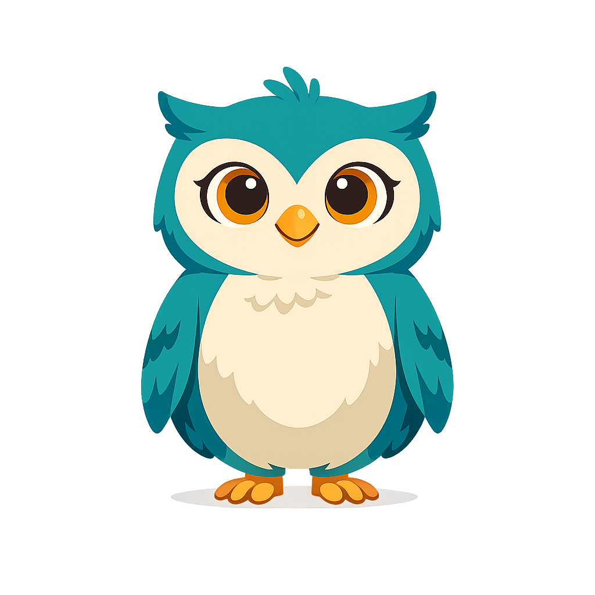
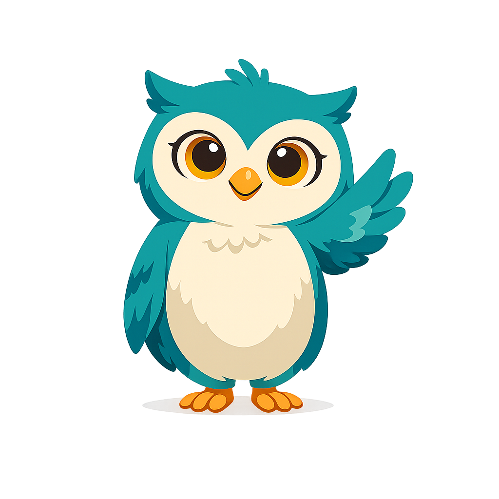
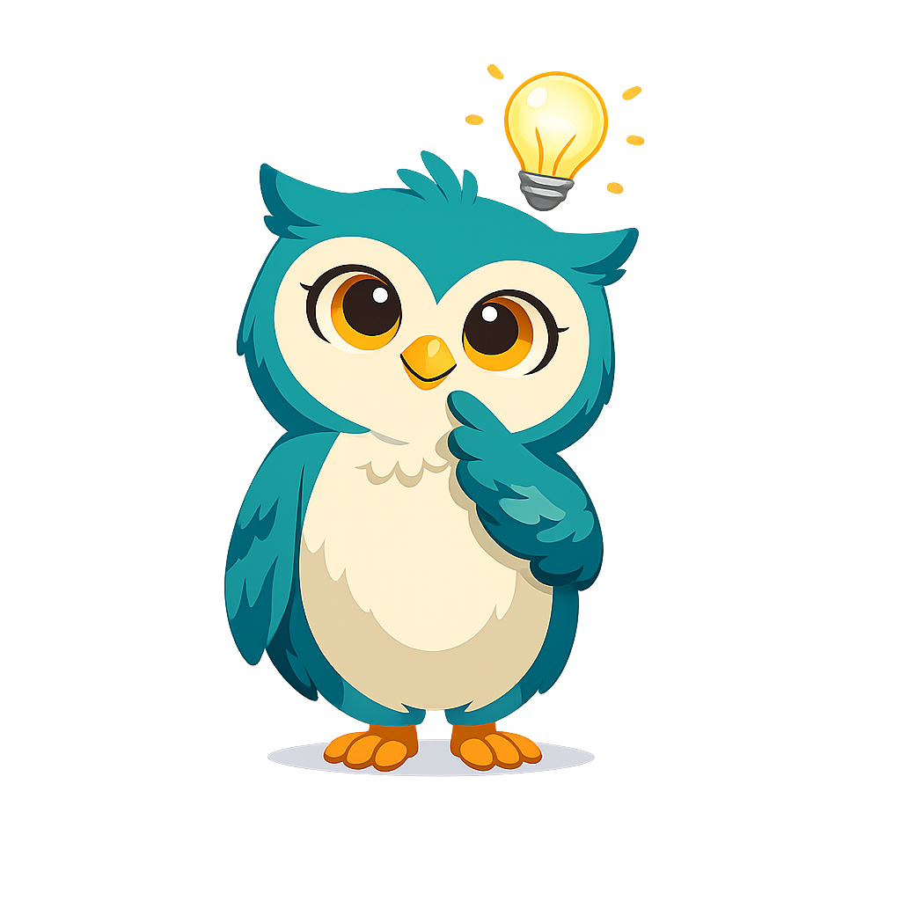

# Sofia the Owl — Mascot Style Guide

This page shows all mascot admonition styles for reference.

!!! mascot-neutral "A Note from Sofia"
    
    This is the neutral style, used for general sidebars or introductions.
    Sofia uses this pose when she has something to share that doesn't fit
    a specific category.

!!! mascot-welcome "Welcome!"
    
    This is the welcome style, used at chapter openings. But how do we know
    what lies ahead? Let's find out together!

!!! mascot-thinking "Key Insight"
    
    This is the thinking style, used for key epistemological concepts.
    But how do we know this is true? What evidence supports this claim?

!!! mascot-tip "Sofia's Tip"
    
    This is the tip style, used for hints and advice. When evaluating a
    knowledge claim, always ask: What is the evidence? Who is the source?
    What perspective might be missing?

!!! mascot-warning "Watch Out!"
    
    This is the warning style, used for common mistakes and logical fallacies.
    Be careful not to confuse correlation with causation — that's one of the
    most common reasoning errors!

!!! mascot-celebration "Well Done!"
    
    This is the celebration style, used for achievements and milestones.
    You've just mastered a challenging concept — that deserves recognition!

!!! mascot-encourage "Keep Going!"
    
    This is the encouraging style, used for difficult content. Epistemology
    can feel abstract at first, but every great thinker started exactly
    where you are now. You've got this!
