# List of MicroSims for Theory of Knowledge

Interactive Micro Simulations to help students learn Theory of Knowledge fundamentals.

-   **[Anachronism Detection](./anachronism-detection/index.md)**

    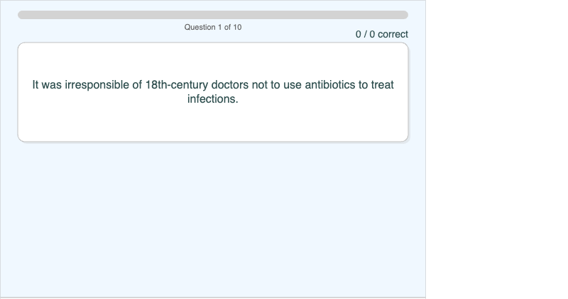

    Interactive p5.js MicroSim for anachronism detection.

-   **[Anatomy of a Mathematical Proof](./anatomy-of-proof/index.md)**

    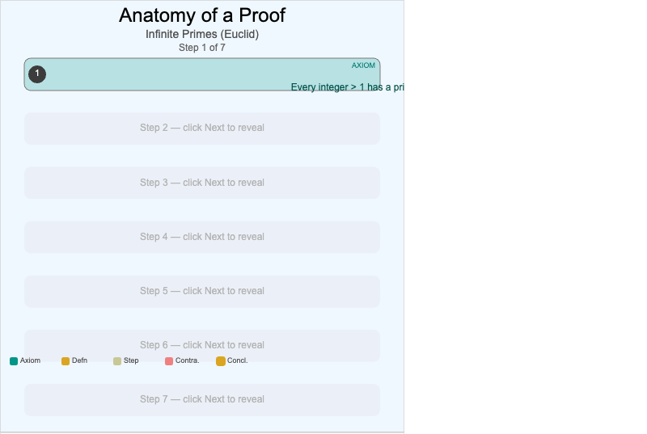

    Interactive p5.js MicroSim for anatomy of a mathematical proof.

-   **[Anatomy of an Argument](./argument-anatomy/index.md)**

    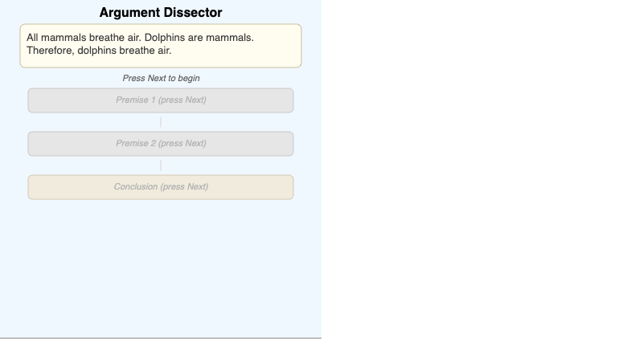

    Interactive p5.js MicroSim for anatomy of an argument.

-   **[Anatomy of an Ethical Dilemma](./ethical-dilemma-anatomy/index.md)**

    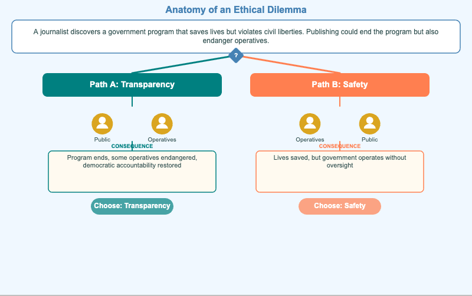

    Interactive p5.js MicroSim for anatomy of an ethical dilemma.

-   **[Anatomy of an Information Warfare Campaign](./info-warfare-anatomy/index.md)**

    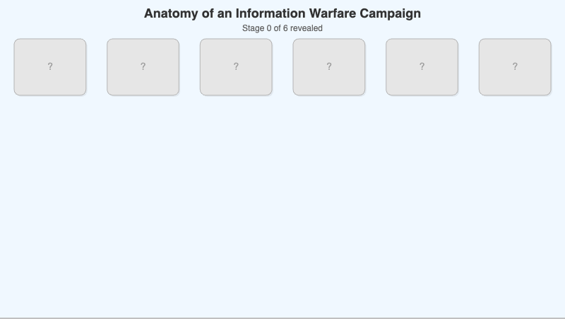

    Interactive p5.js MicroSim for anatomy of an information warfare campaign.

-   **[Art as a Source of Knowledge](./art-as-knowledge-map/index.md)**

    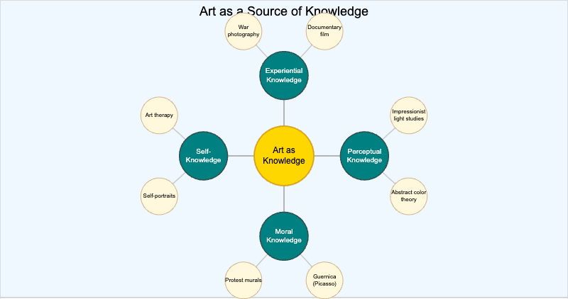

    Interactive p5.js MicroSim for art as a source of knowledge.

-   **[Capstone Portfolio Knowledge Web](./capstone-portfolio-web/index.md)**

    

    Interactive vis-network MicroSim for capstone portfolio knowledge web.

-   **[Cartesian Doubt Progression](./cartesian-doubt-layers/index.md)**

    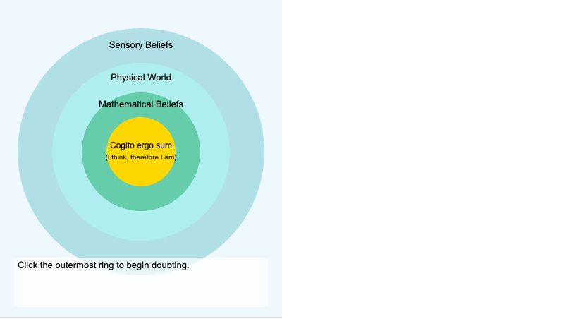

    Interactive p5.js MicroSim for cartesian doubt progression.

-   **[Cognitive Bias Self-Diagnostic Tool](./bias-self-diagnostic/index.md)**

    

    Interactive p5.js MicroSim for cognitive bias self-diagnostic tool.

-   **[Cognitive Dissonance Resolution Strategies](./cognitive-dissonance-model/index.md)**

    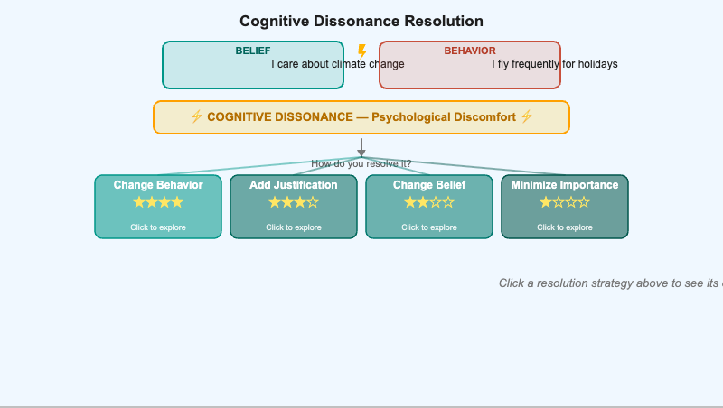

    Interactive p5.js MicroSim for cognitive dissonance resolution strategies.

-   **[Comparing Ethical Frameworks](./ethical-frameworks-comparison/index.md)**

    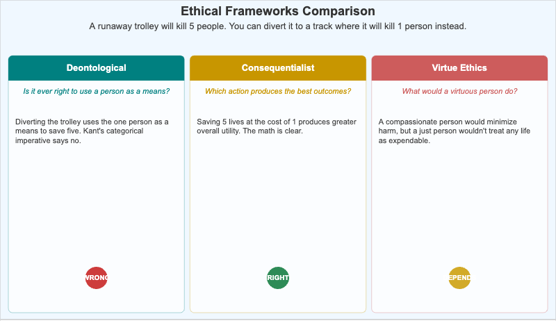

    Interactive p5.js MicroSim for comparing ethical frameworks.

-   **[Conceptual Metaphor Map](./conceptual-metaphor-map/index.md)**

    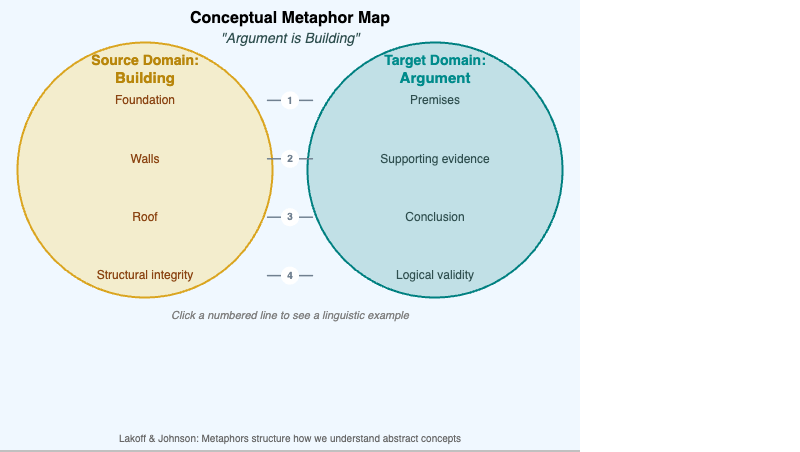

    Interactive p5.js MicroSim for conceptual metaphor map.

-   **[Content Moderation Decision Framework](./content-moderation-framework/index.md)**

    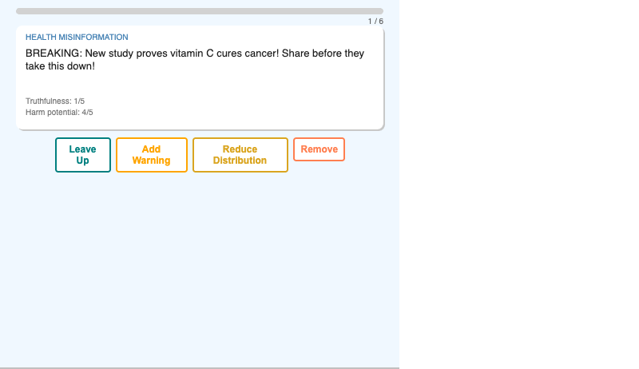

    Interactive p5.js MicroSim for content moderation decision framework.

-   **[Correlation vs. Causation](./correlation-causation/index.md)**

    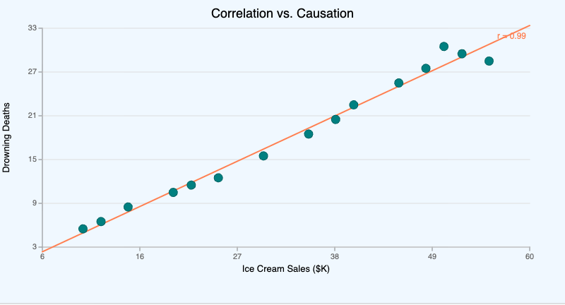

    Interactive p5.js MicroSim for correlation vs. causation.

-   **[Critical Thinking Cycle](./critical-thinking-cycle/index.md)**

    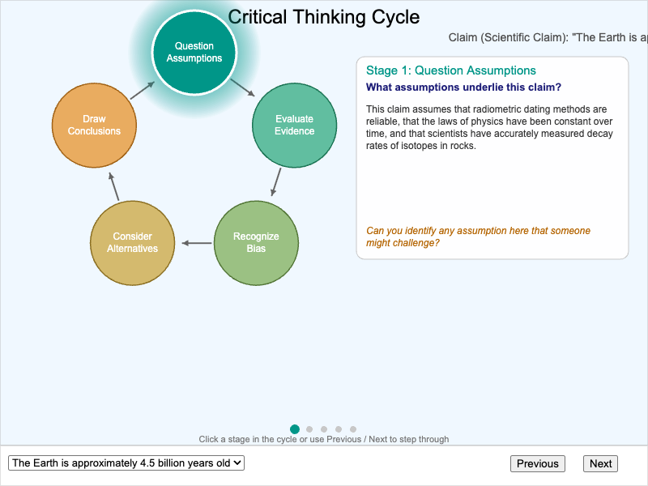

    An interactive cyclical diagram that guides students through five stages of critical thinking — questioning assumptions, evaluating evidence, recognizing bias, considering alternatives, and drawing conclusions — applied to different types of knowledge claims.

-   **[Cross-AOK Synthesis Map](./aok-synthesis-map/index.md)**

    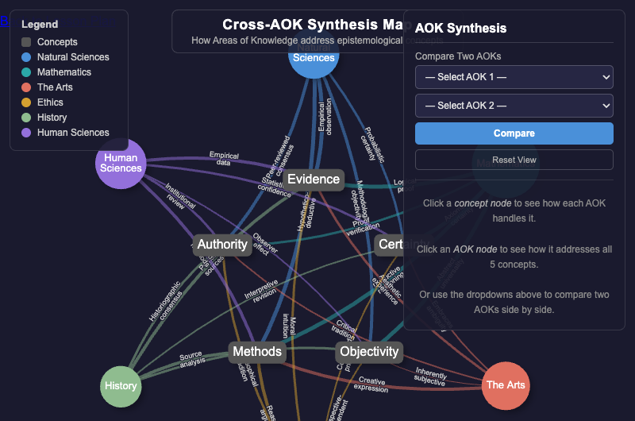

    Interactive vis-network MicroSim for cross-aok synthesis map.

-   **[Debunking vs. Prebunking Effectiveness](./debunking-vs-prebunking/index.md)**

    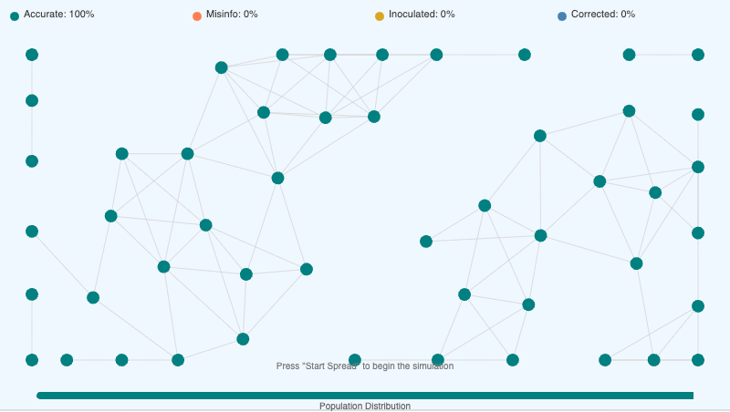

    Interactive p5.js MicroSim for debunking vs. prebunking effectiveness.

-   **[Deductive vs. Inductive Reasoning](./deductive-inductive-comparison/index.md)**

    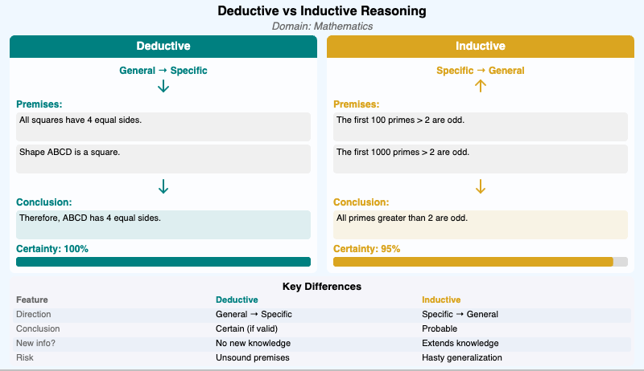

    Interactive p5.js MicroSim for deductive vs. inductive reasoning.

-   **[Dimensions of Creativity](./creativity-dimensions/index.md)**

    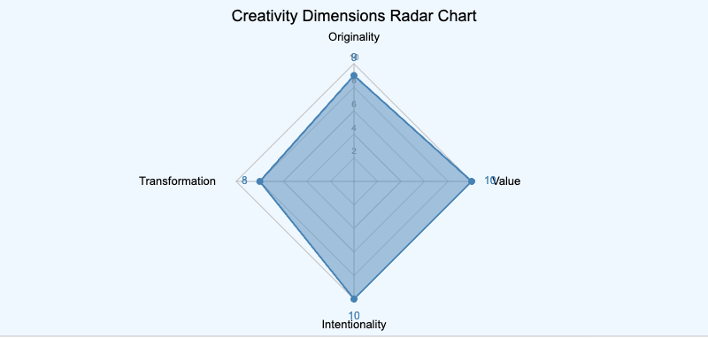

    Interactive p5.js MicroSim for dimensions of creativity.

-   **[Echo Chambers and Filter Bubbles](./echo-chambers-filter-bubbles/index.md)**

    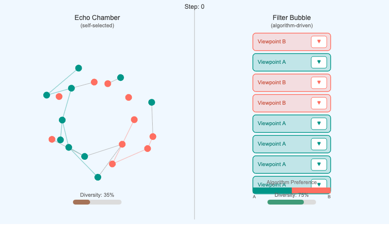

    Interactive p5.js MicroSim for echo chambers and filter bubbles.

-   **[Empiricism vs. Rationalism Comparison](./empiricism-rationalism-compare/index.md)**

    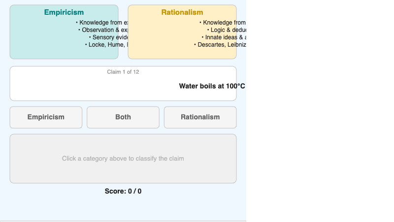

    Interactive p5.js MicroSim for empiricism vs. rationalism comparison.

-   **[Epistemological Frameworks Comparison](./epistemological-frameworks/index.md)**

    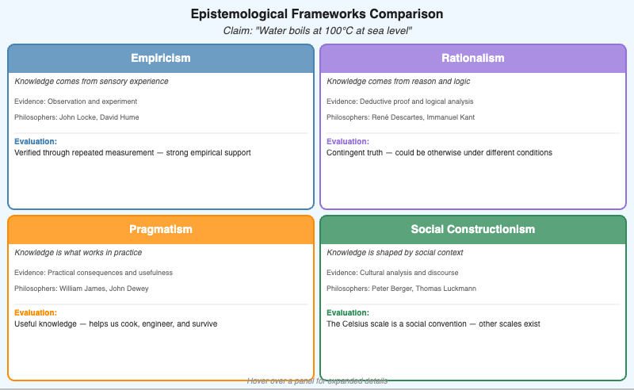

    Interactive p5.js MicroSim for epistemological frameworks comparison.

-   **[Ethical Checkpoints in the Research Process](./research-ethics-checkpoints/index.md)**

    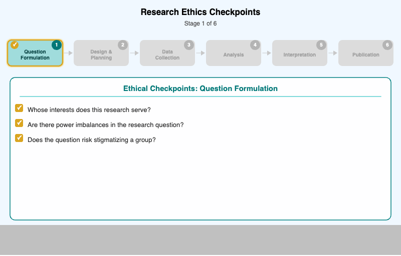

    Interactive p5.js MicroSim for ethical checkpoints in the research process.

-   **[Ethical Dimensions of AI](./ai-ethics-dimensions/index.md)**

    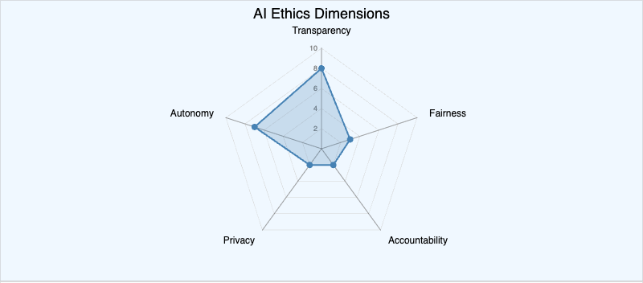

    Interactive p5.js MicroSim for ethical dimensions of ai.

-   **[Evidence Evaluation Workflow](./evidence-evaluation-workflow/index.md)**

    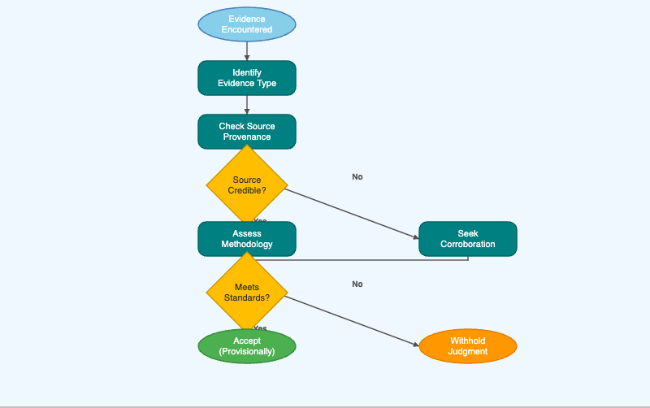

    Interactive p5.js MicroSim for evidence evaluation workflow.

-   **[Evidence Strength Hierarchy](./evidence-strength-hierarchy/index.md)**

    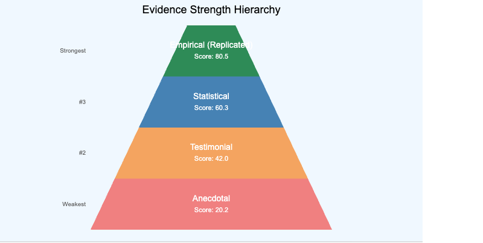

    Interactive p5.js MicroSim for evidence strength hierarchy.

-   **[Four TOK Themes Interaction Map](./tok-themes-interaction/index.md)**

    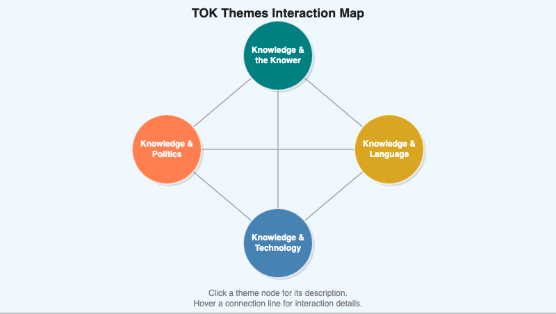

    Interactive p5.js MicroSim for four tok themes interaction map.

-   **[From Claim to Knowledge Workflow](./claim-to-knowledge-workflow/index.md)**

    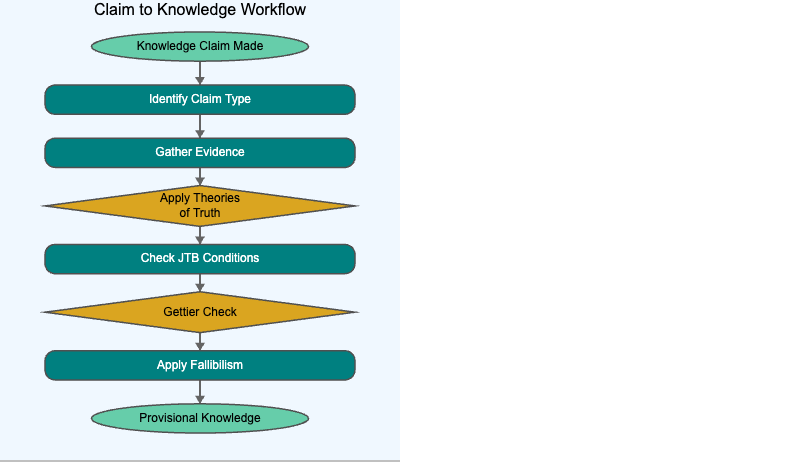

    Interactive p5.js MicroSim for from claim to knowledge workflow.

-   **[From First-Order Questions to Knowledge Questions](./question-levels/index.md)**

    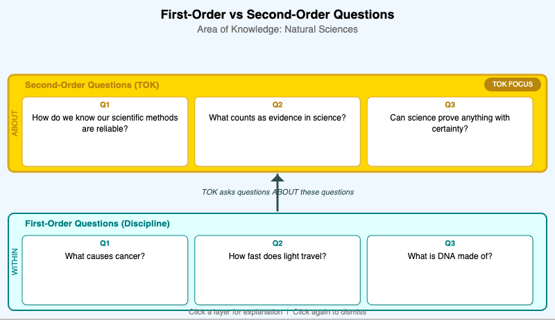

    Interactive p5.js MicroSim for from first-order questions to knowledge questions.

-   **[Godel's Incompleteness Visualized](./godel-incompleteness/index.md)**

    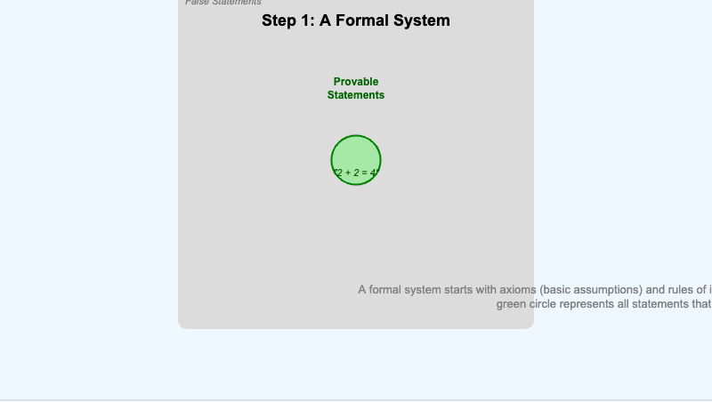

    Interactive p5.js MicroSim for godel's incompleteness visualized.

-   **[How Algorithms Filter Knowledge](./algorithm-filter-knowledge/index.md)**

    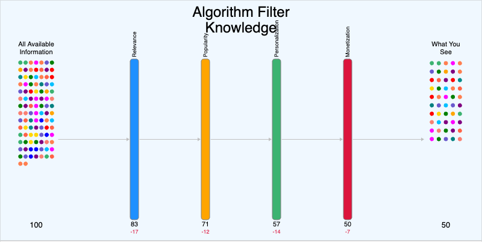

    Interactive p5.js MicroSim for how algorithms filter knowledge.

-   **[How Simulations Generate Knowledge](./simulation-knowledge-cycle/index.md)**

    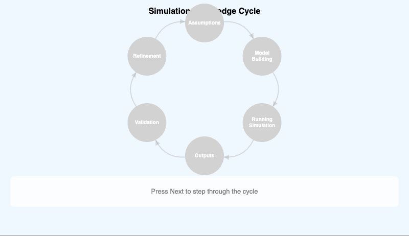

    Interactive p5.js MicroSim for how simulations generate knowledge.

-   **[How the Availability Heuristic Distorts Risk Perception](./availability-heuristic-risk/index.md)**

    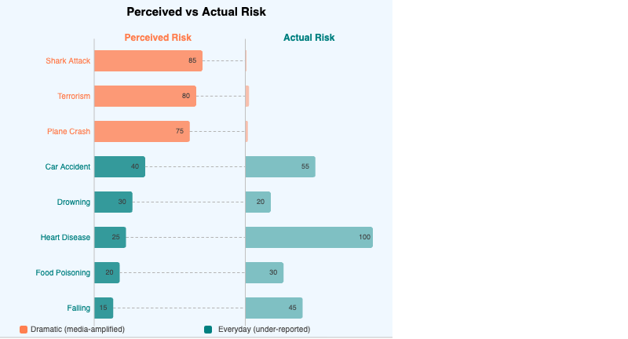

    Interactive p5.js MicroSim for how the availability heuristic distorts risk perception.

-   **[Human Sciences and History Methods Map](./human-sciences-history-map/index.md)**

    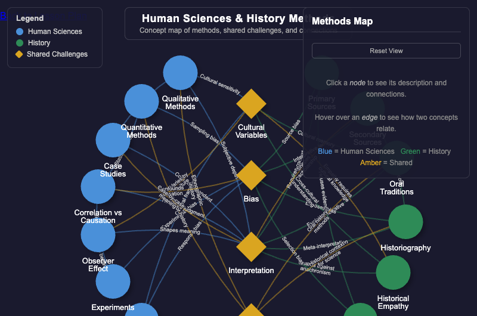

    Interactive vis-network MicroSim for human sciences and history methods map.

-   **[Information Literacy Framework](./information-literacy-framework/index.md)**

    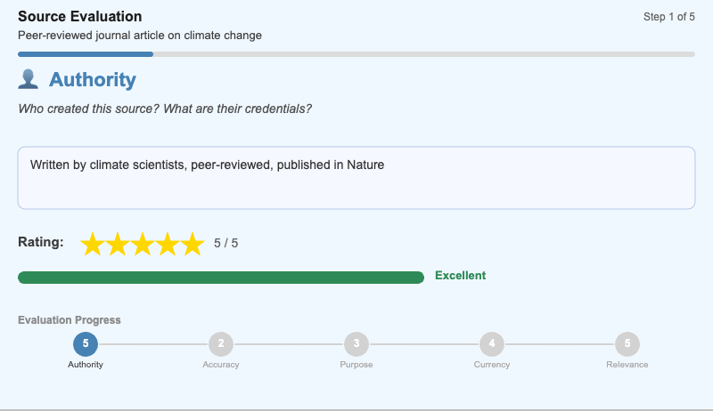

    Interactive p5.js MicroSim for information literacy framework.

-   **[Intellectual Virtues Wheel](./intellectual-virtues-wheel/index.md)**

    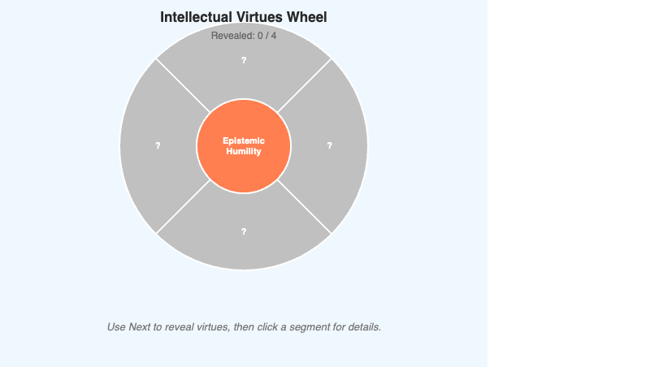

    Interactive p5.js MicroSim for intellectual virtues wheel.

-   **[JTB Venn Diagram - Justified True Belief](./knowledge-jtb-venn/index.md)**

    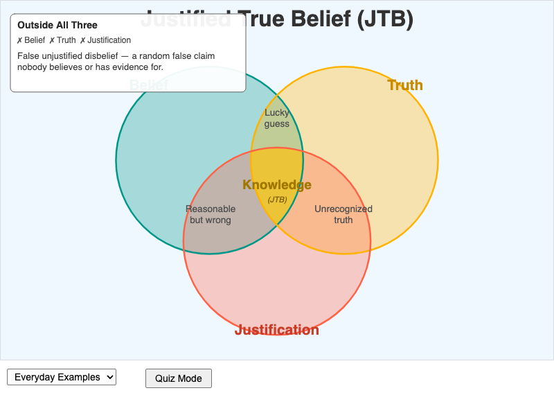

    Interactive Venn diagram showing how knowledge emerges from the intersection of belief, truth, and justification in the classical JTB analysis.

-   **[Justified True Belief Venn Diagram](./jtb-venn-diagram/index.md)**

    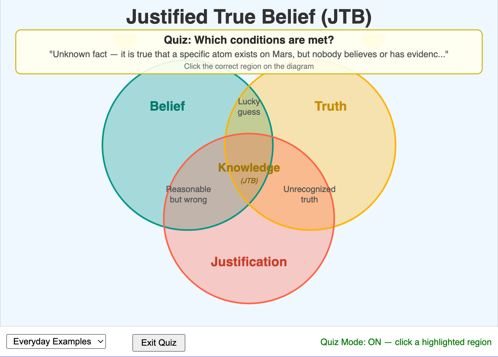

    Interactive p5.js MicroSim for justified true belief venn diagram.

-   **[Knowledge Dissemination Network](./knowledge-dissemination-network/index.md)**

    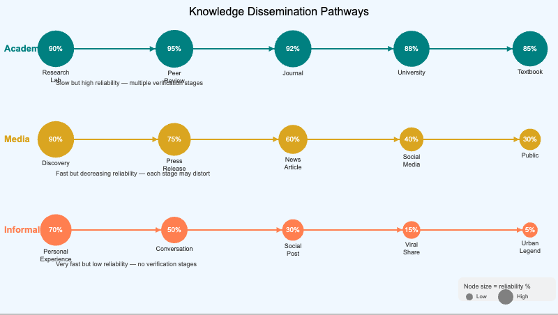

    Interactive p5.js MicroSim for knowledge dissemination network.

-   **[Knowledge Production Pipeline](./knowledge-production-pipeline/index.md)**

    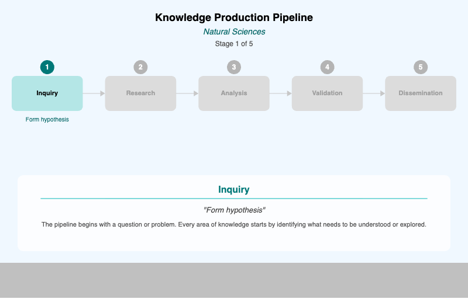

    Interactive p5.js MicroSim for knowledge production pipeline.

-   **[Knowledge Type Classification Game](./knowledge-type-classifier/index.md)**

    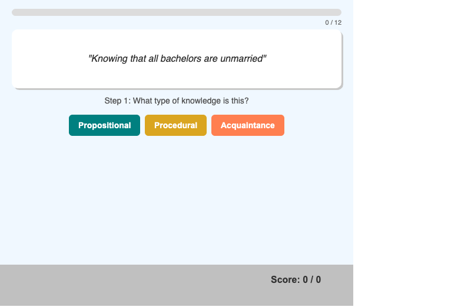

    Interactive p5.js MicroSim for knowledge type classification game.

-   **[Kuhn's Cycle of Scientific Revolutions](./kuhn-cycle/index.md)**

    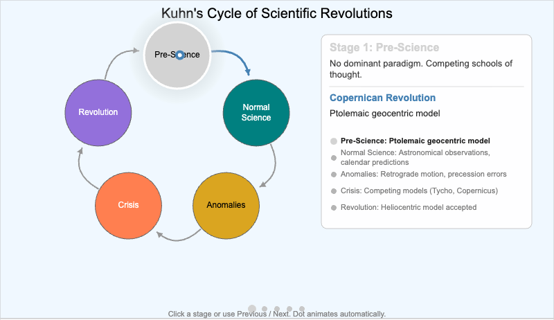

    Interactive p5.js MicroSim for kuhn's cycle of scientific revolutions.

-   **[Language as Tool vs. Language as Constraint](./language-tool-constraint/index.md)**

    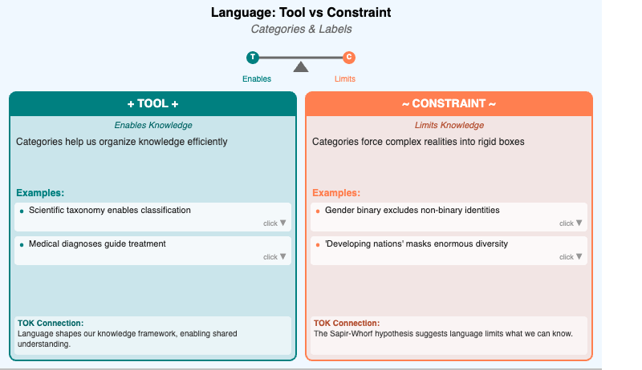

    Interactive p5.js MicroSim for language as tool vs. language as constraint.

-   **[Logical Fallacy Identification Guide](./fallacy-identifier/index.md)**

    

    Interactive p5.js MicroSim for logical fallacy identification guide.

-   **[Mapping AI in Knowledge Production](./ai-knowledge-production-map/index.md)**

    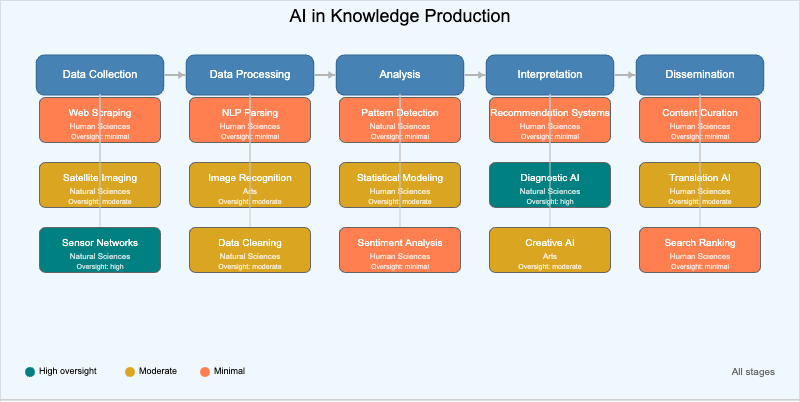

    Interactive p5.js MicroSim for mapping ai in knowledge production.

-   **[Personal and Shared Knowledge](./personal-shared-knowledge/index.md)**

    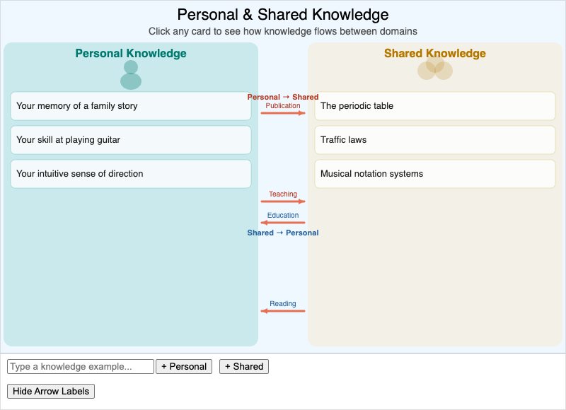

    An interactive infographic examining the bidirectional relationship between personal and shared knowledge, with clickable example cards and user categorization input.

-   **[Primary and Secondary Source Analysis](./source-analysis/index.md)**

    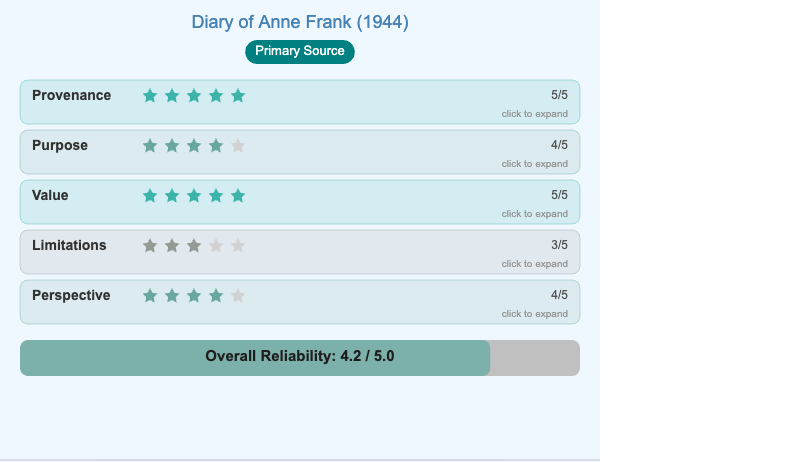

    Interactive p5.js MicroSim for primary and secondary source analysis.

-   **[Quantitative vs. Qualitative Methods in Science](./quant-qual-methods/index.md)**

    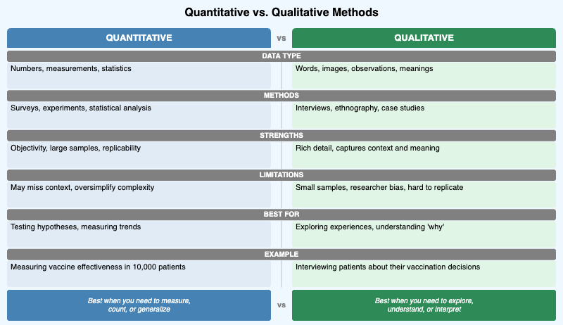

    Interactive p5.js MicroSim for quantitative vs. qualitative methods in science.

-   **[Reductio Ad Absurdum Flowchart](./reductio-flowchart/index.md)**

    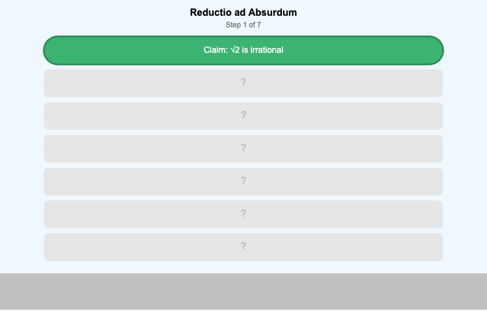

    Interactive p5.js MicroSim for reductio ad absurdum flowchart.

-   **[Reflective Thinking Quiz](./reflective-thinking-quiz/index.md)**

    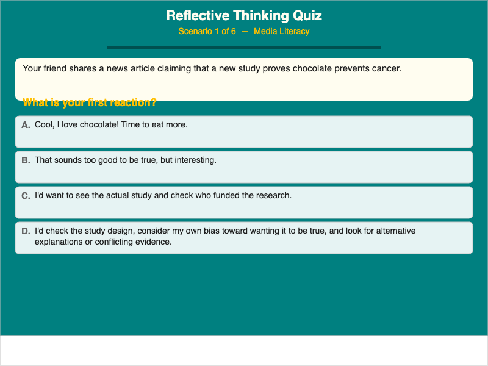

    Assess your own reflective thinking habits by responding to scenario-based questions and reviewing feedback on your reasoning patterns.

-   **[Sampling Methods Comparison](./sampling-methods/index.md)**

    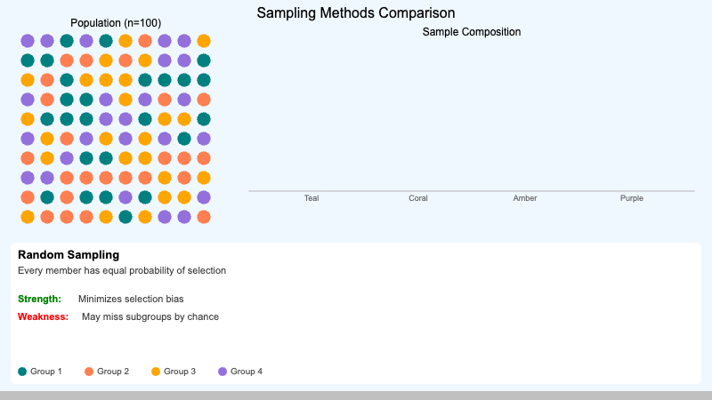

    Interactive p5.js MicroSim for sampling methods comparison.

-   **[Sense Perception and Interpretation](./sense-perception-pipeline/index.md)**

    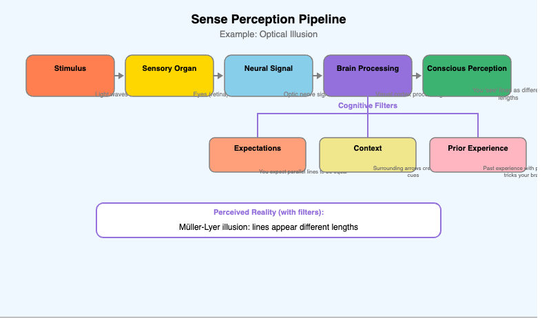

    Interactive p5.js MicroSim for sense perception and interpretation.

-   **[Source Credibility Analyzer](./source-credibility-analyzer/index.md)**

    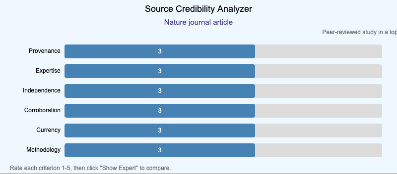

    Interactive p5.js MicroSim for source credibility analyzer.

-   **[The Certainty Spectrum Across AOKs](./certainty-spectrum-aok/index.md)**

    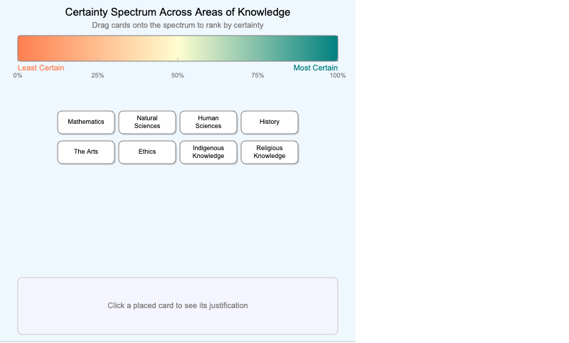

    Interactive p5.js MicroSim for the certainty spectrum across aoks.

-   **[The Communication Triangle of Art](./art-communication-triangle/index.md)**

    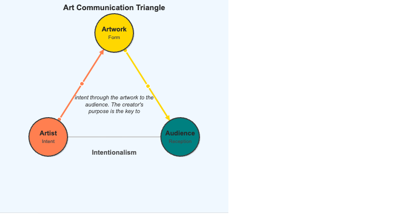

    Interactive p5.js MicroSim for the communication triangle of art.

-   **[The Demarcation Spectrum](./demarcation-spectrum/index.md)**

    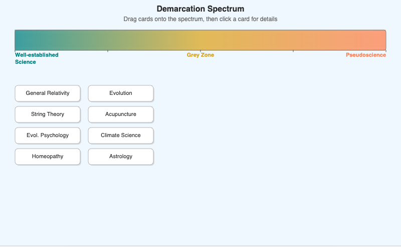

    Interactive p5.js MicroSim for the demarcation spectrum.

-   **[The Dunning-Kruger Confidence Curve](./dunning-kruger-curve/index.md)**

    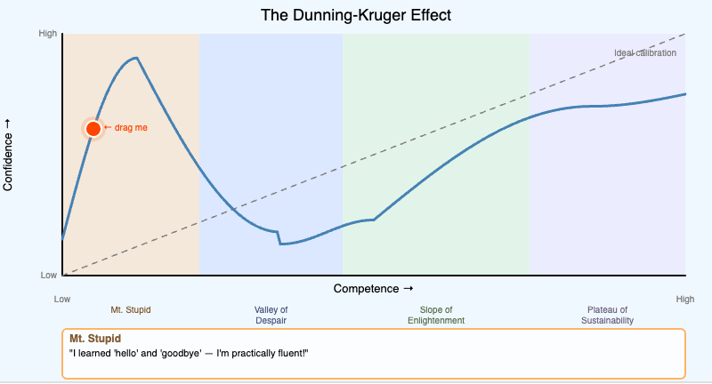

    Interactive p5.js MicroSim for the dunning-kruger confidence curve.

-   **[The Epistemology of the Internet](./internet-epistemology/index.md)**

    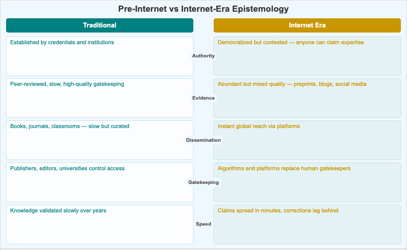

    Interactive p5.js MicroSim for the epistemology of the internet.

-   **[The Hermeneutic Circle](./hermeneutic-circle/index.md)**

    

    Interactive p5.js MicroSim for the hermeneutic circle.

-   **[The Information Disorder Spectrum](./information-disorder-spectrum/index.md)**

    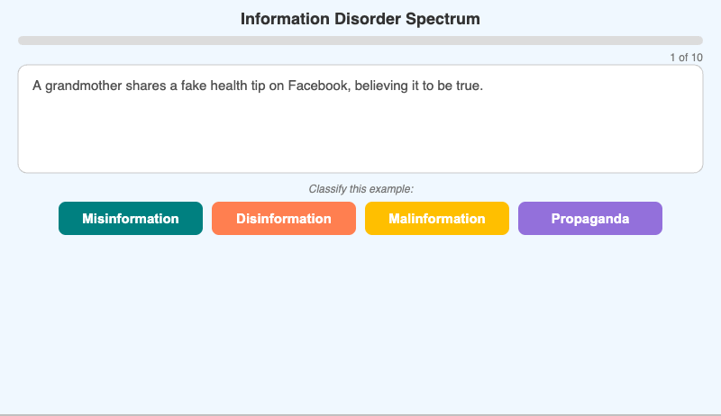

    Interactive p5.js MicroSim for the information disorder spectrum.

-   **[The Knowledge Framework Applied to AOKs](./knowledge-framework-aok/index.md)**

    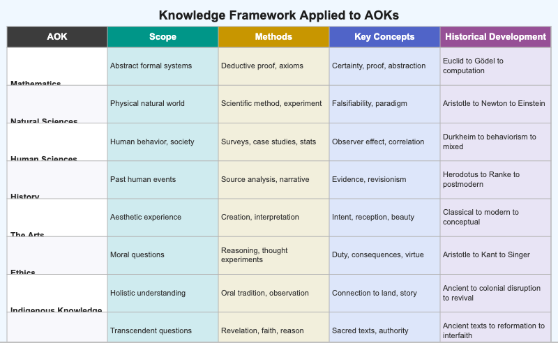

    Interactive p5.js MicroSim for the knowledge framework applied to aoks.

-   **[Theory, Law, and Model Relationships](./theory-law-model/index.md)**

    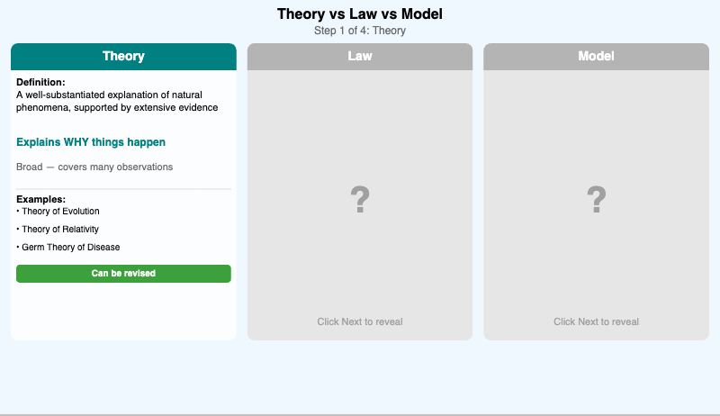

    Interactive p5.js MicroSim for theory, law, and model relationships.

-   **[Three Theories of Truth Comparison](./three-theories-of-truth/index.md)**

    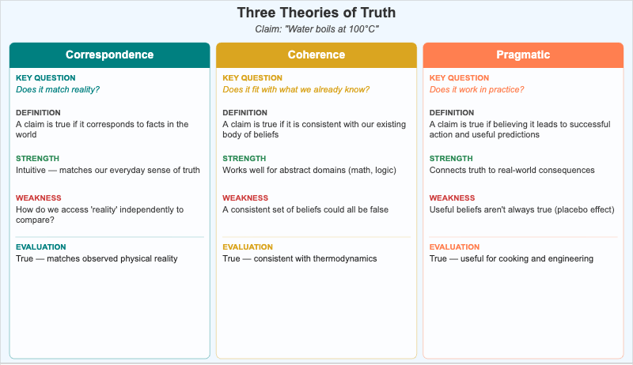

    Interactive p5.js MicroSim for three theories of truth comparison.

-   **[TOK Exhibition Object Analysis Framework](./exhibition-analysis/index.md)**

    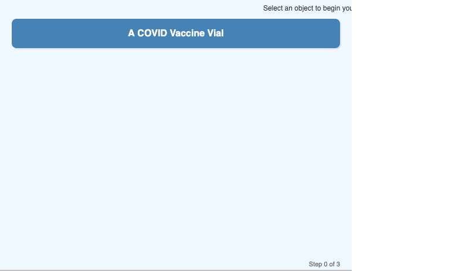

    Interactive p5.js MicroSim for tok exhibition object analysis framework.

-   **[Types of Ambiguity](./types-of-ambiguity/index.md)**

    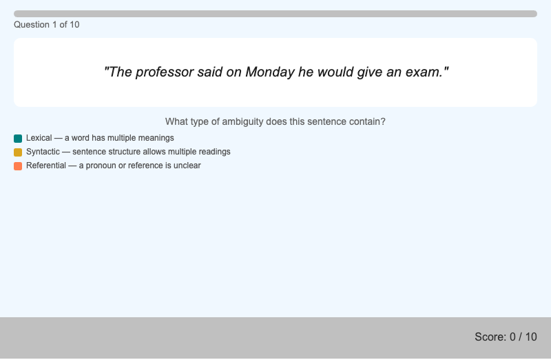

    Interactive p5.js MicroSim for types of ambiguity.

-   **[Types of Knowledge in the Arts](./arts-knowledge-types/index.md)**

    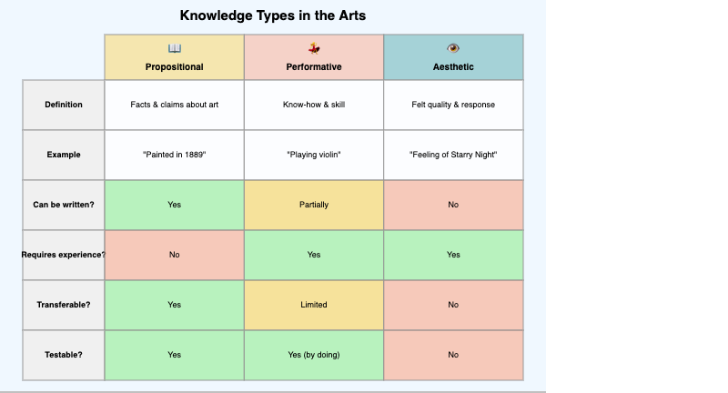

    Interactive p5.js MicroSim for types of knowledge in the arts.

-   **[Ways of Knowing and Their Interactions](./ways-of-knowing-web/index.md)**

    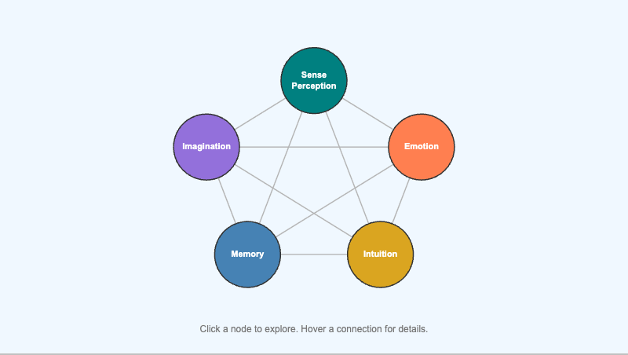

    Interactive p5.js MicroSim for ways of knowing and their interactions.

-   **[What Is Lost in Translation](./translation-loss/index.md)**

    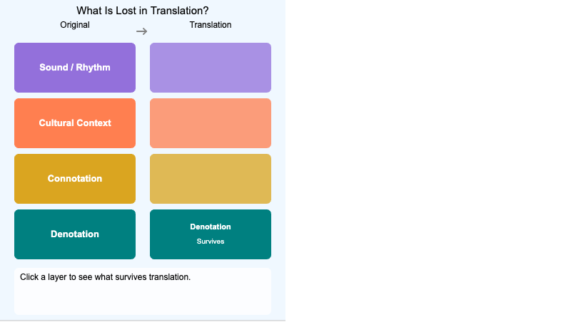

    Interactive p5.js MicroSim for what is lost in translation.

