# The Doctor Who Wouldn't Let Go

Cover Image Prompt

Please generate a wide-landscape 16:9 cover image for a graphic novel titled "The Doctor Who Wouldn't Let Go" in mid-century British editorial illustration style reminiscent of 1950s medical journal covers blended with modern graphic-novel color. Show Dr. Alice Stewart, a slender British woman in her late 40s with short wavy brown hair, alert intelligent eyes, and a tailored 1950s tweed suit with a white lab coat over it, standing in an Oxford epidemiology office. She holds a thick stack of survey questionnaires and gestures toward a chalkboard covered with hand-drawn statistical graphs showing a correlation curve. Behind her, a wooden filing cabinet labeled "Oxford Survey of Childhood Cancers" is open. The title "The Doctor Who Wouldn't Let Go" is rendered in a clean mid-century serif typeface at the top. Color palette: dove gray, chalk white, muted teal, warm brown wood, and a single pool of amber window light. Emotional tone: patient, unshakable scientific resolve. Include: (1) Stewart's steady, intelligent gaze, (2) period-accurate 1956 clothing and horn-rimmed glasses on a chain, (3) the chalkboard with clearly drawn scatter plot, (4) a stack of filled-out survey forms, (5) a fountain pen tucked into her lab coat pocket, (6) warm afternoon light through a tall Oxford window. Generate the image immediately without asking clarifying questions.

Narrative Prompt

This is a 12-panel graphic novel about Dr. Alice Stewart (1906-2002), the British physician and epidemiologist whose Oxford Survey of Childhood Cancers (published 1956) demonstrated that a single prenatal X-ray doubled a child's risk of developing leukemia. The medical establishment rejected her finding for 25 years because it threatened the value of a widely used technology. Settings range from post-war Oxford to British medical conferences, with a later chapter at the Hanford nuclear site in the United States. The art style is mid-century British editorial illustration — muted period colors, careful attention to 1950s–70s clothing and interiors, and a restrained scholarly emotional register. Alice Stewart should be drawn consistently: a slender woman with short wavy brown hair (graying over time), horn-rimmed glasses, tweed suits or simple dresses, alert and composed. Central TOK theme: the slow, patient work of defending statistical evidence against institutional pressure. The story emphasizes her methodological rigor and her partnership with mathematician George Kneale.

### Prologue – A Signal in the Noise

In 1955, childhood leukemia was rising sharply in Britain, and no one knew why. Most doctors assumed it was random — cancer, after all, struck without pattern. Alice Stewart, a 49-year-old physician at Oxford, suspected otherwise. She did not have a theory yet. She had only a hunch and a method: ask the mothers. With one research assistant, a typewriter, and a set of carefully designed questionnaires, she began a survey that would ultimately include thousands of families — and uncover a truth the medical profession would spend twenty-five years trying to ignore.

## Panel 1: The Question No One Was Asking

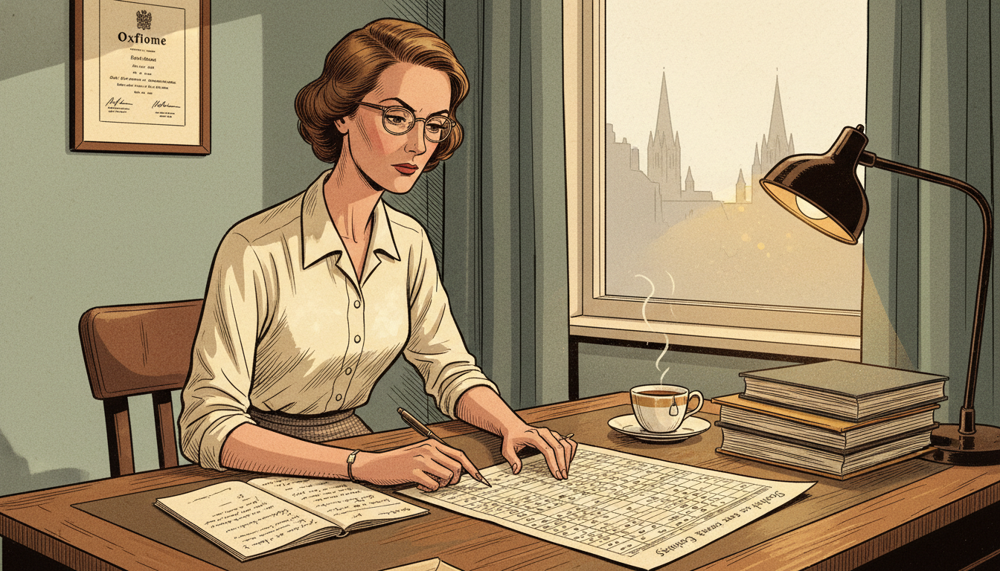

Image Prompt

I am about to ask you to generate a series of images for a graphic novel. Please make the images have a consistent style and consistent characters. Do not ask any clarifying questions. Just generate the image immediately when asked.

Please generate a 16:9 image in mid-century British editorial illustration style depicting panel 1 of 12. The scene shows Dr. Alice Stewart in her modest Oxford office in 1955, a slender British woman in her late 40s with short wavy brown hair and horn-rimmed glasses, seated at a wooden desk reviewing a page of childhood cancer statistics with a furrowed brow. Color palette: warm cream paper, sepia brown, chalk white, muted teal, soft amber lamplight. Emotional tone: quiet curiosity becoming concern. Specific details: (1) a stack of medical journals on the desk, (2) a framed Oxford diploma on the wall, (3) Stewart in a tweed skirt and cream blouse, (4) an open notebook with handwritten questions, (5) a cup of tea on a saucer, (6) a window showing Oxford spires in the background. Generate the image immediately without asking clarifying questions.

Stewart noticed something other epidemiologists had missed: leukemia rates in children were climbing, but no one had systematically interviewed the mothers about their pregnancies. It was a simple question, really — what had happened before the child was born? She applied for a small grant, hired a single assistant, and began designing a questionnaire that asked about every possible prenatal exposure.

## Panel 2: The Questionnaire

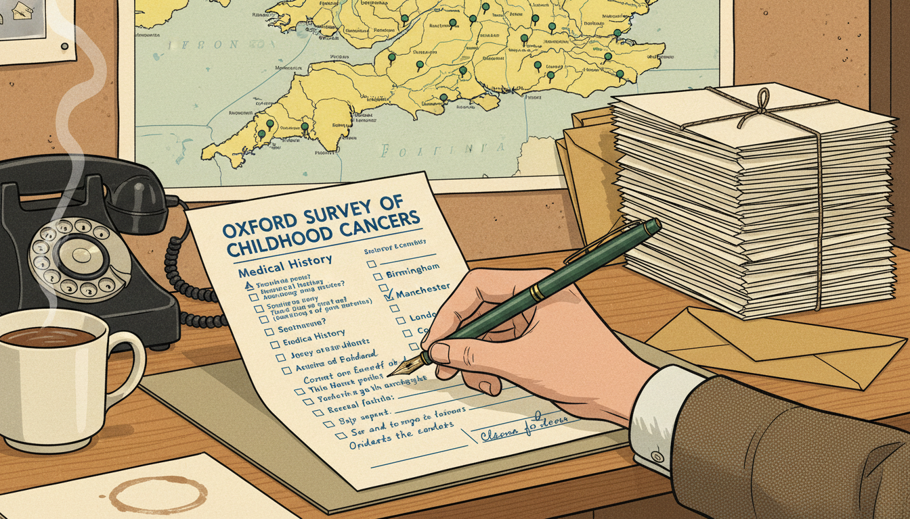

Image Prompt

Please generate a 16:9 image in mid-century British editorial illustration style depicting panel 2 of 12. Make the characters and style consistent with the prior panel. The scene shows a close-up view of Stewart's hand filling out a survey form in 1956, with checkboxes and handwritten notes visible. Beside the form is a stack of similar forms and a map of England marked with pins. Color palette: cream paper, ink blue, forest green pins, warm oak desk. Emotional tone: methodical patience. Specific details: (1) the form clearly labeled "Oxford Survey of Childhood Cancers," (2) a fountain pen in Stewart's hand, (3) a bakelite telephone on the desk, (4) the map with dozens of pins marking respondent locations, (5) a stack of postal envelopes, (6) a mug of tea leaving a ring on the blotter. Generate the image immediately without asking clarifying questions.

The Oxford Survey asked hundreds of questions: diet, medications, illnesses, injuries — and, crucially, whether the mother had received any X-rays during pregnancy. Stewart and her small team interviewed the mothers of every child in England and Wales who had died of leukemia or another cancer, and compared them to matched healthy controls. By 1956 she had enough data to look at the results. What she saw stopped her cold.

## Panel 3: The Pattern Emerges

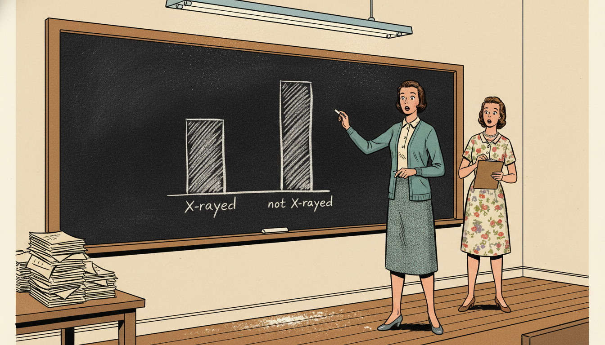

Image Prompt

Please generate a 16:9 image in mid-century British editorial illustration style depicting panel 3 of 12. Make the characters and style consistent with the prior panel. The scene shows Stewart standing at a chalkboard in 1956, chalk in hand, staring at a bar chart she has just drawn showing a clear difference between two groups. Her assistant stands nearby, eyes wide. Color palette: chalk white, slate black, warm brown, muted teal cardigan. Emotional tone: scientific astonishment. Specific details: (1) the chalkboard showing two bars with "X-rayed" clearly taller than "not X-rayed," (2) Stewart's tweed skirt and cardigan, (3) the assistant in a simple 1950s dress holding a clipboard, (4) a fluorescent lamp overhead, (5) scattered chalk dust, (6) a pile of questionnaires on a side table. Generate the image immediately without asking clarifying questions.

Children whose mothers had received a single diagnostic X-ray during pregnancy were roughly twice as likely to develop childhood cancer. Twice. The correlation was strong, consistent, and statistically significant. Stewart checked the numbers again. Then again. The data was real. And it was about to collide with one of the most trusted technologies in medicine.

## Panel 4: Publication in The Lancet

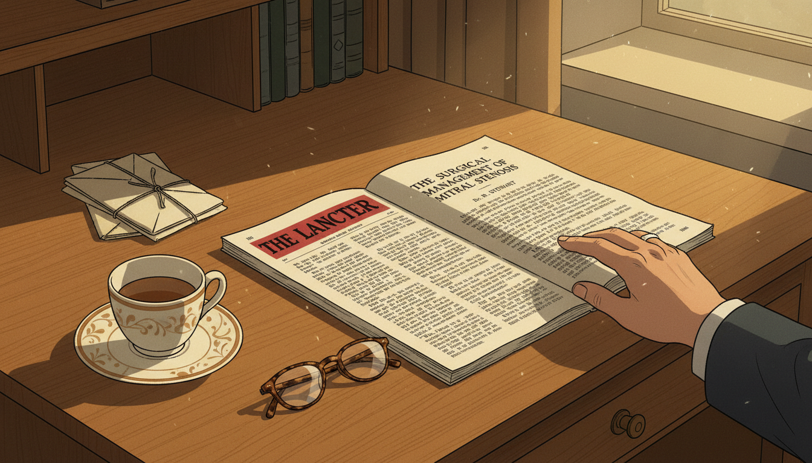

Image Prompt

Please generate a 16:9 image in mid-century British editorial illustration style depicting panel 4 of 12. Make the characters and style consistent with the prior panel. The scene shows a 1956 issue of The Lancet medical journal lying open on a desk, with Stewart's paper visible. Stewart's hand rests on the page. Color palette: cream paper, deep red Lancet masthead, black ink, warm oak. Emotional tone: the calm before a storm. Specific details: (1) the Lancet masthead clearly visible, (2) Stewart's paper title legible, (3) a teacup and saucer, (4) a stack of correspondence, (5) reading glasses beside the journal, (6) afternoon light slanting across the desk. Generate the image immediately without asking clarifying questions.

In 1956, Stewart published her preliminary findings in *The Lancet*, Britain's most prestigious medical journal. The paper was cautious and precise. It did not demand action; it only reported what the data showed. She expected her colleagues to either confirm or disprove the result through their own studies. What she did not expect was for them to simply refuse to believe it.

## Panel 5: The Establishment Pushes Back

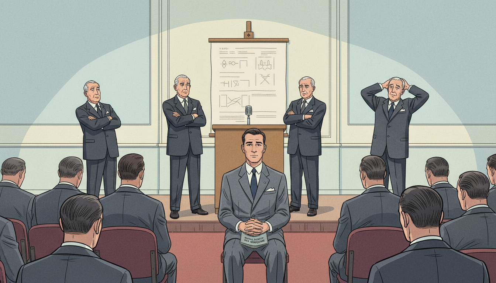

Image Prompt

Please generate a 16:9 image in mid-century British editorial illustration style depicting panel 5 of 12. Make the characters and style consistent with the prior panel. The scene shows a medical conference in London in 1957 with several senior male doctors in dark suits at a podium shaking their heads dismissively, while Stewart sits in the audience, composed but isolated. Color palette: dark suit gray, cream walls, muted red carpet, cold fluorescent light. Emotional tone: professional isolation met with composure. Specific details: (1) a podium with microphone, (2) several gray-haired men at a head table, (3) Stewart in a tailored gray suit in the audience, (4) a large chart on an easel behind the speakers, (5) rows of mostly male attendees, (6) a program with "Royal Society of Medicine" visible. Generate the image immediately without asking clarifying questions.

Senior radiologists and physicians called her methods flawed, her sample sizes inadequate, and her conclusions irresponsible. One eminent doctor suggested she had misunderstood basic statistics. Another noted — correctly, from his point of view — that prenatal X-rays were an enormously valuable diagnostic tool, and that panicking mothers would cause more harm than the risk she had found. The profession decided, collectively, that she must be wrong.

## Panel 6: Meeting George Kneale

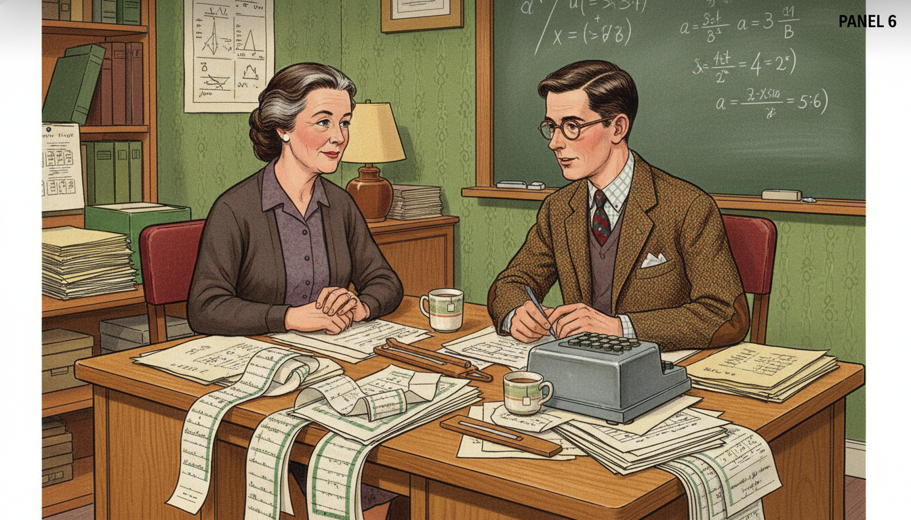

Image Prompt

Please generate a 16:9 image in mid-century British editorial illustration style depicting panel 6 of 12. Make the characters and style consistent with the prior panel. The scene shows Stewart, now in her mid-50s with some graying hair, in a small Oxford office in the early 1960s meeting George Kneale, a quiet young British mathematician in a tweed jacket and glasses. They sit across a desk covered in printouts and computation sheets. Color palette: warm oak, cream paper, forest green wallpaper, amber lamplight. Emotional tone: intellectual partnership forming. Specific details: (1) Stewart in a simple dark dress and cardigan, (2) Kneale in a tweed jacket with elbow patches, (3) stacks of continuous-feed computer printouts, (4) a slide rule and mechanical calculator on the desk, (5) a chalkboard with equations in the background, (6) two mugs of tea. Generate the image immediately without asking clarifying questions.

Stewart needed a partner who could outrun the objections. She found him in George Kneale, a shy but brilliant mathematician who would become her statistical collaborator for the next forty years. Together they adopted a single rule: every time a critic raised an objection, they would take it seriously and rerun the analysis to test it. Kneale treated every attack as a gift — a new way to stress-test the data.

## Panel 7: Twenty Years of Re-analysis

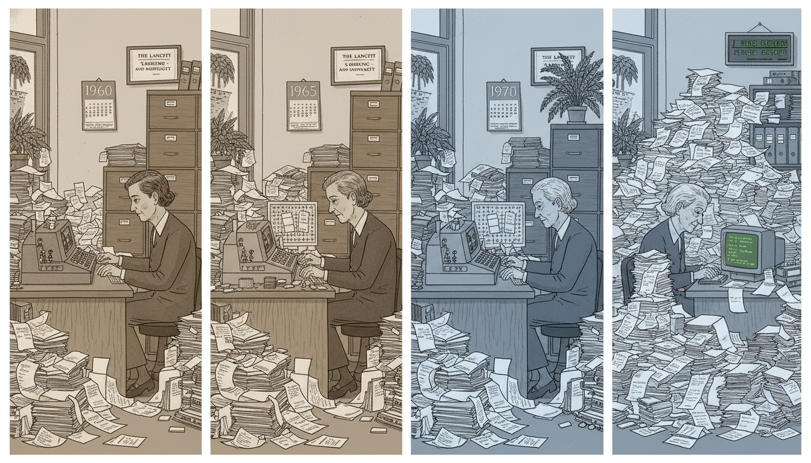

Image Prompt

Please generate a 16:9 image in mid-century British editorial illustration style depicting panel 7 of 12. Make the characters and style consistent with the prior panel. The scene shows a montage composition: Stewart and Kneale at desks across years, with calendars showing 1960, 1965, 1970, 1975, always surrounded by the same growing mountain of survey data. Color palette: sepia tones for older years transitioning to cooler grays for newer ones. Emotional tone: patient perseverance across decades. Specific details: (1) Stewart visibly aging across the montage, (2) computer equipment evolving from mechanical to early mainframe, (3) stacks of printouts growing, (4) a wall of labeled file cabinets, (5) a framed Lancet paper on the wall, (6) a small plant that grows larger across the years. Generate the image immediately without asking clarifying questions.

Year after year, the Oxford Survey grew. New children were added. New statistical techniques were applied. New objections arose — and were answered. Stewart and Kneale refined the finding, narrowed the confidence intervals, and ruled out confounder after confounder. The effect held. By the mid-1970s, their data set was one of the largest and longest-running epidemiological studies in the world.

## Panel 8: The Tide Turns

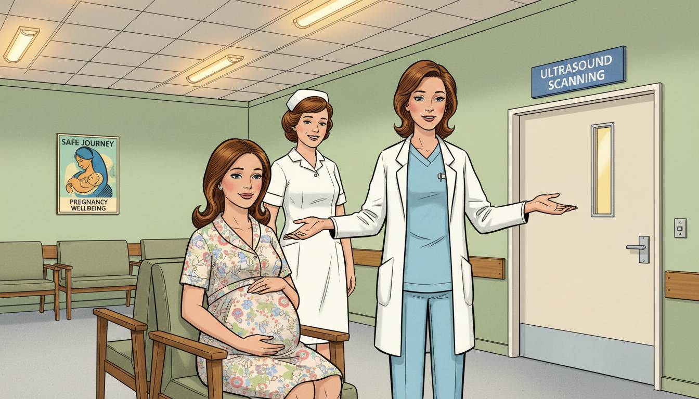

Image Prompt

Please generate a 16:9 image in mid-century British editorial illustration style depicting panel 8 of 12. Make the characters and style consistent with the prior panel. The scene shows a modern British hospital in the late 1970s where a radiographer is gently declining to X-ray a pregnant woman, instead offering ultrasound. Stewart is not in this scene. Color palette: clean hospital white, pale blue scrubs, soft green walls, warm fluorescent. Emotional tone: quiet vindication. Specific details: (1) a visibly pregnant woman seated calmly, (2) a radiographer in 1970s hospital attire pointing toward an ultrasound room, (3) a sign reading "Ultrasound Scanning," (4) a nurse smiling reassuringly, (5) modern late-70s hospital decor, (6) a poster on the wall about pregnancy safety. Generate the image immediately without asking clarifying questions.

By the late 1970s, the medical profession quietly changed its mind. Prenatal X-rays were no longer routine. Ultrasound, which did not involve ionizing radiation, became the standard. Stewart's finding — rejected for more than two decades — had become the new consensus without most practitioners even noticing when the shift happened. It is the classic pattern of scientific change: first ridicule, then silence, then "of course we always knew that."

## Panel 9: Hanford and the Nuclear Workers

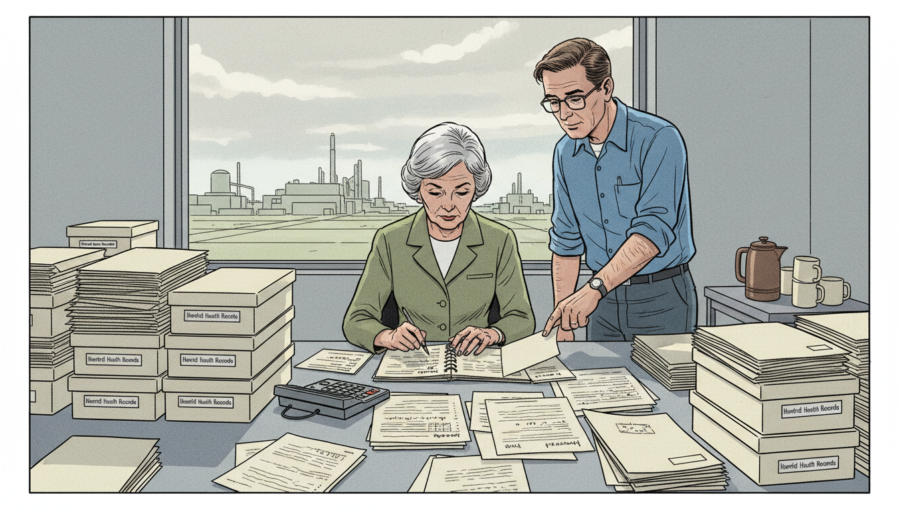

Image Prompt

Please generate a 16:9 image in mid-century British editorial illustration style depicting panel 9 of 12. Make the characters and style consistent with the prior panel. The scene shows Stewart, now in her 70s with gray hair, examining nuclear industry records at the Hanford nuclear site in Washington state in the early 1980s. She is in a plain office with file boxes labeled "Hanford Health Records." Color palette: cool institutional gray, cream paper, muted industrial green. Emotional tone: intellectual tenacity into old age. Specific details: (1) Stewart in a simple traveling suit with gray hair in a neat cut, (2) an American colleague standing nearby, (3) boxes of health records stacked on a long table, (4) a large window showing the distant Hanford plant, (5) a portable calculator and notebook, (6) a pot of coffee on a side table. Generate the image immediately without asking clarifying questions.

In the 1980s, Stewart took on an even larger institution: the United States nuclear industry. Invited to examine health records from Hanford, a nuclear weapons site, she and Kneale applied the same methods. Their analysis suggested that low-dose radiation was more harmful than the government's official risk models admitted. Once again, she had the data. Once again, she was attacked. Once again, she held her ground.

## Panel 10: The Teacher

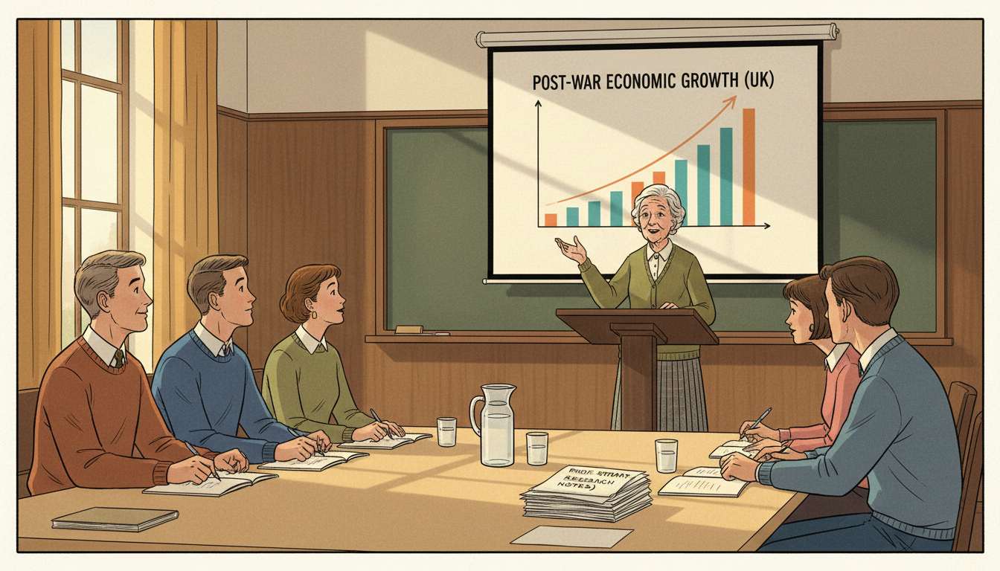

Image Prompt

Please generate a 16:9 image in mid-century British editorial illustration style depicting panel 10 of 12. Make the characters and style consistent with the prior panel. The scene shows Stewart in her 80s, silver-haired and lively, lecturing to a group of graduate students at a university seminar in the 1990s. She gestures at a projected graph. Color palette: warm lecture hall wood, chalkboard green, cream paper, window light. Emotional tone: wisdom and delight in teaching. Specific details: (1) Stewart in a neat cardigan and skirt, silver hair cut short, (2) five or six attentive young students with notebooks, (3) a projection screen with a statistical graph, (4) a wooden lectern, (5) a stack of her own papers on a table, (6) a carafe of water with glasses. Generate the image immediately without asking clarifying questions.

Into her eighties, Stewart taught, lectured, and mentored. She told students a truth that her whole career had taught her: that being right in science is not the same as being believed. That statistical thinking is slow, patient, and unglamorous. And that the most important skill a scientist can develop is the ability to keep working when everyone with a title is telling you to stop.

## Panel 11: The Late Recognition

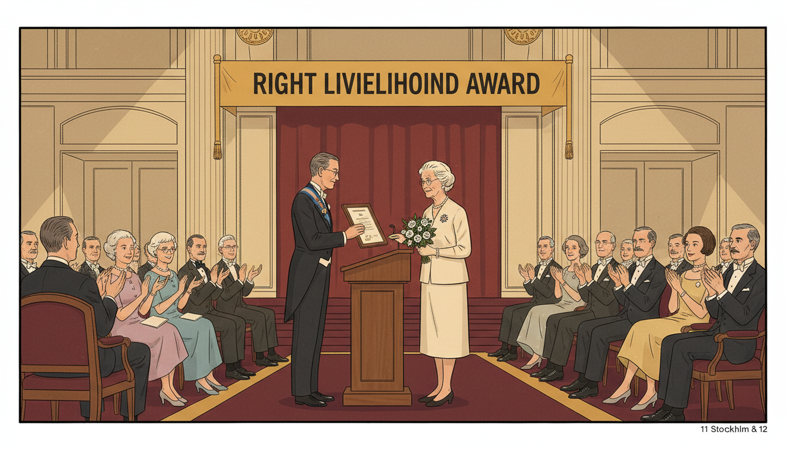

Image Prompt

Please generate a 16:9 image in mid-century British editorial illustration style depicting panel 11 of 12. Make the characters and style consistent with the prior panel. The scene shows Stewart in 1986 receiving the Right Livelihood Award (sometimes called the "Alternative Nobel") in Stockholm, an elegant woman in her 80s in a simple dress accepting a certificate from an official. Color palette: warm gold, burgundy carpet, cream walls, soft stage light. Emotional tone: quiet dignity of delayed recognition. Specific details: (1) Stewart at a podium with a framed certificate, (2) an audience of dignitaries applauding, (3) a Swedish setting with period 1980s formal decor, (4) a small bouquet in her hand, (5) a banner reading "Right Livelihood Award," (6) her modest but proud expression. Generate the image immediately without asking clarifying questions.

In 1986, at age 80, Stewart received the Right Livelihood Award — often called the "Alternative Nobel Prize" — for her work on radiation health. She never received the Nobel itself, and it hardly mattered. Her real reward was the Oxford Survey, which was still running, still producing data, and still correct.

## Panel 12: The Legacy — Patience as a Method

Image Prompt

Please generate a 16:9 image in mid-century British editorial illustration style depicting panel 12 of 12, blended with a subtle modern overlay. The composition shows Stewart's desk in two eras: on the left, her 1956 Oxford office with paper questionnaires and a slide rule; on the right, a modern epidemiologist's laptop screen showing a forest plot of meta-analysis results. A single line of data connects the two. Color palette: sepia left transitioning to cool modern blue right, unified by a warm amber thread. Emotional tone: continuity across generations of careful statistics. Specific details: (1) Stewart clearly visible on the left side, (2) the same desk surface continuing across, (3) a modern forest plot on the laptop, (4) a framed photo of Stewart above the modern workstation, (5) a stack of the original questionnaires, (6) a single tea mug spanning both eras. Generate the image immediately without asking clarifying questions.

Alice Stewart died in 2002 at the age of 95, still actively publishing. Every modern meta-analysis, every systematic review, every epidemiologist who patiently answers a thousand objections rather than one — they all stand on the slow, unshowy foundation she laid. Her career answered one of the hardest questions in science: *what do you do when you are right and no one believes you?* You keep going. You improve the analysis. You train a new generation. And you outlast the consensus.

### Epilogue – What Made Alice Stewart Different?

Stewart was not the most famous scientist of her century, nor the loudest. What made her different was her willingness to spend forty years defending a single finding — not by shouting, but by refining. She treated every objection as a free audit of her own work. She built a partnership (with Kneale) based entirely on stress-testing. And she understood that in statistics, patience is not a virtue — it is the method itself.

| Challenge | How Stewart Responded | Lesson for Today |
|-----------|------------------------|------------------|
| A widely trusted technology (prenatal X-rays) was causing harm | She designed a rigorous survey and published the data | Trust in a tool is not evidence of its safety — evidence is |
| Senior doctors attacked her methods and sample sizes | She partnered with a mathematician to re-run every analysis | Treat criticism as a free audit; rerun the numbers |
| The profession refused to change for twenty years | She kept collecting data and waited | Institutions change slowly; the data does not need to |
| Nuclear industry officials attacked her Hanford analysis | She held the line with the same statistical method | Good methodology is portable — and it scales |
| She was never awarded a Nobel | She kept teaching, publishing, and mentoring into her nineties | Recognition is a byproduct; the work is the reward |

### Call to Action

If you ever feel that no one is listening to what the numbers are telling you, remember Alice Stewart: sit down with a mathematician, rerun the analysis, and wait. The numbers do not need applause, and neither do you. Ask Sofia's question one more time: *But how do we know?* Then let the data answer.

---

*"Truth is the daughter of time."*
—Alice Stewart

*"If we think something is a problem, we have to study it and find out whether it is or not."*
—Alice Stewart

---

## References

1. [Wikipedia: Alice Stewart](https://en.wikipedia.org/wiki/Alice_Stewart) - Biography of the British physician and epidemiologist
2. [Wikipedia: Oxford Survey of Childhood Cancers](https://en.wikipedia.org/wiki/Oxford_Survey_of_Childhood_Cancers) - Stewart's landmark study of prenatal X-ray exposure and childhood cancer
3. [Wikipedia: Epidemiology](https://en.wikipedia.org/wiki/Epidemiology) - The field of study Stewart helped define through her case-control methods
4. [Right Livelihood Award: Alice Stewart](https://rightlivelihood.org/the-change-makers/find-a-laureate/alice-stewart/) - 1986 Right Livelihood Award citation and biography
5. [Encyclopaedia Britannica: Alice Stewart](https://www.britannica.com/biography/Alice-Stewart) - Overview of Stewart's life and epidemiological contributions
