# Andreas Vesalius and the Forbidden Bodies

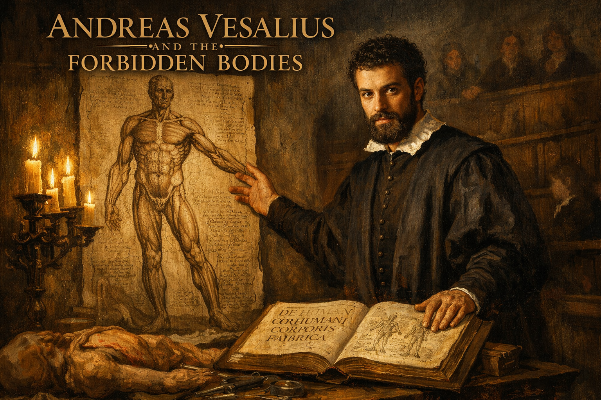

Cover Image Prompt

Please generate a wide-landscape 16:9 cover image for this story in the style of the Italian Renaissance (circa 1540s), with warm chiaroscuro lighting reminiscent of Caravaggio and the anatomical precision of Leonardo da Vinci's notebooks. The scene shows Andreas Vesalius as a young man of about 28: dark curly hair, a short beard, intense dark eyes, wearing a black scholar's robe with a white linen collar. He stands at a heavy oak dissection table in a candlelit anatomy theater, one hand resting on an open copy of his great book "De Humani Corporis Fabrica," the other hand gesturing toward a large anatomical illustration pinned to the wall behind him — a detailed Renaissance-style drawing of the human muscular system in a dramatic standing pose. Candles in iron candelabras cast deep golden light across his face and the table. In the background, tiered wooden benches of the anatomy theater rise into shadow, with a few indistinct figures watching. Include the title "ANDREAS VESALIUS AND THE FORBIDDEN BODIES" rendered in a Renaissance-era serif typeface across the top. Color palette: warm candlelight gold, deep umber, rich burgundy, cream parchment, and the cool blue-gray of stone walls. Emotional tone: bold, scholarly, defiant — a young man challenging centuries of received wisdom. Generate the image immediately without asking clarifying questions.

Narrative Prompt

This is the story of Andreas Vesalius (1514–1564), a Belgian-born anatomist who, at the age of 28, published one of the most important books in the history of science — De Humani Corporis Fabrica (On the Fabric of the Human Body). For over a thousand years, European medicine had relied on the anatomical writings of the Roman physician Galen, who had never dissected a human body because Roman law forbade it. Galen dissected apes and pigs and extrapolated to humans, and generations of doctors memorized his errors as sacred truth. Vesalius dared to look for himself — stealing bodies from gallows, dissecting by candlelight, and comparing what he saw with what Galen had written. He found hundreds of errors. When he published his findings with stunning anatomical illustrations, the medical establishment attacked him viciously. Central themes: appeal to authority, the primacy of first-hand evidence, the courage to look, and the difference between reading about truth and seeing it for yourself. Visual style: consistent Italian Renaissance painting style throughout all 12 panels, with warm chiaroscuro lighting, candlelit scenes, anatomical illustrations visible in the background, and Vesalius as a recurring character — always the same dark-haired, bearded young man in a black scholar's robe. Architecture should reflect 16th-century Padua and Brussels — vaulted stone ceilings, wooden anatomy theaters, Gothic university halls. Color palette stays consistent: warm candlelight gold, deep umber, rich burgundy, cream parchment, cool stone gray.

### Prologue – A Thousand Years of Guessing

For over a millennium, every physician in Europe learned anatomy from the same source: the writings of Claudius Galen, a Greek physician who served Roman gladiators and emperors in the second century. Galen was brilliant, prolific, and confident. He was also wrong about hundreds of things — because Roman law forbade the dissection of human bodies, and he had never cut one open. He dissected Barbary apes and pigs instead, and assumed humans were the same inside. For a thousand years, no one checked. Then a young man from Brussels decided to look.

## Panel 1: Galen's Shadow

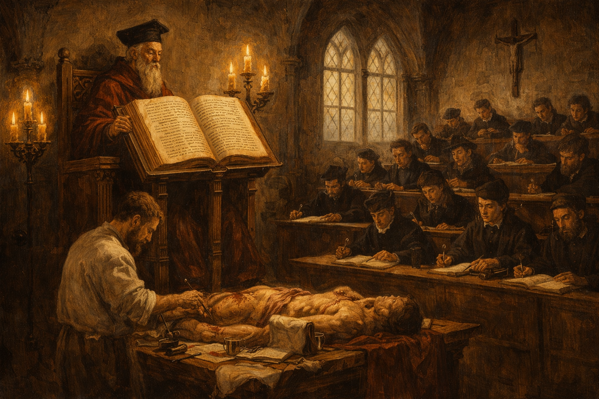

Image Prompt

I am about to ask you to generate a series of images for a graphic novel. Please make the images have a consistent style and consistent characters. Do not ask any clarifying questions. Just generate the image immediately when asked.

Please generate a 16:9 image in Italian Renaissance painting style (circa 1540s) with warm chiaroscuro lighting, depicting panel 1 of 12. The scene shows a medieval European university lecture hall around 1530. A white-bearded professor in a tall academic cap and heavy crimson robes sits on an elevated wooden throne-like chair, reading aloud from a massive leather-bound copy of Galen's anatomical texts propped on a lectern. Below him, a barber-surgeon in a plain apron performs a dissection on a table, but the professor never looks down — he reads only from the book. Rows of students in dark scholar's robes sit on tiered wooden benches, dutifully copying the professor's words into notebooks. Nobody is looking at the actual body on the table. Color palette: warm candlelight gold, deep umber, rich burgundy, cream parchment. The emotional tone is ritualistic, reverent, and stagnant — knowledge transmitted by authority, not observation. Include: tall Gothic arched windows with pale light, a wooden crucifix on the wall, iron candelabras, quill pens and inkwells, and the massive ornate book dominating the scene. Generate the image immediately without asking clarifying questions.

This was how anatomy was taught in every medical school in Europe for centuries. A professor sat in an elevated chair, reading aloud from Galen's texts in Latin. Below him, a barber-surgeon cut open the body. The professor never looked down. The students never questioned the book. If what they saw on the table did not match what Galen had written, they assumed the body was wrong — not the book.

## Panel 2: The Boy Who Stole Bones

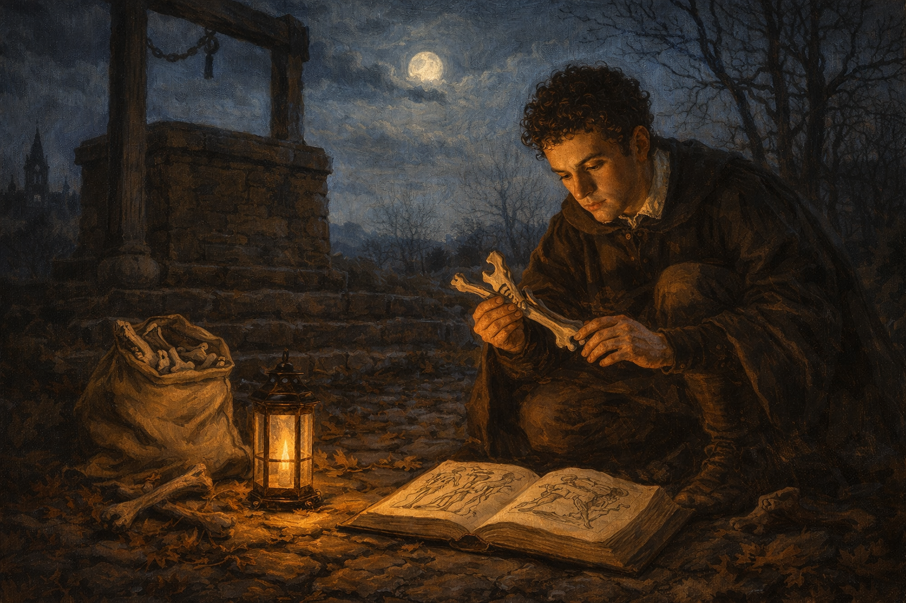

Image Prompt

Please generate a 16:9 image in Italian Renaissance painting style with warm chiaroscuro lighting, depicting panel 2 of 12. Make the characters and style consistent with the prior panel. The scene shows a teenage Andreas Vesalius, about 16 years old — dark curly hair, no beard yet, thin and intense — in the moonlit countryside outside Brussels around 1530. He crouches at the base of a stone gallows structure, carefully examining animal bones he has collected, comparing them with a small worn anatomy book open on the ground beside him. A canvas sack of bones sits nearby. The gallows stands dark against a pale moonlit sky. Bare winter trees frame the scene. Color palette: cool moonlight blue-silver, warm amber from a small lantern on the ground, deep shadow, cream parchment of the open book. The emotional tone is secretive, driven, and fearless — a boy obsessed with understanding what lies beneath the surface. Include: cobblestones, dried leaves, a church steeple visible in the distance, the small oil lantern casting a warm circle of light, and the boy's intense focus on comparing the bones to the illustration. Generate the image immediately without asking clarifying questions.

Andreas Vesalius was born in Brussels in 1514 into a family of physicians and pharmacists. As a boy, he was consumed by curiosity about the structure of living things. He dissected mice, rats, and stray cats. He haunted the outskirts of town where executed criminals were displayed on gibbets, collecting bones that had been picked clean by birds and weather. While other boys played, Vesalius compared bones to the illustrations in his father's anatomy books — and even as a teenager, he noticed that something did not add up.

## Panel 3: The University of Paris

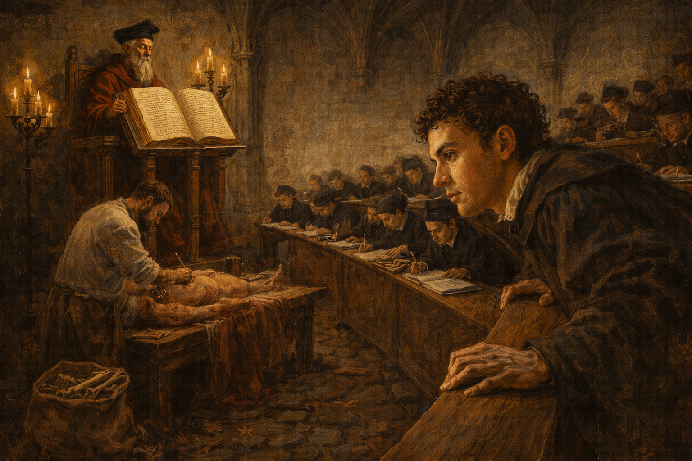

Image Prompt

Please generate a 16:9 image in Italian Renaissance painting style with warm chiaroscuro lighting, depicting panel 3 of 12. Make the characters and style consistent with the prior panel. The scene shows the medical lecture hall at the University of Paris around 1533. A young Vesalius, now about 19, sits among dozens of students on wooden benches. The same traditional arrangement is visible — an elderly professor reads from Galen on an elevated chair while a barber-surgeon works below. But Vesalius is different from the other students: while they write in their notebooks with heads down, he leans forward, craning his neck to see the dissection table, his face showing frustration and skepticism. Color palette: warm candlelight gold, deep umber, burgundy academic robes, cream walls. The emotional tone is restless impatience — a student who wants to see for himself. Include: Gothic stone arches, a large leather-bound Galen text on the professor's lectern, iron candelabras with dripping candles, other students dutifully copying, inkwells and quill pens, and Vesalius's hands gripping the edge of the bench as he strains to see. Generate the image immediately without asking clarifying questions.

At the University of Paris, Vesalius encountered the same ritual he would later destroy. Professors lectured from Galen while barber-surgeons did the actual cutting. Students were expected to memorize, not observe. But Vesalius could not stop looking. He pushed to the front of every dissection. He volunteered to hold the instruments. His professors praised his skill with a scalpel but warned him against questioning Galen. One professor, Jacobus Sylvius, would later become his most bitter enemy.

## Panel 4: The Anatomy Theater at Padua

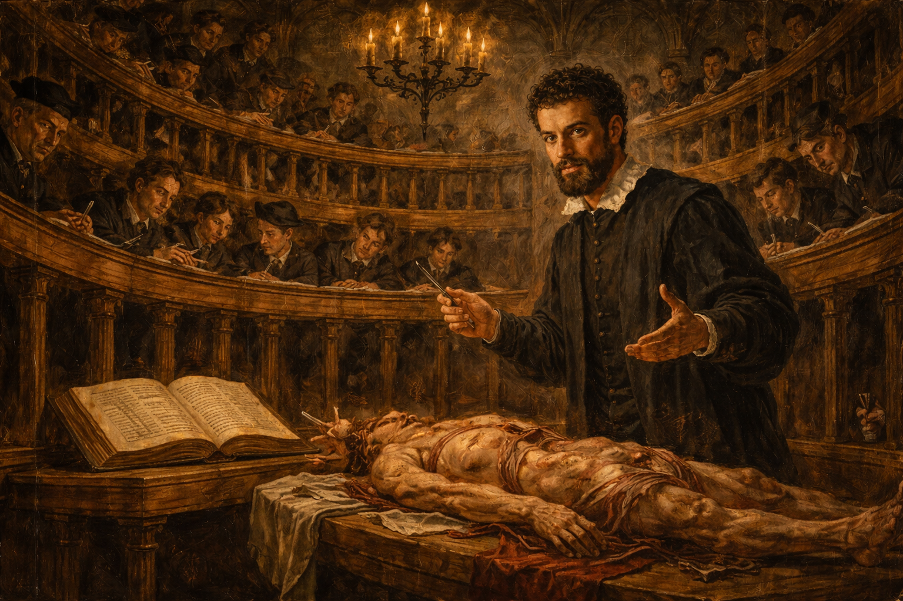

Image Prompt

Please generate a 16:9 image in Italian Renaissance painting style with warm chiaroscuro lighting, depicting panel 4 of 12. Make the characters and style consistent with the prior panel. The scene shows the famous circular wooden anatomy theater at the University of Padua in 1537. Andreas Vesalius, now 23, with a short dark beard, stands at the center of the theater beside a dissection table. For the first time, the professor is doing the dissection himself — Vesalius holds a scalpel in one hand and gestures with the other as he lectures. Concentric rings of standing spectators in dark robes lean over wooden railings, looking down at the table with intense fascination. Candles and oil lamps illuminate the scene from above. Color palette: warm gold candlelight, deep wood browns, cream and umber, rich burgundy. The emotional tone is revolutionary and electric — something new is happening. Include: the distinctive oval tiered balconies of the Padua anatomy theater, iron candelabras suspended from above, students sketching in notebooks, the open Galen text set aside on a secondary table, and Vesalius's confident posture as he teaches by doing. Generate the image immediately without asking clarifying questions.

In 1537, at the astonishing age of 23, Vesalius was appointed professor of anatomy at the University of Padua — the finest medical school in Europe. On his very first day, he broke tradition. He dismissed the barber-surgeon, picked up the scalpel himself, and performed the dissection with his own hands while lecturing. The students had never seen anything like it. A professor who actually *looked* at what he was teaching.

## Panel 5: Stealing the Dead by Candlelight

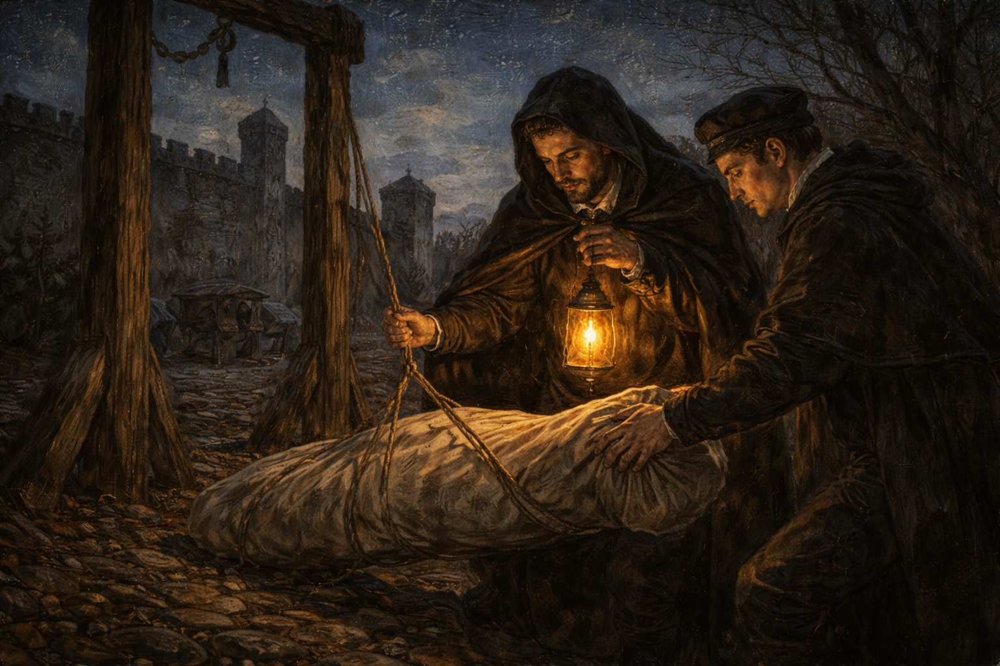

Image Prompt

Please generate a 16:9 image in Italian Renaissance painting style with warm chiaroscuro lighting, depicting panel 5 of 12. Make the characters and style consistent with the prior panel. The scene shows Vesalius and a trusted student on a dark night outside the walls of Padua, near a stone execution ground. They carefully lower a wrapped bundle from a wooden gibbet by lantern light. A horse-drawn cart waits nearby on a dirt road. The city walls and a watchtower are silhouetted against a starry sky. Color palette: deep night blues and blacks, warm amber lantern light on the two figures, cool silver moonlight on the stone walls. The emotional tone is tense, secretive, and urgent — scholars doing forbidden work under cover of darkness. Include: a hooded cloak on Vesalius, the small oil lantern casting dramatic shadows, cobblestones, a rope, bare winter trees, stars visible above, and the careful, reverent way the two figures handle the bundle. Do not show any exposed remains — the bundle is wrapped in cloth. Generate the image immediately without asking clarifying questions.

To study human anatomy properly, Vesalius needed bodies — and bodies were desperately hard to obtain. He made arrangements with local judges for the corpses of executed criminals. When that was not enough, he and his students crept out at night to the gallows and execution grounds outside the city walls. They took what the law and the Church would not willingly give. Every body was a chance to check Galen against reality, and Vesalius checked relentlessly.

## Panel 6: Galen Was Wrong

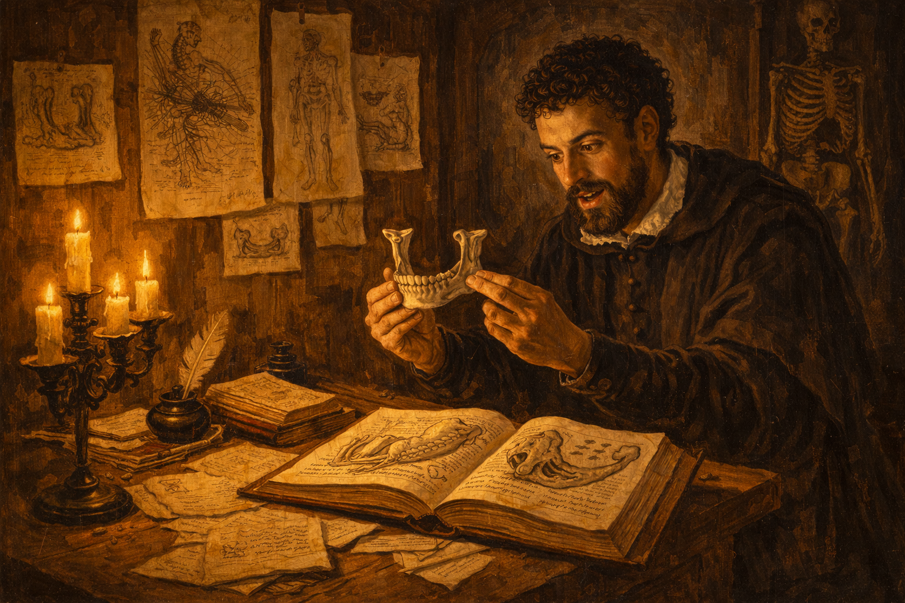

Image Prompt

Please generate a 16:9 image in Italian Renaissance painting style with warm chiaroscuro lighting, depicting panel 6 of 12. Make the characters and style consistent with the prior panel. The scene shows Vesalius in his private study at the University of Padua, late at night. He sits at a heavy oak table covered with anatomical drawings, open books, and detailed sketches of bones and organs. He holds a human jawbone in one hand and compares it to an illustration in Galen's text, which shows a different structure — an ape's jaw with a different number of segments. His face shows a mixture of excitement and disbelief. Detailed anatomical drawings in the style of Renaissance illustration are pinned to the walls around him. Color palette: warm candlelight gold, deep umber shadows, cream parchment, rich burgundy book bindings. The emotional tone is the thrill of discovery mixed with the weight of its implications. Include: multiple candles in brass holders, anatomical sketches pinned with wax to wooden walls, an ink pot and quill, scattered pages of notes comparing Galen's descriptions to observed reality, a human skeleton hanging from a stand in the corner, and the open Galen text clearly showing a drawing that does not match the bone in Vesalius's hand. Generate the image immediately without asking clarifying questions.

The errors piled up. Galen had written that the human jawbone was made of two separate bones — because an ape's jaw is. Vesalius held a human jawbone in his hands: it was one bone. Galen said the human breastbone had seven segments — because a pig's does. Vesalius counted three. Galen described a network of blood vessels at the base of the brain called the *rete mirabile* — it exists in ungulates but not in humans. Error after error, organ after organ. The greatest medical authority in history had been describing animals, not people, and nobody had looked closely enough to notice for over a thousand years.

## Panel 7: The Artists of the Fabrica

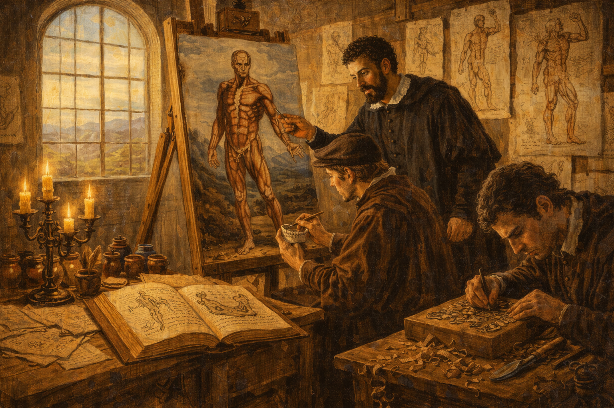

Image Prompt

Please generate a 16:9 image in Italian Renaissance painting style with warm chiaroscuro lighting, depicting panel 7 of 12. Make the characters and style consistent with the prior panel. The scene shows Vesalius working alongside two Renaissance artists in a large, bright studio in Padua around 1540. One artist sits at an easel, carefully painting a full-size anatomical figure in a dramatic standing pose — a muscular figure with layers of muscle revealed, set against an Italian landscape background, in the distinctive style of the Fabrica woodcuts. Vesalius stands beside the easel, pointing to specific anatomical details and directing the artist's work. A second artist at a nearby table carves a detailed woodblock for printing, wood shavings curling on the floor. Anatomical reference drawings and preliminary sketches cover the walls. Color palette: warm natural daylight from large windows, golden wood tones, cream paper, rich umber and sienna. The emotional tone is creative collaboration and meticulous precision — art in service of truth. Include: large arched windows letting in Italian sunlight, wooden easels, pots of pigment, carving tools, reference drawings pinned to the wall showing the famous "muscle men" poses from the Fabrica, and both artists working with intense concentration. Generate the image immediately without asking clarifying questions.

Vesalius understood that seeing was everything — so the illustrations had to be extraordinary. He recruited artists from the studio of the great Titian to create the woodcut illustrations for his book. The result was unprecedented: life-sized figures depicted with both scientific accuracy and artistic beauty, posed dramatically against Italian landscapes as if they were alive. Skeletons contemplated skulls. Figures with muscles revealed stood in classical contrapposto. Nothing like it had ever existed. The pictures did not merely illustrate anatomy — they made it impossible to look away.

## Panel 8: De Humani Corporis Fabrica

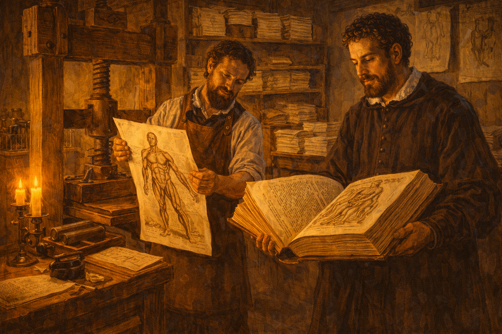

Image Prompt

Please generate a 16:9 image in Italian Renaissance painting style with warm chiaroscuro lighting, depicting panel 8 of 12. Make the characters and style consistent with the prior panel. The scene shows a printing workshop in Basel, Switzerland, in 1543. A large wooden printing press dominates the center of the room. A printer in a leather apron pulls a freshly printed page from the press — it shows one of the famous anatomical woodcut illustrations from the Fabrica, a muscular figure in a dramatic standing pose. Vesalius stands beside the press, examining a bound proof copy of the massive book, his face showing pride and anxiety. Stacks of printed sheets dry on wooden racks along the walls. Color palette: warm amber workshop light, deep wood browns, cream paper, black ink. The emotional tone is anticipation and momentousness — a book about to change the world. Include: the large wooden screw press, ink rollers, wooden type cases on shelves, bundles of printed pages tied with string, a pot of black ink, the massive size of the Fabrica visible in Vesalius's hands (it was over 700 pages), and the detailed anatomical woodcut illustration visible on the freshly printed sheet. Generate the image immediately without asking clarifying questions.

In 1543, when Vesalius was just 28 years old, the printing presses of Johannes Oporinus in Basel produced *De Humani Corporis Fabrica* — "On the Fabric of the Human Body." It was over 700 pages, with more than 200 woodcut illustrations of breathtaking detail. It was the most ambitious anatomical work ever attempted, and it systematically dismantled Galen's authority point by point, replacing ancient guesswork with observed reality. Vesalius dedicated the book to the Holy Roman Emperor Charles V — a strategic move to shield himself from the fury he knew was coming.

## Panel 9: The Fury of Sylvius

Image Prompt

Please generate a 16:9 image in Italian Renaissance painting style with warm chiaroscuro lighting, depicting panel 9 of 12. Make the characters and style consistent with the prior panel. The scene shows a grand wood-paneled academic hall at the University of Paris around 1544. Jacobus Sylvius, an elderly professor with a long white beard, sharp nose, and furious expression, stands at a lectern pounding his fist on an open copy of the Fabrica. He holds up a crumpled pamphlet — his published attack on Vesalius — in his other hand. Behind him on the wall hangs a large portrait of Galen crowned with laurel, like a saint's icon. A crowd of faculty members in dark academic robes murmur among themselves. Color palette: deep mahogany browns, burgundy robes, candlelight gold, cold gray stone. The emotional tone is rage, indignation, and institutional fury. Include: the ornate Gothic architecture of the Paris faculty hall, iron candelabras, Sylvius's trembling hand, the crumpled pamphlet visible with the word "VESANUS" (madman — a pun on Vesalius's name), disapproving faces in the audience, and the near-religious reverence for Galen's portrait. Generate the image immediately without asking clarifying questions.

The backlash was ferocious. Jacobus Sylvius — Vesalius's former professor in Paris and the most powerful anatomist in France — published a venomous attack calling Vesalius "Vesanus" (madman). He argued that if Galen's descriptions did not match modern bodies, it was because the human body itself had changed since Galen's time — not because Galen was wrong. Other Galenists accused Vesalius of impiety, of desecrating the dead, of arrogance beyond his years. The man who had looked was being punished for what he saw.

## Panel 10: The Bonfire of Manuscripts

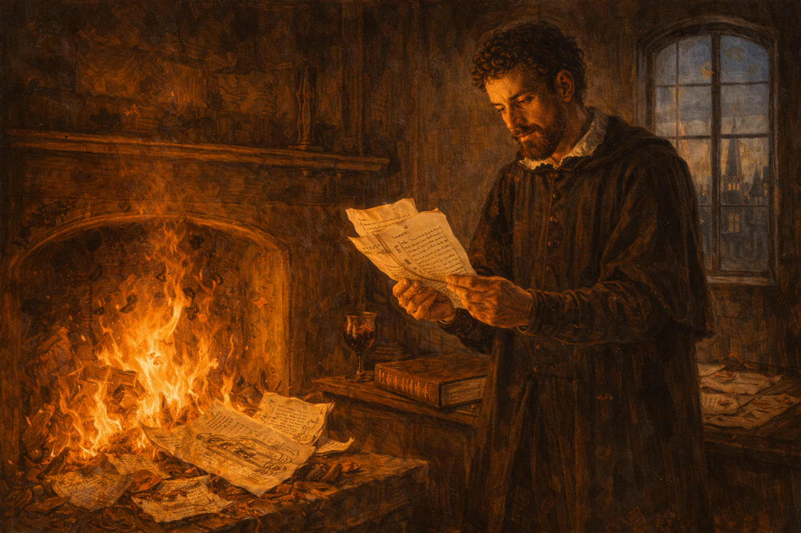

Image Prompt

Please generate a 16:9 image in Italian Renaissance painting style with warm chiaroscuro lighting, depicting panel 10 of 12. Make the characters and style consistent with the prior panel. The scene shows Vesalius alone in his study, standing before a fireplace where flames consume a pile of manuscripts and anatomical notes. His face is lit by the fire — an expression of anguish, exhaustion, and bitter resignation. He holds a few remaining pages in one hand, hesitating. On the table behind him, his copy of the Fabrica lies closed. Through a window, the spires of a European city are visible at twilight. Color palette: intense firelight orange and gold, deep shadow, cool twilight blue through the window, dark umber. The emotional tone is devastating — a brilliant man breaking under the weight of rejection. Include: flames consuming detailed anatomical drawings, curling pages with visible handwritten text, the heavy closed Fabrica on the table, a wine goblet, scattered correspondence with broken wax seals, and the deep shadows of a man who feels defeated. Generate the image immediately without asking clarifying questions.

The attacks took their toll. In a moment of despair that still haunts the history of science, Vesalius burned many of his unpublished manuscripts and anatomical notes. He left his academic career, accepting a position as court physician to Emperor Charles V — prestigious but intellectually sterile. For nearly twenty years, one of the greatest anatomists who ever lived spent his days treating gout and indigestion in the imperial court. The establishment had not disproved him. It had simply made the cost of being right too high to bear.

## Panel 11: The Fabrica Lives On

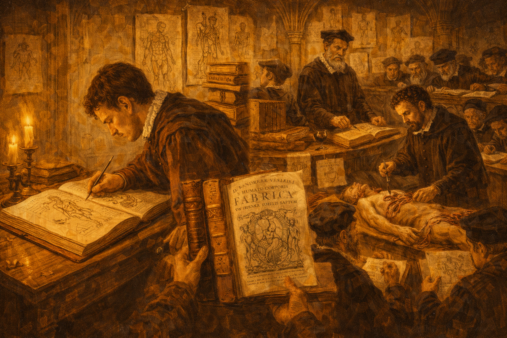

Image Prompt

Please generate a 16:9 image in Italian Renaissance painting style with warm chiaroscuro lighting, depicting panel 11 of 12. Make the characters and style consistent with the prior panel. The scene is a split composition spanning decades. On the left, a copy of the Fabrica lies open on a desk in a candlelit study, with a young anatomy student in 1560s clothing leaning over it, sketching from its illustrations. On the right, set perhaps fifty years later, another anatomy theater (around 1600) shows a professor performing his own dissection — just as Vesalius had — while students observe and draw. Between the two halves, copies of the Fabrica are being carried, traded, and studied by figures in various European clothing. Color palette: warm candlelight gold flowing across both halves, deep umber, cream parchment, rich burgundy. The emotional tone is legacy and quiet revolution — an idea that could not be stopped. Include: multiple copies of the distinctive large Fabrica with its ornate title page, students comparing the book's illustrations to their own observations, anatomical drawings on walls, and a sense of knowledge spreading unstoppably through time. Generate the image immediately without asking clarifying questions.

But the book could not be burned. The *Fabrica* spread across Europe like a fire of its own. Students who read it could never go back to blind faith in Galen. A new generation of anatomists picked up Vesalius's scalpel and his principle: *look for yourself*. Gabriele Falloppio, Vesalius's own student, extended his teacher's work. Within a century, the entire tradition of reading Galen from an elevated chair while someone else did the cutting had collapsed. The professor and the dissector became the same person — because Vesalius had proven they must be.

## Panel 12: The Lesson of the Scalpel

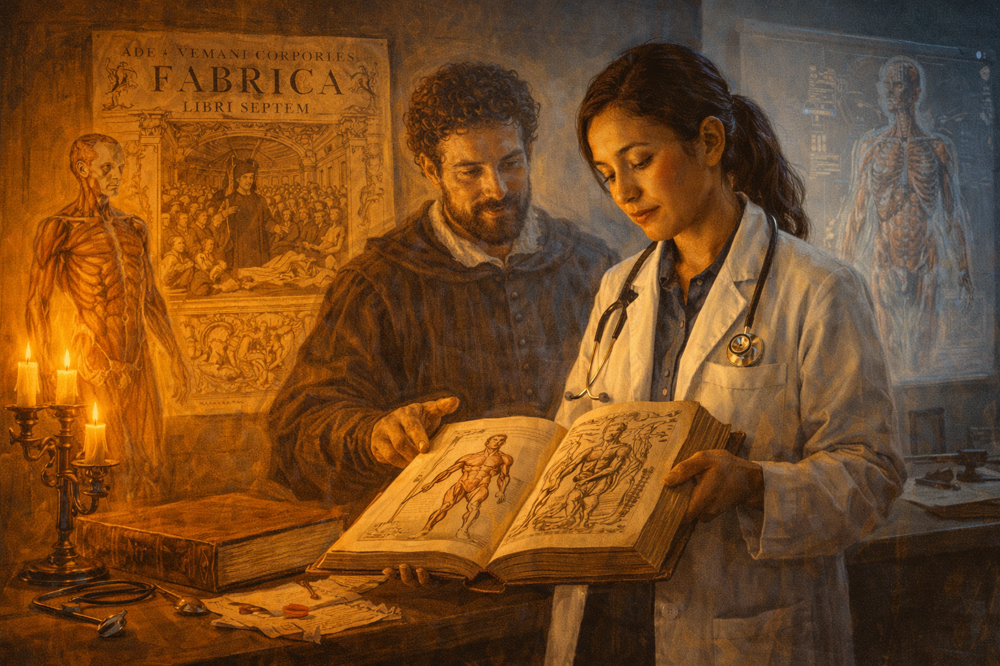

Image Prompt

Please generate a 16:9 image in Italian Renaissance painting style with warm chiaroscuro lighting, depicting panel 12 of 12, with a subtle timeless quality. Make the characters and style consistent with the prior panels. The scene shows a modern medical student in a white coat standing in a contemporary anatomy laboratory, holding a copy of the Fabrica open to one of its famous muscular-figure illustrations. Behind her, mounted on the wall, is a large reproduction of the Fabrica's iconic title page — the crowded anatomy theater with Vesalius at the center. A ghostly, translucent Renaissance-era figure of Vesalius in his black scholar's robe stands beside the student, one hand reaching toward the book, his expression one of quiet satisfaction. The lighting blends warm Renaissance candlelight around Vesalius's figure with cool modern laboratory light on the student. Color palette: warm gold and umber on Vesalius's side, clean whites and pale blues on the modern side. The emotional tone is continuity, reverence, and the enduring power of first-hand observation. Include: a modern anatomy model on the table, the student's stethoscope, the distinctive Fabrica illustrations clearly visible, a projection screen showing a digital anatomical image, and the two figures — past and present — united by the same book and the same principle: look for yourself. Generate the image immediately without asking clarifying questions.

Every medical student who has ever held a scalpel owes something to Andreas Vesalius. Not just for the anatomy he corrected, but for the principle he established: that no authority, however ancient, however revered, is a substitute for looking with your own eyes. The *Fabrica* did not just fix Galen's errors. It broke the spell of a thousand years of intellectual obedience and replaced it with something far more powerful — the insistence that knowledge must be verified by direct observation, no matter who disagrees.

### Epilogue – What Made Vesalius Different?

Vesalius was not the only physician who had access to Galen's texts. He was not even the only one who performed dissections. What set him apart was a refusal to subordinate what he *saw* to what he had been *told*. He treated Galen's writings not as scripture but as a hypothesis to be tested — and when the hypothesis failed, he trusted his own hands over a thousand years of authority. That is the foundational act of empirical science, and it cost him everything.

| Challenge | How Vesalius Responded | Lesson for Today |
|-----------|------------------------|------------------|
| A millennium of unquestioned authority | He compared Galen's claims to direct observation | Authority is not evidence — always check the source |
| Bodies were forbidden and difficult to obtain | He risked his career and freedom to obtain specimens | First-hand evidence sometimes requires courage to gather |
| His former teachers attacked him publicly | He published the evidence anyway, with irrefutable illustrations | Make your evidence so clear that it speaks for itself |
| The emotional cost of being right became unbearable | He retreated, but his book carried the revolution forward | Ideas, once published, can outlast the person who had them |

### Call to Action

The next time you encounter a claim defended only by the phrase "that's what the textbook says" or "that's what the experts believe," remember Vesalius. For a thousand years, every doctor in Europe memorized the anatomy of an ape and called it human — because the authority who wrote it down was too famous to question. You do not need a medical degree to apply Vesalius's lesson. You need only the willingness to ask: *has anyone actually looked?*

---

*"I am not accustomed to saying anything with certainty after only one or two observations."*
—Andreas Vesalius

*"I think it will be more profitable if I lead you to the thing itself than talk about something you have never seen."*
—Andreas Vesalius, *De Humani Corporis Fabrica* (1543)

*"In such a tangled thicket of opinions, the best course is to put aside all authorities and trust one's own eyes."*
—Andreas Vesalius

---

## References

1. [Wikipedia: Andreas Vesalius](https://en.wikipedia.org/wiki/Andreas_Vesalius) - Biography of the founder of modern human anatomy
2. [Wikipedia: De Humani Corporis Fabrica](https://en.wikipedia.org/wiki/De_Humani_Corporis_Fabrica) - The revolutionary 1543 anatomical atlas that overturned Galen's authority
3. [Wikipedia: Galen](https://en.wikipedia.org/wiki/Galen) - The Roman physician whose anatomical writings dominated European medicine for over a thousand years
4. [Encyclopaedia Britannica: Andreas Vesalius](https://www.britannica.com/biography/Andreas-Vesalius) - Curated overview of Vesalius's life, work, and legacy in the history of medicine
5. [U.S. National Library of Medicine: Andreas Vesalius and the Anatomy of the Human Body](https://www.nlm.nih.gov/exhibition/historicalanatomies/vesalius_home.html) - Historical Anatomies on the Web — digitized pages and illustrations from the Fabrica
