# The Baloney Detection Kit

Cover Image Prompt

Please generate a wide-landscape 16:9 cover image for a graphic novel titled "The Baloney Detection Kit" in a Space Age American illustration style blending 1970s NASA technical art with modern editorial illustration. Show Carl Sagan, a thoughtful American man in his early 50s with dark wavy hair, warm brown eyes, and his trademark brown corduroy jacket over a beige turtleneck, standing beside a glowing model of the solar system with a starry cosmos background. In one hand he holds an open hardback book clearly labeled "The Demon-Haunted World," and beside him floats a checklist labeled "Baloney Detection Kit." The title "The Baloney Detection Kit" is rendered in a clean retro-futuristic sans-serif typeface at the top. Color palette: deep cosmic indigo, warm amber stars, cream pages, corduroy brown, burnished gold. Emotional tone: wonder held together with rigor. Include: (1) Sagan's warm, curious expression, (2) period-accurate 1980s clothing, (3) the book title clearly legible, (4) swirling galaxies in the background, (5) a pencil tucked behind his ear, (6) a faint sketch of the Voyager Golden Record floating nearby. Generate the image immediately without asking clarifying questions.

Narrative Prompt

This is a 12-panel graphic novel about Carl Sagan (1934-1996), the American astronomer, planetary scientist, and science communicator whose book *The Demon-Haunted World: Science as a Candle in the Dark* (1995) gave the public a practical toolkit for distinguishing real knowledge from pseudoscience. Settings range from 1940s Brooklyn and the 1939 World's Fair, to Cornell University in the 1970s, to JPL during the Voyager missions, to his final hospital room. The art style combines Space Age NASA technical illustration with mid-century American editorial color. Sagan should be drawn consistently: a tall man with dark wavy hair (thinning later), warm brown eyes, his trademark corduroy jacket and turtleneck, and an expression that is simultaneously awed and curious. Central TOK theme: skepticism is not the opposite of wonder but the discipline that protects it.

### Prologue – A Library Card and a World's Fair

In 1939, a five-year-old boy from Brooklyn visited the New York World's Fair and saw a vision of the future: trains that floated, cities of glass, machines that could think. Later that year, a librarian handed him his first library card and explained that he could borrow books about *anything*. Carl Sagan walked home that day clutching a future he could not yet describe — one in which humans would walk on other worlds, build robots that spoke across the solar system, and also, dangerously, lose the ability to tell what was true. He would spend his life trying to prevent that second future from winning.

## Panel 1: The 1939 World's Fair

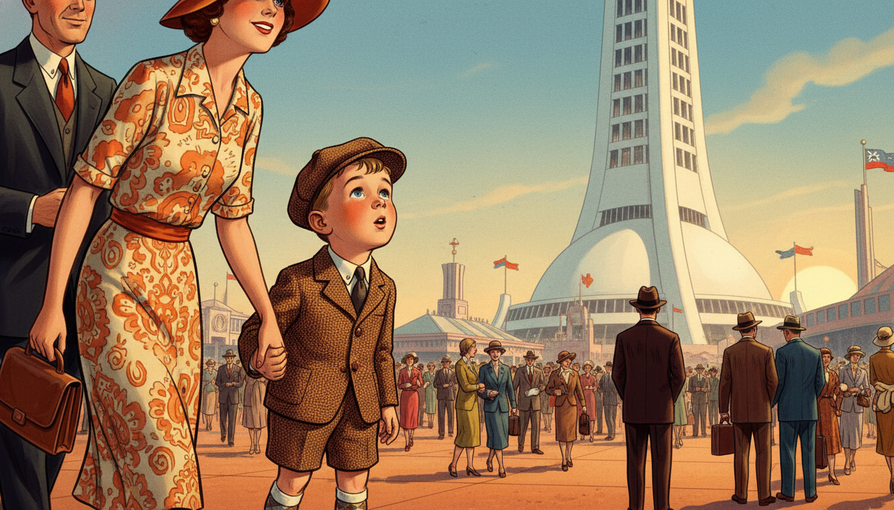

Image Prompt

I am about to ask you to generate a series of images for a graphic novel. Please make the images have a consistent style and consistent characters. Do not ask any clarifying questions. Just generate the image immediately when asked.

Please generate a 16:9 image in a style blending 1940s American illustration with Space Age retro-futurism, depicting panel 1 of 12. The scene shows young Carl Sagan, a wide-eyed five-year-old boy in a 1939 boy's cap, jacket, and short pants, gazing up in wonder at the Trylon and Perisphere at the 1939 New York World's Fair, holding his mother's hand. Color palette: deco cream, sky blue, burnished copper, warm gold. Emotional tone: pure childhood wonder. Specific details: (1) the iconic Trylon and Perisphere architecture clearly visible, (2) a crowd of 1939 fairgoers in period clothing, (3) Carl in short pants and cap, (4) his mother in a 1939 dress and hat, (5) flags flying from distant pavilions, (6) a warm afternoon sky. Generate the image immediately without asking clarifying questions.

The Fair's motto was "The World of Tomorrow." For Carl, it was not just advertising — it was a promise. Rockets, television, robots, and highways in the sky were real possibilities, not fantasy. He came home, climbed onto his mother's lap, and asked the question that would guide him for sixty years: *how do we know what is real?*

## Panel 2: The Library Card

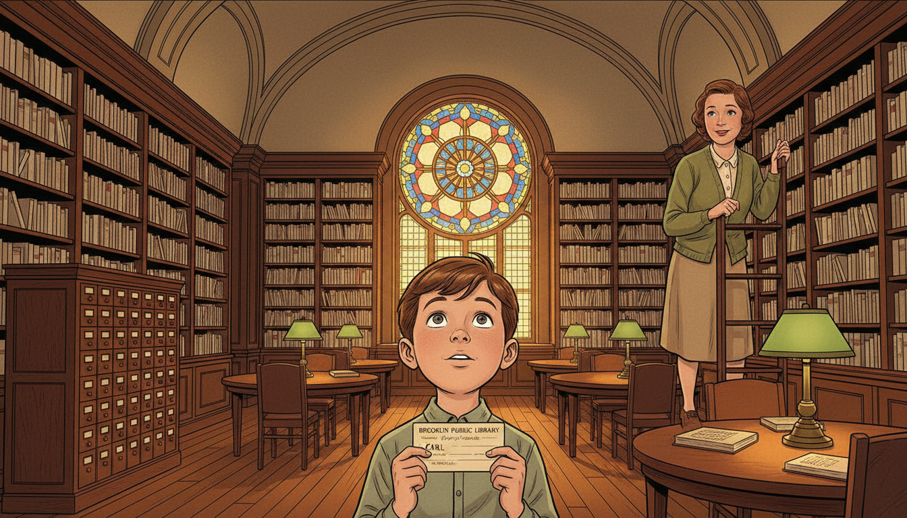

Image Prompt

Please generate a 16:9 image in the same style, depicting panel 2 of 12. Make the characters and style consistent with the prior panel. The scene shows young Carl in a neighborhood Brooklyn public library in 1939, holding his very first library card and looking up at tall shelves of books in amazement. A kindly librarian in a 1930s dress smiles down at him. Color palette: warm oak, deep reading-lamp amber, green shaded desk lamps, cream book spines. Emotional tone: reverent wonder. Specific details: (1) a wooden library card catalog, (2) Carl holding a paper library card, (3) the librarian in a 1930s cardigan, (4) tall stacks of books, (5) a round reading table with green lamps, (6) a stained-glass window casting colored light. Generate the image immediately without asking clarifying questions.

At the local branch of the Brooklyn Public Library, Carl asked for "books on stars." The librarian walked him to the astronomy shelf and handed him a book. Inside he found that the points of light he saw over Brooklyn at night were suns — suns so far away that their light took years to reach him. He later said that moment was the first time his sense of wonder collided with the scale of reality. The collision never stopped.

## Panel 3: The Young Astronomer

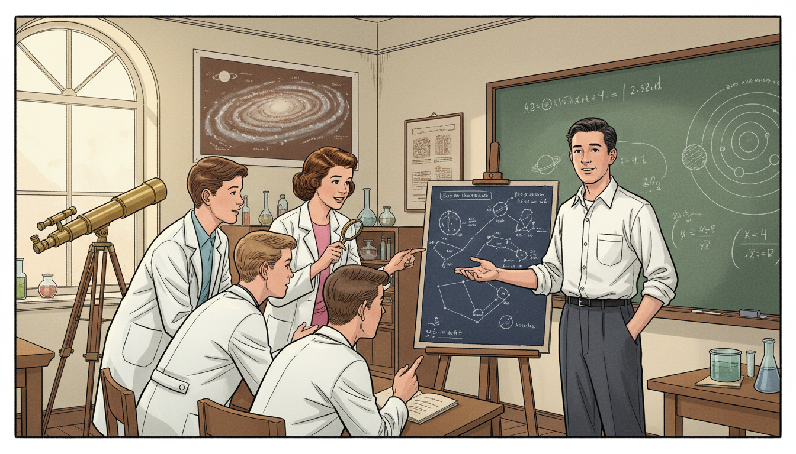

Image Prompt

Please generate a 16:9 image in the same style, depicting panel 3 of 12. Make the characters and style consistent with the prior panel. The scene shows teenage Carl Sagan in the early 1950s at a high school science club, showing fellow students a homemade star chart he has drawn. Color palette: chalk green blackboard, warm cream, brown wood, white lab coats. Emotional tone: emerging confidence in a lifelong passion. Specific details: (1) a hand-drawn star chart on easel, (2) Carl in a 1950s white shirt and dark slacks, (3) four or five curious classmates, (4) a telescope on a tripod by the window, (5) a wall poster of the Milky Way, (6) a chalkboard with a hand-drawn diagram of the solar system. Generate the image immediately without asking clarifying questions.

Through high school and college, Sagan devoured astronomy, physics, biology, and — increasingly — the history of how humans had been fooled. He became fascinated by the boundary between science and pseudoscience, between careful observation and wishful thinking. By the time he entered the University of Chicago as an undergraduate, he had already decided his life's work would straddle both sides of that line.

## Panel 4: The Scientist at Cornell

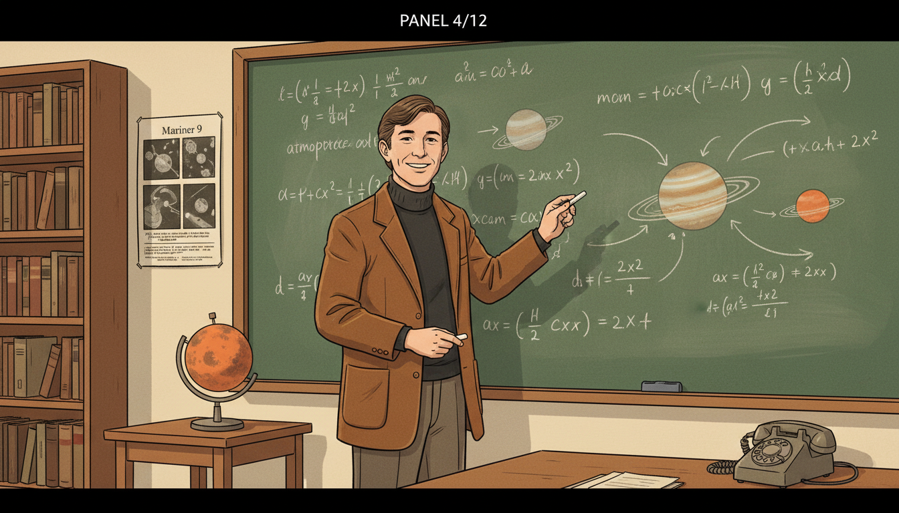

Image Prompt

Please generate a 16:9 image in the same style, depicting panel 4 of 12. Make the characters and style consistent with the prior panel. The scene shows Sagan as a young professor at Cornell University in the early 1970s, standing in front of a large blackboard covered with equations and planetary diagrams. He wears his trademark brown corduroy jacket and turtleneck. Color palette: chalkboard green, cream, corduroy brown, warm lecture hall light. Emotional tone: joyful scientific engagement. Specific details: (1) blackboard with planetary atmosphere equations, (2) Sagan pointing with a piece of chalk, (3) a small model of Mars on a side table, (4) bookshelves filled with journals, (5) a 1970s-era telephone on the desk, (6) a large poster of Mariner 9 images. Generate the image immediately without asking clarifying questions.

At Cornell, Sagan became one of the first scientists to study planetary atmospheres seriously. He correctly predicted the hot surface of Venus, the sand storms of Mars, and the organic chemistry of Titan. But he also did something his colleagues thought beneath them: he wrote for popular audiences. He appeared on television. He insisted that the taxpayers funding science deserved to understand it.

## Panel 5: The Voyager Golden Record

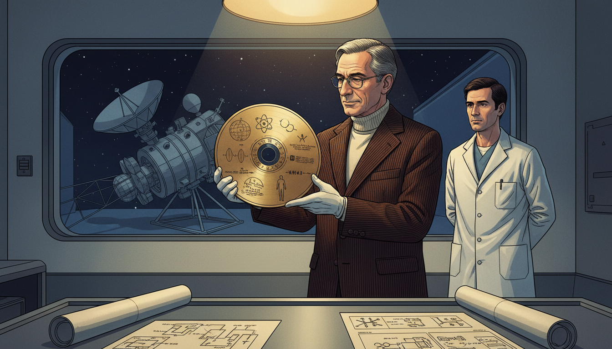

Image Prompt

Please generate a 16:9 image in the same style, depicting panel 5 of 12. Make the characters and style consistent with the prior panel. The scene shows Sagan in 1977 at JPL examining the gold-plated Voyager Golden Record, which he helped curate as a message from humanity to any alien civilization that might find it. Color palette: burnished gold, deep indigo, cream lab walls, warm spotlight. Emotional tone: humility before the cosmic scale. Specific details: (1) the circular gold record clearly visible with its etched diagrams, (2) Sagan in a corduroy jacket handling it with white cotton gloves, (3) a JPL technician in a white lab coat nearby, (4) a clean-room window in the background, (5) a portion of the Voyager spacecraft visible, (6) scattered technical drawings of the record's contents. Generate the image immediately without asking clarifying questions.

When NASA launched Voyager 1 and 2 in 1977, Sagan led the team that designed the Golden Records attached to each spacecraft — a message from Earth to whoever might find them, perhaps a billion years from now. Music from a dozen cultures. Greetings in 55 languages. A diagram showing where our Sun was located in the galaxy. For Sagan, it was an act of cosmic humility: a bottle thrown into an ocean so vast we could not see its edges.

## Panel 6: Cosmos on Television

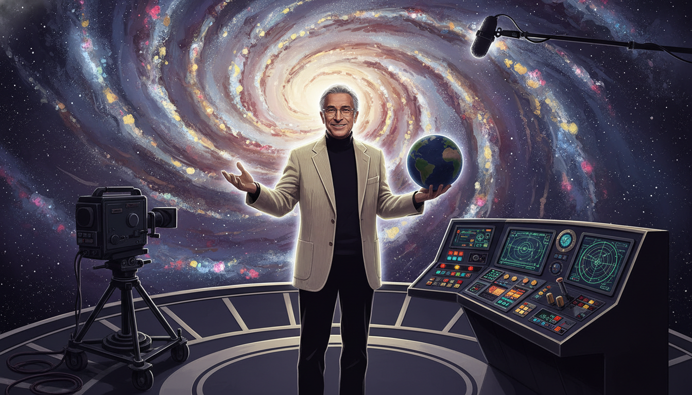

Image Prompt

Please generate a 16:9 image in the same style, depicting panel 6 of 12. Make the characters and style consistent with the prior panel. The scene shows Sagan on the set of the 1980 television series "Cosmos," standing before a large swirling galaxy backdrop with the iconic "Spaceship of the Imagination" control panel beside him. Color palette: deep cosmic purple, swirling gold and silver stars, cream jacket accents. Emotional tone: theatrical wonder. Specific details: (1) the famous Cosmos set with stylized galactic background, (2) Sagan gesturing warmly toward the camera, (3) television camera and boom microphone at the edge of frame, (4) his trademark corduroy jacket and turtleneck, (5) a small hand-held globe of Earth, (6) soft rim lighting picking up his silhouette. Generate the image immediately without asking clarifying questions.

In 1980, *Cosmos: A Personal Voyage* aired on PBS. Over thirteen episodes, Sagan walked viewers from the Big Bang to DNA to the rise of civilization — and ultimately to our responsibility to protect the pale blue dot we live on. More than 500 million people in sixty countries watched. For a generation, Sagan was not just an astronomer; he was the adult who took curious children seriously.

## Panel 7: The Baloney Detection Kit Takes Shape

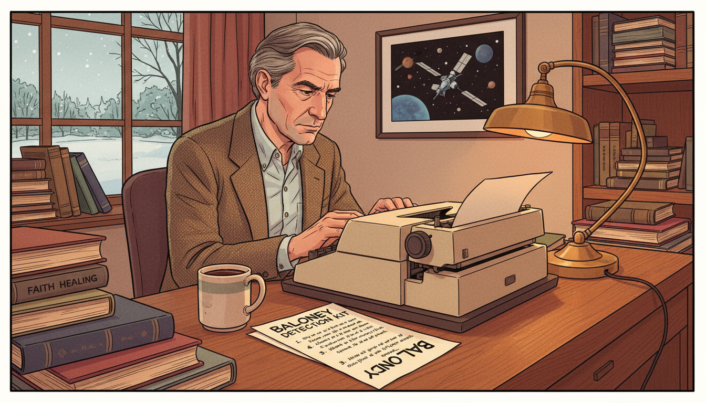

Image Prompt

Please generate a 16:9 image in the same style, depicting panel 7 of 12. Make the characters and style consistent with the prior panel. The scene shows Sagan in his Cornell office in the early 1990s, now in his late 50s with graying hair, writing at a typewriter with a handwritten list titled "Tools for Skeptical Thinking" beside him. Color palette: warm oak, cream paper, soft lamp amber. Emotional tone: thoughtful urgency. Specific details: (1) a list clearly titled "Baloney Detection Kit" with numbered items, (2) a 1990s electric typewriter, (3) stacks of books including one labeled "UFOs" and another labeled "Faith Healing," (4) a framed photograph of Voyager on the wall, (5) a mug of coffee, (6) a window showing Ithaca snow outside. Generate the image immediately without asking clarifying questions.

By the 1990s, Sagan was watching something alarm him: Americans were increasingly believing in things that were not true. UFO abductions. Faith healers. Crystal energy. Fake science dressed in the vocabulary of real science. So he sat down to write a practical checklist — tools that any citizen could use to tell real knowledge from nonsense. He called it the Baloney Detection Kit.

## Panel 8: The Demon-Haunted World

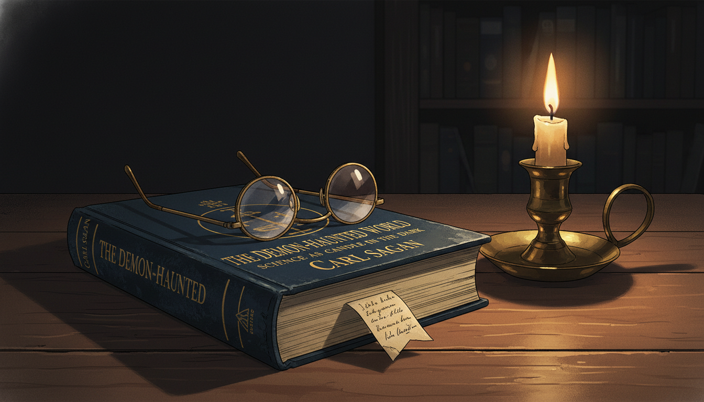

Image Prompt

Please generate a 16:9 image in the same style, depicting panel 8 of 12. Make the characters and style consistent with the prior panel. The scene shows a close-up of a 1995 hardcover edition of "The Demon-Haunted World: Science as a Candle in the Dark" resting on a desk, with a single lit candle beside it casting warm light. Sagan's reading glasses rest on the cover. Color palette: deep midnight blue book cover, candle-amber warmth, cream page, brass candleholder. Emotional tone: solemn hope. Specific details: (1) the book title clearly legible, (2) the subtitle "Science as a Candle in the Dark" visible, (3) a single candle flame, (4) his reading glasses, (5) a darkened room beyond, (6) a small handwritten bookmark inside. Generate the image immediately without asking clarifying questions.

*The Demon-Haunted World* appeared in 1995. Its central image was a candle held up against darkness: science as the flickering, imperfect, but real light humanity had learned to carry. The book taught readers to ask: Is the claim falsifiable? Has it been independently verified? Does it rely on authority rather than evidence? Can an alternative explanation account for the same facts? Simple questions. Almost childishly simple. And yet together they formed one of the most powerful thinking tools ever written for a general audience.

## Panel 9: Facing Illness

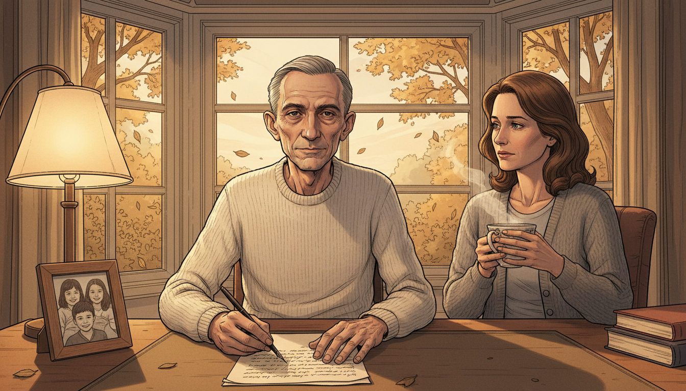

Image Prompt

Please generate a 16:9 image in the same style, depicting panel 9 of 12. Make the characters and style consistent with the prior panel. The scene shows Sagan in 1996, thinner and more gaunt from myelodysplasia but still composed, sitting at his writing desk by a large window with autumn light, pen in hand, his wife Ann Druyan beside him with a cup of tea. Color palette: muted autumn gold, soft gray, cream, warm lamplight. Emotional tone: tender urgency. Specific details: (1) Sagan in a simple sweater, thinner than before, (2) Ann Druyan seated beside him, (3) a manuscript page in front of him, (4) a window with autumn leaves outside, (5) a small framed photo of their children, (6) a steaming teacup. Generate the image immediately without asking clarifying questions.

Sagan was diagnosed with myelodysplasia, a rare bone marrow disease, in 1994. Knowing he did not have much time, he doubled his output. He finished *The Demon-Haunted World*. He wrote *Billions and Billions*, finished posthumously by his wife Ann Druyan. He gave interviews warning that a nation that cannot tell science from pseudoscience will eventually make decisions that destroy it. He was not pessimistic, but he was urgent.

## Panel 10: The Pale Blue Dot

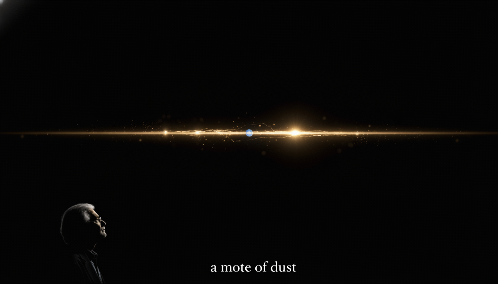

Image Prompt

Please generate a 16:9 image in the same style, depicting panel 10 of 12. Make the characters and style consistent with the prior panel. The scene shows a dramatic view of the "Pale Blue Dot" photograph — Earth seen from Voyager 1 at 6 billion kilometers away, a single pale blue point of light suspended in a band of sunlight, set against the vastness of space. Sagan's silhouette is faintly visible in the lower corner contemplating it. Color palette: deep cosmic black, scattered gold sunbeams, the faint blue of distant Earth. Emotional tone: humbling awe. Specific details: (1) the actual "pale blue dot" point of light, (2) a band of scattered sunlight, (3) Sagan in silhouette at the edge of frame, (4) deep space blackness, (5) a faint text quote in serif type along the bottom reading "a mote of dust," (6) no stars visible, matching the actual image. Generate the image immediately without asking clarifying questions.

It was Sagan who had requested, years earlier, that Voyager 1 turn its camera back toward Earth from the edge of the solar system and take one final picture. The result — a single blue pixel suspended in a beam of sunlight — became one of the most important photographs ever taken. "That's here. That's home. That's us," he wrote. A civilization that could understand that image could not stay childish for long.

## Panel 11: The Last Interview

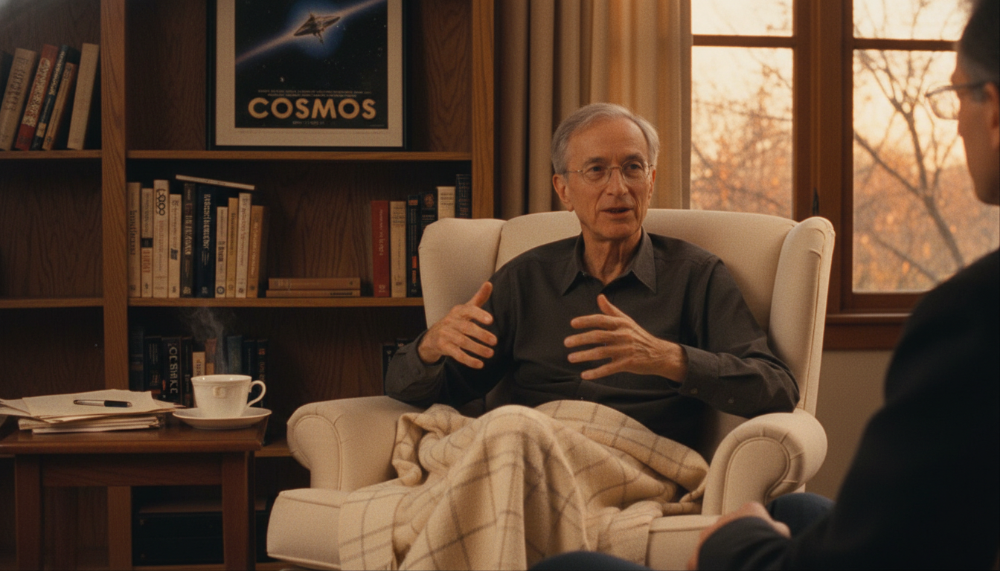

Image Prompt

Please generate a 16:9 image in the same style, depicting panel 11 of 12. Make the characters and style consistent with the prior panel. The scene shows Sagan in late 1996 in a quiet study giving one of his final interviews, seated in an armchair with a warm blanket over his knees, speaking directly to an interviewer off-camera. Color palette: warm oak, cream blanket, soft lamplight, autumn light. Emotional tone: calm, urgent, generous. Specific details: (1) Sagan thin but composed, (2) a bookshelf behind him with familiar titles, (3) a steaming teacup on a side table, (4) a framed Cosmos poster, (5) a window showing late-afternoon light, (6) his hands gesturing gently. Generate the image immediately without asking clarifying questions.

In his final televised interview, weeks before his death, Sagan warned that America was drifting toward a time when almost no one could tell the difference between what was true and what made them feel good. He did not name villains. He simply named the cure: science, critical thinking, and a citizenry willing to use both. He died on December 20, 1996, at age 62.

## Panel 12: The Candle Still Burns

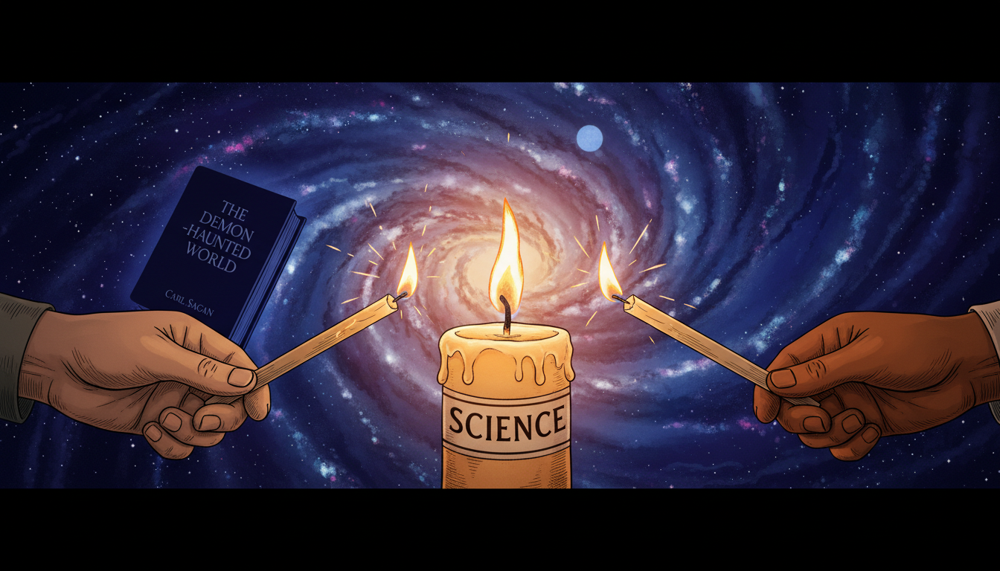

Image Prompt

Please generate a 16:9 image in the same style blended with modern design, depicting panel 12 of 12. The composition shows a symbolic scene: a single candle labeled "Science" burning in the foreground, with modern hands — young, diverse — reaching in to light new candles from the original flame. The background shows a swirling galaxy. Color palette: warm candle amber, cosmic indigo, cream, bright flames. Emotional tone: legacy and continuation. Specific details: (1) the original candle at center, (2) three or four young hands from different skin tones with new candles, (3) Sagan's "Demon-Haunted World" visible as a silhouette in the background, (4) a starry cosmos above, (5) the glowing Pale Blue Dot faintly visible, (6) warm light spreading outward. Generate the image immediately without asking clarifying questions.

Sagan's greatest legacy is not a discovery. It is a habit of mind. Every student who asks "what is the evidence?", every citizen who pauses before sharing a claim, every teacher who tells her class that wonder and skepticism are partners — each of them is lighting a candle from the one he lit. The world is still demon-haunted. But thanks to Carl Sagan, more people know how to hold a light.

### Epilogue – What Made Carl Sagan Different?

Sagan was not the greatest astronomer of his century, nor the most cited. What made him different was his refusal to separate wonder from rigor. He believed the universe was both astonishing and knowable, and that every human being deserved access to both halves of that truth. He treated the public as intelligent adults. He treated pseudoscience as a serious threat, not a harmless quirk. And he insisted, to his last breath, that teaching people how to think was the highest form of protection a democracy could have.

| Challenge | How Sagan Responded | Lesson for Today |
|-----------|----------------------|------------------|
| Science was seen as inaccessible to ordinary people | He wrote, broadcast, and taught for the general public | Expertise is not a wall; it is a door |
| Pseudoscience was spreading unchallenged | He built a practical "Baloney Detection Kit" | Give people tools, not just conclusions |
| Academics mocked him for doing public science | He kept doing it anyway | Communicating what you know is part of knowing it |
| He was diagnosed with a fatal illness | He worked harder and faster, urgently finishing his books | Time pressure clarifies what matters |
| The public conflated skepticism with cynicism | He showed that skepticism is what keeps wonder honest | Doubt and awe are partners, not opposites |

### Call to Action

Next time you read a claim that feels too good, too scary, or too certain — pause and run it through Sagan's checklist. What's the evidence? Who benefits? Has anyone else replicated it? Can it be proven wrong? These are not cynical questions. They are the questions of someone who loves the truth enough to protect it. That, Sofia would say, is exactly how we know.

---

*"Somewhere, something incredible is waiting to be known."*
—Carl Sagan

*"Extraordinary claims require extraordinary evidence."*
—Carl Sagan

*"Science is a way of thinking much more than it is a body of knowledge."*
—Carl Sagan

---

## References

1. [Wikipedia: Carl Sagan](https://en.wikipedia.org/wiki/Carl_Sagan) - Biography of the American astronomer and science communicator
2. [Wikipedia: The Demon-Haunted World](https://en.wikipedia.org/wiki/The_Demon-Haunted_World) - Sagan's 1995 book introducing the Baloney Detection Kit
3. [Wikipedia: Pale Blue Dot](https://en.wikipedia.org/wiki/Pale_Blue_Dot) - The Voyager 1 photograph Sagan requested and his famous reflection on it
4. [NASA: Carl Sagan](https://solarsystem.nasa.gov/people/209/carl-sagan/) - NASA biographical page for Carl Sagan
5. [Encyclopaedia Britannica: Carl Sagan](https://www.britannica.com/biography/Carl-Sagan) - Overview of Sagan's life and contributions to planetary science and public understanding
