# Charles Darwin and the Finches' Beaks

Cover Image Prompt

Please generate a wide-landscape 16:9 cover image for a graphic novel titled "Charles Darwin and the Finches' Beaks" in a Victorian-era Pre-Raphaelite style blended with natural history illustration, using warm brown tones throughout. Show Charles Darwin as a young man of about twenty-five, with dark wavy hair, a clean-shaven face, and an intense, observant expression, standing on a volcanic rocky shore of the Galápagos Islands. He holds an open leather-bound notebook and pencil. Around him, four finches with distinctly different beak shapes perch on nearby rocks and cactus branches. The HMS Beagle is anchored in the turquoise bay behind him. The title text "Charles Darwin and the Finches' Beaks" is rendered in an elegant Victorian serif typeface at the top. Color palette: warm sepia browns, umber, ochre, muted sage greens, with soft golden tropical light. Emotional tone: the wonder of discovery on the edge of a dangerous idea. Include: (1) Darwin's youthful, curious expression, (2) four finches with visibly different beak shapes, (3) volcanic black rock and sparse cactus vegetation, (4) the HMS Beagle at anchor in the middle distance, (5) a leather specimen bag slung over Darwin's shoulder, (6) a giant tortoise partially visible among the rocks. Generate the image immediately without asking clarifying questions.

Narrative Prompt

This is a 12-panel graphic novel about Charles Darwin (1809-1882), the English naturalist whose theory of evolution by natural selection transformed biology and our understanding of humanity's place in nature. The story spans from his departure on the HMS Beagle in 1831 to the publication of On the Origin of Species in 1859 and beyond. Settings range from the English countryside, the decks and cabins of the HMS Beagle, the Galápagos Islands, and Darwin's study at Down House in Kent. The art style throughout is Victorian Pre-Raphaelite blended with natural history illustration — warm brown tones, sepia, umber, and ochre, with the meticulous detail of 19th-century scientific plates. Darwin should be drawn consistently across panels: initially a young clean-shaven man in his twenties with dark wavy hair and an eager expression, aging across the panels into his famous bearded older self. Central TOK themes: inductive reasoning from accumulated evidence, the emotional and social dimensions of paradigm shifts, and the courage required to publish ideas that challenge deeply held beliefs.

### Prologue – The Reluctant Revolutionary

In December 1831, a twenty-two-year-old Englishman who had dropped out of medical school and nearly become a country clergyman stepped aboard a small survey ship called the HMS Beagle. Five years later, Charles Darwin came home with notebooks full of observations that would not leave him alone. Fossils of giant extinct mammals that looked like smaller living ones. Finches on neighboring islands with beaks shaped for entirely different foods. Mockingbirds that varied from island to island in ways no one had bothered to explain. The evidence pointed somewhere Darwin knew would horrify Victorian society — and his own deeply religious wife. He sat on his theory for twenty years. This is the story of what he saw, what he feared, and why he finally spoke.

## Panel 1: The Young Man on the Dock

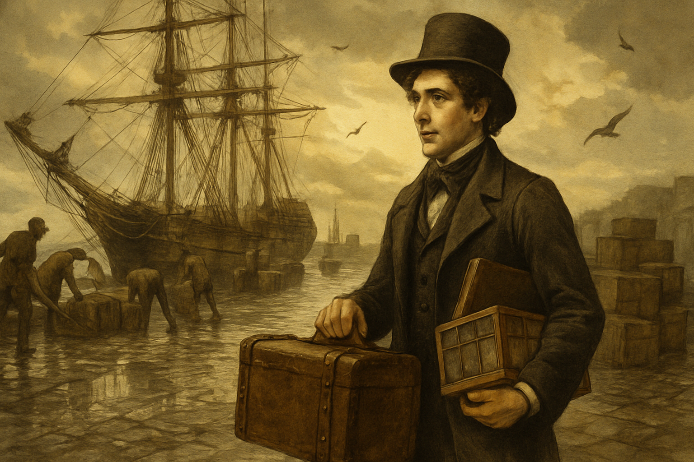

Image Prompt

I am about to ask you to generate a series of images for a graphic novel. Please make the images have a consistent style and consistent characters. Do not ask any clarifying questions. Just generate the image immediately when asked.

Please generate a 16:9 image in Victorian Pre-Raphaelite style with natural history illustration elements and warm brown tones depicting panel 1 of 12. The scene shows young Charles Darwin, age twenty-two, clean-shaven with dark wavy hair and an eager expression, standing on a rain-slicked dock in Plymouth, England, in December 1831. Behind him, the HMS Beagle, a small ten-gun brig-sloop, is being loaded with provisions. Darwin carries a leather trunk and a wooden case of specimen jars. His father's disapproving letter is folded in his coat pocket. The color palette is sepia, umber, slate gray, rain-washed greens, and a pale winter light breaking through clouds. Emotional tone: nervous excitement at the threshold of the unknown. Specific details: (1) the HMS Beagle with its masts and rigging visible, (2) dockworkers loading barrels and crates, (3) Darwin in a dark frock coat and top hat, (4) a leather-bound journal under his arm, (5) rain puddles reflecting the ship, (6) seagulls wheeling above the harbor. Generate the image immediately without asking clarifying questions.

Darwin's father had told him the voyage was a waste of time — a wild scheme for an idle young man. His uncle Josiah Wedgwood had argued otherwise, and his father had relented. Now Darwin stood on the Plymouth docks watching supplies loaded onto a ship barely ninety feet long, wondering if he had made a terrible mistake. He had been seasick on the English Channel. The Beagle was about to cross the Atlantic.

## Panel 2: Seasick and Scribbling

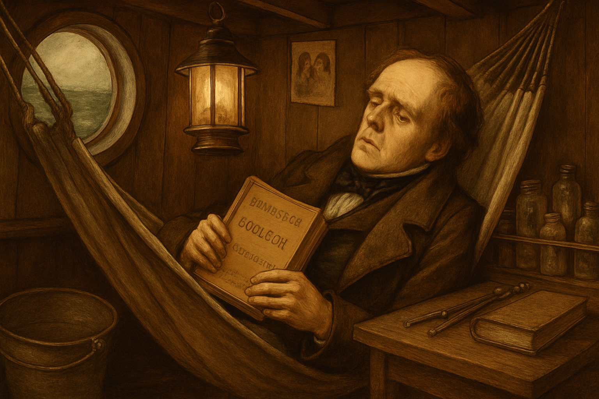

Image Prompt

Please generate a 16:9 image in Victorian Pre-Raphaelite style with natural history illustration elements and warm brown tones depicting panel 2 of 12. Make the characters and style consistent with the prior panel. The scene shows Charles Darwin in his cramped cabin aboard the HMS Beagle in early 1832, lying in his hammock looking pale and miserable from seasickness, yet holding a copy of Charles Lyell's Principles of Geology open on his chest. The tiny cabin is cluttered with specimen jars, a swinging lantern, and a narrow desk bolted to the wall. The color palette is warm lamplight amber, dark wood brown, and green-gray ocean visible through a small porthole. Emotional tone: misery mixed with intellectual obsession. Specific details: (1) the hammock swinging at an angle as the ship rolls, (2) Lyell's book clearly visible in his hands, (3) specimen bottles secured in a wooden rack, (4) a bucket beside the hammock, (5) nautical instruments on the desk, (6) a small portrait of his family pinned to the wall. Generate the image immediately without asking clarifying questions.

Darwin was wretchedly seasick for nearly the entire five-year voyage. But in his hammock he read Charles Lyell's *Principles of Geology*, which argued that the Earth was enormously old and shaped by slow, gradual forces rather than sudden catastrophes. The idea lodged in his mind: if the Earth changed slowly over vast stretches of time, could living things change slowly too? It was a question he was not yet ready to ask aloud.

## Panel 3: The Fossils of Patagonia

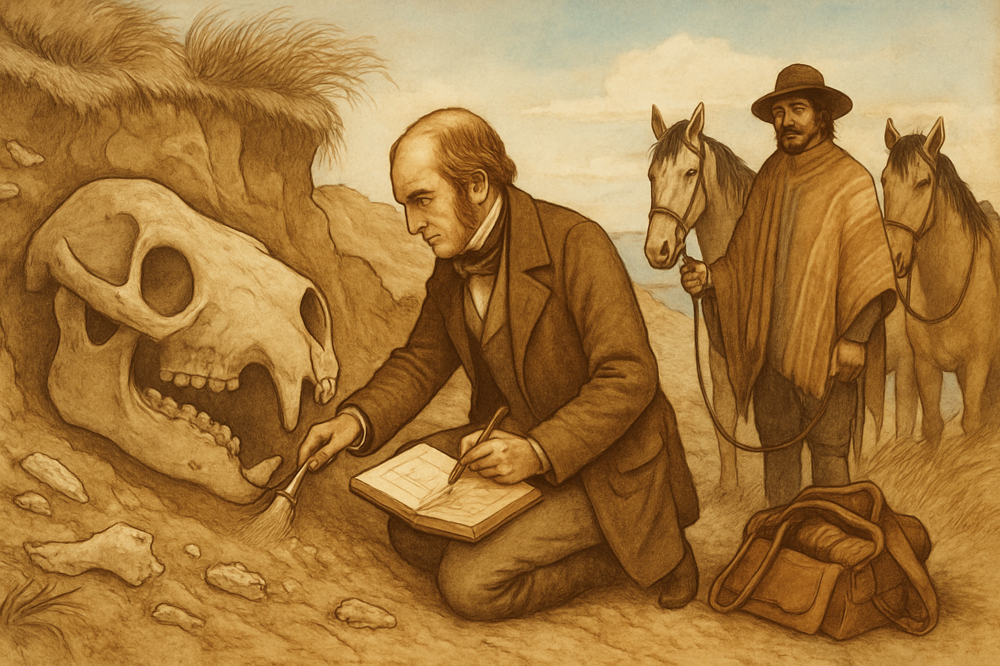

Image Prompt

Please generate a 16:9 image in Victorian Pre-Raphaelite style with natural history illustration elements and warm brown tones depicting panel 3 of 12. Make the characters and style consistent with the prior panel. The scene shows Darwin on the windswept coast of Patagonia in 1833, kneeling in a sandy cliff face beside the enormous fossilized skull of a Toxodon, an extinct South American mammal. He is carefully brushing sand from the fossil with a small brush while sketching in his notebook. A gaucho guide stands nearby holding the reins of two horses. The color palette is dusty ochre, bleached bone white, warm sienna, and pale blue Patagonian sky. Emotional tone: the thrill of discovery and the first stirrings of a dangerous question. Specific details: (1) the massive Toxodon skull half-exposed in the cliff, (2) Darwin's notebook open with a quick sketch, (3) wind-bent scrub grass on the clifftop, (4) the gaucho in traditional poncho and hat, (5) a leather satchel of tools and wrapped specimens, (6) other fossil fragments visible in the exposed rock layer. Generate the image immediately without asking clarifying questions.

In Patagonia, Darwin dug enormous fossil bones out of coastal cliffs — the skulls and limbs of creatures no one in England had ever seen. A Toxodon that looked like a giant version of the living capybara. A Megatherium, an extinct ground sloth the size of an elephant. Why did these extinct giants resemble smaller animals still living on the same continent? If each species had been separately created, why would God make an extinct giant that looked like a living rodent? Darwin recorded the question in his notebook and moved on.

## Panel 4: The Enchanted Islands

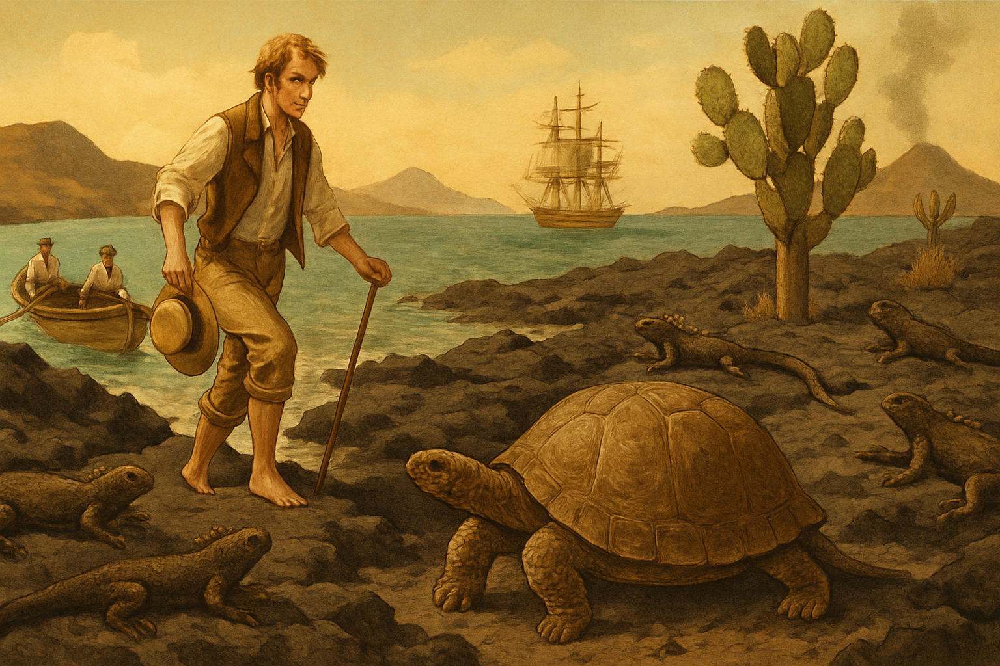

Image Prompt

Please generate a 16:9 image in Victorian Pre-Raphaelite style with natural history illustration elements and warm brown tones depicting panel 4 of 12. Make the characters and style consistent with the prior panel. The scene shows Darwin arriving on a Galápagos beach in September 1835, stepping from a small rowing boat onto black volcanic rock. Marine iguanas bask in the equatorial sun, completely unafraid. A giant tortoise lumbers across the foreground. The volcanic landscape is stark — black lava, sparse cactus, and a fumarole steaming in the distance. The color palette is volcanic black, dusty sage green, warm amber sunlight, and turquoise ocean. Emotional tone: alien wonder, as if arriving on another planet. Specific details: (1) Darwin stepping onto the rocks in rolled-up trousers and a linen shirt, (2) marine iguanas draped across the rocks, (3) a giant tortoise with its distinctive domed shell, (4) prickly pear cactus trees, (5) the rowing boat with two sailors, (6) the HMS Beagle visible at anchor in the bay. Generate the image immediately without asking clarifying questions.

The Galápagos Islands were unlike anything Darwin had seen. Marine iguanas — found nowhere else on Earth — sneezed salt and dove into the sea to eat algae. Giant tortoises whose shells varied from island to island were so unafraid of humans that Darwin could walk up and tap them. The vice-governor told Darwin he could look at any tortoise and name which island it came from by the shape of its shell. Darwin noted this but did not yet understand what it meant.

## Panel 5: The Finches' Beaks

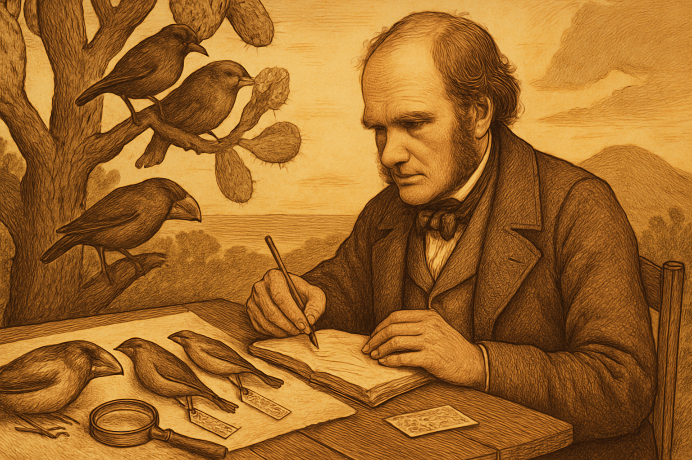

Image Prompt

Please generate a 16:9 image in Victorian Pre-Raphaelite style with natural history illustration elements and warm brown tones depicting panel 5 of 12. Make the characters and style consistent with the prior panel. The scene shows a detailed natural history illustration composition: Darwin seated at a camp table on a Galápagos island in 1835, examining and sketching a series of finch specimens laid out before him. Each finch has a distinctly different beak — one large and crushing, one thin and probing, one short and pointed, one curved. Behind him, living finches perch in a gnarled cactus tree. The color palette is warm parchment, feather browns and grays, ink black, and soft gold tropical light. Emotional tone: the moment of pattern recognition. Specific details: (1) four finch specimens arranged in a row showing beak variation, (2) Darwin sketching in his notebook with careful detail, (3) a magnifying glass on the table, (4) living finches feeding in the background — one cracking a seed, one probing a cactus flower, (5) specimen labels and tags, (6) a volcanic hillside in the distance. Generate the image immediately without asking clarifying questions.

It was the finches that would not let Darwin rest. On each island, finches had different beaks — thick crushing beaks for hard seeds, thin probing beaks for insects, curved beaks for cactus flowers. At first Darwin did not even realize they were all finches; the beaks were so different he thought they were different families of birds. Only later, back in England, when the ornithologist John Gould examined the specimens and told him they were all closely related finches, did the full weight of the pattern hit him. The same ancestor had become many species, each shaped by its island's food.

## Panel 6: The Notebook Sketch

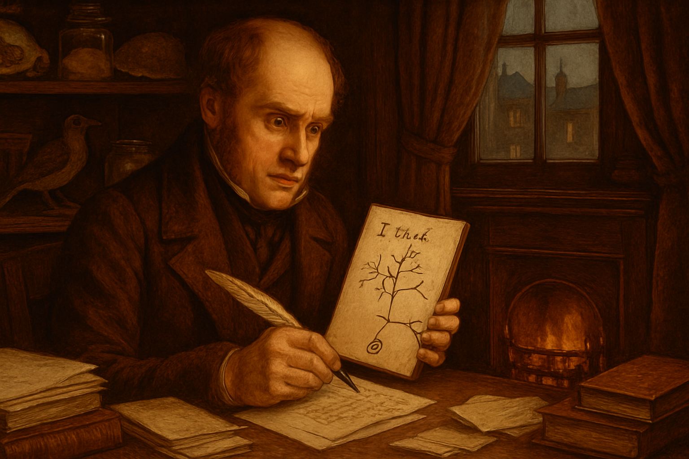

Image Prompt

Please generate a 16:9 image in Victorian Pre-Raphaelite style with natural history illustration elements and warm brown tones depicting panel 6 of 12. Make the characters and style consistent with the prior panel. The scene shows Darwin in his London study in 1837, two years after returning from the voyage, drawing his famous "I think" tree of life sketch in a small brown notebook. He is now about twenty-eight, still clean-shaven, sitting at a cluttered desk by a coal fire. The notebook is open to the page with the branching tree diagram and the words "I think" scrawled at the top. His expression is a mixture of excitement and dread. The color palette is warm firelight amber, deep mahogany, cream paper, ink black. Emotional tone: the private birth of a world-changing idea. Specific details: (1) the iconic "I think" branching diagram visible in the notebook, (2) a quill pen in Darwin's hand, (3) Galápagos specimens on shelves behind him, (4) a coal fire glowing in a grate, (5) stacks of correspondence and books, (6) a window showing a gray London evening. Generate the image immediately without asking clarifying questions.

In July 1837, Darwin opened a small brown notebook and wrote two words at the top of the page: "I think." Below them he drew a branching diagram — the first tree of life. Species were not fixed. They changed over time, branching from common ancestors like limbs from a trunk. He knew what this meant. If all species descended from common ancestors, then humans were not a special creation. They were part of the same tree as every finch, every tortoise, every barnacle. He told no one.

## Panel 7: Emma and the Fear

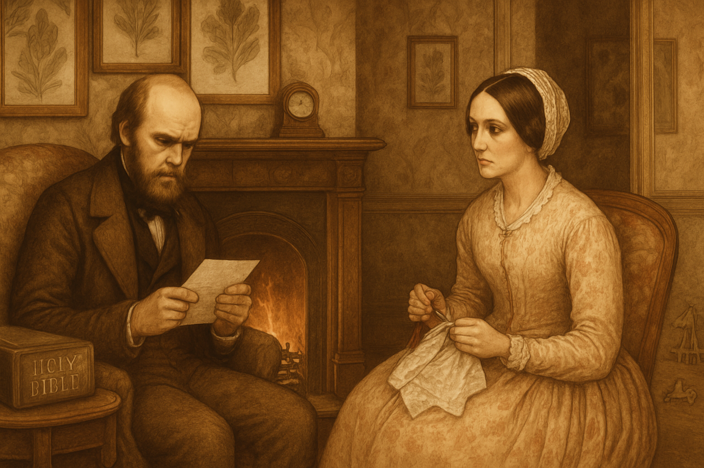

Image Prompt

Please generate a 16:9 image in Victorian Pre-Raphaelite style with natural history illustration elements and warm brown tones depicting panel 7 of 12. Make the characters and style consistent with the prior panel. The scene shows Darwin and his wife Emma in the drawing room of Down House in Kent in the early 1840s. Darwin, now in his early thirties with the beginnings of a short beard, sits in an armchair looking troubled, holding a letter. Emma, a gentle-faced woman in a Victorian day dress, sits across from him doing needlework, watching him with a concerned expression. Between them, a small fire burns in an ornate hearth. The color palette is warm domestic browns, soft rose, cream, firelight gold. Emotional tone: love shadowed by an unspoken burden. Specific details: (1) a family Bible on the side table, (2) Emma's needlework in her lap, (3) Darwin's troubled expression as he holds a folded letter, (4) children's toys visible near the doorway, (5) botanical prints on the wallpapered walls, (6) a clock on the mantelpiece. Generate the image immediately without asking clarifying questions.

Darwin married his cousin Emma Wedgwood in 1839. She was devoutly religious, and he loved her deeply. He knew his theory would strike at the heart of everything she believed about God's creation. Emma once wrote him a letter begging him not to let his scientific work close his mind to faith, and Darwin kept that letter for the rest of his life, writing on it: "When I am dead, know that many times I have kissed and cried over this." For twenty years, the fear of what his idea would do to Emma, to his reputation, and to the fabric of Victorian society kept him silent.

## Panel 8: Twenty Years of Barnacles

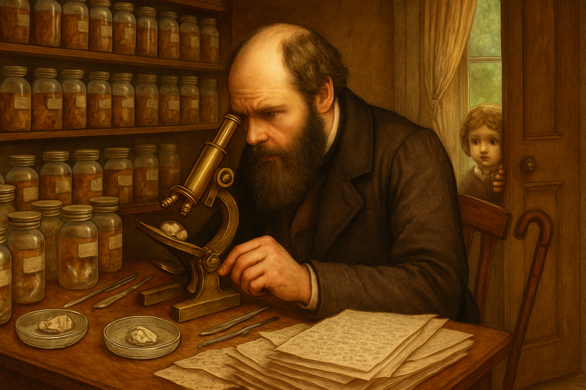

Image Prompt

Please generate a 16:9 image in Victorian Pre-Raphaelite style with natural history illustration elements and warm brown tones depicting panel 8 of 12. Make the characters and style consistent with the prior panel. The scene shows Darwin in his study at Down House in the early 1850s, now in his forties with a full dark beard, hunched over a microscope examining barnacles. The study is overwhelmed with barnacle specimens in jars, dissection tools, and stacks of manuscript pages. One of his young children peeks through the doorway. The color palette is warm study browns, specimen-jar amber, cream paper, with green garden light from a window. Emotional tone: obsessive delay disguised as productivity. Specific details: (1) a brass microscope with a barnacle specimen, (2) rows of labeled specimen jars on shelves, (3) Darwin's beard now full and dark, (4) a child's face peering around the door frame, (5) manuscript pages covered in tiny handwriting, (6) a walking stick leaned against the desk, hinting at his chronic illness. Generate the image immediately without asking clarifying questions.

Instead of publishing his theory, Darwin spent eight years studying barnacles — an exhaustive monograph that established him as a serious taxonomist but that even his friends found bewildering. His son once asked a neighbor's child, "Where does your father do his barnacles?" assuming every father had a similar obsession. Darwin was not wasting time; he was building credibility and gathering evidence. But he was also, as he admitted later, afraid. The theory sat in his desk drawer, growing more complete and more dangerous every year.

## Panel 9: The Letter from Wallace

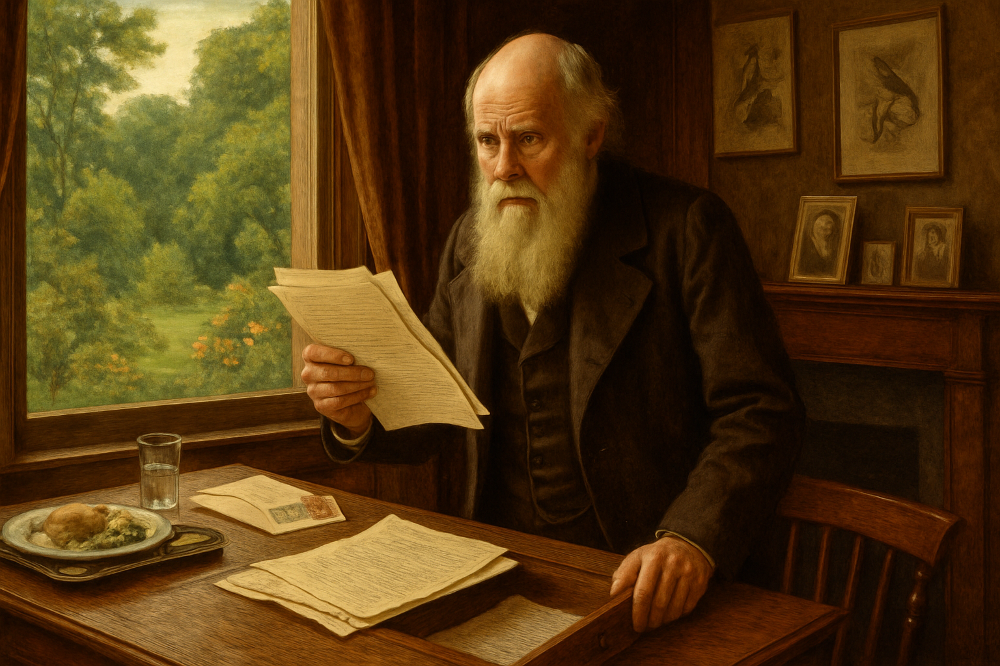

Image Prompt

Please generate a 16:9 image in Victorian Pre-Raphaelite style with natural history illustration elements and warm brown tones depicting panel 9 of 12. Make the characters and style consistent with the prior panel. The scene shows Darwin in his study at Down House in June 1858, standing at his desk in visible shock, holding a letter and a manuscript from Alfred Russel Wallace. His face is pale; one hand grips the edge of the desk. Through the window, the peaceful English garden is in full summer bloom, oblivious to the crisis. The color palette is summer greens seen through the window contrasted with the dark wood interior, warm browns, and parchment cream. Emotional tone: the collision of dread and urgency. Specific details: (1) Wallace's manuscript pages visible in Darwin's hand, (2) Darwin's expression of stunned recognition, (3) his own unpublished manuscript visible in an open desk drawer, (4) a letter bearing tropical postage stamps, (5) a half-eaten lunch on a tray, (6) family photographs on the mantlepiece. Generate the image immediately without asking clarifying questions.

In June 1858, a letter arrived from the Malay Archipelago. A young naturalist named Alfred Russel Wallace had independently arrived at the same theory of evolution by natural selection and was asking Darwin to review his paper. Darwin was stricken. "All my originality will be smashed," he wrote to Charles Lyell. His friends arranged a joint presentation to the Linnean Society, but Darwin knew the moment of delay was over. If he did not publish his full argument now, the idea would enter the world without the mountain of evidence he had spent twenty years assembling.

## Panel 10: Writing Against the Clock

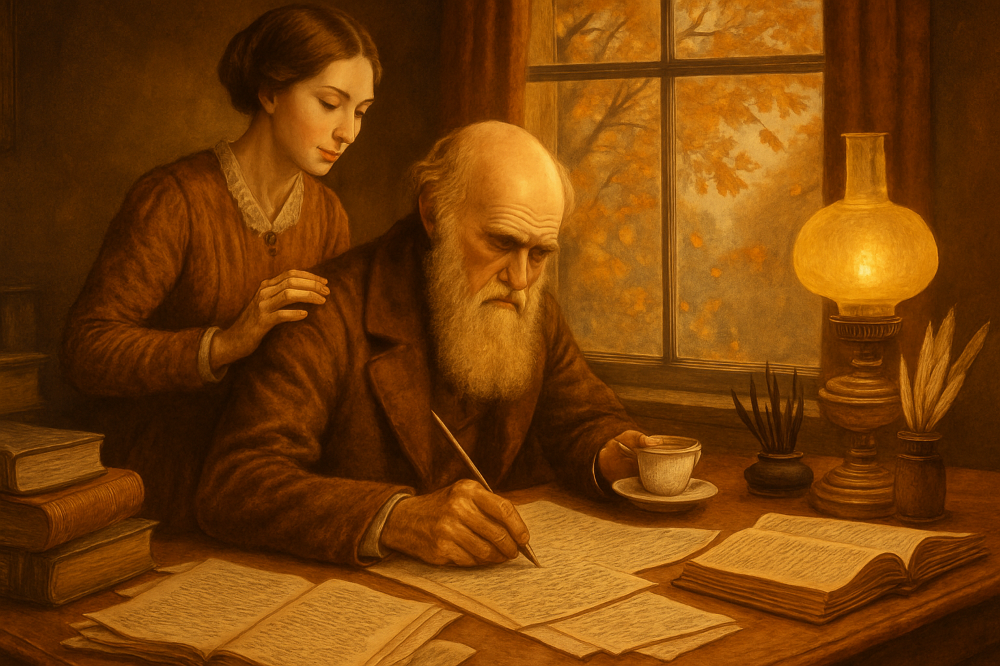

Image Prompt

Please generate a 16:9 image in Victorian Pre-Raphaelite style with natural history illustration elements and warm brown tones depicting panel 10 of 12. Make the characters and style consistent with the prior panel. The scene shows Darwin writing furiously at his desk at Down House in late 1858, working on the manuscript of On the Origin of Species. Papers are spread across every surface. Emma brings him a cup of tea, placing a gentle hand on his shoulder. Through the study window, autumn leaves fall in the garden. The color palette is warm autumnal amber, deep brown, cream paper, and soft gold lamplight. Emotional tone: a race against time fueled by love and duty. Specific details: (1) manuscript pages covered in Darwin's handwriting with many corrections, (2) Emma standing behind him with tea, her expression supportive, (3) ink-stained fingers, (4) reference books open and stacked, (5) autumn trees visible through the window, (6) a pen holder with multiple quills. Generate the image immediately without asking clarifying questions.

Darwin wrote *On the Origin of Species* in thirteen months — a fraction of the time he had planned. He called it an "abstract" of a larger work, yet it ran to over five hundred pages. Every chapter built on evidence: pigeon breeding, fossil sequences, island biogeography, embryology, the geographical distribution of species. He did not mention human evolution directly — that was a fight for another day. He ended the book with one of the most beautiful sentences in scientific literature: "There is grandeur in this view of life."

## Panel 11: The Book That Shook the World

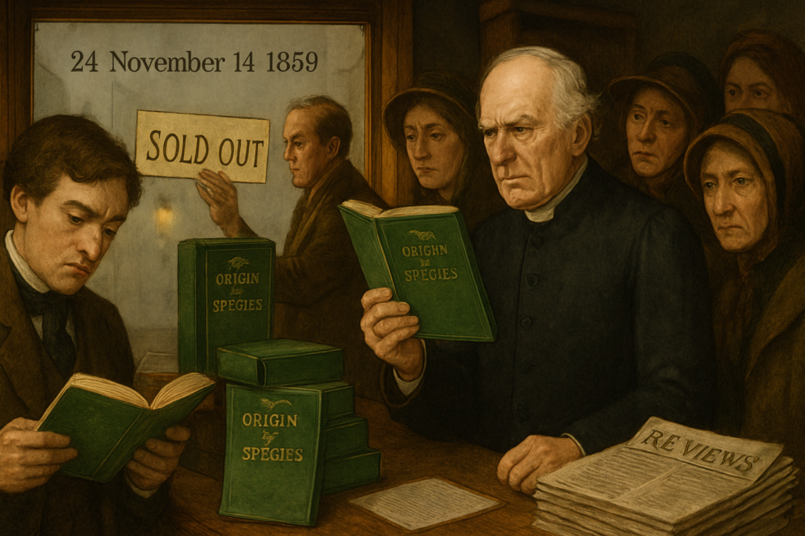

Image Prompt

Please generate a 16:9 image in Victorian Pre-Raphaelite style with natural history illustration elements and warm brown tones depicting panel 11 of 12. Make the characters and style consistent with the prior panel. The scene shows a London bookshop on November 24, 1859, the day On the Origin of Species was published. The shop window displays stacked copies of the green-clothed book. Well-dressed Victorian men and women crowd inside, examining copies with expressions ranging from fascination to outrage. A clergyman holds a copy at arm's length with a frown. The color palette is rich Victorian greens, warm gaslight gold, mahogany wood, and foggy London gray outside. Emotional tone: a cultural earthquake arriving quietly in a bookshop. Specific details: (1) copies of On the Origin of Species in their distinctive green cloth binding, (2) a hand-lettered "SOLD OUT" sign being placed in the window, (3) a gentleman reading the first page intently, (4) the clergyman's disapproving expression, (5) fog and gas lamps visible through the shop window, (6) a stack of newspapers with reviews on the counter. Generate the image immediately without asking clarifying questions.

*On the Origin of Species* was published on November 24, 1859. The entire first printing of 1,250 copies sold out on the first day. The reaction was everything Darwin had feared and everything his friends had hoped. Scientists who had quietly suspected that species changed now had an argument backed by overwhelming evidence. Clergymen were horrified. Newspaper cartoonists drew Darwin as an ape. But the book's power lay in its method: it did not demand belief. It presented evidence and invited the reader to reason.

## Panel 12: The Old Man in the Garden

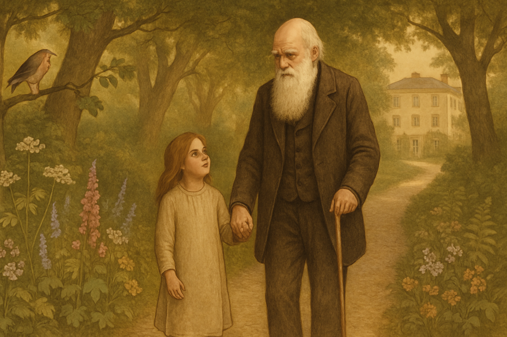

Image Prompt

Please generate a 16:9 image in Victorian Pre-Raphaelite style with natural history illustration elements and warm brown tones depicting panel 12 of 12. Make the characters and style consistent with the prior panel. The scene shows an elderly Charles Darwin in his early seventies, with his famous long white beard, walking slowly along the Sandwalk — his thinking path — at Down House on a soft English afternoon in the late 1870s. Wildflowers line the gravel path, and dappled light filters through beech and oak trees. A grandchild walks beside him, holding his hand. The color palette is soft golden-green, warm cream, aged brown, and gentle violet shadows. Emotional tone: peace after a lifetime of quiet courage. Specific details: (1) Darwin's white beard and stooped but dignified posture, (2) a small grandchild holding his hand and looking up at him, (3) the famous Sandwalk path curving into the trees, (4) wildflowers and ferns along the path, (5) a robin perched on a nearby branch, (6) Down House visible in the background through the trees. Generate the image immediately without asking clarifying questions.

Darwin spent his remaining years at Down House, still working, still publishing — on orchids, on earthworms, on the expression of emotions in humans and animals. He never stopped gathering evidence. When he died on April 19, 1882, he was buried in Westminster Abbey, near Isaac Newton — a nation's acknowledgment that the quiet man who had been afraid to publish had changed the world. The finches' beaks had told a story that could not be untold, and the tree of life he sketched in his notebook now connected every living thing on Earth.

### Epilogue – What Made Charles Darwin Different?

Darwin did not succeed because he was the smartest naturalist of his age, or the bravest, or the most eloquent. He succeeded because he respected evidence more than he feared controversy. For twenty years he gathered facts, tested predictions, and built an argument so thoroughly documented that it could withstand the fury of an entire civilization's resistance. His story is a lesson in how knowledge actually advances: not through sudden revelation, but through the slow, patient accumulation of evidence — and the courage, eventually, to follow that evidence wherever it leads.

| Challenge | How Darwin Responded | Lesson for Today |
|-----------|---------------------|------------------|
| Evidence that contradicted the dominant worldview | Spent twenty years gathering more evidence before publishing | Extraordinary claims require extraordinary evidence — and patience |
| Fear of hurting his wife and his reputation | Kept working privately until another scientist forced his hand | The emotional cost of paradigm shifts is real and deserves respect |
| Personal attacks and public ridicule | Let supporters like Huxley debate while he continued his research | The strongest response to mockery is more evidence |
| The temptation to overstate his case | Called his book an "abstract" and avoided claiming more than the evidence supported | Intellectual honesty is more persuasive than confidence |

### Call to Action

Darwin's method is available to everyone: observe carefully, record honestly, look for patterns, and follow the evidence even when it leads somewhere uncomfortable. The next time you encounter an idea that troubles you — not because it is wrong, but because it challenges something you want to believe — ask yourself what Darwin would do. He would not reject it. He would not accept it. He would gather more evidence. And then he would follow the truth.

---

*"There is grandeur in this view of life, with its several powers, having been originally breathed into a few forms or into one; and that, whilst this planet has gone cycling on according to the fixed law of gravity, from so simple a beginning endless forms most beautiful and most wonderful have been, and are being, evolved."*
—Charles Darwin, *On the Origin of Species* (1859)

*"It is not the strongest of the species that survives, nor the most intelligent, but the one most responsive to change."*
—Commonly attributed to Charles Darwin

*"I have called this principle, by which each slight variation, if useful, is preserved, by the term Natural Selection."*
—Charles Darwin, *On the Origin of Species* (1859)

---

## References

1. [Wikipedia: Charles Darwin](https://en.wikipedia.org/wiki/Charles_Darwin) - Biography of the English naturalist who developed the theory of evolution by natural selection
2. [Wikipedia: On the Origin of Species](https://en.wikipedia.org/wiki/On_the_Origin_of_Species) - Darwin's 1859 book presenting the theory of evolution by natural selection
3. [Wikipedia: Darwin's finches](https://en.wikipedia.org/wiki/Darwin%27s_finches) - The group of about eighteen species of passerine birds that helped inspire Darwin's theory
4. [Darwin Correspondence Project, University of Cambridge](https://www.darwinproject.ac.uk/) - The definitive scholarly collection of Darwin's letters and biographical resources
5. [Natural History Museum, London: Charles Darwin](https://www.nhm.ac.uk/discover/charles-darwin.html) - Museum resources on Darwin's life, voyage, and scientific legacy
