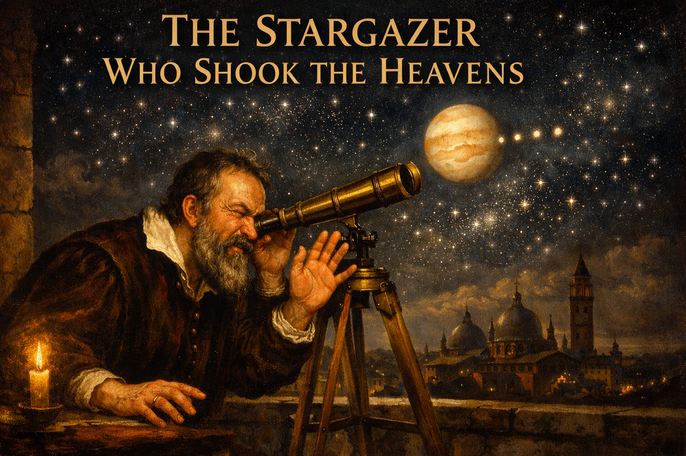
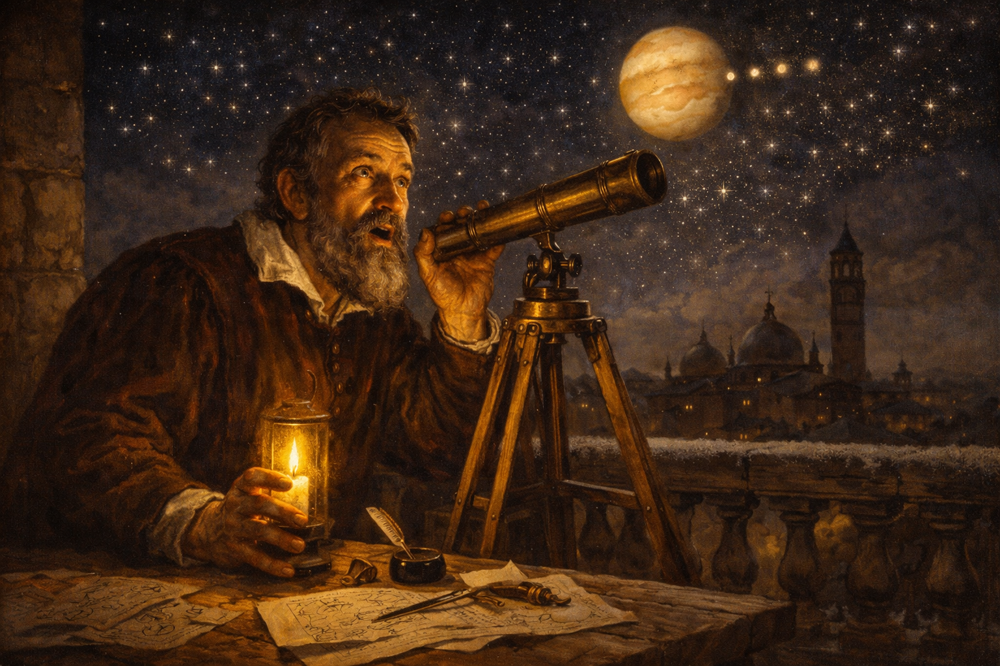
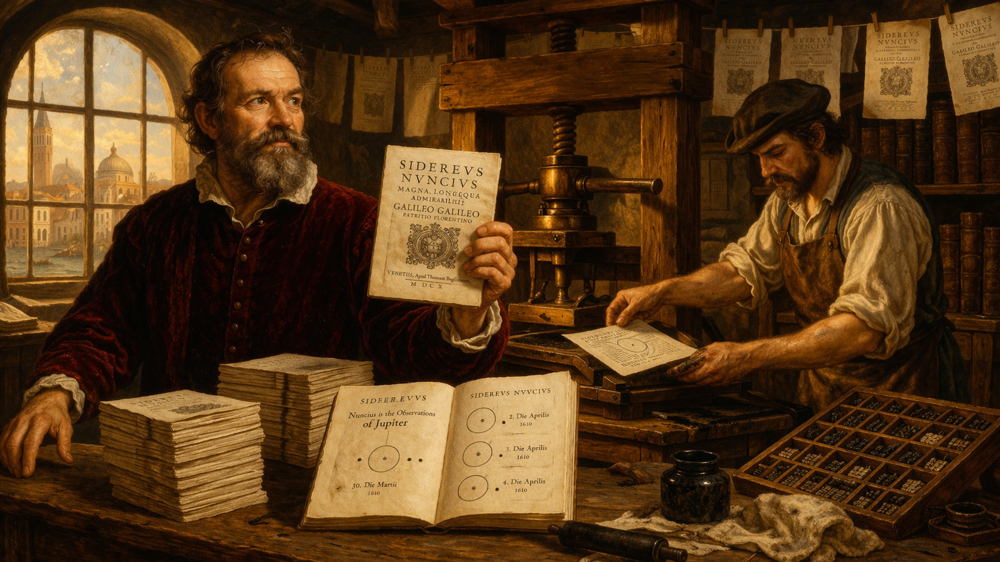
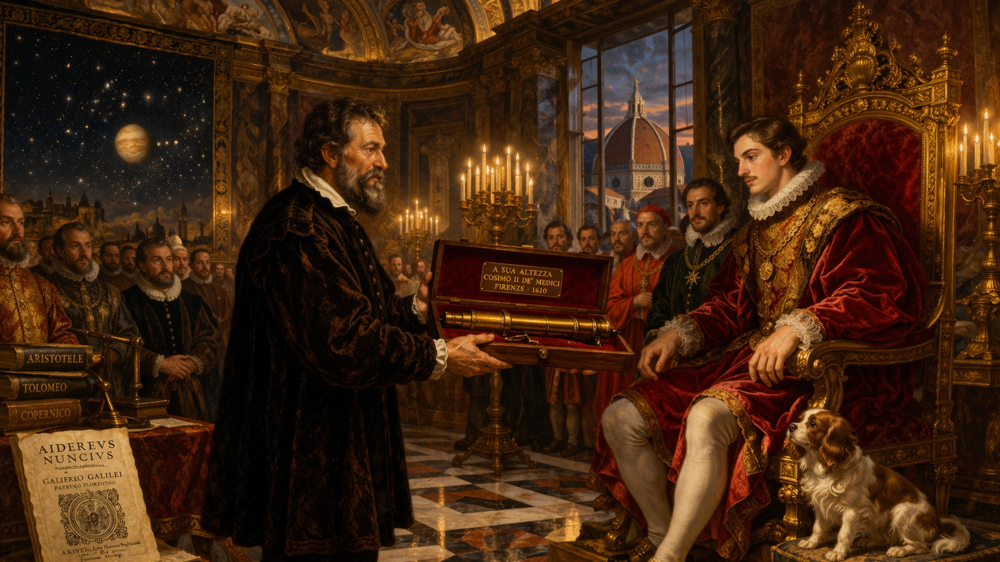
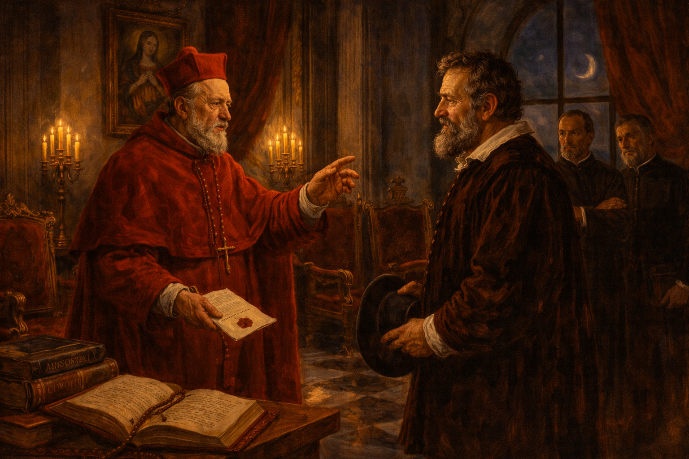
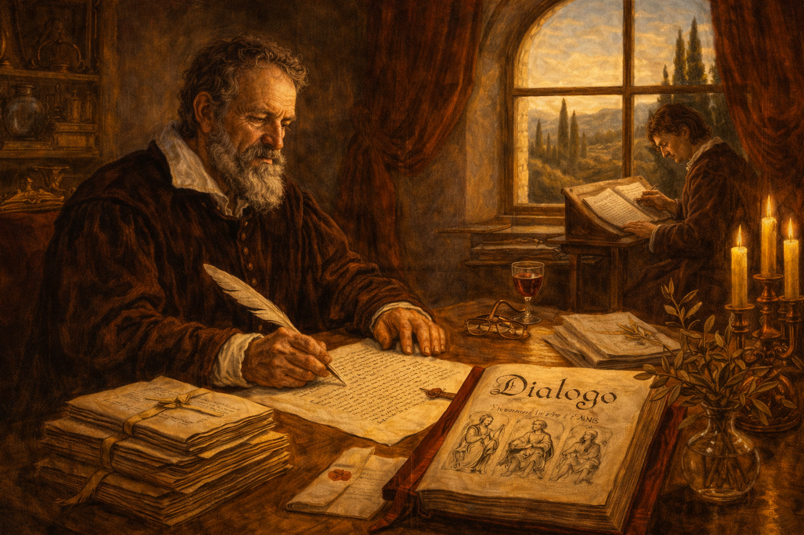
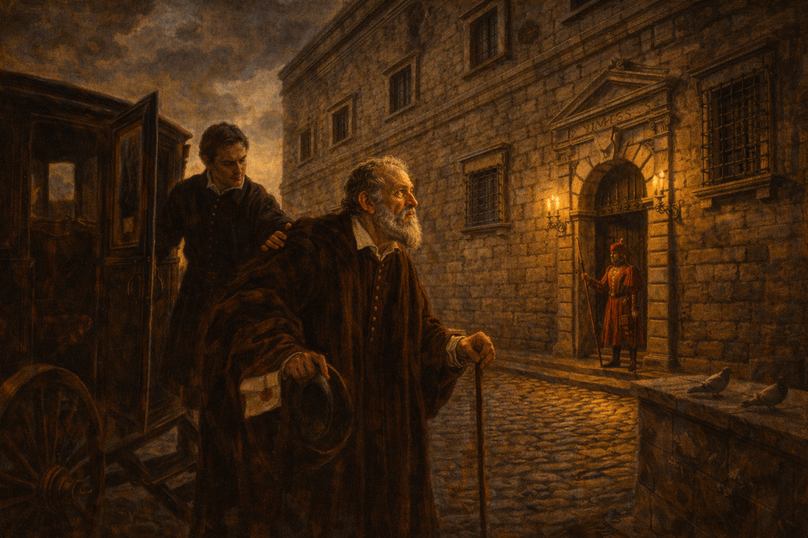
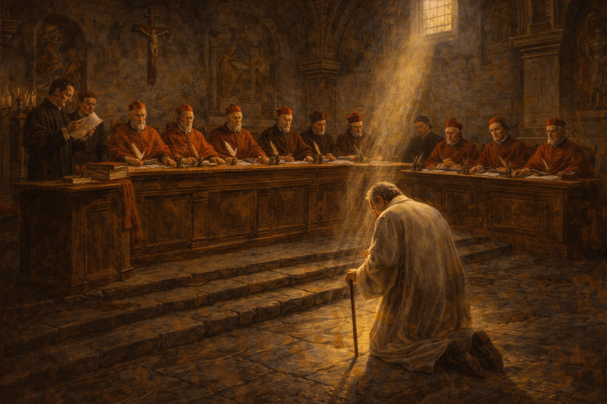

# The Stargazer Who Shook the Heavens — Galileo Galilei and the Moons of Jupiter

Cover Image Prompt

Please generate a wide-landscape 16:9 cover image for this story in the style of Italian Renaissance painting with Baroque chiaroscuro lighting (think Caravaggio's dramatic contrast and Raphael's warm palette). The scene shows Galileo Galilei as a bearded man in his mid-forties: reddish-brown beard turning gray, intense dark eyes, wearing a dark velvet doublet with a white linen collar typical of early 1600s Tuscany. He is leaning forward over a long brass telescope mounted on a wooden tripod on an open terrace, one eye pressed to the eyepiece, the other hand raised in astonishment. Above and behind him, the night sky over Padua is ablaze with stars, and Jupiter glows prominently with four tiny points of light arranged in a line beside it. Include the title "THE STARGAZER WHO SHOOK THE HEAVENS" rendered in an elegant Renaissance serif typeface across the top. Color palette: deep midnight blue, warm candlelight gold, Venetian red, ivory, and the cold silver-white of starlight. Emotional tone: wonder, intellectual courage, and the solitary thrill of seeing something no human has ever seen. Generate the image immediately without asking clarifying questions.

Narrative Prompt

This is the story of Galileo Galilei (1564–1642), an Italian mathematician, physicist, and astronomer who turned a homemade telescope on the night sky in January 1610 and observed four moons orbiting Jupiter — proof that not everything in the heavens revolved around the Earth. A devout Catholic who believed scripture and nature were both books written by God, Galileo published his findings in Italian so ordinary people could read them, triggering a confrontation with the Roman Inquisition that ended in his forced recantation and house arrest. Central themes: observation vs. authority, the limits of institutional knowledge, science and religion as different ways of knowing, and the courage required to follow evidence against established doctrine. Visual style: consistent Italian Renaissance and Baroque painting style throughout all 12 panels, with Galileo as a recurring character — always the same bearded man with reddish-brown beard, intense dark eyes, velvet doublet. Architectural settings shift from Padua and Venice to Florence and Rome, with period-accurate Renaissance interiors, domed churches, and Tuscan landscapes. Color palette stays consistent: deep midnight blue for night scenes, warm candlelight gold, Venetian red, ivory, and dramatic Caravaggio-style chiaroscuro throughout.

### Prologue — The Book of Nature

Italy, 1610. The Church taught that the Earth stood at the center of God's creation, with the sun, moon, planets, and stars revolving around it in perfect crystalline spheres. This was not merely astronomy — it was theology, philosophy, and common sense woven into one seamless fabric. To question it was to pull at a thread that held together the entire intellectual order of Christendom. One middle-aged professor in Padua was about to pull that thread — not with an argument, but with a piece of glass.

## Panel 1: The Lens Grinder's Rumor

Image Prompt

I am about to ask you to generate a series of images for a graphic novel. Please make the images have a consistent style and consistent characters. Do not ask any clarifying questions. Just generate the image immediately when asked.

Please generate a 16:9 image in Italian Renaissance painting style with warm Baroque lighting depicting panel 1 of 12. The scene shows a busy workshop in Padua, Italy, in 1609. Galileo Galilei, a bearded man of 45 with reddish-brown beard, intense dark eyes, and a dark velvet doublet with white linen collar, sits at a cluttered wooden workbench. He is holding a letter in one hand while examining a crude convex lens with the other, tilting it toward the light from a tall arched window. Around him: brass tubes, glass blanks, grinding powder in ceramic bowls, calipers, and scattered papers covered in mathematical notation. A young student assistant stands behind him, holding a second lens. Through the window, the red-tiled rooftops and bell towers of Padua are visible in warm afternoon light. Color palette: warm gold, Venetian red, deep brown wood, ivory paper, green glass. Emotional tone: curiosity sparked, the moment before invention. Generate the image immediately without asking clarifying questions.

In 1609, word reached Galileo Galilei — a forty-five-year-old professor of mathematics at the University of Padua — that a Dutch spectacle-maker had invented a device that made distant objects appear close. Within months, Galileo had not merely copied the instrument but improved it dramatically, grinding his own lenses and building a telescope that magnified objects twenty times. Most men would have pointed it at ships on the horizon. Galileo pointed it at the sky.

## Panel 2: First Light on Jupiter

Image Prompt

Please generate a 16:9 image in Italian Renaissance painting style with dramatic Baroque chiaroscuro depicting panel 2 of 12. Make the characters and style consistent with the prior panel. The scene shows Galileo on a stone terrace at night, leaning over a long brass telescope mounted on a wooden tripod. His face is lit from below by a single candle in a glass lantern on the balustrade. He has pulled back from the eyepiece and his expression is one of stunned amazement — mouth slightly open, eyes wide, one hand gripping the telescope barrel. In the night sky above Padua, Jupiter is prominent and bright, with four tiny points of light arranged in a near-straight line beside it, clearly visible to the viewer. Set in Padua, January 7, 1610. Color palette: deep midnight blue sky, warm candlelight gold on Galileo's face, silver-white starlight, dark stone gray. Emotional tone: the shock of first discovery, sacred wonder. Include: scattered star charts on a wooden table beside him, an inkwell and quill, a brass compass, the silhouette of a church dome against the stars, and frost on the stone railing. Generate the image immediately without asking clarifying questions.

On the night of January 7, 1610, Galileo trained his telescope on Jupiter and noticed three tiny "stars" near the planet, arranged in a line. Night after night he watched them shift position. By January 13, he had found a fourth. They were not stars at all — they were moons, orbiting Jupiter the way our Moon orbits the Earth. If moons could circle another planet, then not everything in the heavens revolved around the Earth. The Ptolemaic cosmos, endorsed by Aristotle and the Church for over a thousand years, had a crack in it.

## Panel 3: The Starry Messenger

Image Prompt

Please generate a 16:9 image in Italian Renaissance painting style with warm Baroque lighting depicting panel 3 of 12. Make the characters and style consistent with the prior panel. The scene shows a Venetian printing house in 1610. Galileo stands beside a large wooden printing press, holding the first printed copy of a small book — Sidereus Nuncius (The Starry Messenger). A printer in a leather apron is pulling a freshly inked page from the press. Stacks of the small book are piled on a wooden table. On the open pages visible to the viewer, hand-drawn diagrams show Jupiter with four dots in different positions on successive nights. Warm light pours through a large arched window. Set in Venice, March 1610. Color palette: warm gold, rich brown wood, Venetian red, black ink, cream paper. Emotional tone: excitement, pride, the thrill of announcement. Include: hanging drying sheets of printed pages, ink-stained rags, a compositor's type case, leather-bound reference books, and Galileo's satisfied expression. Generate the image immediately without asking clarifying questions.

In March 1610, Galileo rushed his observations into print. *Sidereus Nuncius* — "The Starry Messenger" — was a slim sixty-page booklet that stunned Europe. It contained careful drawings of Jupiter's moons on successive nights, observations of the Moon's cratered surface (not the smooth perfect sphere Aristotle had described), and the discovery that the Milky Way was made of countless individual stars. Five hundred copies sold out almost immediately. Galileo was suddenly the most famous scientist in Europe.

## Panel 4: The Medici Court

Image Prompt

Please generate a 16:9 image in Italian Renaissance painting style with rich Baroque grandeur depicting panel 4 of 12. Make the characters and style consistent with the prior panel. The scene shows the opulent court of Grand Duke Cosimo II de' Medici in Florence. Galileo stands before the young Grand Duke, who is seated on an ornate gilded throne beneath a painted ceiling. Galileo is presenting a brass telescope in a velvet-lined wooden case as a gift. Courtiers in silk and brocade gather around. A large tapestry of the night sky hangs on one wall, and through tall windows, the dome of Florence Cathedral is visible. Set in Florence, 1610. Color palette: Medici gold, deep crimson, midnight blue, marble white, rich green velvet. Emotional tone: triumph, patronage, ambition fulfilled. Include: a marble floor with geometric patterns, candelabras with dozens of candles, a small dog at the Duke's feet, the telescope gleaming in candlelight, and Galileo's respectful but confident posture. Generate the image immediately without asking clarifying questions.

Galileo had shrewdly named Jupiter's four moons the "Medicean Stars" in honor of the powerful Medici family of Florence. The flattery worked. Grand Duke Cosimo II appointed Galileo as his personal philosopher and mathematician — a position that freed him from teaching duties and gave him the time, money, and protection to pursue his research. It was the happiest moment of his career. He moved to Florence with his telescope, his notebooks, and his growing conviction that Copernicus had been right: the Earth moved around the Sun.

## Panel 5: The Refusal to Look

Image Prompt

Please generate a 16:9 image in Italian Renaissance painting style with dramatic Baroque chiaroscuro depicting panel 5 of 12. Make the characters and style consistent with the prior panel. The scene shows a candlelit meeting room at the University of Bologna. Galileo stands beside his telescope, gesturing toward it with an open hand, inviting observation. Across from him, an older Aristotelian professor in a black academic robe and square cap turns away, arms folded, chin raised in refusal. Two other scholars stand nearby — one peering cautiously toward the telescope, the other shaking his head. A chalkboard behind them shows the traditional Ptolemaic Earth-centered diagram. Set in Bologna, 1610. Color palette: deep shadow, warm candlelight gold, academic black, chalk white, Venetian red. Emotional tone: frustration meeting stubbornness, the absurdity of refusing to look. Include: a heavy wooden table with astronomical charts, a celestial globe showing the Ptolemaic model, leather-bound volumes of Aristotle, tall beeswax candles, and the dramatic shadow of the telescope across the wall. Generate the image immediately without asking clarifying questions.

Not everyone was convinced. Several prominent Aristotelian professors simply refused to look through the telescope. One argued that the moons of Jupiter were an illusion created by the lenses. Another declared that since Aristotle had not mentioned them, they could not exist. Cesare Cremonini, a distinguished philosopher at Padua, reportedly refused even to put his eye to the instrument. They did not dispute the evidence — they declined to see it.

## Panel 6: Two Books, One Author

Image Prompt

Please generate a 16:9 image in Italian Renaissance painting style with warm, contemplative Baroque lighting depicting panel 6 of 12. Make the characters and style consistent with the prior panel. The scene shows Galileo in his private study in Florence, sitting at a large wooden desk covered in papers, writing by candlelight. On the desk before him, two books stand open and propped side by side: on the left, a Bible with ornate illuminated margins; on the right, Copernicus's De Revolutionibus with a diagram of the heliocentric solar system. Galileo is writing a letter, his quill poised mid-sentence, his expression thoughtful and earnest. A crucifix hangs on the wall behind him. Through an arched window, a crescent moon is visible. Set in Florence, 1613. Color palette: warm candlelight gold, deep brown wood, ivory paper, crimson Bible binding, midnight blue through the window. Emotional tone: sincere intellectual struggle, a man of faith trying to reconcile two truths. Include: a rosary draped over the Bible, astronomical instruments on a shelf, a small portrait of Copernicus, scattered sealed letters, and the shadow of the crucifix falling across the desk. Generate the image immediately without asking clarifying questions.

Galileo was a devout Catholic. He attended Mass, believed in scripture, and had no wish to undermine the Church. In a series of eloquent letters, he argued that God had written two books — the Book of Scripture and the Book of Nature — and that both were true but written in different languages. Scripture spoke in metaphor to teach salvation; Nature spoke in mathematics to reveal the structure of creation. The Bible tells us how to go to heaven, he wrote, not how the heavens go. It was a graceful solution. The Church was not ready to hear it.

## Panel 7: The First Warning

Image Prompt

Please generate a 16:9 image in Italian Renaissance painting style with solemn Baroque lighting depicting panel 7 of 12. Make the characters and style consistent with the prior panel. The scene shows a grand reception hall in Rome. Cardinal Robert Bellarmine, an elderly man with a white beard and crimson cardinal's robes and biretta, stands before Galileo in a formal but not hostile posture. Bellarmine holds a sealed document in one hand and gestures with the other in a measured, paternal warning. Galileo, standing across from him, listens with a tense but respectful expression, hat in hand. Two Jesuit astronomers in black cassocks observe from the background. Set in Rome, February 1616. Color palette: cardinal crimson, deep shadow, marble white, gold candlelight, midnight blue through tall windows. Emotional tone: formal gravity, a polite but unmistakable threat. Include: a marble floor, a painting of the Madonna on the wall, heavy crimson drapes, a papal seal visible on the document, ornate gilded chairs, and a sense of immense institutional power. Generate the image immediately without asking clarifying questions.

In 1616, the Inquisition declared heliocentrism "formally heretical." Cardinal Robert Bellarmine, the Church's most formidable theologian, summoned Galileo to Rome and delivered a private warning: he could discuss the Copernican model as a mathematical hypothesis, but he must not teach it as physical truth. Galileo agreed — or seemed to. He returned to Florence and, for sixteen years, largely obeyed. But he never stopped believing. And he never stopped writing.

## Panel 8: The Dialogue

Image Prompt

Please generate a 16:9 image in Italian Renaissance painting style with warm Baroque lighting depicting panel 8 of 12. Make the characters and style consistent with the prior panel. The scene shows Galileo, now in his late sixties with a fully gray beard, sitting in a sunlit Florentine study, writing the final pages of a large manuscript. The title page is visible: "Dialogo" in elegant calligraphy. Three allegorical figures are sketched in the margins — representing the three characters of the dialogue. A young scribe sits at a smaller desk nearby, copying pages. Sunlight streams through a Renaissance arched window with a view of Tuscan cypress trees and rolling hills. Set in Florence, 1630. Color palette: warm Tuscan gold, olive green, rich brown, ivory, Venetian red. Emotional tone: intellectual defiance masked as scholarly restraint, the satisfaction of finally saying what must be said. Include: stacked manuscript pages tied with ribbon, a brass astrolabe, reading spectacles on the desk, a glass of wine, a vase of olive branches, and Galileo's subtle, knowing expression. Generate the image immediately without asking clarifying questions.

In 1632, Galileo published his masterpiece: *Dialogue Concerning the Two Chief World Systems*. Written as a conversation among three characters, it presented the Ptolemaic and Copernican models side by side. Technically, it reached no conclusion. In practice, the argument for Copernicus was overwhelming, and the character defending the Earth-centered view — named Simplicio — was made to look foolish. Worse, Galileo wrote the book in Italian, not Latin. He wanted not just scholars but merchants, students, and the literate public to read it. The Church noticed.

## Panel 9: Summoned to Rome

Image Prompt

Please generate a 16:9 image in Italian Renaissance painting style with dramatic Baroque chiaroscuro depicting panel 9 of 12. Make the characters and style consistent with the prior panel. The scene shows Galileo, now elderly and frail, arriving in Rome by carriage. He is helped down from a dark wooden coach by a young attendant. Before him rises the imposing facade of the Palace of the Holy Office (the Inquisition headquarters), its heavy stone walls and iron-barred windows casting long shadows in the late afternoon sun. A Swiss Guard stands at the entrance. Galileo looks up at the building with dignified apprehension. Set in Rome, February 1633. Color palette: cold stone gray, deep shadow, warm gold of late afternoon sun on Galileo's face, crimson accents, dark coach wood. Emotional tone: dread controlled by dignity, an old man facing institutional power. Include: cobblestone street, a dome of St. Peter's Basilica visible in the background, pigeons on the ledge, Galileo's walking stick, a sealed letter in his coat pocket, and gathering clouds. Generate the image immediately without asking clarifying questions.

Pope Urban VIII — who had once been Galileo's friend and admirer — was furious. He believed Galileo had put the Pope's own words into the mouth of Simplicio, the fool. In February 1633, the sixty-nine-year-old Galileo, ill and nearly broken, was summoned to Rome to stand trial before the Inquisition. The charge was "vehement suspicion of heresy." The man who had revealed Jupiter's moons now faced the full weight of the most powerful institution in Europe.

## Panel 10: The Trial

Image Prompt

Please generate a 16:9 image in Italian Renaissance painting style with solemn Baroque lighting depicting panel 10 of 12. Make the characters and style consistent with the prior panel. The scene shows the formal trial chamber of the Roman Inquisition. Galileo kneels on a stone floor before a long elevated table of ten cardinals and theologians in crimson and black robes. He wears a simple white penitent's robe over his clothing. A clerk reads from a document. The room is grand — high vaulted ceilings, religious frescoes, heavy dark wood. A single shaft of light from a high window falls on Galileo's bowed gray head. Set in Rome, June 22, 1633. Color palette: deep crimson, solemn black, cold marble white, a single warm shaft of gold light on Galileo. Emotional tone: dignified sorrow, institutional gravity, the loneliness of one man against an institution. Keep the scene respectful and restrained — no violence or cruelty, only the weight of authority. Include: a crucifix on the wall, a heavy leather-bound Bible on the table, quill pens and inkwells, the concerned face of one younger cardinal, and Galileo's white hair catching the light. Generate the image immediately without asking clarifying questions.

On June 22, 1633, Galileo knelt before the assembled cardinals and read a prepared recantation. He declared that he "abjured, cursed, and detested" the heliocentric theory he had spent a lifetime proving. The alternative was imprisonment — or worse. He was sixty-nine, ill, and alone. Legend says he murmured *"Eppur si muove"* — "And yet it moves" — as he rose from his knees. Whether or not he said it, the sentiment was true. No amount of institutional authority could stop Jupiter's moons from orbiting.

## Panel 11: House Arrest at Arcetri

Image Prompt

Please generate a 16:9 image in Italian Renaissance painting style with warm, melancholy Baroque lighting depicting panel 11 of 12. Make the characters and style consistent with the prior panel. The scene shows Galileo in his final years, now completely blind, sitting in a wooden armchair in a simple but dignified room in his villa at Arcetri, outside Florence. He dictates to a young assistant — Vincenzo Viviani — who writes rapidly at a desk. Galileo's sightless eyes gaze upward as if still seeing the stars. On the desk, a manuscript is taking shape — his final work, Two New Sciences. Through an open window, the Tuscan hills and a sunset sky are visible, but Galileo cannot see them. Set in Arcetri, near Florence, 1638. Color palette: warm sunset gold, soft terra cotta, deep shadow, olive green, melancholy amber. Emotional tone: quiet perseverance, the unconquerable mind, beauty he can no longer see. Include: a telescope leaning unused in the corner, a cat sleeping on a cushion, a bowl of fruit, scattered letters, Viviani's devoted expression, and evening light falling on Galileo's weathered hands. Generate the image immediately without asking clarifying questions.

Galileo's sentence was house arrest for the rest of his life. Confined to his villa at Arcetri near Florence, he went blind within a few years — perhaps from years of staring at the Sun through his telescope. But he did not stop working. Dictating to his young disciple Vincenzo Viviani, he completed *Two New Sciences*, the foundation of modern physics. Banned from publishing in Italy, he smuggled the manuscript to Holland, where it was printed in 1638. Even blind, even silenced, even condemned, he wrote.

## Panel 12: The Moons Still Orbit

Image Prompt

Please generate a 16:9 image in Italian Renaissance painting style with a subtle modern resonance, Baroque chiaroscuro throughout, depicting panel 12 of 12. Make the characters and style consistent with the prior panels. The scene is a split composition. On the left, a ghostly translucent figure of Galileo stands holding his brass telescope, bathed in warm candlelight gold, looking upward with wonder. On the right, a modern observatory dome opens to reveal a vast night sky in which Jupiter and its four Galilean moons — Io, Europa, Ganymede, and Callisto — are brilliantly visible, labeled with their names in elegant script. A modern astronomer in silhouette looks through a large telescope at the same sight Galileo first saw. A thin beam of starlight connects the two halves. Color palette: warm Renaissance gold on the left, cool silver-blue starlight on the right, deep midnight blue, with Jupiter glowing amber. Emotional tone: timeless vindication, the continuity of wonder, evidence that outlasts authority. Include: the ghostly Galileo's gentle smile, scattered stars, the modern dome structure, a plaque on the observatory wall reading "Galilean Moons," and the sense of four centuries quietly bridged. Generate the image immediately without asking clarifying questions.

Galileo died on January 8, 1642, at the age of seventy-seven, still under house arrest. The Church forbade a public funeral. But the four moons of Jupiter — now called the Galilean moons in his honor — kept orbiting. Io, Europa, Ganymede, and Callisto circle Jupiter today exactly as they did on the night Galileo first saw them. In 1992, after a thirteen-year investigation, Pope John Paul II formally acknowledged that the Church had been wrong. It took 359 years. The moons did not wait.

### Epilogue — What Made Galileo Different?

Galileo was not the first person to suspect the Earth moved around the Sun — Copernicus had published that idea sixty-seven years earlier, and Aristarchus of Samos had proposed it in ancient Greece. What made Galileo dangerous was that he combined mathematical reasoning with direct observation and then communicated his findings in the language of the people. He did not just think the heavens were different — he showed anyone with a telescope that they could see it for themselves. That insistence on public, verifiable evidence is the core of modern science, and it is what brought him into conflict with an institution that claimed knowledge on the basis of authority and revelation.

| Challenge | How Galileo Responded | Lesson for Today |
|-----------|----------------------|-------------------|
| Professors refused to look through the telescope | He published detailed drawings so anyone could verify his observations | When people refuse to examine evidence, publish it widely |
| The Church declared heliocentrism heretical | He argued that scripture and nature were two books by the same author, written in different languages | Different ways of knowing can coexist without one canceling the other |
| He was ordered not to teach the Copernican model as truth | He wrote a "dialogue" that presented both sides but made the evidence overwhelming | How you frame an argument matters as much as its content |
| Forced to recant under threat of punishment | He complied publicly but continued writing privately, smuggling his final work out of Italy | Institutional power can silence a person but cannot change what is true |

### Call to Action

The next time someone tells you that a question has already been settled — by tradition, by authority, by consensus — remember Galileo's telescope. The instrument did not care who was looking through it. The moons of Jupiter did not care whether the Pope approved of their orbits. Evidence is democratic: it shows the same thing to anyone willing to look. Your job as a knower is to keep looking, keep measuring, and keep asking the question that Galileo's whole life embodied: *What do we actually see?*

---

*"I do not feel obliged to believe that the same God who has endowed us with sense, reason, and intellect has intended us to forgo their use."*
— Galileo Galilei

*"In questions of science, the authority of a thousand is not worth the humble reasoning of a single individual."*
— Galileo Galilei

*"And yet it moves."*
— attributed to Galileo Galilei, 1633

---

## References

1. [Wikipedia: Galileo Galilei](https://en.wikipedia.org/wiki/Galileo_Galilei) — Biography of the Italian astronomer, physicist, and mathematician
2. [Wikipedia: Galileo affair](https://en.wikipedia.org/wiki/Galileo_affair) — The conflict between Galileo and the Roman Catholic Church over heliocentrism
3. [Wikipedia: Galilean moons](https://en.wikipedia.org/wiki/Galilean_moons) — The four largest moons of Jupiter, discovered by Galileo in January 1610
4. [Encyclopaedia Britannica: Galileo](https://www.britannica.com/biography/Galileo-Galilei) — Curated overview of Galileo's life, discoveries, and legacy
5. [Stanford Encyclopedia of Philosophy: Galileo Galilei](https://plato.stanford.edu/entries/galileo/) — Scholarly analysis of Galileo's contributions to science and epistemology
6. [ChatGPT Share Link Used to Generate this Story](https://chatgpt.com/share/69d3f421-fb68-83e8-afa0-64d169c2d905)
