# Hannah Arendt and the Truth in the Courtroom

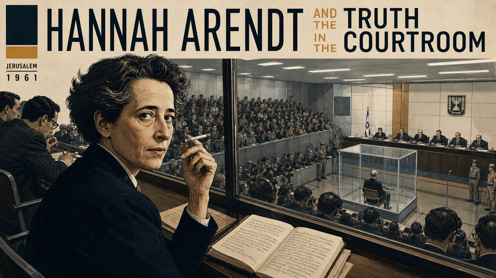

Cover Image Prompt

Please generate a wide-landscape 16:9 cover image for a graphic novel titled "Hannah Arendt and the Truth in the Courtroom" in a mid-century intellectual style blending German Bauhaus precision with 1960s New York editorial illustration. The scene shows Hannah Arendt, a woman in her mid-50s with short dark hair swept back, sharp intelligent eyes, high cheekbones, and a cigarette between her fingers, seated in the press gallery of a packed courtroom in Jerusalem, 1961. She wears a dark tailored jacket and a white blouse. Before her on the narrow desk is an open notebook with handwritten observations. Below her in the courtroom, visible through a glass partition, a small balding man in a dark suit sits in a glass booth — seen from behind and at a distance, anonymous and unremarkable. The courtroom is crowded with spectators and journalists. The title text "HANNAH ARENDT AND THE TRUTH IN THE COURTROOM" is rendered in a clean modernist sans-serif typeface across the top. Color palette: cool institutional grays, warm amber lighting, dark navy, cream paper, and the cold fluorescent white of a 1960s courtroom. Emotional tone: intellectual intensity, moral gravity, and the tension of seeing something no one else is willing to name. Generate the image immediately without asking clarifying questions.

Narrative Prompt

This is a 12-panel graphic novel about Hannah Arendt (1906–1975), the German-born Jewish philosopher who fled Europe during the rise of fascism, became a political theorist in New York, and traveled to Jerusalem in 1961 to cover the trial of Adolf Eichmann for *The New Yorker*. Her reporting introduced the phrase "the banality of evil" — the idea that catastrophic moral failure can arise not from demonic intent but from the refusal to think. The story spans from her intellectual youth in 1920s Germany through her flight from Europe, her life as a refugee and scholar in New York, the Eichmann trial, and the firestorm of controversy that followed. Art style: Early Modern (1900–1950) German intellectual and Bauhaus aesthetic for the early years, transitioning to 1960s New York editorial illustration for the later years. Arendt should be drawn consistently across all panels: a woman with short dark hair swept back, sharp intelligent eyes, high cheekbones, angular features, and a cigarette frequently in hand. She is intense, composed, and unafraid. Central TOK themes: moral reasoning, the refusal to think as a political act, the courage to be misunderstood, and the difference between understanding evil and excusing it. CRITICAL: Avoid all explicit Nazi imagery (swastikas, Nazi banners, SS uniforms) throughout. Use empty streets, gray institutional buildings, official stamps, packed courtrooms, and civilian clothing instead.

### Prologue – The Philosopher in the Courtroom

Jerusalem, 1961. A philosopher walked into a courtroom expecting to see a monster. Hannah Arendt — refugee, thinker, survivor — had come to witness the trial of Adolf Eichmann, one of the chief administrators of the Holocaust. She had lost friends, lost her country, lost her language. She expected to see the face of radical evil. Instead, she saw a balding man in a glass booth who spoke in cliches and claimed he was "just following orders." What she wrote about that man would change how the world thinks about evil, about thinking, and about the terrible cost of intellectual honesty.

## Panel 1: A Young Mind in Weimar Germany

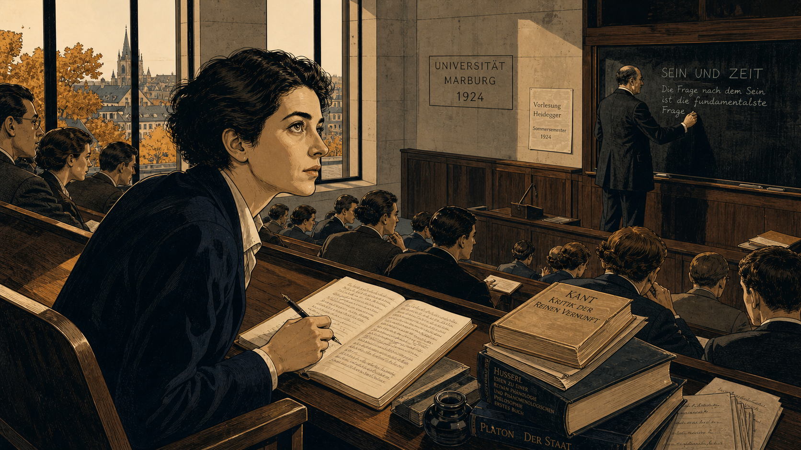

Image Prompt

I am about to ask you to generate a series of images for a graphic novel. Please make the images have a consistent style and consistent characters. Do not ask any clarifying questions. Just generate the image immediately when asked.

Please generate a 16:9 image in a 1920s German intellectual and Bauhaus-influenced style depicting panel 1 of 12. The scene shows a young Hannah Arendt, around 18 years old, with short dark hair, sharp intelligent eyes, and angular features, seated in a university lecture hall at the University of Marburg, Germany, in 1924. She sits forward in her seat, utterly absorbed, a notebook open on the fold-down desk before her. Around her, other students in 1920s academic dress listen in various states of attention. At the front of the hall, a professor writes on a large blackboard. The architecture is clean modernist stone and wood — Weimar-era academic design. Through tall windows, the rooftops of a small German university town are visible in autumn light. Color palette: warm amber, cool stone gray, dark navy, cream, and the golden brown of autumn leaves. Emotional tone: intellectual awakening, the excitement of discovering philosophy. Include: period-accurate 1920s clothing, a fountain pen in her hand, stacks of philosophy books on the desk, the German text "SEIN UND ZEIT" partly visible on the blackboard, wood-paneled walls, and the intensity of a young woman who has found her calling. Generate the image immediately without asking clarifying questions.

Hannah Arendt was born in 1906 in Linden, Germany, into a secular Jewish family. Brilliant and restless, she entered university at eighteen and was immediately seized by philosophy. At the University of Marburg, she studied under Martin Heidegger, one of the most important philosophers of the twentieth century. She learned to think — really think — about what it means to exist, to act, and to live among others. She could not yet know how urgently she would need those skills.

## Panel 2: The World Begins to Darken

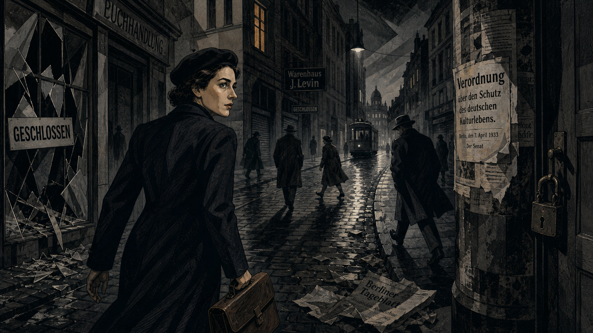

Image Prompt

Please generate a 16:9 image in a 1930s German Expressionist style depicting panel 2 of 12. Make the characters and style consistent with the prior panel. The scene shows a street in Berlin, 1933. Hannah Arendt, now in her late 20s, walks quickly down a gray cobblestone street carrying a leather briefcase. She wears a dark coat and beret. The street is eerily quiet — shuttered storefronts with "GESCHLOSSEN" (closed) signs, a smashed shop window with glass on the pavement, and official notices pasted on walls and lamp posts. A few people hurry past with their heads down. No explicit political symbols are shown — only the atmosphere of fear and conformity. Gray institutional buildings loom on both sides. Color palette: muted grays, cold blues, dark charcoal, a single patch of warm amber from a lit window. Emotional tone: tension, dread, and the feeling of a society closing in on itself. Include: crumpled newspapers in the gutter, a lone streetcar in the distance, a padlocked door, Arendt's determined stride, and long dramatic shadows cast by unseen streetlights. Generate the image immediately without asking clarifying questions.

By 1933, Germany had changed. The new regime began systematically excluding Jewish citizens from public life. Arendt watched her colleagues — brilliant, educated people — begin to comply, to look away, to stop thinking about what was happening around them. She was briefly arrested for collecting evidence of antisemitic propaganda. When she was released, she understood: it was time to leave. The question that would define her life's work was already forming — how do ordinary people become participants in evil?

## Panel 3: Flight from Europe

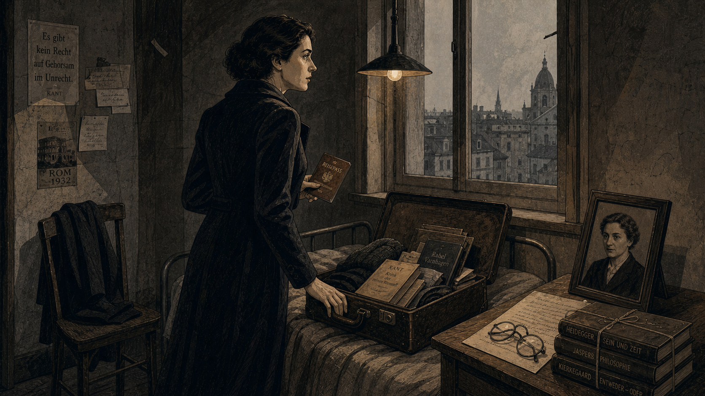

Image Prompt

Please generate a 16:9 image in a 1930s European Expressionist style depicting panel 3 of 12. Make the characters and style consistent with the prior panels. The scene shows Hannah Arendt in a modest room, preparing to leave. A small suitcase lies open on a narrow bed, half-packed with books and papers. She stands at the window looking out at a gray European cityscape, one hand resting on the suitcase, the other holding a passport or travel document. A framed photograph of her mother sits on a small bedside table. The room is spare — bare walls, a single overhead lamp, a wooden chair with a coat draped over it. Color palette: muted grays, warm amber lamplight, dark brown leather, cold pale sky through the window. Emotional tone: quiet resolve, the weight of leaving everything behind, and the loneliness of exile. Include: a stack of philosophy books tied with string, a pair of reading glasses on the table, a handwritten letter, worn floorboards, and the sense that this departure is permanent. Generate the image immediately without asking clarifying questions.

Arendt fled Germany in 1933, crossing into Czechoslovakia and then to Paris, where she spent eight years as a stateless refugee. She worked with organizations helping other Jewish refugees escape Europe. In 1941, as France fell, she and her husband Heinrich Blucher obtained emergency visas and sailed to New York. She arrived with almost nothing — no citizenship, no academic position, no certainty — but with a mind that refused to stop asking dangerous questions.

## Panel 4: A Thinker Rebuilds in New York

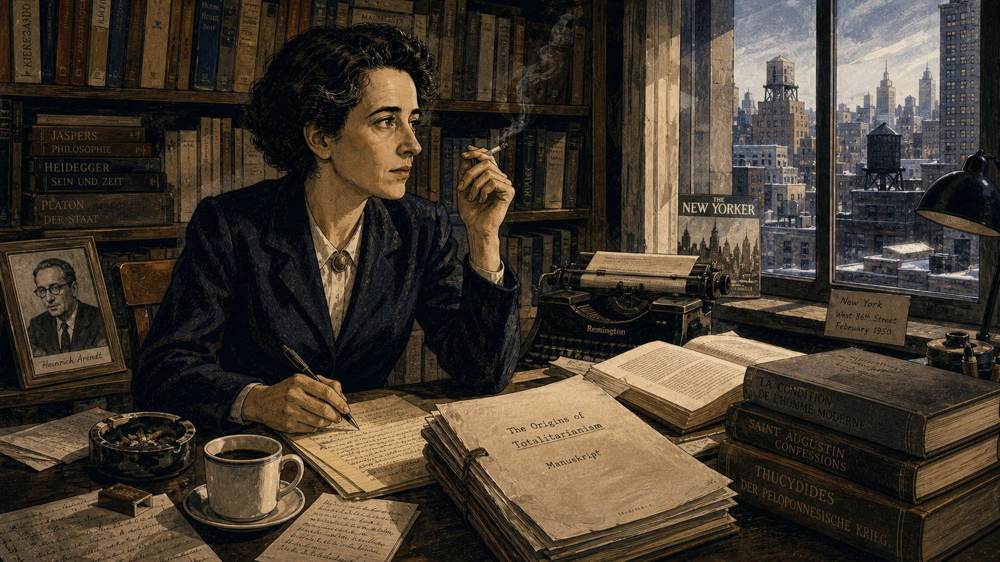

Image Prompt

Please generate a 16:9 image in a 1940s–1950s New York editorial illustration style depicting panel 4 of 12. Make the characters and style consistent with the prior panels. The scene shows Hannah Arendt in her apartment on the Upper West Side of Manhattan, circa 1950. She sits at a heavy wooden desk covered with manuscripts, open books, and carbon-copy typescript pages, a cigarette in one hand and a pen in the other. Behind her, floor-to-ceiling bookshelves are packed with volumes in German, French, and English. Through a window, the rooftops and water towers of mid-century Manhattan are visible against a winter sky. Color palette: warm interior browns and ambers, cool blue-gray city light, cream paper, dark navy and charcoal. Emotional tone: intellectual determination, the quiet intensity of a mind building something important. Include: a typewriter on a side table, an ashtray with cigarette stubs, a framed photograph of her husband Heinrich, a cup of coffee, scattered handwritten notes, and the thick manuscript of a book in progress. Generate the image immediately without asking clarifying questions.

In New York, Arendt rebuilt her intellectual life from scratch. She learned English, wrote for small journals, and slowly gained a reputation as one of the most original political thinkers of her generation. In 1951, she published *The Origins of Totalitarianism*, a sweeping study of how authoritarian regimes seize power by destroying people's ability to think and judge for themselves. The book made her famous. But her most controversial work was still a decade away.

## Panel 5: The Assignment — Jerusalem, 1961

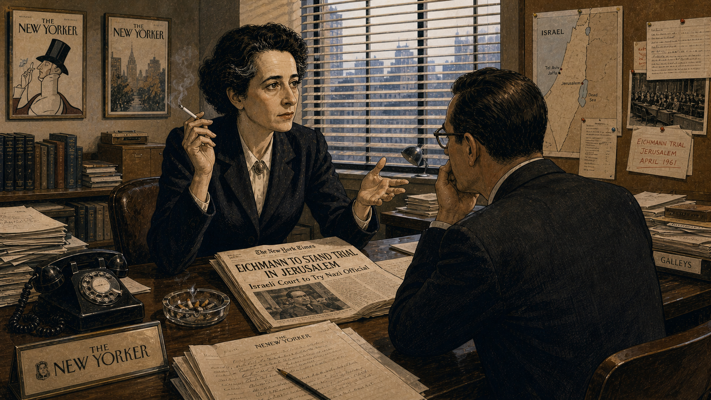

Image Prompt

Please generate a 16:9 image in a 1960s New York editorial illustration style depicting panel 5 of 12. Make the characters and style consistent with the prior panels. The scene shows Hannah Arendt, now in her mid-50s, standing in the offices of The New Yorker magazine in Manhattan. She is speaking with an editor across a desk, gesturing with one hand while holding a cigarette in the other. On the desk between them lies an open newspaper with a headline about the upcoming Eichmann trial in Jerusalem. Arendt's expression is intent and resolute — she has volunteered for this assignment. The office is a classic mid-century New York editorial space: neat stacks of galley proofs, framed magazine covers on the wall, venetian blinds filtering afternoon light. Color palette: warm office ambers, cream, dark charcoal suits, cool blue-gray light. Emotional tone: professional resolve and the gravity of what lies ahead. Include: a rotary telephone, a glass ashtray, manuscript pages, a map of Israel pinned to a corkboard, The New Yorker logo visible on stationery, and period-accurate 1960s office furnishings. Generate the image immediately without asking clarifying questions.

In 1960, Israeli agents captured Adolf Eichmann, a former senior official who had organized the logistics of the Holocaust — the transportation of millions of people to their deaths. He was brought to Jerusalem to stand trial. When Arendt heard the news, she immediately contacted *The New Yorker* and asked to cover the trial. She needed to see this man for herself. She needed to understand.

## Panel 6: The Man in the Glass Booth

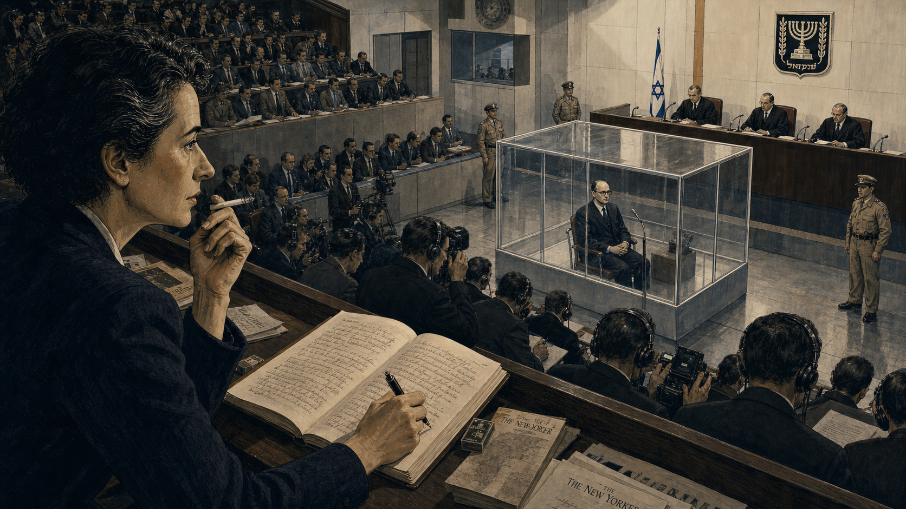

Image Prompt

Please generate a 16:9 image in a 1960s documentary illustration style depicting panel 6 of 12. Make the characters and style consistent with the prior panels. The scene shows the interior of the Jerusalem District Court during the Eichmann trial, 1961. The courtroom is large, modern, and packed with spectators, journalists, and translators wearing headphones. In the center of the courtroom, a bulletproof glass booth contains a single figure: a thin, balding, middle-aged man in a dark suit, sitting upright with his hands folded, wearing thick-rimmed glasses. He looks utterly ordinary — a bureaucrat, not a monster. In the press gallery above, Hannah Arendt sits with a notebook open, her pen frozen mid-sentence, staring down at the man in the booth with an expression of disturbed concentration. Three judges in dark robes sit at an elevated bench. Color palette: cold fluorescent courtroom whites, institutional gray, dark navy suits, warm amber on Arendt's face from a side lamp. Emotional tone: the shock of the ordinary, clinical observation, and moral bewilderment. Include: microphones on the judges' bench, headphone sets for translation, rows of journalists with notebooks, the glass booth reflecting overhead lights, uniformed court guards, and the strange emptiness of Eichmann's expression. Generate the image immediately without asking clarifying questions.

Arendt sat in the press gallery day after day, watching and listening. She had expected a fanatic, a figure of towering malice. Instead, she saw a man who spoke in bureaucratic jargon, who could not form an original sentence, who insisted he had never personally hated anyone. Eichmann did not deny what he had done. He denied that he had *thought* about what he had done. He claimed he was merely following orders, merely doing his job, merely obeying the law as it existed. Arendt stared down at him and felt something shift in her understanding of evil.

## Panel 7: The Banality of Evil

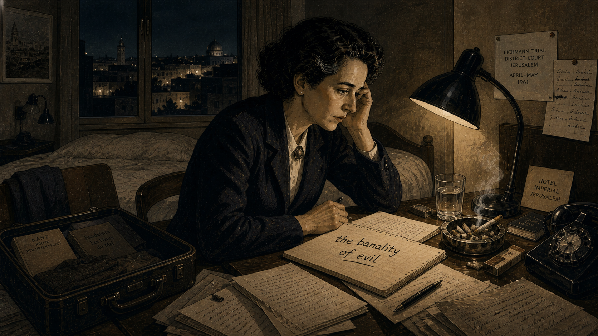

Image Prompt

Please generate a 16:9 image in a 1960s editorial illustration style depicting panel 7 of 12. Make the characters and style consistent with the prior panels. The scene shows Hannah Arendt alone in her hotel room in Jerusalem at night, sitting at a small writing desk. She has just written a phrase in her notebook and is staring at it, cigarette burning forgotten in the ashtray. The notebook page is visible, with the handwritten words "the banality of evil" underlined. Her expression is one of troubled clarity — she has found the words for something she cannot un-see. The room is spare: a single bed, a reading lamp casting a cone of warm light, a window showing the dark skyline of Jerusalem with a few distant lights. Color palette: warm amber lamplight, deep shadow, cream paper, cool blue-black night sky. Emotional tone: solitary revelation, the weight of a dangerous idea, and the loneliness of intellectual honesty. Include: scattered handwritten pages, a half-empty glass of water, an open suitcase with books, a hotel telephone, and the glow of her cigarette in the darkened room. Generate the image immediately without asking clarifying questions.

In her hotel room, Arendt wrote the phrase that would follow her for the rest of her life: *the banality of evil*. She did not mean that the Holocaust was banal, or that Eichmann's crimes were trivial. She meant something far more disturbing — that Eichmann was not a demon. He was a man who had simply stopped thinking. He had surrendered his capacity for independent moral judgment and replaced it with obedience, careerism, and cliche. The evil he helped produce was monstrous. The man who produced it was terrifyingly ordinary.

## Panel 8: The New Yorker Articles Arrive

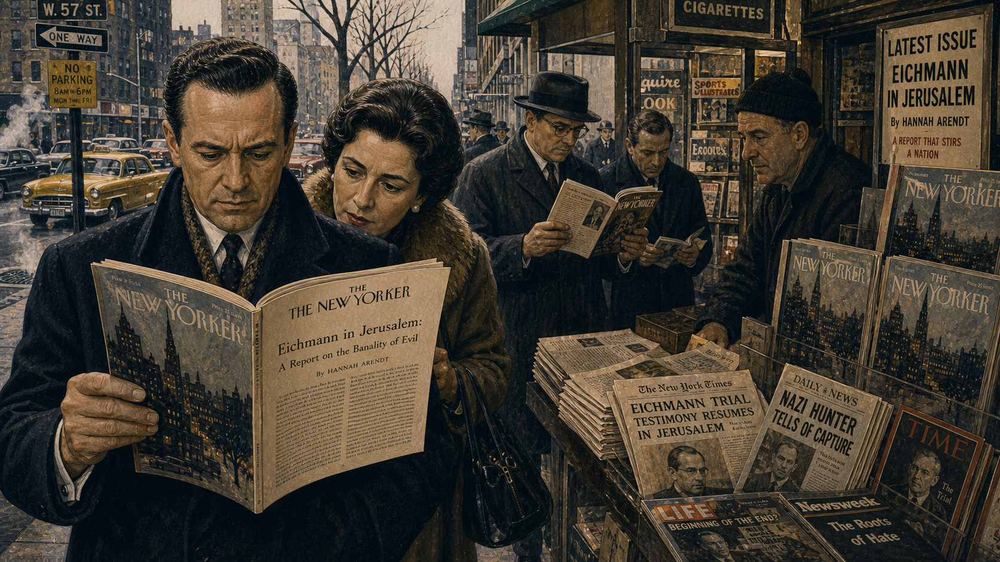

Image Prompt

Please generate a 16:9 image in a 1960s New York editorial illustration style depicting panel 8 of 12. Make the characters and style consistent with the prior panels. The scene shows a New York City newsstand in early 1963, with copies of The New Yorker magazine prominently displayed. Several people have stopped to read — a man in a dark overcoat holds the magazine open, his expression troubled; a woman in a fur-collared coat reads over his shoulder. The magazine cover and the visible article page are the focus. In the background, a busy Manhattan sidewalk with 1960s cars, yellow cabs, and winter-bare trees. Color palette: cool winter grays, warm newsstand yellows, cream magazine pages, dark coats, and the muted urban palette of early 1960s New York. Emotional tone: public shock, the moment an idea enters the world and cannot be taken back. Include: stacked magazines and newspapers, a vendor in a wool cap, steam rising from a street grate, period-accurate signage, and the sense that everyone is reading the same unsettling thing. Generate the image immediately without asking clarifying questions.

In February 1963, *The New Yorker* published Arendt's report in five serial installments. The reaction was immediate and volcanic. Her argument — that Eichmann was not uniquely evil but rather a thoughtless conformist — struck many readers as an outrageous minimization of the Holocaust. Others were furious that she had criticized certain Jewish leaders for their role in the councils that cooperated, under duress, with deportation orders. The articles became the most controversial thing the magazine had ever published.

## Panel 9: Attacked from Every Side

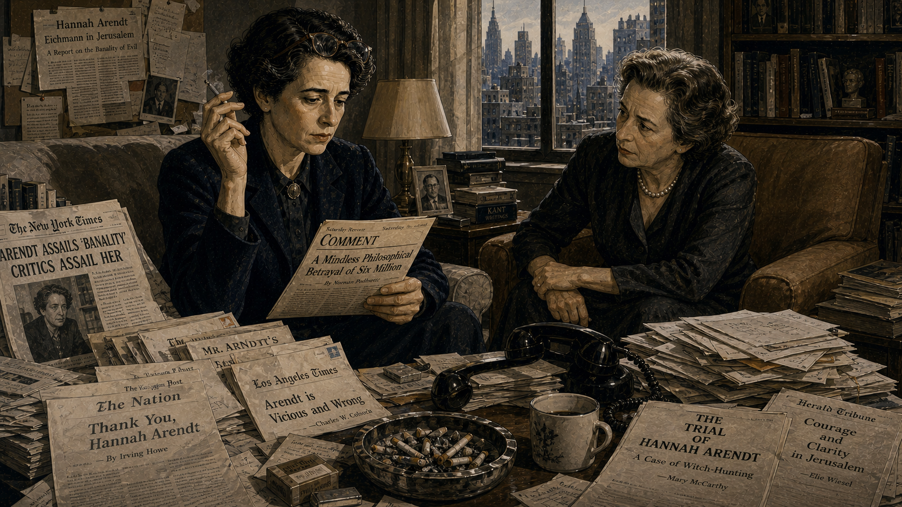

Image Prompt

Please generate a 16:9 image in a 1960s editorial illustration style depicting panel 9 of 12. Make the characters and style consistent with the prior panels. The scene shows Hannah Arendt sitting in a living room, surrounded by open newspapers and letters, reading a hostile review with a pained but composed expression. Around her on the table and sofa are scattered newspaper clippings with visible headlines — some supportive but most angry. A telephone sits off the hook. Through the window, the skyline of Manhattan is visible in gray afternoon light. Her friend Mary McCarthy sits across from her in an armchair, leaning forward with a concerned expression. Color palette: muted grays and warm interior browns, cool winter light, dark print on cream newsprint. Emotional tone: besieged dignity, the cost of public honesty, and the comfort of loyal friendship. Include: reading glasses pushed up on Arendt's forehead, a cigarette in hand, an overflowing ashtray, stacks of unopened mail, a bookshelf in the background, and the visible weight of public condemnation on Arendt's composed face. Generate the image immediately without asking clarifying questions.

The attacks came from every direction. Old friends severed ties. The Israeli government condemned her. Jewish organizations accused her of blaming the victims. Academic colleagues called her arrogant. Even people who had not read her work attacked it based on secondhand summaries. Arendt was devastated by the loss of friendships but refused to retract a word. She had not excused Eichmann — she had tried to *understand* him, which she insisted was a very different thing. Understanding how evil happens is not the same as forgiving it.

## Panel 10: The Refusal to Simplify

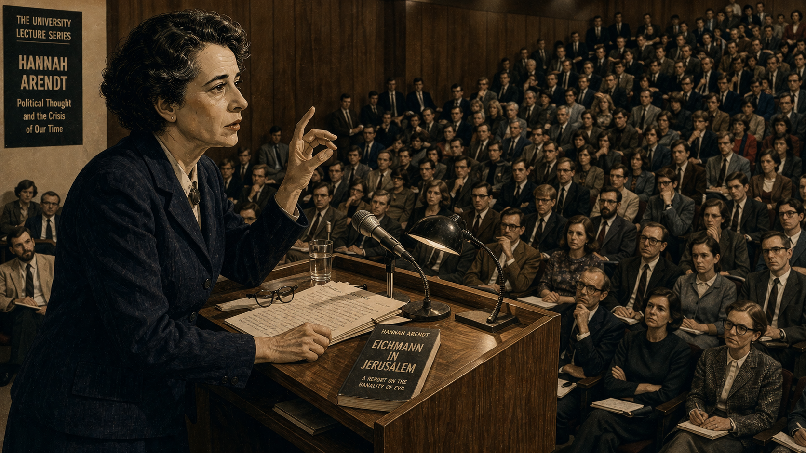

Image Prompt

Please generate a 16:9 image in a 1960s intellectual portrait style depicting panel 10 of 12. Make the characters and style consistent with the prior panels. The scene shows Hannah Arendt standing at a podium in a university lecture hall, addressing a packed audience. She is mid-sentence, one hand raised in a precise philosophical gesture, the other resting on her notes. Her expression is fierce and uncompromising. The audience is a mix of supportive and hostile faces — some leaning forward, some with arms crossed, some taking notes. The hall is a classic 1960s American university auditorium with wood paneling and institutional lighting. Color palette: warm wood browns, cool fluorescent light, dark suits and dresses, cream paper, and the amber of a desk lamp on the podium. Emotional tone: intellectual courage under fire, the refusal to back down, and the loneliness of a mind that will not simplify. Include: a glass of water on the podium, a microphone, her book *Eichmann in Jerusalem* visible on the lectern, attentive and skeptical faces in the front rows, and the focused intensity of a woman who knows exactly what she means. Generate the image immediately without asking clarifying questions.

Arendt's central argument was deceptively simple and endlessly misunderstood. She was not saying evil is trivial. She was saying that the most dangerous form of evil does not require villains — it requires only people who stop thinking for themselves. Eichmann's crime was not hatred. It was thoughtlessness. He had abdicated his responsibility to judge right from wrong and handed that responsibility to the system. For Arendt, the refusal to think was itself a moral act — perhaps the most dangerous moral act of all.

## Panel 11: Thinking as a Moral Duty

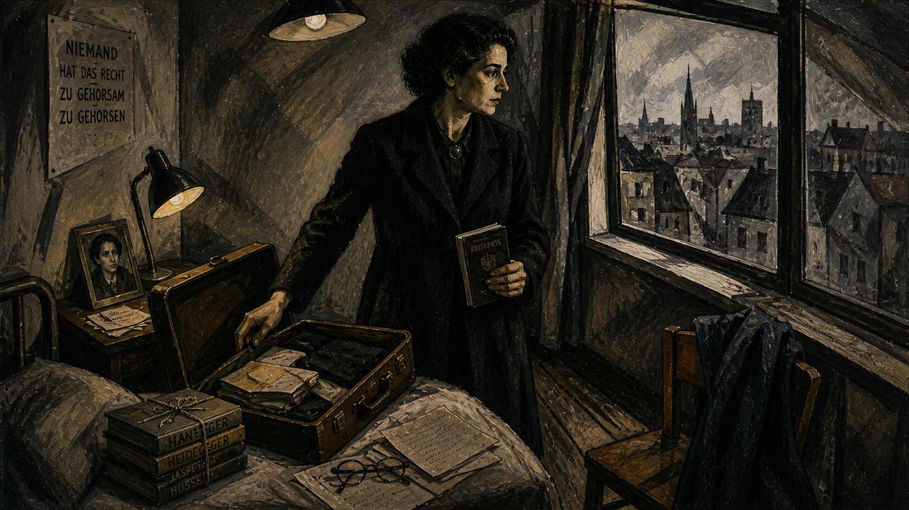

Image Prompt

Please generate a 16:9 image in a late 1960s intellectual illustration style depicting panel 11 of 12. Make the characters and style consistent with the prior panels. The scene shows Hannah Arendt in her study at the New School for Social Research in New York, late 1960s. She sits in an armchair beside a window, an open book in her lap, gazing outward with a contemplative expression. On her desk nearby are manuscripts for her final, unfinished work — the pages are titled "The Life of the Mind." Bookshelves rise behind her. Late afternoon light streams through the window, catching the smoke from her cigarette. A small seminar table with chairs is visible, suggesting the intimate teaching she loved. Color palette: warm golden afternoon light, deep book-leather browns, cream and ivory, soft charcoal shadows. Emotional tone: wisdom earned through suffering, the quiet power of a life devoted to thinking, and the urgency of her final project. Include: reading glasses, an open philosophy text, handwritten notes, a pen, a cup of tea gone cold, and the sense of a mind still working at full intensity. Generate the image immediately without asking clarifying questions.

In her later years, Arendt devoted herself to a question the Eichmann trial had forced on her: what does it actually mean to think? Her unfinished masterwork, *The Life of the Mind*, argued that thinking is not a luxury or a hobby — it is a moral obligation. When people stop engaging in the inner dialogue of conscience, when they accept slogans instead of reasoning, when they obey without judging — that is when catastrophe becomes possible. Thinking, for Arendt, was the last line of defense against evil.

## Panel 12: A Legacy That Will Not Be Silenced

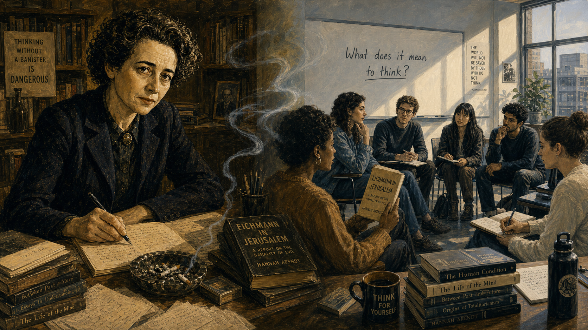

Image Prompt

Please generate a 16:9 image in a style that blends mid-century intellectual illustration with a subtle modern sensibility, depicting panel 12 of 12. Make the characters and style consistent with the prior panels. The scene is a split composition. On the left, Hannah Arendt sits at her desk in warm golden light, pen in hand, looking directly at the viewer with calm, unflinching intelligence — a portrait of the thinker at the height of her powers. On the right, a modern university classroom where diverse students sit in a circle discussion, one student holding a copy of *Eichmann in Jerusalem*, another writing in a notebook. A translucent thread of cigarette smoke drifts from Arendt's side into the modern classroom, connecting the two eras. Color palette: warm amber and deep brown on Arendt's side, cool contemporary whites and soft blues on the classroom side, with the smoke serving as a visual bridge. Emotional tone: continuity, intellectual inheritance, and the quiet insistence that thinking matters. Include: Arendt's characteristic sharp gaze, her books visible on both sides of the image, the students' engaged expressions, a whiteboard with "What does it mean to think?" written on it, natural light, and the sense of a conversation that spans generations. Generate the image immediately without asking clarifying questions.

Hannah Arendt died in 1975 at the age of sixty-nine, her final manuscript still on her desk. She never reconciled with many of the friends she lost over the Eichmann controversy. She never softened her conclusions. Today, her phrase "the banality of evil" is one of the most cited ideas in political philosophy, psychology, and ethics. Every time a student asks how ordinary people become complicit in terrible systems — every time a citizen refuses to accept "I was just following orders" as an excuse — they are continuing the work Hannah Arendt began in that Jerusalem courtroom.

### Epilogue – What Made Arendt Different?

Arendt was not the only journalist at the Eichmann trial. Hundreds of reporters covered it. She was the only one who looked at the man in the glass booth and refused to see what everyone expected to see. Where others saw a monster and felt satisfied, Arendt saw a bureaucrat and felt terrified — because a monster is a unique aberration, but a bureaucrat who stops thinking is a type that exists in every society, in every era, including our own. Her courage was not physical but intellectual: the willingness to say what her own evidence showed, even when it cost her friendships, reputation, and peace of mind.

| Challenge | How Arendt Responded | Lesson for Today |
|-----------|----------------------|------------------|
| Expected to see a monster at the trial | She described what she actually observed — an ordinary man | Report what the evidence shows, not what you expected to find |
| Her conclusions offended allies and enemies alike | She refused to retract or simplify her argument | Intellectual honesty sometimes means being misunderstood by everyone |
| Accused of excusing evil by trying to understand it | She distinguished sharply between understanding and forgiving | Understanding how something happens is the first step to preventing it |
| The refusal to think enabled mass atrocity | She spent her final years studying what thinking actually is | Thinking is not optional — it is a moral responsibility |

### Call to Action

The next time you hear someone say "I was just following orders," or "that's just how things work," or "it's not my job to question policy," pause and think about what Arendt saw in that courtroom. Thoughtlessness is not the same as innocence. Every time you examine an assumption instead of accepting it, every time you ask "is this right?" instead of "is this permitted?" — you are doing the work that Arendt argued was the foundation of moral life. You do not need to be a philosopher. You need to be willing to think.

---

*"The sad truth is that most evil is done by people who never make up their minds to be good or evil."*
—Hannah Arendt, *The Life of the Mind*

*"Comprehension does not mean denying the outrageous, deducing the unprecedented from precedents, or explaining phenomena by such analogies and generalities that the impact of reality and the shock of experience are no longer felt."*
—Hannah Arendt, *The Origins of Totalitarianism*

*"The trouble with Eichmann was precisely that so many were like him, and that the many were neither perverted nor sadistic, that they were, and still are, terrifyingly normal."*
—Hannah Arendt, *Eichmann in Jerusalem*

---

## References

1. [Wikipedia: Hannah Arendt](https://en.wikipedia.org/wiki/Hannah_Arendt) - Biography of the German-born American political philosopher and author of *The Origins of Totalitarianism* and *Eichmann in Jerusalem*
2. [Wikipedia: Eichmann in Jerusalem](https://en.wikipedia.org/wiki/Eichmann_in_Jerusalem) - Arendt's 1963 book reporting on the trial and introducing the concept of "the banality of evil"
3. [Wikipedia: Adolf Eichmann](https://en.wikipedia.org/wiki/Adolf_Eichmann) - The Holocaust administrator whose trial in Jerusalem became a landmark event in law, philosophy, and public memory
4. [Stanford Encyclopedia of Philosophy: Hannah Arendt](https://plato.stanford.edu/entries/arendt/) - Comprehensive scholarly overview of Arendt's political philosophy, including her theories of thinking, judgment, and totalitarianism
5. [United States Holocaust Memorial Museum: Adolf Eichmann](https://encyclopedia.ushmm.org/content/en/article/adolf-eichmann) - Historical account of Eichmann's role in the Holocaust and the circumstances of his capture and trial
