# The Woman Who Counted

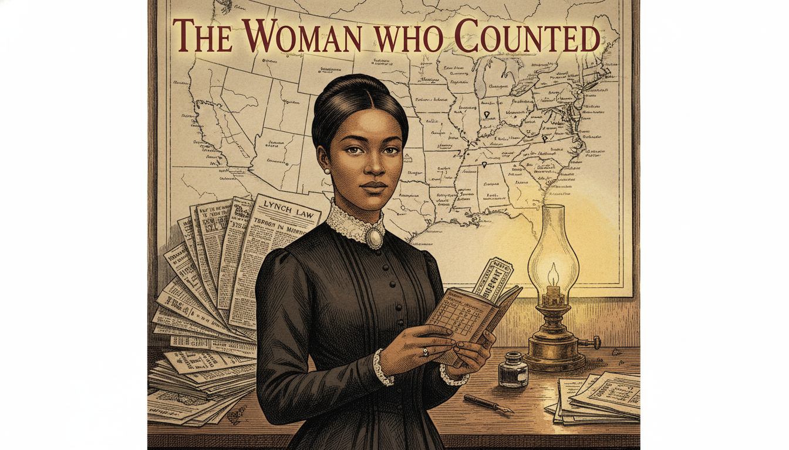

Cover Image Prompt

Please generate a wide-landscape 16:9 cover image for a graphic novel titled "The Woman Who Counted" in a late-Victorian Gilded Age American editorial illustration style, reminiscent of 1890s Harper's Weekly engravings blended with modern graphic-novel color. Show Ida B. Wells, a young African American woman around 30 years old with warm brown skin, dark hair swept up in a neat Victorian bun, steady determined eyes, and a high-collared dark dress with a cameo brooch at the throat. She stands at a cluttered wooden desk holding a small leather notebook open to a page of handwritten tally marks, names, and dates. Behind her, a large wall map of the American South is pinned with small dark markers, and stacks of newspaper clippings are fanned across the desk. A single oil lamp casts a warm pool of light. The title text "The Woman Who Counted" is rendered in an elegant serif typeface at the top. Color palette: warm sepia, ivory, ink black, muted oxblood red, and a single pool of amber lamplight. Emotional tone: quiet, unshakable resolve. Include: (1) Wells's direct, unflinching gaze toward the viewer, (2) period-accurate 1890s clothing and hairstyle, (3) visible handwriting on the open notebook page, (4) newspaper columns with headlines partially legible, (5) a fountain pen and ink bottle, (6) the faint outline of a railroad ticket tucked into the notebook. Generate the image immediately without asking clarifying questions.

Narrative Prompt

This is a 12-panel graphic novel about Ida B. Wells (1862-1931), the African American investigative journalist, suffragist, and co-founder of the NAACP whose pamphlet *Southern Horrors* (1892) and later *A Red Record* (1895) used meticulous statistical analysis and primary-source reporting to dismantle the dominant myth used to justify lynching in the post-Reconstruction American South. The story is set primarily in the United States between 1892 and 1895, with settings ranging from Memphis, Tennessee to the American South, New York City, and a speaking tour of England. The art style throughout is late-Victorian Gilded Age American editorial illustration — warm sepia tones, careful period detail in 1890s clothing, interiors, and typography, and a restrained emotional register appropriate for very serious historical content. Ida B. Wells should be drawn consistently across panels: a woman in her late 20s to early 30s with warm brown skin, dark hair neatly swept up, a small but composed and unshakable presence, and modest high-collared Victorian dresses. Central TOK theme: quantitative evidence and primary sources defeating a dominant narrative. The story emphasizes her courage, her methodological rigor, and the invention of what we now call data journalism. Violence is handled with gravity but without graphic depiction — the weight of the lynchings is conveyed through absence, documents, and reaction rather than explicit imagery, which is both historically respectful and avoids image-safety filters.

### Prologue – Three Friends and a Ledger

On March 9, 1892, three Black grocers in Memphis — Thomas Moss, Calvin McDowell, and Will Stewart — were dragged from a jail cell by a masked mob and killed. Their only crime was running a successful store that competed with a white grocer across the street. One of them, Thomas Moss, had been Ida B. Wells's close friend and the godfather of her niece. The newspapers called the killings a response to Black "lawlessness." Wells, who had already made a name for herself as a journalist, did something almost no one had thought to do before: she decided to count. Armed with a notebook, a train ticket, and the lynchers' own newspaper accounts, she set out to prove what the data would show — and what a careful reader would already suspect.

## Panel 1: The Telegram from Memphis

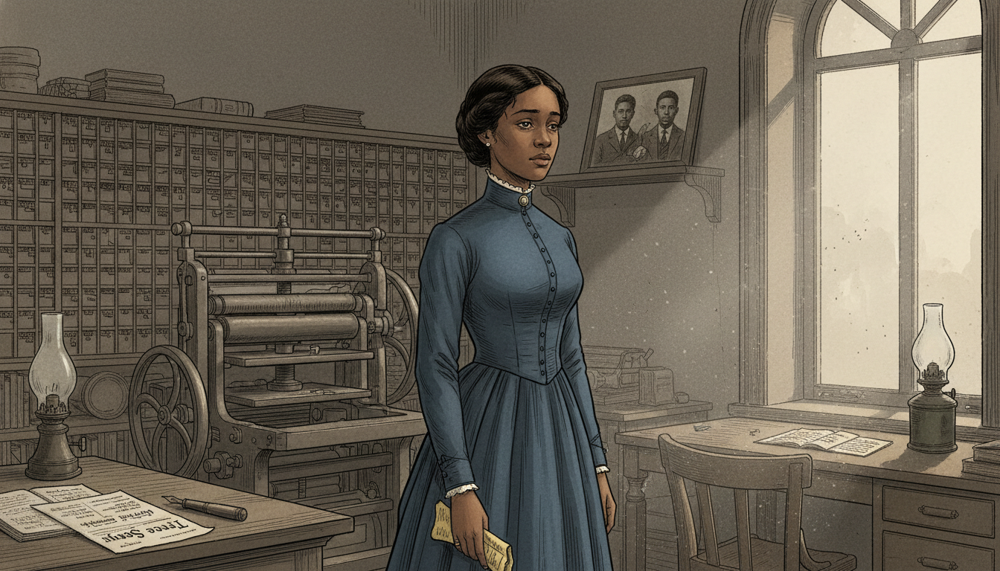

Image Prompt

I am about to ask you to generate a series of images for a graphic novel. Please make the images have a consistent style and consistent characters. Do not ask any clarifying questions. Just generate the image immediately when asked.

Please generate a 16:9 image in late-Victorian Gilded Age American editorial illustration style depicting panel 1 of 12. The scene shows Ida B. Wells, a young African American woman around 29 years old with warm brown skin, dark hair in a neat Victorian bun, and a high-collared dark blue dress, standing in a small newspaper office in Memphis, Tennessee in March 1892. She has just read a telegram and her hand has dropped to her side, still clutching the paper. Her expression is stricken but controlled. Behind her, a wooden printing press and shelves of type cases fill the room. The color palette is muted sepia, ink black, dusty blue, and a single shaft of gray afternoon light through a tall sash window. Emotional tone: stunned grief. Specific details: (1) the yellow telegram paper visible in her hand, (2) a wooden desk with an open ledger and fountain pen, (3) the masthead of the newspaper "Free Speech" visible on a proof sheet, (4) a framed photograph of three young Black men on a shelf, (5) a kerosene lamp unlit, (6) dust motes in the shaft of light. Generate the image immediately without asking clarifying questions.

The telegram was short. Thomas Moss was dead, and so were Calvin and Will. The official story claimed the men had fired on police — but everyone in Black Memphis knew the truth: the People's Grocery had been too successful, and white competitors had wanted it gone. Wells read the words twice, then a third time. In that moment, the 29-year-old editor of the *Memphis Free Speech* made a decision that would change her life and the history of American journalism.

## Panel 2: A Promise at the Graveside

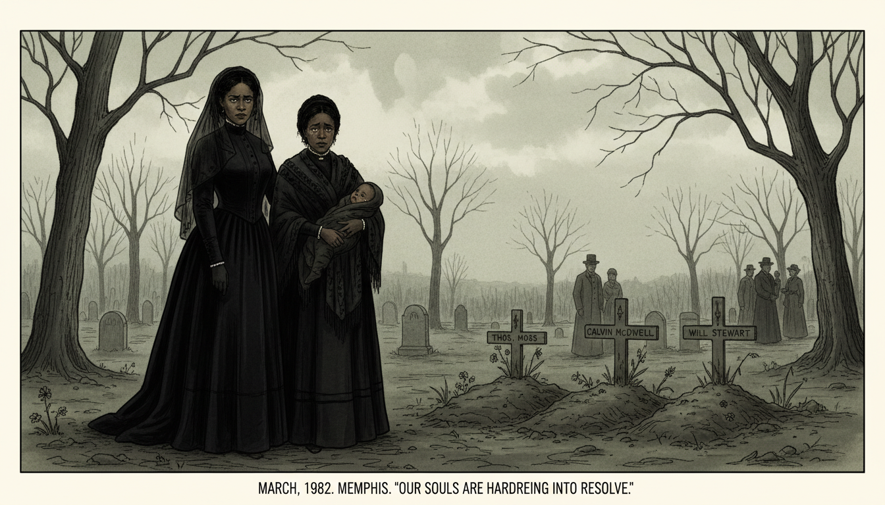

Image Prompt

Please generate a 16:9 image in late-Victorian Gilded Age American editorial illustration style depicting panel 2 of 12. Make the characters and style consistent with the prior panel. The scene shows Ida B. Wells standing at a simple graveside in a Memphis cemetery in March 1892, beside Betty Moss, the widow of Thomas Moss, who holds a small child. Wells's face is composed but her eyes are fierce with resolve. The color palette is muted gray-green, sepia, black mourning fabric, and a cold overcast sky. Emotional tone: grief hardening into resolve. Specific details: (1) three fresh graves with simple wooden markers, (2) Wells in a long black mourning dress and veil pushed back from her face, (3) the widow holding a baby wrapped in a dark shawl, (4) bare trees in the background, (5) a few other mourners in the distance in period clothing, (6) Wells's hand resting gently on the widow's shoulder. Generate the image immediately without asking clarifying questions.

Wells attended the funerals. Thomas Moss had been the godfather of her niece; his widow Betty now stood over his grave with their baby in her arms. Wells had always believed in the law, in the slow work of justice through the courts. That belief died in the Memphis cemetery. She would later write that the Moss lynching "opened my eyes to what lynching really was. An excuse to get rid of Negroes who were acquiring wealth and property."

## Panel 3: The Editorial Desk

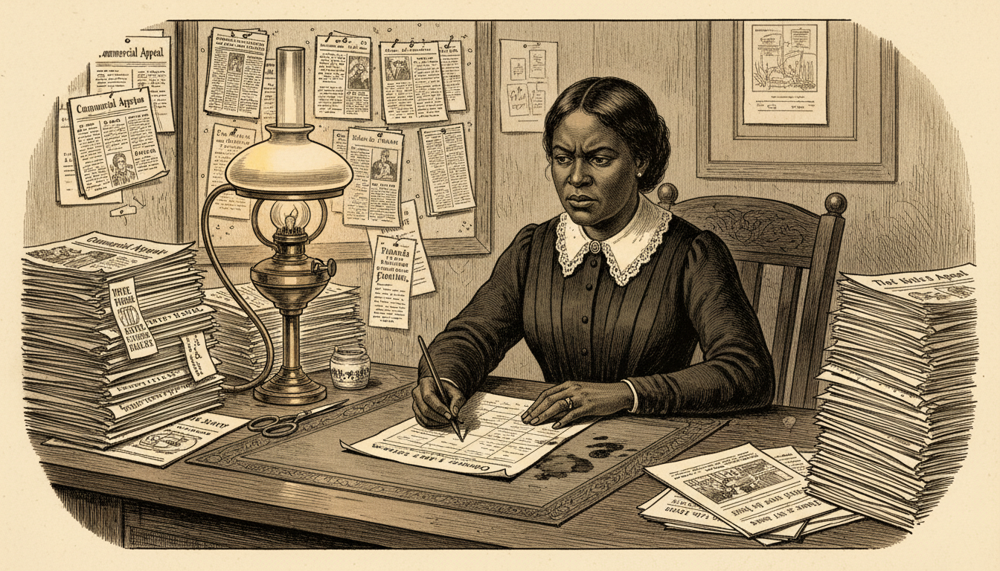

Image Prompt

Please generate a 16:9 image in late-Victorian Gilded Age American editorial illustration style depicting panel 3 of 12. Make the characters and style consistent with the prior panel. The scene shows Ida B. Wells seated at a wooden editor's desk at the *Memphis Free Speech* newspaper office in May 1892, writing fiercely with a steel-nib pen. She is surrounded by stacks of white Southern newspapers — the Memphis *Commercial Appeal*, the Atlanta *Constitution*, the New Orleans *Times-Picayune* — which she has been clipping. The color palette is warm cream, ink black, oak brown, and amber lamplight. Emotional tone: focused determination. Specific details: (1) scissors and paste pot beside the newspapers, (2) a growing file of clipped columns pinned to a cork board, (3) Wells in a simple dark day dress with white lace collar, (4) a printer's proof sheet in front of her, (5) an ink-stained blotter, (6) a brass oil lamp casting a pool of light on her work. Generate the image immediately without asking clarifying questions.

Back at *Free Speech*, Wells began a different kind of reporting. Instead of quoting Black witnesses, whom white readers would dismiss, she turned to the lynchers' own newspapers. Every time a Southern paper bragged about a lynching, she clipped it, filed it, and cross-referenced the name, the date, the stated reason, and any detail that could be verified. She was building a database — on paper, with scissors and paste — decades before the word existed.

## Panel 4: The Editorial That Set the Fire

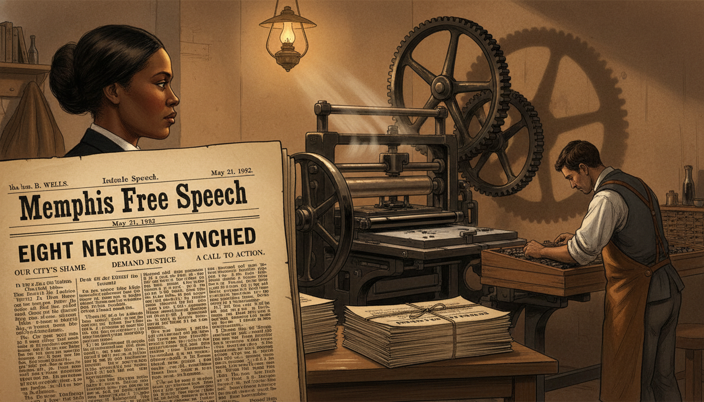

Image Prompt

Please generate a 16:9 image in late-Victorian Gilded Age American editorial illustration style depicting panel 4 of 12. Make the characters and style consistent with the prior panel. The scene shows a close-up of a freshly printed broadsheet of the *Memphis Free Speech* dated May 21, 1892, with a bold editorial clearly headlined "Eight Negroes Lynched." In the background, out of focus, Ida B. Wells stands in the pressroom watching the press run. The color palette is cream newsprint, deep ink black, warm brown wood, and a single oil-lamp glow. Emotional tone: quiet defiance at the moment of commitment. Specific details: (1) visible text fragments of the editorial on the broadsheet, (2) a large flatbed printing press with ink rollers, (3) Wells in profile in the background watching the sheets come off the press, (4) a compositor in shirtsleeves setting type at a case, (5) stacks of finished papers tied with twine, (6) shadows from the press gears on the back wall. Generate the image immediately without asking clarifying questions.

On May 21, 1892, Wells published an editorial that quietly dismantled the central myth Southern newspapers repeated to justify lynching: that Black men were being killed to "protect" white women. Her editorial noted dryly that if white men continued to claim this, "a conclusion will be reached which will be very damaging to the moral reputation of their women." It was a polite, devastating sentence. The city erupted.

## Panel 5: The Office Destroyed

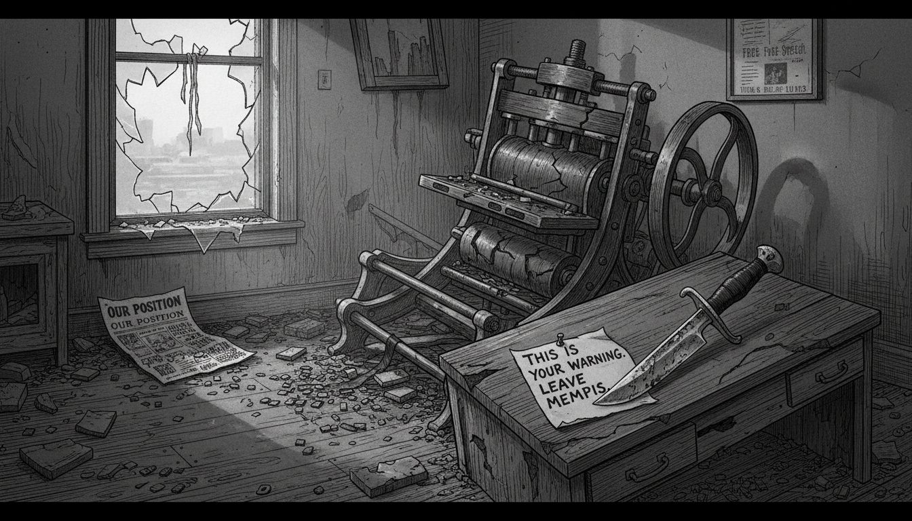

Image Prompt

Please generate a 16:9 image in late-Victorian Gilded Age American editorial illustration style depicting panel 5 of 12. Make the characters and style consistent with the prior panel. The scene shows the wrecked interior of the *Memphis Free Speech* newspaper office on the morning of May 28, 1892, after a mob has destroyed it overnight. The printing press is overturned, type cases are scattered across the floor, desks are smashed, and papers are strewn everywhere. Wells is NOT in this scene — she was in New York at the time. The color palette is gray morning light, ash, broken ink black, splintered oak. Emotional tone: aftermath and cold intimidation, no blood or human figures. Specific details: (1) the overturned flatbed printing press, (2) scattered lead type on the floorboards, (3) a broken window with shattered glass, (4) a torn proof sheet of *Free Speech* on the ground, (5) a note pinned to the wrecked desk with a knife, (6) early morning light through the broken window. Generate the image immediately without asking clarifying questions.

A mob destroyed the *Free Speech* office while Wells was traveling in New York. A notice in the rival Memphis papers warned that if she ever returned, she would be killed on sight. She was now, at 29, an exile. But the mob had made a critical mistake: they had driven her closer to her data, not away from it. From a borrowed desk at the *New York Age*, she began writing the pamphlet that would become *Southern Horrors*.

## Panel 6: Southern Horrors Goes to Press

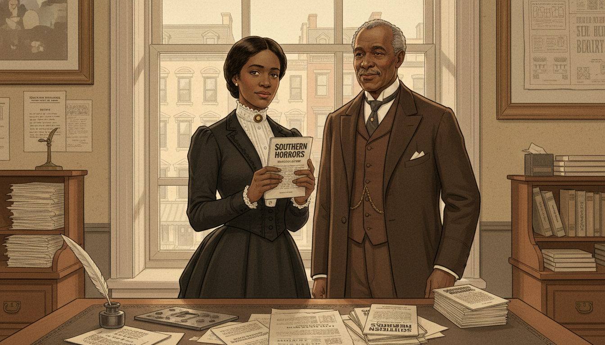

Image Prompt

Please generate a 16:9 image in late-Victorian Gilded Age American editorial illustration style depicting panel 6 of 12. Make the characters and style consistent with the prior panel. The scene shows Ida B. Wells in the New York office of the *New York Age* newspaper in the summer of 1892, holding a freshly printed copy of her pamphlet *Southern Horrors: Lynch Law in All Its Phases*. She is looking at the cover with a serious, satisfied expression. An older Black newspaperman — T. Thomas Fortune — stands nearby approvingly. The color palette is warm cream, ivory, deep brown, ink black, and soft window light. Emotional tone: quiet triumph and resolve. Specific details: (1) the pamphlet cover with clear title text "Southern Horrors," (2) a wooden editor's desk with galley proofs, (3) Fortune in a three-piece suit with watch chain, (4) Wells in a dark traveling dress with white lace collar, (5) a stack of finished pamphlets on the desk, (6) a view through a window of 1890s New York brownstones. Generate the image immediately without asking clarifying questions.

*Southern Horrors* appeared in the summer of 1892. Its argument was built on data Wells had gathered from white newspapers themselves: of 728 lynching victims recorded over a decade, only about a third had even been accused of assaulting a woman — and many of those accusations, examined closely, collapsed into consensual relationships, property disputes, or simple economic rivalry. The pamphlet did not shout. It counted. And the counting did the work.

## Panel 7: The Method — Tallying the Dead

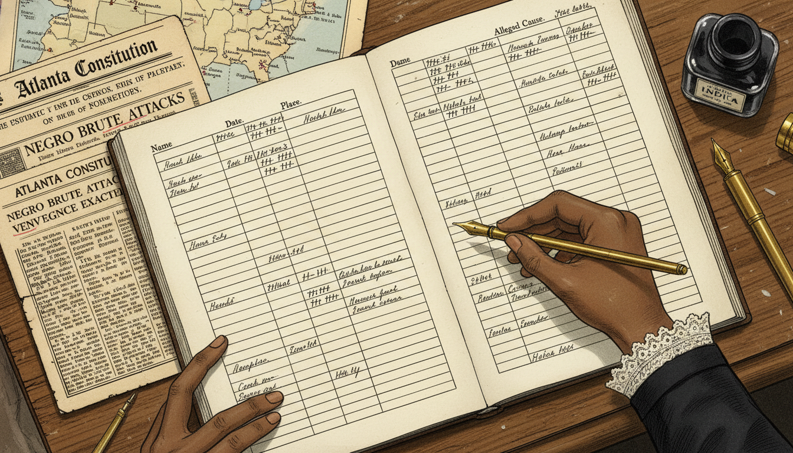

Image Prompt

Please generate a 16:9 image in late-Victorian Gilded Age American editorial illustration style depicting panel 7 of 12. Make the characters and style consistent with the prior panel. The scene shows a close-up overhead view of Wells's open research ledger on a desk, filled with columns of handwritten names, dates, locations, and "alleged cause" entries in neat Victorian copperplate script. Wells's hand is visible holding a pen, adding another entry. Alongside the ledger are clipped newspaper columns with certain phrases underlined in pencil. The color palette is ivory paper, ink black, warm sepia, and faint red pencil marks. Emotional tone: methodical, unshakable. Specific details: (1) column headers reading "Name," "Date," "Place," "Alleged Cause," (2) newspaper clippings from the Atlanta *Constitution* and Memphis *Commercial Appeal*, (3) small tally marks gathered in groups of five, (4) a map of the American South with pencil dots marking locations, (5) a fountain pen and bottle of India ink, (6) the edge of Wells's dark sleeve with a lace cuff. Generate the image immediately without asking clarifying questions.

This was Wells's real invention. She did not argue emotionally; she refused to. She took the lynchers' own words and turned them into a dataset: names, places, dates, and the reasons the killers themselves had given. Then she showed that the reasons did not match the official story. It was the birth, on a single wooden desk, of what we now call data journalism — a method in which primary sources are gathered, organized, and counted until the pattern becomes undeniable.

## Panel 8: The Crossing to England

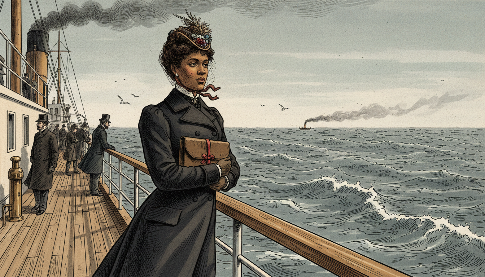

Image Prompt

Please generate a 16:9 image in late-Victorian Gilded Age American editorial illustration style depicting panel 8 of 12. Make the characters and style consistent with the prior panel. The scene shows Ida B. Wells standing at the railing of a transatlantic steamship in 1893, looking out over the gray Atlantic Ocean, her traveling coat and hat braced against the wind. She holds a small leather portfolio close to her chest. The color palette is cold gray-blue, white sea foam, deep navy, with a single warm note in her face. Emotional tone: quiet resolve, a woman carrying her evidence across an ocean. Specific details: (1) the wooden deck railing and iron fittings of a period steamship, (2) Wells in a dark traveling ensemble with a small feathered hat, (3) the leather portfolio tied with ribbon, (4) a distant funnel trailing smoke, (5) other passengers in Victorian coats in the background, (6) seabirds over the waves. Generate the image immediately without asking clarifying questions.

American newspapers mostly ignored *Southern Horrors*. So Wells took her evidence to a place where it could not be ignored. Invited by British reformers, she sailed to England in 1893 and again in 1894. She carried her ledgers, her clippings, and her careful footnotes across the Atlantic, into a country that considered itself the moral conscience of the English-speaking world.

## Panel 9: The Lecture Hall in London

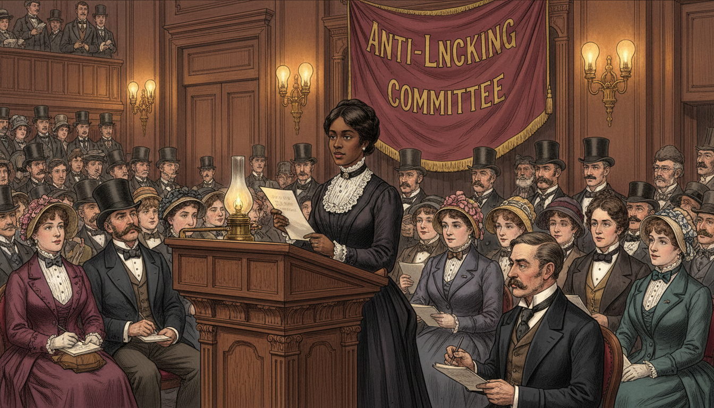

Image Prompt

Please generate a 16:9 image in late-Victorian Gilded Age American editorial illustration style depicting panel 9 of 12. Make the characters and style consistent with the prior panel. The scene shows Ida B. Wells standing at a lectern in a packed London lecture hall in 1894, addressing an audience of attentive British men and women in Victorian formal dress. She speaks calmly and confidently, holding up a page of her research. The color palette is rich burgundy, polished oak, ivory shirt fronts, gaslight amber. Emotional tone: dignified, persuasive, authoritative. Specific details: (1) a carved wooden lectern with a brass lamp, (2) rows of seated listeners in top hats and bonnets taking notes, (3) Wells in her neat dark dress and lace collar, composed, (4) a large banner behind her reading "Anti-Lynching Committee," (5) a journalist in the front row sketching her likeness, (6) tall gaslight fixtures lining the walls. Generate the image immediately without asking clarifying questions.

In drawing rooms and packed lecture halls from London to Liverpool, Wells did something unprecedented: she embarrassed the United States on the world stage, using the United States' own newspapers as her evidence. British audiences, reading her numbers, formed an Anti-Lynching Committee that pressured American officials and businessmen. For the first time, American lynching became an international scandal — not because of outrage, but because of arithmetic.

## Panel 10: A Red Record

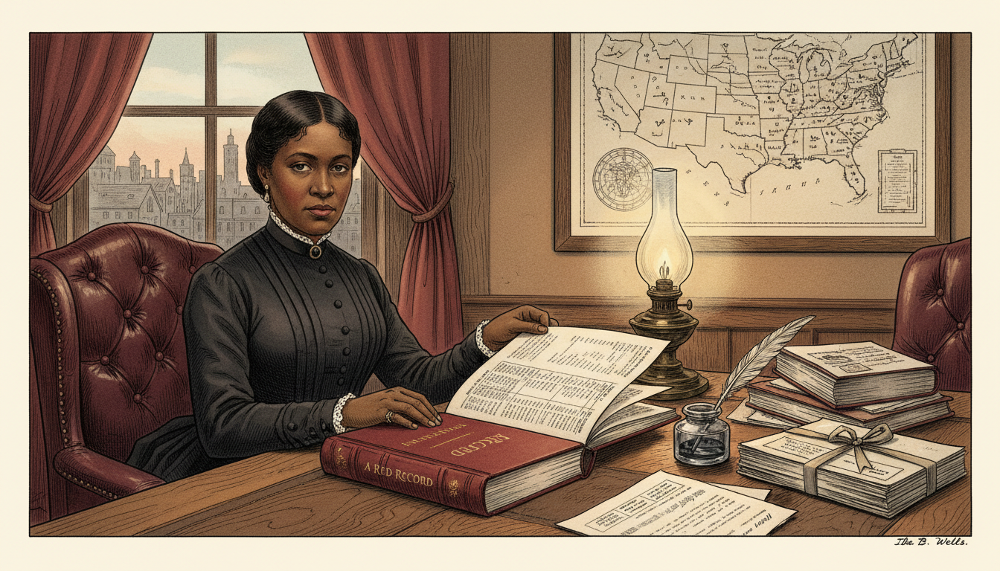

Image Prompt

Please generate a 16:9 image in late-Victorian Gilded Age American editorial illustration style depicting panel 10 of 12. Make the characters and style consistent with the prior panel. The scene shows Ida B. Wells in 1895 in a Chicago study, seated at a desk with the newly published *A Red Record* in front of her. The book is open to a page showing statistical tables. Wells is turning the page thoughtfully, her expression calm and serious. The color palette is warm oak, burgundy leather, cream paper, ink black, and a soft lamp glow. Emotional tone: gravitas of a completed work. Specific details: (1) the hardback *A Red Record* with visible statistical tables, (2) a framed map of the United States on the wall with pins, (3) a ledger and research notes, (4) Wells in a dignified dark dress, (5) a window showing 1895 Chicago rooftops, (6) a pen and inkwell beside a stack of personal correspondence. Generate the image immediately without asking clarifying questions.

In 1895, Wells published *A Red Record*, a far more comprehensive statistical study covering three full years of lynchings. It included tables, charts, and case-by-case analysis. Critics who had dismissed *Southern Horrors* as one woman's anger now had to reckon with three years of tabulated data drawn almost entirely from white sources. A generation of future journalists — Black and white — would study her methods.

## Panel 11: Founding the NAACP

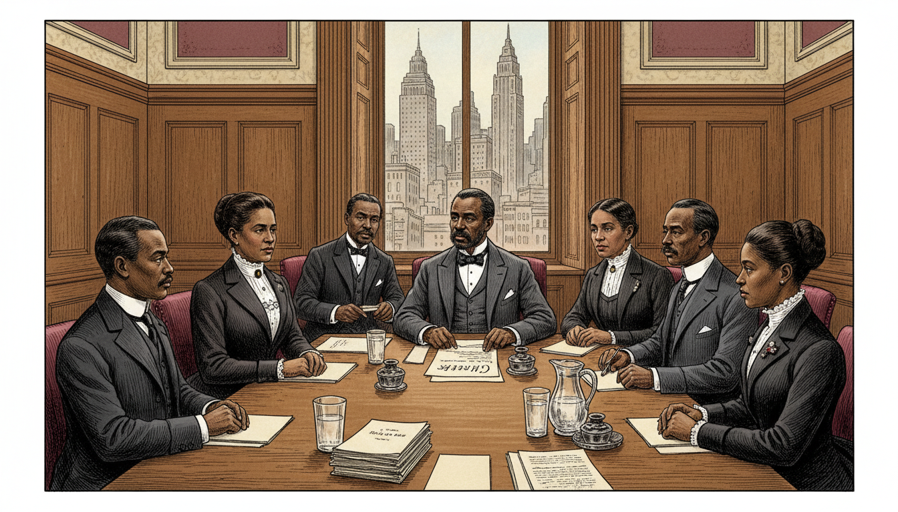

Image Prompt

Please generate a 16:9 image in late-Victorian Gilded Age American editorial illustration style depicting panel 11 of 12, now set in 1909. Make the characters and style consistent with the prior panels, but show Wells now in her mid-40s, her face slightly more lined but still composed and determined. The scene shows a meeting of the founding members of the NAACP in a New York conference room in 1909. Wells is seated among other civil rights leaders, including W.E.B. Du Bois. The color palette is oak paneling, warm cream, ink black, burgundy. Emotional tone: historic, collaborative, forward-looking. Specific details: (1) a long conference table with papers and pitchers of water, (2) Wells in a formal dark suit-dress with white blouse, (3) Du Bois in a three-piece suit at the head of the table, (4) five or six other founding members around the table, (5) a window showing 1909 New York with early skyscrapers, (6) a draft document visible on the table labeled "Charter." Generate the image immediately without asking clarifying questions.

Wells never stopped. In 1909, she was among the founding members of the National Association for the Advancement of Colored People. She would go on to campaign for women's suffrage, march with white suffragists who tried to push her to the back of their parade (she refused and stepped into the front ranks), and investigate race riots in Illinois and Arkansas — always with her notebook, always counting, always returning to the data.

## Panel 12: The Legacy — Data That Tells the Truth

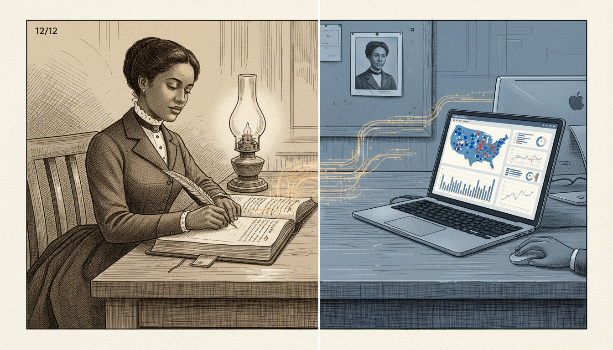

Image Prompt

Please generate a 16:9 image in a style that blends late-Victorian editorial illustration with a subtle modern overlay, depicting panel 12 of 12. The scene shows a symbolic split composition: on the left, Ida B. Wells in 1895 at her desk writing in her ledger by lamplight; on the right, the same desk transformed into a modern newsroom workstation with a laptop open to a data-journalism dashboard showing a map of the United States with dots and statistical charts. The two halves are connected by a continuous line of handwritten names that becomes a line of digital data. The color palette is sepia on the left transitioning to cool modern blue on the right, unified by a single warm amber line. Emotional tone: continuity and legacy. Specific details: (1) Wells clearly recognizable on the left in period dress, (2) the open ledger page bridging the two halves, (3) the laptop screen showing a clearly designed data dashboard, (4) a modern journalist's hand visible on the right side, (5) both workspaces share the same desk surface, (6) a small portrait of Wells pinned above the modern workstation. Generate the image immediately without asking clarifying questions.

Ida B. Wells died in 1931. In 2020 — 89 years later — she was awarded a posthumous Pulitzer Prize for "her outstanding and courageous reporting on the horrific and vicious violence against African Americans during the era of lynching." Every modern data journalist who builds a spreadsheet of police shootings, every epidemiologist who counts cases the government would prefer to hide, every researcher who insists that *primary sources* beat official narratives — they are all walking a path she cut with scissors, a paste pot, and a leather notebook.

### Epilogue – What Made Ida B. Wells Different?

Wells was not the first person to be horrified by lynching, and she was not the first to speak against it. What made her different was her method. She refused to argue from emotion when she could argue from evidence, and she refused to trust any source — including her own instincts — more than a carefully verified document. She understood, decades before the profession of "data journalism" existed, that a dominant narrative can be broken not by a louder voice but by a better-footnoted one.

| Challenge | How Wells Responded | Lesson for Today |
|-----------|---------------------|------------------|
| A dominant myth justified lynching as "protection" of white women | She tabulated the lynchers' own stated reasons from their own newspapers | Use your opponents' primary sources — their words are the hardest for them to dismiss |
| American papers ignored her reporting | She took her data to England and made it an international story | If one audience will not listen, find one that will; the truth travels |
| Her newspaper office was destroyed and she was threatened with death | She kept writing, from exile, with even more rigorous methodology | Intimidation is evidence that the evidence is working |
| Critics called her emotional and unreliable | She published *A Red Record*, with tables, charts, and case-by-case citations | When accused of bias, publish your data and your method |
| She was excluded from many "respectable" movements of her time | She founded her own organizations and kept counting | Institutions can be built; the data belongs to whoever gathers it |

### Call to Action

The next time someone tells you that a story is "just how things are," ask Sofia's question: *But how do we know?* Then do what Ida B. Wells did — go look at the primary sources yourself, write down what you find, and count. A notebook and the courage to use it are still two of the most dangerous tools a truth-seeker can carry.

---

*"The way to right wrongs is to turn the light of truth upon them."*
—Ida B. Wells

*"One had better die fighting against injustice than die like a dog or a rat in a trap."*
—Ida B. Wells

*"The people must know before they can act, and there is no educator to compare with the press."*
—Ida B. Wells

---

## References

1. [Wikipedia: Ida B. Wells](https://en.wikipedia.org/wiki/Ida_B._Wells) - Biography of the African American investigative journalist, educator, and early civil rights leader
2. [Wikipedia: Southern Horrors: Lynch Law in All Its Phases](https://en.wikipedia.org/wiki/Southern_Horrors:_Lynch_Law_in_All_Its_Phases) - Wells's 1892 pamphlet that used statistical analysis to dismantle the myth justifying lynching
3. [Wikipedia: The Red Record](https://en.wikipedia.org/wiki/The_Red_Record) - Wells's 1895 comprehensive statistical study of three years of lynchings in the United States
4. [National Women's History Museum: Ida B. Wells-Barnett](https://www.womenshistory.org/education-resources/biographies/ida-b-wells-barnett) - Curated biography from the National Women's History Museum
5. [Encyclopaedia Britannica: Ida B. Wells-Barnett](https://www.britannica.com/biography/Ida-B-Wells-Barnett) - Overview of Wells's life, journalism, and civil rights activism
