# The Doctor Who Counted the Dead — Ignaz Semmelweis and the Invisible Killer

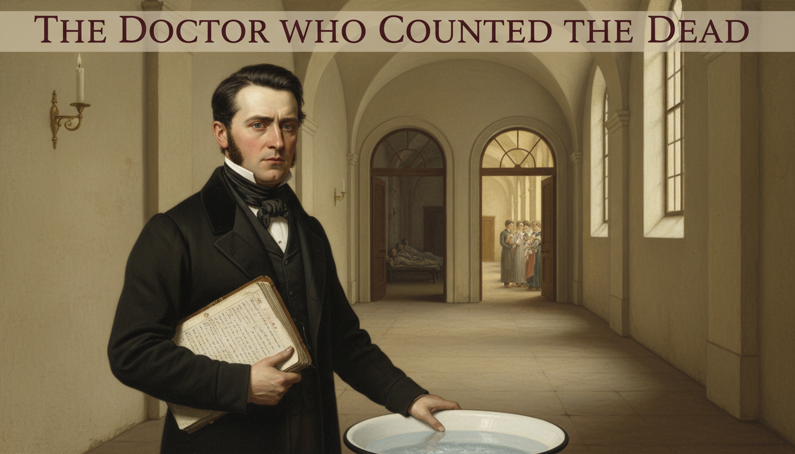

Cover Image Prompt

Please generate a wide-landscape 16:9 cover image for this story in the style of Biedermeier-era Central European painting (1840s Vienna), with the careful realism of early Victorian medical illustration. The scene shows Dr. Ignaz Semmelweis as a young man in his late twenties: dark hair, sideburns, a determined but troubled expression, wearing a dark frock coat, white shirt, and cravat typical of 1847 Vienna. He stands in the long stone corridor of the Vienna General Hospital, holding a heavy ledger open in one hand, his other hand resting on a white ceramic basin of chlorinated lime water. Behind him, the corridor stretches toward two arched doorways — one dimly lit, one bright — symbolizing the two maternity wards with different death rates. Soft candlelight and pale morning light from tall arched windows fall across his face. Include the title "THE DOCTOR WHO COUNTED THE DEAD" rendered in a period-appropriate 1840s serif typeface across the top. Color palette: muted creams, warm browns, deep burgundy, candlelight gold, and the cold pale blue of early dawn. Emotional tone: serious, determined, haunted by what he has discovered. Generate the image immediately without asking clarifying questions.

Narrative Prompt

This is the story of Ignaz Semmelweis (1818–1865), a Hungarian-born physician working in the Vienna General Hospital in the 1840s. At a time before germ theory existed, he used statistical observation to discover that doctors were transmitting "cadaverous particles" from autopsies to laboring mothers, causing a horrific death rate from puerperal (childbed) fever. When he ordered doctors to wash their hands in chlorinated lime solution, deaths plummeted — but the medical establishment rejected his findings because they could not explain *why* the solution worked and because the implications were too painful to accept. Central themes: the Semmelweis reflex, evidence vs. authority, the psychological cost of being correct too early, and how statistical reasoning can uncover invisible truths. Visual style: consistent Biedermeier / early Victorian painting style throughout all 12 panels, with Semmelweis as a recurring character — always the same dark-haired young man with sideburns, dark frock coat, serious expression. The Vienna General Hospital architecture (arched stone corridors, tall windows, tiled wards) should be visually recognizable from panel to panel. Color palette stays consistent: warm candlelight gold, muted creams, deep burgundy, pale dawn blue.

### Prologue – The Ward Where Mothers Died

Vienna, 1847. In the vast halls of the Vienna General Hospital, young mothers walked through two doors. One door led to safety. The other led, for roughly one woman in ten, to a feverish, agonizing death within days of giving birth. Nobody could explain why. One young doctor refused to let the mystery go — and the answer he found was so uncomfortable that the medical profession would rather destroy him than listen.

## Panel 1: Two Doors, Two Fates

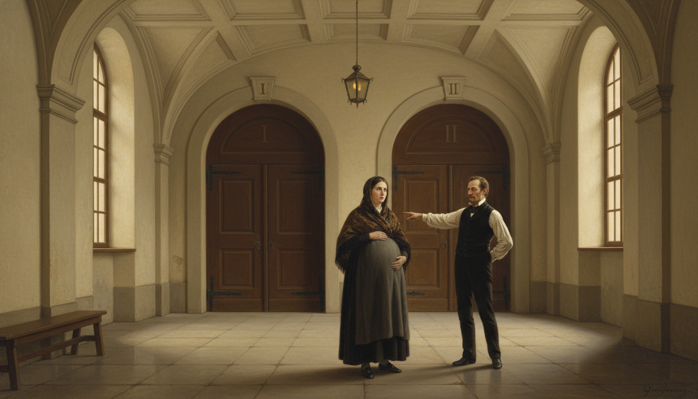

Image Prompt

I am about to ask you to generate a series of images for a graphic novel. Please make the images have a consistent style and consistent characters. Do not ask any clarifying questions. Just generate the image immediately when asked.

Please generate a 16:9 image in Biedermeier-era Central European painting style (1840s Vienna) depicting panel 1 of 12. The scene shows the grand stone entrance hall of the Vienna General Hospital in 1847, with two large arched wooden doors side by side. A pregnant woman in a simple dark dress and shawl stands in the foreground, hesitating between the two doors, one hand on her belly. A hospital clerk in a dark waistcoat points her toward the left door. Above each door is a small Roman numeral — "I" and "II" — carved in the stone. The color palette is muted creams, warm browns, deep burgundy, and pale candlelight gold. The emotional tone is ominous and uncertain, as if a life hangs on a coin flip. Include: tall arched windows with soft morning light, worn stone floor tiles, a dim oil lamp hanging from the ceiling, a wooden bench along the wall, period-accurate 1840s clothing, and a sense of fated gravity. Generate the image immediately without asking clarifying questions.

When a pregnant woman arrived at the Vienna General Hospital in 1847, the clerk assigned her to one of two maternity clinics based purely on the day of the week. The First Clinic was staffed by doctors and medical students. The Second Clinic was staffed by midwives. The women knew what the doctors did not yet admit — in the First Clinic, you might not come home.

## Panel 2: The Young Doctor from Hungary

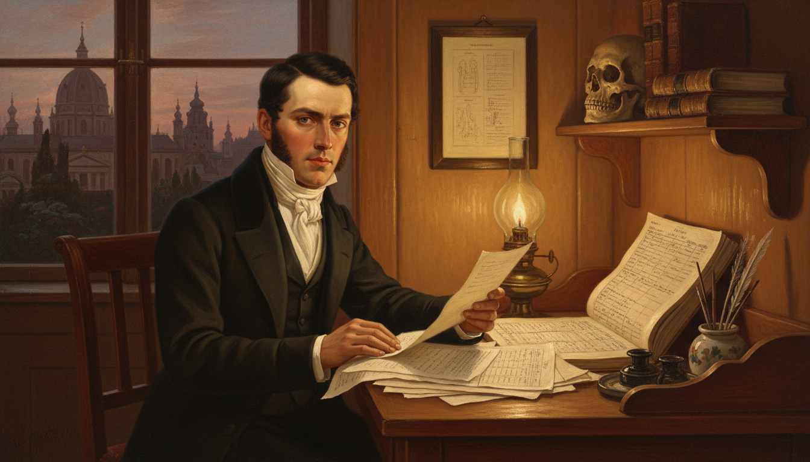

Image Prompt

Please generate a 16:9 image in Biedermeier-era Central European painting style depicting panel 2 of 12. Make the characters and style consistent with the prior panel. The scene shows Ignaz Semmelweis as a young man of 28: dark hair, sideburns, serious expression, wearing a dark frock coat, white shirt, and cravat. He stands at a desk in a small wood-paneled office of the Vienna General Hospital in 1846, reviewing a stack of medical papers by candlelight. Behind him through a tall window, the domes and spires of Vienna are visible at dusk. Set in Vienna, 1846. Color palette: warm candlelight gold, dark wood browns, deep burgundy, cream paper. The emotional tone is studious, ambitious, and earnest. Include: a brass oil lamp on the desk, an open medical ledger with handwritten columns, a human skull used as a teaching specimen on a shelf, period 1840s books bound in leather, quill pens in an inkwell, and a framed anatomical diagram on the wall. Generate the image immediately without asking clarifying questions.

Dr. Ignaz Semmelweis had arrived in Vienna from Hungary to study medicine. Brilliant, stubborn, and deeply troubled by suffering, he had just been appointed to the First Clinic as a junior assistant. His job was to help deliver babies safely — but in his first month alone, he watched too many mothers die of the same strange, violent fever.

## Panel 3: Childbed Fever

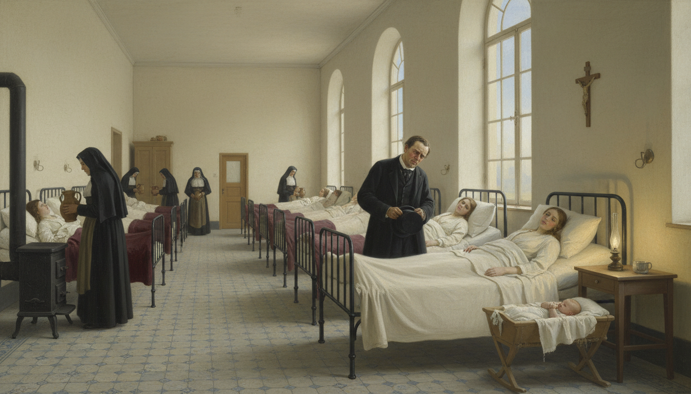

Image Prompt

Please generate a 16:9 image in Biedermeier-era Central European painting style depicting panel 3 of 12. Make the characters and style consistent with the prior panel. The scene shows a large 1840s hospital maternity ward with rows of iron bedsteads along stone walls. Several women lie under thin white sheets, pale and feverish. Nuns in dark habits move between the beds carrying pitchers of water. Dr. Semmelweis stands at the foot of one bed, hat in hand, face stricken as he looks down at a young mother. Set in Vienna General Hospital, First Clinic, 1846. Color palette: pale cream walls, muted whites, candlelight gold, deep burgundy blankets, the cold blue of early morning light through tall arched windows. The emotional tone is sorrowful and helpless. Include: a wooden crucifix on the wall, a small iron stove in the corner, a single flickering oil lamp, a newborn in a simple wooden cradle, patterned tiled floor, and the sense of a quiet tragedy unfolding. Generate the image immediately without asking clarifying questions.

The disease had a name — puerperal fever, or "childbed fever" — but no one knew its cause. Victims developed chills, fever, abdominal pain, and died within days. In the First Clinic, it killed as many as one mother in six. In the Second Clinic, staffed only by midwives, it killed fewer than one in twenty-five. The women's whispered rumors were right, and no doctor could explain why.

## Panel 4: The Obsession Begins

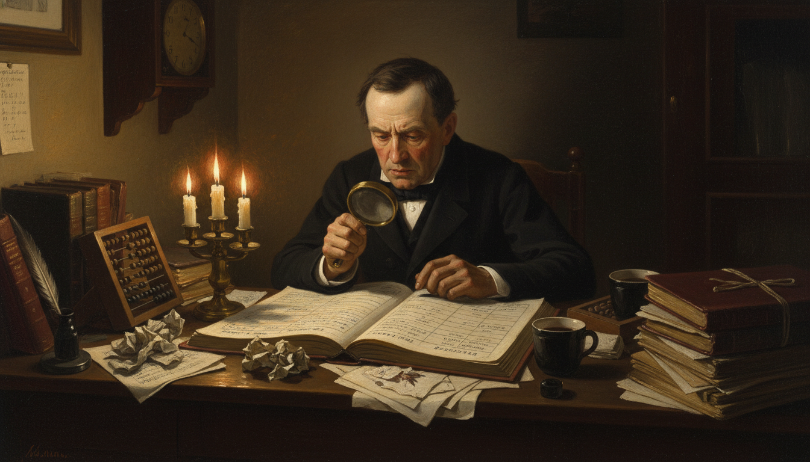

Image Prompt

Please generate a 16:9 image in Biedermeier-era Central European painting style depicting panel 4 of 12. Make the characters and style consistent with the prior panel. The scene shows Dr. Semmelweis alone at night in his small office at the Vienna General Hospital, hunched over a large ledger filled with rows of handwritten numbers. Candles have burned low; crumpled papers are scattered across the desk. He is comparing two columns — death counts from the First and Second Clinics — with a brass magnifying glass. Set in Vienna, late 1846. Color palette: deep shadows, warm candlelight gold, cream paper, dark wood, burgundy leather. The emotional tone is obsessive, exhausted, and determined. Include: multiple guttering candles, a half-empty coffee cup, an abacus, an ink-stained quill, stacks of autopsy reports tied with string, a clock showing 2:00 a.m., and shadows that swallow the corners of the room. Generate the image immediately without asking clarifying questions.

Semmelweis could not sleep. He filled ledger after ledger with death counts, comparing the two clinics month by month. The numbers were undeniable. Whatever was killing these mothers, it was something the doctors were doing and the midwives were not. But what?

## Panel 5: The Death of a Friend

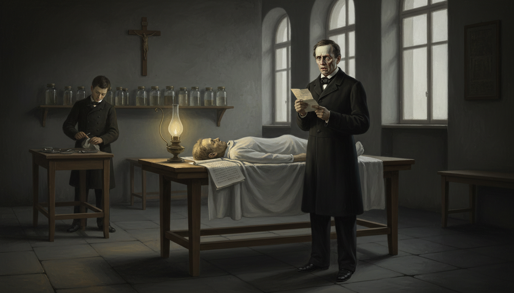

Image Prompt

Please generate a 16:9 image in Biedermeier-era Central European painting style depicting panel 5 of 12. Make the characters and style consistent with the prior panel. The scene shows a dimly lit 1840s autopsy room with a single wooden table. Semmelweis stands beside the table, reading a handwritten letter, his face pale with grief. On the table under a white sheet is the covered body of his colleague and mentor, Jakob Kolletschka. A pathology student in the background wipes a scalpel with a cloth. Set in Vienna, March 1847. Color palette: cold grays, muted creams, deep shadow, a single warm oil lamp casting yellow light on Semmelweis's face. The emotional tone is shock and dawning realization. Include: a row of glass specimen jars on a shelf, an autopsy report on the table, tall arched windows with cold pale light, a wooden cross on the wall, dark stone floor tiles, and a hushed reverent atmosphere. Do not show any blood, wounds, or graphic injury — keep the scene respectful and somber. Generate the image immediately without asking clarifying questions.

In March 1847, Semmelweis returned from a trip to terrible news. His friend and professor Jakob Kolletschka had died — of the exact same fever that killed the mothers. Kolletschka had cut his finger during an autopsy. Semmelweis read the report and felt the world shift. A man, not pregnant, not a mother, had died of "childbed fever." The only thing connecting him to the mothers was the autopsy room.

## Panel 6: Key Insight — Cadaverous Particles

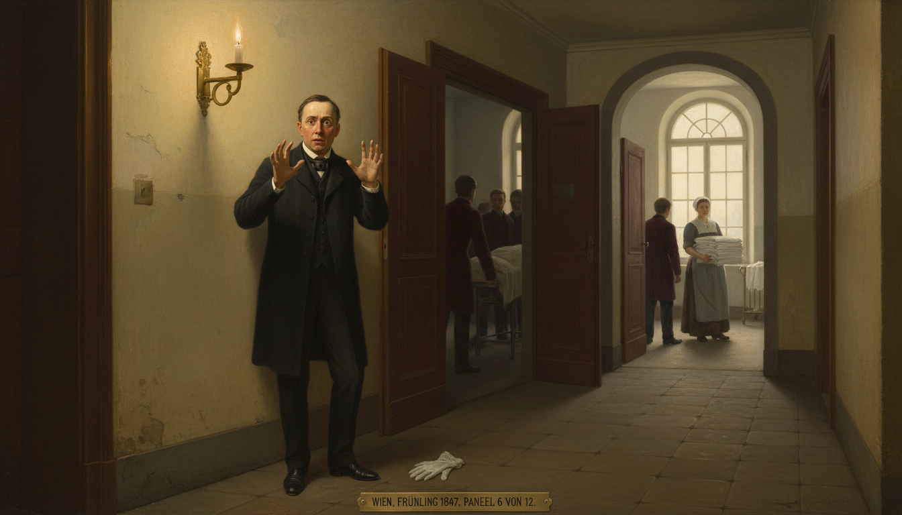

Image Prompt

Please generate a 16:9 image in Biedermeier-era Central European painting style depicting panel 6 of 12. Make the characters and style consistent with the prior panel. The scene shows Semmelweis standing in a corridor of the Vienna General Hospital, frozen mid-step, staring down at his own hands. Through an open door behind him, medical students in dark coats emerge from an autopsy room; through another door ahead of him, a midwife carries fresh linen into the maternity ward. Set in Vienna, spring 1847. Color palette: warm candlelight gold, cream walls, deep burgundy, muted shadow. The emotional tone is a lightning-strike moment of realization — horror, clarity, and dread all at once. Include: a lit brass sconce on the wall, an arched window showing pale morning light, worn stone tiles, the silhouettes of medical students in the background, a single fallen glove on the floor, and Semmelweis's wide eyes fixed on his own palms. Generate the image immediately without asking clarifying questions.

Doctors and medical students in Vienna started each morning dissecting corpses in the autopsy room. Then they walked, unwashed, straight to the maternity ward to examine laboring mothers. The midwives in the Second Clinic never touched the dead. Semmelweis named the unknown agent "cadaverous particles" — something invisible, carried on hands, transferred from the dead to the living. Germs would not be discovered for another twenty years, but Semmelweis had found their shadow.

!!! mascot-thinking "Key Insight"
    
    Semmelweis did not need to see germs to know something was being transmitted. He reasoned from a pattern in the numbers and a single anomalous death. This is the heart of scientific inference — you can know *that* something is true long before you can explain *why* it is true. But how do we know when a pattern is real, and not just a coincidence?

## Panel 7: The Chlorinated Lime Basin

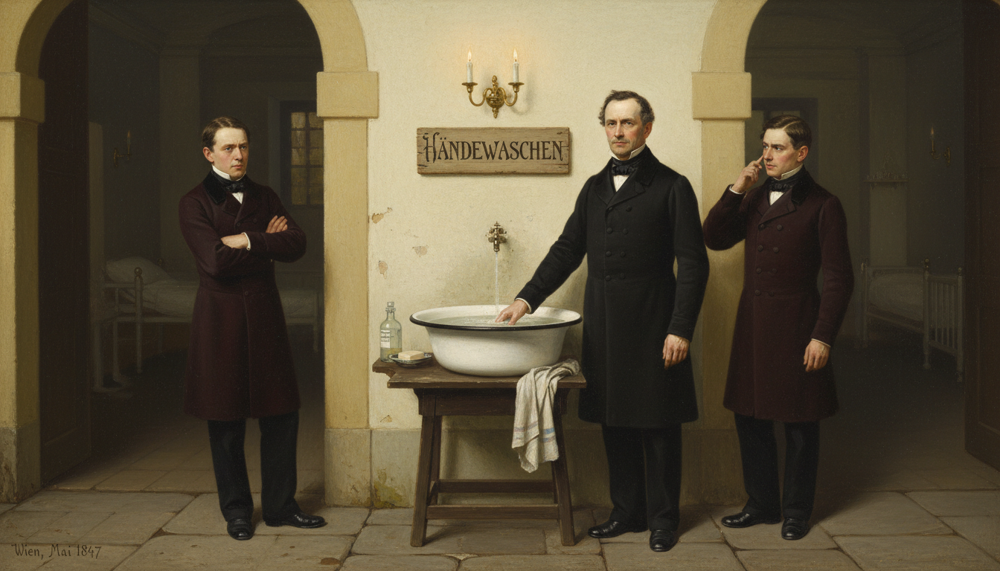

Image Prompt

Please generate a 16:9 image in Biedermeier-era Central European painting style depicting panel 7 of 12. Make the characters and style consistent with the prior panel. The scene shows Semmelweis standing beside a large white ceramic basin full of cloudy chlorinated lime solution, positioned on a wooden stand just outside the entrance to the maternity ward. He is demonstrating hand-washing to two skeptical medical students in dark frock coats. Above the basin, a hand-written sign is nailed to the wall with the German word "HÄNDEWASCHEN" (hand-washing) in careful script. Set in Vienna General Hospital, May 1847. Color palette: warm candlelight gold, cream walls, deep burgundy, cold white porcelain. The emotional tone is firm, instructive, and slightly confrontational. Include: a linen hand towel draped over the stand, a bar of soap in a small dish, a glass bottle of chloride solution, the arched doorway to the maternity ward visible behind them, a brass sconce lit on the wall, and the folded arms of one skeptical student. Generate the image immediately without asking clarifying questions.

In May 1847, Semmelweis did something revolutionary. He placed a basin of chlorinated lime solution outside the maternity ward and ordered every doctor and student to scrub their hands before entering. The chloride smelled sharp and bleached the skin. Most of his colleagues resented it — they were gentlemen, after all, and gentlemen's hands were clean.

## Panel 8: The Numbers Plummet

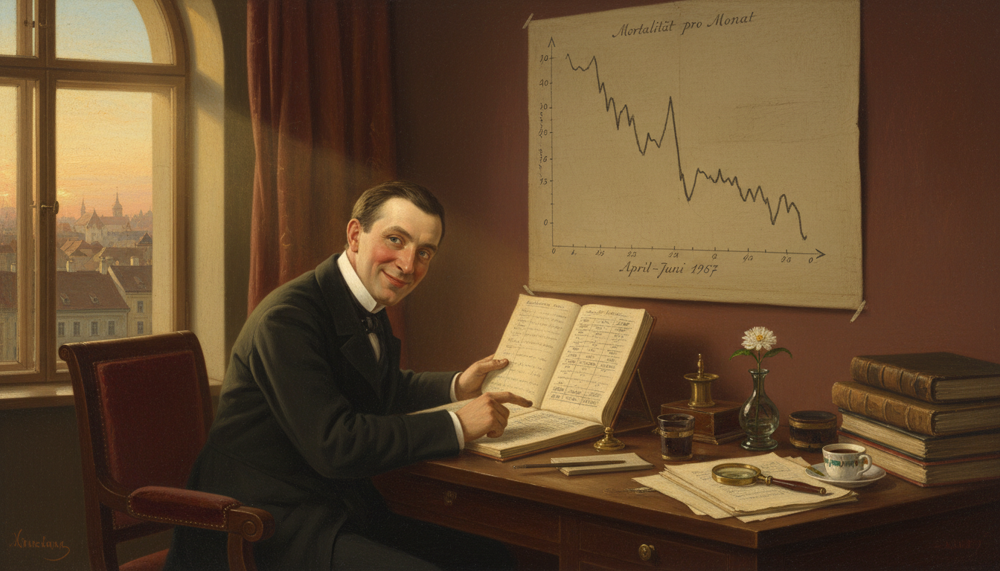

Image Prompt

Please generate a 16:9 image in Biedermeier-era Central European painting style depicting panel 8 of 12. Make the characters and style consistent with the prior panel. The scene shows Semmelweis at his desk in the early morning, triumphantly tracing a finger down a ledger column. A large hand-drawn graph on the wall beside him shows a jagged monthly death rate dropping steeply from a high peak to nearly zero between April and June 1847. A shaft of golden sunrise light streams through a tall arched window onto the ledger. Set in Vienna, summer 1847. Color palette: warm golds, cream paper, deep burgundy, dawn blue. The emotional tone is vindication, hope, and quiet amazement. Include: an open window with a view of Vienna rooftops at sunrise, scattered coffee cups, ink-stained fingers, a brass magnifying glass, multiple ledgers stacked on the desk, a small vase with a single flower, and Semmelweis's first genuine smile of the story. Generate the image immediately without asking clarifying questions.

The effect was almost miraculous. Within one month, the death rate in the First Clinic fell from 18% to 2%. Within a year, it was lower than the Second Clinic's. Thousands of mothers who would have died were going home with their babies. Semmelweis's ledgers showed a clear, undeniable result: hand-washing saved lives.

## Panel 9: The Medical Establishment Fights Back

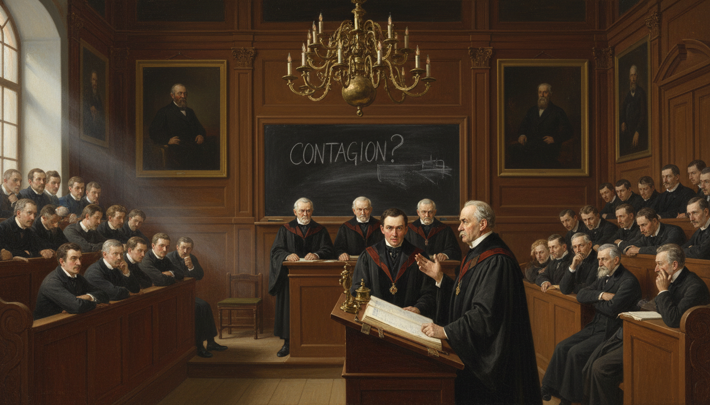

Image Prompt

Please generate a 16:9 image in Biedermeier-era Central European painting style depicting panel 9 of 12. Make the characters and style consistent with the prior panel. The scene shows a large wood-paneled lecture hall at the Vienna medical faculty. On a raised dais at the front, three older male professors in dark academic robes glare down at Semmelweis, who stands at a podium with his ledger open, one hand raised mid-argument. The audience of medical students and faculty is divided — some leaning forward, some crossing their arms in dismissal. Set in Vienna, 1849. Color palette: deep mahogany browns, dark burgundy, candlelight gold, cold shafts of daylight. The emotional tone is hostile, tense, and confrontational. Include: tiered wooden bench seating, a large blackboard with the word "CONTAGION?" partly erased, oil portraits of bearded professors on the wall, a brass inkstand, a heavy chandelier, tall arched windows, and the frowning faces of the three senior professors. Generate the image immediately without asking clarifying questions.

Instead of celebration, Semmelweis faced a wall of resistance. Senior doctors were insulted. His theory implied that *they* had been killing their own patients for years — an unbearable accusation. Without germ theory to explain *why* the chloride worked, the establishment dismissed his results as coincidence. In 1849, his contract was not renewed, and he was forced out of Vienna.

!!! mascot-warning "Watch Out!"
    
    This is a classic example of what psychologists now call the **Semmelweis reflex** — the reflexive rejection of new evidence that contradicts established beliefs, especially when accepting the evidence would require admitting a painful mistake. Watch for it in yourself. When a finding makes you angry before you examine it, pause and ask: am I resisting the data, or resisting the feeling?

## Panel 10: Exile and the Open Letters

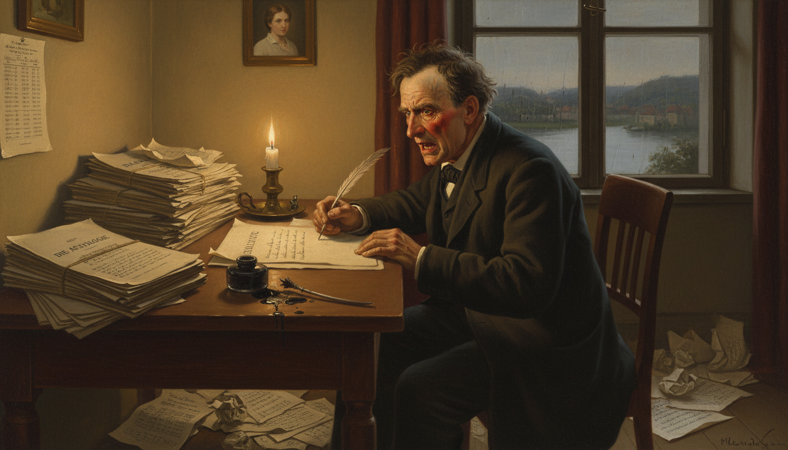

Image Prompt

Please generate a 16:9 image in Biedermeier-era Central European painting style depicting panel 10 of 12. Make the characters and style consistent with the prior panel. The scene shows Semmelweis, now noticeably older and more haggard, sitting at a writing desk in a modest study in Budapest. He is furiously writing an open letter, his face flushed with anger and despair. Crumpled drafts litter the floor around him. Through the window, a view of the Danube and the Buda hills is visible. Set in Budapest, Hungary, around 1861. Color palette: darker browns, muted cream, deep burgundy, evening candlelight. The emotional tone is angry, desperate, and lonely. Include: a large stack of printed pamphlets titled "DIE AETIOLOGIE", a quill snapped in half, an overturned ink bottle, a single candle burning low, a portrait of his young wife on the wall, loose sheets of mathematical tables, and rain on the windowpane. Generate the image immediately without asking clarifying questions.

Semmelweis returned to Hungary, where he finally married and continued his work at a Budapest hospital. In 1861 he published his great book, *The Etiology, Concept, and Prophylaxis of Childbed Fever*. When the European medical community still ignored him, he wrote furious open letters, calling his critics "murderers." The attacks cost him friends, sleep, and eventually his grip on reality.

## Panel 11: Vindication After Death

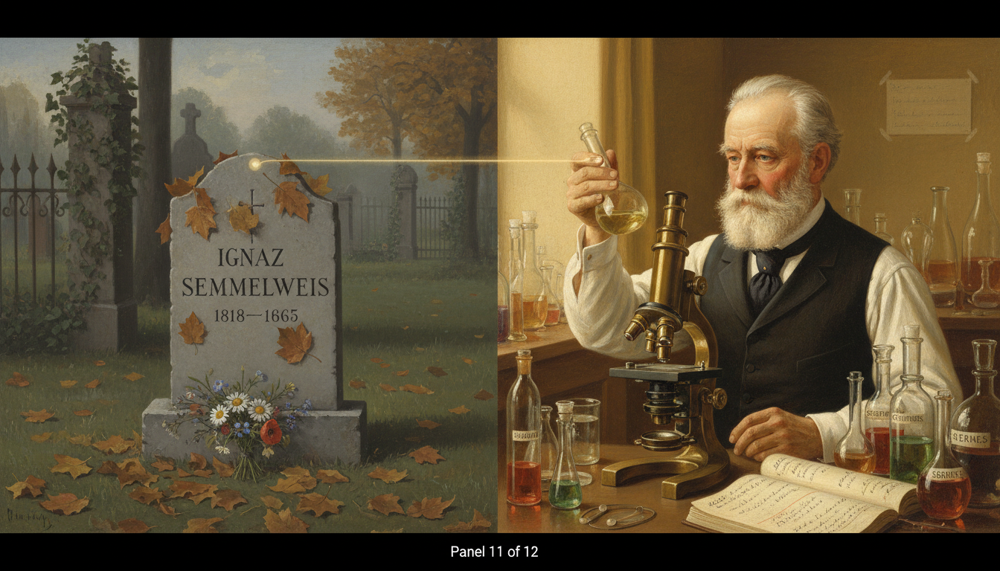

Image Prompt

Please generate a 16:9 image in Biedermeier-era Central European painting style depicting panel 11 of 12. Make the characters and style consistent with the prior panel. The scene is a split composition: on the left, a small simple gravestone in a quiet Hungarian cemetery inscribed "IGNAZ SEMMELWEIS 1818–1865"; on the right, about twenty years later, Louis Pasteur in a Parisian laboratory (1880s) holding up a glass flask and looking into a microscope. A thin beam of light connects the two halves of the image. Set in Europe, spanning 1865 to the 1880s. Color palette: soft melancholy grays and greens on the left, warm laboratory golds and scientific whites on the right. The emotional tone is bittersweet — sorrow and eventual justice. Include: autumn leaves on the grave, a small bouquet of wildflowers, Pasteur in a dark waistcoat and high collar, glass flasks labeled in French, a brass microscope, handwritten notes reading "GERMES", ivy climbing an iron fence, and soft connecting rays of light. Generate the image immediately without asking clarifying questions.

Semmelweis died in 1865 at the age of 47, alone in an asylum, just weeks after being committed. He never knew he was right. Within twenty years, Louis Pasteur and Robert Koch proved germ theory beyond doubt. Joseph Lister introduced antiseptic surgery citing Semmelweis's work. The chloride basins returned — this time with the full weight of science behind them.

## Panel 12: The Handwashing Sign Today

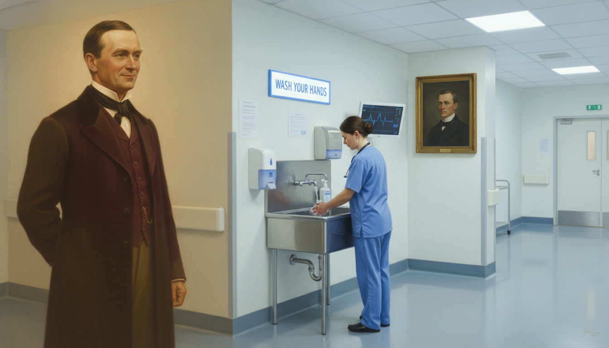

Image Prompt

Please generate a 16:9 image in Biedermeier-era Central European painting style depicting panel 12 of 12, but with a subtle modern twist. Make the characters and style consistent with the prior panels. The scene shows a ghostly, translucent image of Dr. Semmelweis standing in the corner of a modern hospital corridor, watching a present-day doctor in scrubs carefully washing her hands at a stainless-steel sink beneath a modern "WASH YOUR HANDS" sign. The lighting blends nineteenth-century warm candlelight around Semmelweis's figure with cool fluorescent white light on the modern scene. Color palette: warm golds and burgundy on Semmelweis's side, cool whites and pale blues on the hospital side. The emotional tone is peaceful vindication and gentle awe. Include: a modern hand-sanitizer dispenser, a digital monitor, the modern doctor's stethoscope, a framed historical portrait of Semmelweis on the wall, the ghost's slight smile, a clipboard, and a sense of two centuries quietly meeting. Generate the image immediately without asking clarifying questions.

Every time a nurse, a surgeon, or a parent washes their hands before touching a newborn, they are practicing Semmelweis's discovery. The sign above every hospital sink in the world is his monument. He asked one question — *what are the doctors doing differently?* — and the answer saved more lives than almost any other single insight in the history of medicine.

### Epilogue – What Made Semmelweis Different?

Semmelweis was not the first doctor to notice that mothers were dying. He was the first to *count*. He treated the hospital ward as a laboratory, compared two conditions, traced an anomaly, and acted on the evidence even though he could not yet explain the mechanism. That is the core of empirical science — and the core of TOK. His tragedy is that correct knowledge is not the same thing as accepted knowledge, and that the path from one to the other runs through the egos, identities, and institutions of human beings.

| Challenge | How Semmelweis Responded | Lesson for Today |
|-----------|---------------------------|------------------|
| An unexplained pattern of deaths | He counted, compared, and documented | When something seems wrong, measure it |
| A missing causal mechanism | He acted on the correlation anyway and tested an intervention | You can be right about *what* before you know *why* |
| Hostile senior authorities | He kept publishing his data and refused to soften it | Evidence is not invalidated by who dislikes it |
| His findings implied colleagues were at fault | He accepted the social cost of telling the truth | Uncomfortable truths are still truths |

### Call to Action

The next time someone tells you that something is "obviously true" or "obviously impossible," ask what the numbers actually say. Semmelweis's ledgers are proof that a careful observer with a notebook can overturn a thousand years of tradition. You don't need a laboratory. You need a question, a way to count, and the courage to follow the evidence wherever it leads.

---

*"When I look back upon the past, I can only dispel the sadness which falls upon me by gazing into that happy future when the infection will be banished."*
—Ignaz Semmelweis

*"The teaching of this doctrine is not sufficient. Doctors must be made to believe it."*
—Ignaz Semmelweis

---

## References

1. [Wikipedia: Ignaz Semmelweis](https://en.wikipedia.org/wiki/Ignaz_Semmelweis) - Biography of the Hungarian physician who discovered the importance of hand disinfection
2. [Wikipedia: Puerperal fever](https://en.wikipedia.org/wiki/Puerperal_fever) - The childbed fever that Semmelweis traced and prevented
3. [Wikipedia: Semmelweis reflex](https://en.wikipedia.org/wiki/Semmelweis_reflex) - The cognitive bias named after him — reflexive rejection of evidence that contradicts established beliefs
4. [Encyclopaedia Britannica: Ignaz Semmelweis](https://www.britannica.com/biography/Ignaz-Semmelweis) - Curated overview of his life, discovery, and legacy
5. [U.S. National Library of Medicine: Ignaz Semmelweis and the Birth of Infection Control](https://www.ncbi.nlm.nih.gov/pmc/articles/PMC1743774/) - Peer-reviewed historical review of Semmelweis's methods and reception
