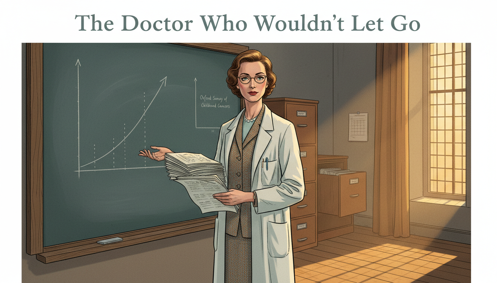

# Stories of Truth-Seekers and Myth-Breakers

> *"But how do we know?"* — Sofia the Owl

This collection of illustrated short stories introduces the real people behind some of the most important moments in the history of knowledge. Each story is a 12-panel graphic novel that dramatizes a moment when one person's careful thinking, patient evidence-gathering, or sheer intellectual courage changed how humanity tells truth from fiction.

These are not just biographies. They are case studies in epistemology — in how real knowledge is built, how misinformation is built, and how rigorous evidence can defeat a well-funded lie.

- **[Andreas Vesalius — The Forbidden Bodies](andreas-vesalius/index.md)**

    
    For a thousand years, European doctors memorized a Roman physician's errors as sacred truth — because he had never been allowed to dissect a human body. In 1543, a young Belgian anatomist decided to look for himself, and published illustrations so accurate they overturned a millennium of dogma.

- **[Galileo Galilei — The Moons of Jupiter](galileo-galilei/index.md)**

    
    In 1610, Galileo pointed a homemade telescope at Jupiter and saw four tiny moons — proof that not everything revolved around the Earth. A devout Catholic who never wanted a fight with Rome, he published his findings in Italian so ordinary people could read them. The Inquisition put him on trial.

- **[Mary Anning — The Dragons in the Cliffs](mary-anning/index.md)**

    
    A poor girl from Lyme Regis who never went to school taught herself anatomy and geology, then pulled monsters from the cliffs that proved extinction was real and the Earth was vastly older than anyone believed. Male scientists bought her fossils, published papers, and rarely credited her.

- **[Charles Darwin — The Finches' Beaks](charles-darwin/index.md)**

    
    Darwin sailed home from the Galápagos with notebooks full of observations that troubled him deeply. The finches had different beaks on different islands. The evidence pointed somewhere he knew would horrify Victorian society. He sat on his theory for twenty years — then published the most important book in the history of biology.

- **[Ignaz Semmelweis — The Doctor Who Counted the Dead](ignaz-semmelweis/index.md)**

    
    Vienna, 1847. A young Hungarian doctor notices that mothers in one maternity ward are dying at six times the rate of those in another. Without germ theory to guide him, Semmelweis counts, compares, and uncovers an invisible killer — then pays a terrible personal price for being right too early.

- **[Ida B. Wells — The Woman Who Counted](ida-b-wells/index.md)**

    
    Memphis, 1892. After three of her friends are lynched, journalist Ida B. Wells does something radical — she counts. Armed with a notebook and the lynchers' own newspapers, she builds the dataset that shatters the myth used to justify lynching, and in the process invents what we now call data journalism.

- **[Alice Stewart — The Doctor Who Wouldn't Let Go](alice-stewart/index.md)**

    
    In 1956, a British epidemiologist published evidence that a single prenatal X-ray doubled a child's risk of cancer. The medical establishment rejected her finding for twenty-five years. Stewart kept refining her statistics, answered every objection, and outlasted the consensus.

- **[Hannah Arendt — The Truth in the Courtroom](hannah-arendt/index.md)**

    
    A philosopher traveled to Jerusalem to cover the trial of a man who helped orchestrate the Holocaust. She expected to see a monster. Instead she saw a mediocre bureaucrat who had stopped thinking — and coined a phrase that shook the world: the banality of evil.

- **[Hedy Lamarr — The Inventor Behind the Face](hedy-lamarr/index.md)**

    
    Hollywood saw only her face. What it missed was her mind. During World War II, Hedy Lamarr co-invented a frequency-hopping system that the Navy ignored because she was an actress. Decades later, her patent became the foundation of Wi-Fi, Bluetooth, and GPS.

- **[Maurice Hilleman — The Vaccine Detective](maurice-hilleman/index.md)**

    
    You have probably never heard of Maurice Hilleman, but he may have saved your life. This gruff microbiologist developed over forty vaccines — and was one of the first scientists to trace the fraud behind a paper that falsely linked vaccines to autism.

- **[Carl Sagan — The Baloney Detection Kit](carl-sagan/index.md)**

    
    A five-year-old boy from Brooklyn visited the World's Fair and fell in love with the universe. Decades later, racing a fatal illness, he wrote a book giving ordinary citizens the tools to tell real science from nonsense. His Baloney Detection Kit remains one of the most powerful thinking tools ever published.

- **[Marie Colvin — Because Someone Has to Be There](marie-colvin/index.md)**

    
    Some lies can only be broken by someone who was there. War correspondent Marie Colvin lost an eye in Sri Lanka and kept going. Her final broadcast from besieged Homs described civilians the Syrian regime insisted were terrorists. She was killed twelve hours later.

- **[Katalin Karikó — The Rejected Idea](katalin-kariko/index.md)**

    
    For forty years, a Hungarian biochemist believed messenger RNA could be used to make vaccines. For forty years, almost no one else did. She was demoted, denied grants, and nearly deported. Then COVID-19 arrived, and her rejected idea saved millions of lives. In 2023, she won the Nobel Prize.

- **[Rachel Carson — The Woman Who Listened to Silent Spring](rachel-carson/index.md)**

    
    A quiet marine biologist takes on the most powerful chemical companies in America — armed only with meticulously footnoted evidence. Racing a fatal diagnosis, Rachel Carson shows how patient research and clear writing can defeat a well-funded disinformation campaign.

## How to Read These Stories

Each story follows the same structure: a brief prologue setting up the historical moment, twelve illustrated panels with narrative captions, an epilogue that draws out the lessons for modern readers, and a few memorable quotes from the subject. Every panel is built around a question that Sofia the Owl might ask: *How did they know? How did they prove it? Why were they believed?*

As you read, try to notice the patterns. Truth-seekers across centuries share surprising habits — they check their sources, they publish their reasoning, they listen carefully to critics, and they are willing to pay a personal cost for the right to say what the evidence actually shows.
