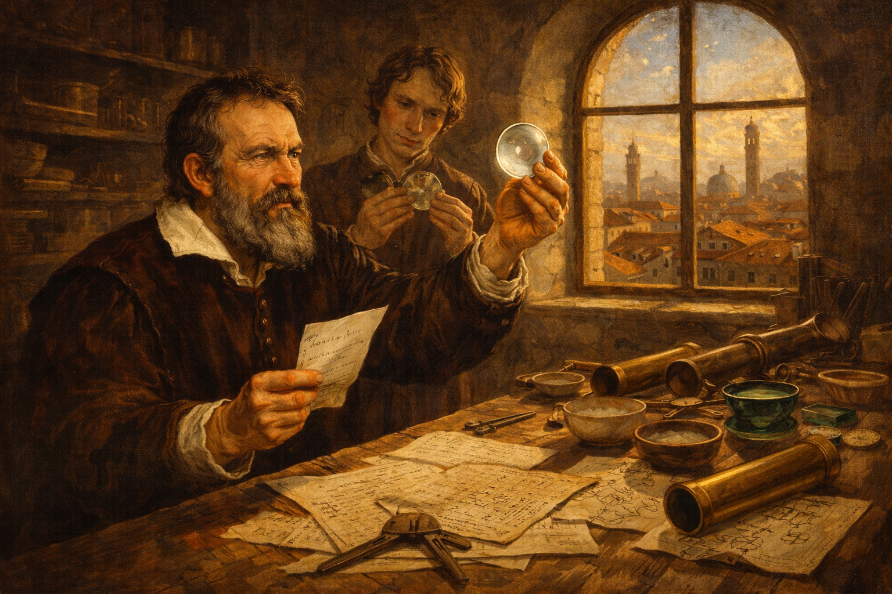
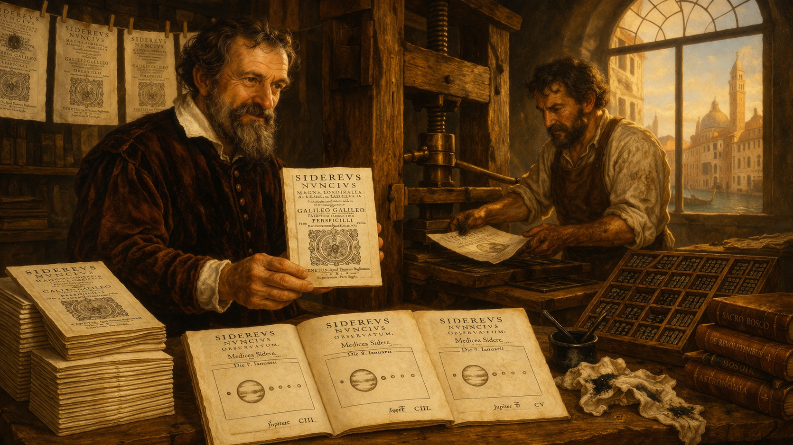
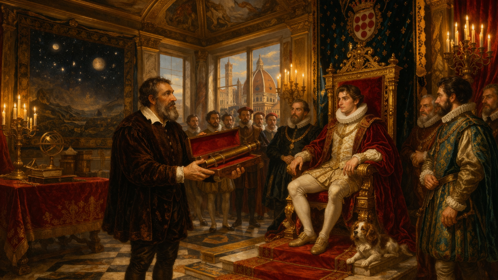
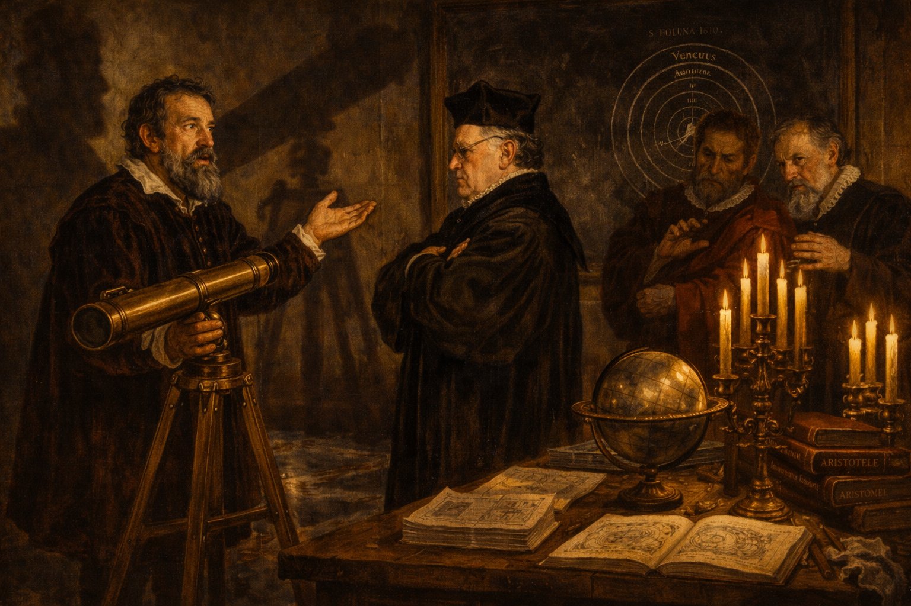
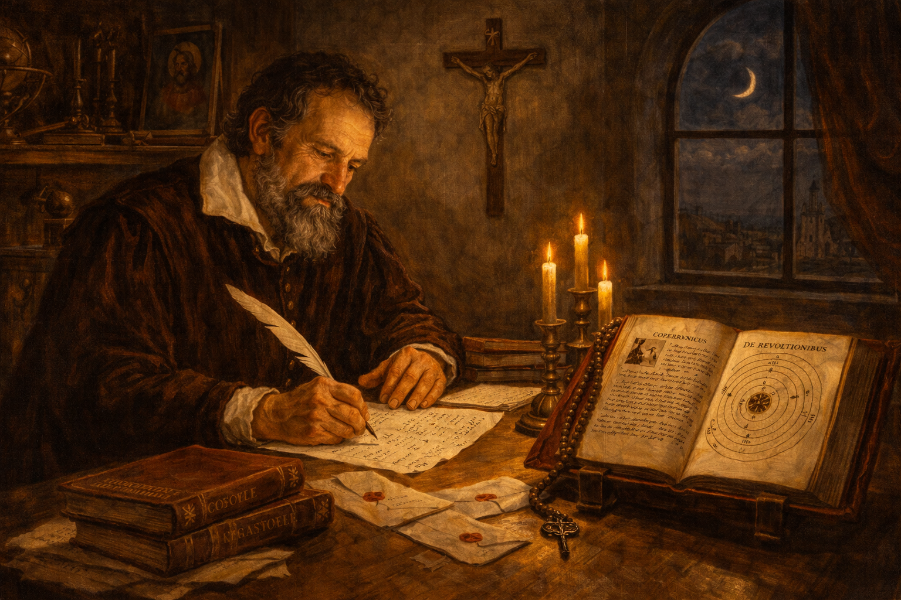
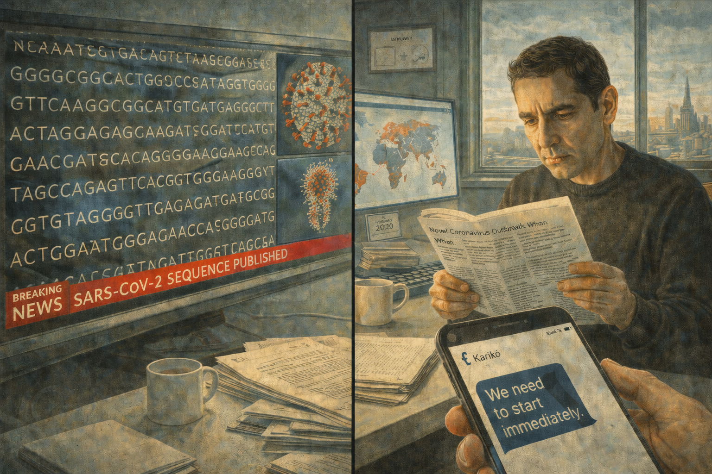
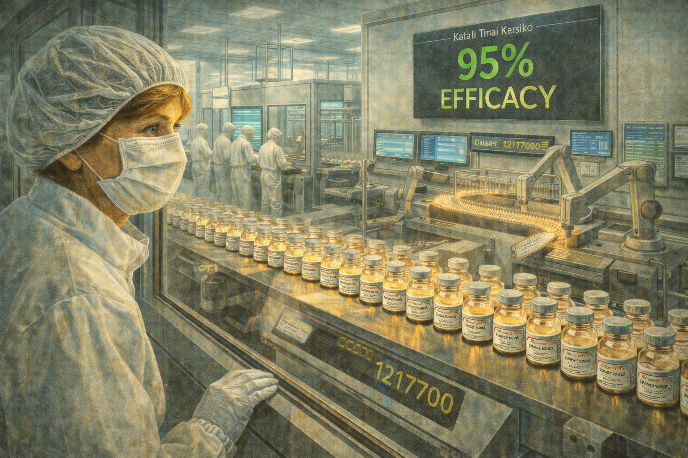
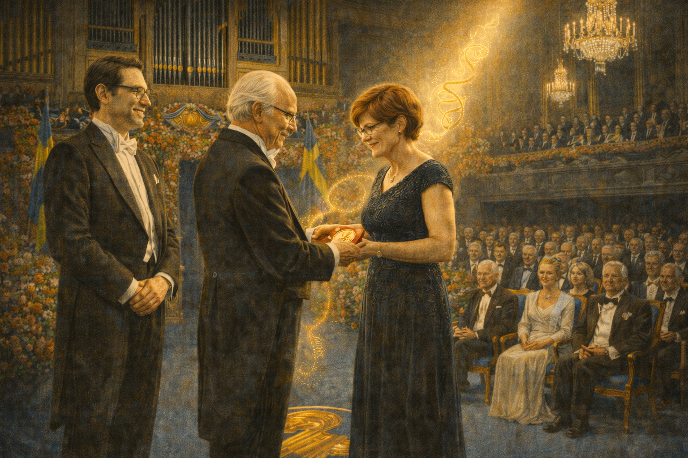

# The Rejected Idea — Katalin Karikó and the mRNA Revolution

Cover Image Prompt

Please generate a wide-landscape 16:9 cover image in a contemporary photorealistic editorial illustration style, blending period elements from 1970s-80s Hungary with modern clean design. The scene shows Dr. Katalin Karikó, a determined Hungarian woman in her sixties with short light-brown hair and warm, resolute eyes, standing in a modern molecular biology laboratory. She holds a translucent vial of mRNA solution that glows with a faint golden light. Behind her, a double exposure effect layers two worlds: on the left, the muted gray apartment blocks and sunlit fields of 1970s Kisújszállás, Hungary; on the right, the gleaming glass and steel of a 2020s pharmaceutical manufacturing facility producing millions of vaccine doses. A strand of stylized mRNA curls through the composition like a ribbon connecting past and present. Include the title "THE REJECTED IDEA" rendered in a modern clean sans-serif typeface across the top. Color palette: warm amber and gold tones for the Hungarian past, cool scientific whites and teals for the laboratory present, with the mRNA strand in luminous gold. Emotional tone: quiet triumph after decades of persistence. Generate the image immediately without asking clarifying questions.

Narrative Prompt

This is the story of Katalin Karikó (born 1955), a Hungarian biochemist who spent four decades pursuing the idea that messenger RNA could be used to create medicines and vaccines. Despite repeated grant rejections, demotion at the University of Pennsylvania, and near-deportation from the United States, she persisted. Her breakthrough partnership with immunologist Drew Weissman solved the central problem — the body's immune system destroyed synthetic mRNA before it could work. Their discovery of nucleoside modification made mRNA therapeutics possible. When COVID-19 emerged in 2020, this long-rejected idea became the foundation of the Pfizer-BioNTech and Moderna vaccines, saving millions of lives within months. In 2023, Karikó and Weissman won the Nobel Prize in Physiology or Medicine. Central themes: scientific revolutions, the sociology of knowledge, persistence against consensus, the relationship between funding structures and scientific progress, and how rejected knowledge can transform the world. Visual style: contemporary photorealistic editorial illustration throughout all 12 panels, with period-accurate details for 1970s-80s Hungary (Soviet-era architecture, modest laboratories) transitioning to modern clean scientific environments. Karikó is the recurring character — always recognizable with her short light-brown hair, determined expression, and quiet intensity. Color palette stays consistent: warm amber and gold for the Hungarian past, cool teals and whites for the American present, luminous gold for mRNA imagery.

### Prologue – The Idea Nobody Wanted

For forty years, Katalin Karikó believed that a molecule called messenger RNA could revolutionize medicine. For forty years, almost no one agreed. She was denied funding, stripped of her faculty position, and pushed to the margins of science. She kept working anyway — in borrowed lab space, on shoestring budgets, with an idea the scientific establishment considered a dead end. Then a global pandemic arrived, and her rejected idea saved the world.

## Panel 1: A Girl in the Hungarian Plains

Image Prompt

I am about to ask you to generate a series of images for a graphic novel. Please make the images have a consistent style and consistent characters. Do not ask any clarifying questions. Just generate the image immediately when asked.

Please generate a 16:9 image in contemporary photorealistic editorial illustration style with 1970s Hungarian period elements, depicting panel 1 of 12. The scene shows the small town of Kisújszállás in the Hungarian Great Plain, around 1970. A teenage girl with light-brown hair pulled back — young Katalin Karikó, about 15 years old — sits at a rough wooden table in a modest adobe-walled home with no running water, reading a biology textbook by lamplight. Her father, a butcher in a simple work shirt, stands in the doorway wiping his hands on an apron. Through the small window, flat golden fields stretch to the horizon under a wide Hungarian sky. The room is spare but warm: embroidered curtains, a ceramic stove, a shelf of well-worn books. Color palette: warm amber, golden wheat tones, muted earth browns, soft lamplight. The emotional tone is quiet ambition — a girl dreaming beyond her circumstances. Include: a small radio on a shelf, a hand-drawn diagram of a cell in the margin of her notebook, a simple oil lamp, period-accurate 1970s Hungarian clothing, and the sense of vast open sky outside the window. Generate the image immediately without asking clarifying questions.

Katalin Karikó grew up in Kisújszállás, a small town on the Hungarian Great Plain. Her family had no running water, no television, and no refrigerator. Her father was a butcher. But she had curiosity that could not be contained. In school, she excelled at biology and became fascinated by the molecular machinery of life — especially the fleeting molecule called messenger RNA, the cell's instruction carrier, built for a single reading and then destroyed.

## Panel 2: The Young Scientist in Szeged

Image Prompt

Please generate a 16:9 image in contemporary photorealistic editorial illustration style with 1980s Hungarian period elements, depicting panel 2 of 12. Make the characters and style consistent with the prior panel. The scene shows Katalin Karikó in her late twenties, now a postdoctoral researcher at the Biological Research Centre in Szeged, Hungary, around 1983. She stands at a cluttered laboratory bench pipetting a solution into a row of test tubes. The lab is modestly equipped — Soviet-era instruments, a bulky centrifuge, hand-labeled glass bottles of reagents. A poster on the wall shows the central dogma of molecular biology: DNA to RNA to protein. Through tall windows, the Art Nouveau architecture of Szeged is visible. Color palette: muted institutional greens and grays of a 1980s Eastern European laboratory, warm amber light from the windows, the bright blue of a lab coat. The emotional tone is energetic, focused, and hopeful. Include: a notebook filled with dense handwritten data, a rack of Eppendorf tubes, a boxy 1980s microscope, a calendar showing 1983, photocopied journal articles pinned to a corkboard, and the quiet intensity of early-career passion. Generate the image immediately without asking clarifying questions.

At the University of Szeged, Karikó earned her PhD studying RNA biology. She was captivated by a radical idea: what if you could design synthetic messenger RNA and inject it into the body, instructing cells to make their own therapeutic proteins? It would be like sending a temporary software update to living cells. The idea was elegant. It was also, in 1985, considered almost impossible. And then her funding ran out.

## Panel 3: Leaving Hungary with Everything in a Teddy Bear

Image Prompt

Please generate a 16:9 image in contemporary photorealistic editorial illustration style with 1980s period elements, depicting panel 3 of 12. Make the characters and style consistent with the prior panel. The scene shows a 1985 departure at Budapest Ferihegy Airport. Katalin Karikó, age 30, wearing a practical wool coat, stands with her husband and their two-year-old daughter Susan in the crowded terminal. She clutches a passport and plane tickets in one hand. At their feet is a single suitcase and a brown teddy bear with a visible seam along its back — inside which is sewn 1,200 British pounds, their entire savings converted to cash because Hungarian law forbade taking money out of the country. Through the large terminal windows, a MALÉV Hungarian Airlines plane waits on the tarmac. Color palette: muted grays and institutional beiges of an 1980s Eastern Bloc airport, warm amber tones on the family, cold fluorescent overhead lighting. The emotional tone is anxious courage — leaving everything known for an uncertain future. Include: a departure board showing "PHILADELPHIA" as a destination, travelers in 1980s clothing, a border guard in uniform checking documents in the background, the little girl reaching for the teddy bear, and the tension of a family betting everything on one idea. Generate the image immediately without asking clarifying questions.

When her university lab lost its funding in 1985, Karikó faced a choice: abandon mRNA research or leave Hungary. She and her husband sold their car, converted the money to 1,200 British pounds, and sewed the cash into their daughter Susan's teddy bear — because Hungarian law forbade citizens from taking more than a small sum out of the country. With a toddler, a stuffed bear full of hidden money, and an unshakeable belief in mRNA, they boarded a plane for Philadelphia.

## Panel 4: The Grant Rejection Pile

Image Prompt

Please generate a 16:9 image in contemporary photorealistic editorial illustration style depicting panel 4 of 12. Make the characters and style consistent with the prior panel. The scene shows Katalin Karikó in a small, cramped office at the University of Pennsylvania, around 1995. She sits at a desk stacked with manila folders stamped "NOT FUNDED" and "DECLINED" in red ink. A tall pile of grant rejection letters threatens to topple off the desk. She is reading the latest rejection, her jaw set, eyes steady — not defeated but steeled. The office is windowless and cluttered: a shared space with another researcher's materials encroaching. A single framed photo of her daughter and a small Hungarian flag pennant provide the only personal touches. Color palette: institutional beige walls, fluorescent lighting casting flat shadows, the red of rejection stamps, warm amber tones on Karikó herself. The emotional tone is stubborn persistence in the face of systemic dismissal. Include: a desktop computer with a 1990s CRT monitor, a printed email that reads "we regret to inform you," a coffee mug with a UPenn logo, a shelf of molecular biology textbooks, a whiteboard with mRNA diagrams, and the sense of a brilliant person working in a space that does not match her talent. Generate the image immediately without asking clarifying questions.

At the University of Pennsylvania, Karikó applied for grant after grant to fund mRNA research. Every major funding body rejected her. The proposals kept coming back stamped with the same verdict: mRNA therapeutics were impractical, unstable, and would never work in the human body. Synthetic mRNA triggered violent immune reactions that destroyed it before it could do anything useful. Reviewers saw a dead end. Karikó saw an unsolved problem.

## Panel 5: The Demotion

Image Prompt

Please generate a 16:9 image in contemporary photorealistic editorial illustration style depicting panel 5 of 12. Make the characters and style consistent with the prior panel. The scene shows a university department chair's office at the University of Pennsylvania, 1995. Behind a large mahogany desk sits a male administrator in a suit, hands folded, delivering difficult news. Across the desk, Katalin Karikó sits upright in a wooden chair, absorbing the blow — she is being told she will be demoted from the tenure track, losing her faculty position and prestige. Through the office window, the collegiate Gothic towers of Penn's campus are visible. On the administrator's desk, a formal letter with the university letterhead lies face-up. Color palette: dark wood tones, institutional greens, cold fluorescent light mixed with gray daylight from the window, warm amber on Karikó's face. The emotional tone is humiliation tempered by inner resolve — a crushing professional blow that would cause most people to quit. Include: framed diplomas on the wall, a Penn pennant, bookshelves of academic journals, a clock reading late afternoon, Karikó's hands gripping the armrests of her chair, and the asymmetry of power in the room. Generate the image immediately without asking clarifying questions.

In 1995, the University of Pennsylvania delivered a devastating verdict. Because Karikó could not secure grant funding, she was demoted from the tenure track — a professional humiliation that in academic science is understood as a signal to leave. Most researchers in her position would have abandoned mRNA and pivoted to a fundable topic. Karikó accepted the pay cut, the loss of status, and the smaller lab space. She kept working on mRNA.

## Panel 6: The Photocopier Conversation

Image Prompt

Please generate a 16:9 image in contemporary photorealistic editorial illustration style depicting panel 6 of 12. Make the characters and style consistent with the prior panel. The scene shows a university hallway at the University of Pennsylvania, around 1998. Katalin Karikó stands beside a large photocopier, talking animatedly with Dr. Drew Weissman, an immunologist — a tall man with dark hair, glasses, and a white lab coat, holding a stack of journal articles. Both are leaning in, engaged in intense conversation. The hallway is ordinary: linoleum floor, fluorescent lights, bulletin boards covered with seminar announcements. But between them, the air seems charged with possibility. Color palette: institutional beiges and whites, warm golden light falling on the two scientists from a window at the end of the hallway, cool fluorescent tones elsewhere. The emotional tone is the spark of a transformative partnership — two minds discovering they need each other. Include: the photocopier mid-print with a green light blinking, scattered journal articles about immunology and RNA on a nearby table, a bulletin board with seminar flyers, a water fountain on the wall, coffee cups in hand, and the casual ordinariness of a moment that would change history. Generate the image immediately without asking clarifying questions.

The encounter that changed everything happened at a photocopier. In the late 1990s, Karikó struck up a conversation with Drew Weissman, an immunologist who had just joined Penn. Weissman wanted to develop an HIV vaccine. Karikó told him mRNA could be the delivery platform. Weissman was intrigued but raised the central problem: the body's immune system attacked synthetic mRNA as if it were a virus. "I know," Karikó said. "I think I know how to fix it."

## Panel 7: The Nucleoside Breakthrough

Image Prompt

Please generate a 16:9 image in contemporary photorealistic editorial illustration style depicting panel 7 of 12. Make the characters and style consistent with the prior panel. The scene shows Karikó and Weissman working together in a modest university laboratory at the University of Pennsylvania, around 2004-2005. Karikó sits at a bench examining data printouts showing immune response curves — one line spiking high (unmodified mRNA triggering inflammation) and another staying flat (modified mRNA evading detection). Weissman stands beside her, pointing at the flat line with visible excitement. On the bench between them are rows of cell culture plates, pipettes, and a computer screen displaying molecular structures of nucleosides — uridine being replaced by pseudouridine. Color palette: cool laboratory whites and teals, the warm gold of the data printout, bright screen glow from the computer. The emotional tone is a eureka moment — quiet, precise, and world-changing. Include: labeled Eppendorf tubes, a centrifuge humming in the background, printed molecular diagrams taped to the wall showing the chemical modification, a journal open to a page about transfer RNA, lab notebooks filled with meticulous data, and the focused joy of scientists who know they have found something real. Generate the image immediately without asking clarifying questions.

The problem was elegant in hindsight. Natural RNA in the body contains chemically modified nucleosides — small molecular tweaks that the immune system recognizes as "self." Synthetic mRNA made in a lab used unmodified nucleosides, and the immune system flagged them as foreign invaders. Karikó and Weissman discovered that by substituting one nucleoside — replacing uridine with pseudouridine — they could make synthetic mRNA invisible to the immune system. The body's defenses stood down. The mRNA survived long enough to deliver its instructions. They published their findings in 2005. Almost nobody noticed.

*"I thought the phones would ring off the hook,"* Karikó later recalled. *"Nobody called."*

## Panel 8: The World Looks Away

Image Prompt

Please generate a 16:9 image in contemporary photorealistic editorial illustration style depicting panel 8 of 12. Make the characters and style consistent with the prior panel. The scene shows Katalin Karikó sitting alone in the audience of a large, mostly empty scientific conference lecture hall, around 2010. She is in the front row, notebook open, while a speaker at the distant podium presents slides about gene therapy approaches that do not include mRNA. The vast auditorium stretches behind her with hundreds of empty seats. A few scattered attendees sit far apart. On Karikó's lap is a printed copy of her 2005 paper, highlighted and annotated. Color palette: cool auditorium blues and grays, warm amber spotlight on the podium, the lonely warm tone on Karikó in the front row. The emotional tone is isolation in plain sight — the loneliness of being right too early. Include: a conference badge hanging around her neck, projection screens showing non-mRNA approaches, empty coffee cups on the seat-back trays, dim house lights, exit signs glowing red, and the quiet dignity of someone who will not stop believing in her work. Generate the image immediately without asking clarifying questions.

Their 2005 paper in *Immunity* — the paper that made mRNA vaccines possible — received little attention. The broader scientific community still considered mRNA a dead end. Karikó continued to be passed over for major grants. She was not invited to give keynote lectures. The work that would eventually win a Nobel Prize was, for more than a decade, treated as a footnote. But two small biotech companies were paying attention: one in Germany called BioNTech, and one in Massachusetts called Moderna.

## Panel 9: BioNTech and the Quiet Bet

Image Prompt

Please generate a 16:9 image in contemporary photorealistic editorial illustration style depicting panel 9 of 12. Make the characters and style consistent with the prior panel. The scene shows Katalin Karikó, now in her early sixties, sitting across a table from Dr. Ugur Sahin and Dr. Ozlem Tureci, the husband-and-wife founders of BioNTech, in a modern glass-walled conference room in Mainz, Germany, around 2013. Sahin, a man with dark hair and glasses in a casual blazer, leans forward with intensity. Tureci, a woman with dark hair pulled back, studies a molecular diagram on a tablet. Karikó gestures at a whiteboard covered with mRNA vaccine platform designs. Through the glass walls, the modern BioNTech campus is visible — sleek, small, ambitious. Color palette: clean modern whites and light grays, warm amber tones on the three scientists, cool teal accents on the BioNTech branding. The emotional tone is collaboration and shared vision — three outsiders who believe in the same impossible idea. Include: the BioNTech logo on the wall, a laptop showing clinical trial designs, coffee cups, molecular models on the table, a whiteboard covered with diagrams of lipid nanoparticles encasing mRNA, and the energy of a startup that knows it is onto something. Generate the image immediately without asking clarifying questions.

In 2013, Karikó joined BioNTech, the small German biotech company founded by Ugur Sahin and Ozlem Tureci. They shared her conviction that mRNA could transform medicine — not just vaccines but cancer treatments, rare disease therapies, the entire landscape of biomedicine. For the first time in decades, Karikó was surrounded by people who believed what she believed. She became Senior Vice President and threw herself into building the mRNA platform that BioNTech would need if the moment ever came.

## Panel 10: The Pandemic Arrives

Image Prompt

Please generate a 16:9 image in contemporary photorealistic editorial illustration style depicting panel 10 of 12. Make the characters and style consistent with the prior panel. The scene shows a split composition set in January 2020. On the left, a news broadcast on a large screen shows the genetic sequence of SARS-CoV-2 being published — a scrolling display of A, U, G, C nucleotide letters. On the right, Ugur Sahin sits at a desk in his BioNTech office reading a medical journal article about the novel coronavirus outbreak in Wuhan, his expression shifting from alarm to determination. In the foreground, a phone screen shows a message to Karikó: "We need to start immediately." Through the window behind Sahin, the Mainz skyline is visible under a gray January sky. Color palette: the cold blue glow of screens, urgent red accents from news tickers, warm amber on Sahin's face, gray winter light. The emotional tone is the moment when decades of preparation meet sudden necessity — urgency, clarity, and the weight of what is coming. Include: the date "January 2020" visible on a calendar, the SARS-CoV-2 spike protein structure on a monitor, a world map showing the outbreak spreading, stacked research papers, a coffee cup, and the sense of a clock starting to tick. Generate the image immediately without asking clarifying questions.

In January 2020, Ugur Sahin read about a novel coronavirus emerging in Wuhan, China. He immediately recognized the threat. Within hours, he began designing an mRNA vaccine candidate targeting the virus's spike protein. The genetic sequence of SARS-CoV-2 had been published by Chinese scientists on January 11. By January 25, BioNTech had its first vaccine designs. The entire mRNA platform that Karikó had spent her career building was about to be tested on a global stage.

## Panel 11: Vaccine at the Speed of Science

Image Prompt

Please generate a 16:9 image in contemporary photorealistic editorial illustration style depicting panel 11 of 12. Make the characters and style consistent with the prior panel. The scene shows a large modern pharmaceutical manufacturing facility in late 2020. In the foreground, Katalin Karikó stands in a white cleanroom suit and hairnet, watching through a glass observation window as automated production lines fill thousands of small glass vaccine vials with the Pfizer-BioNTech mRNA COVID-19 vaccine. The vials glow with a faint amber liquid. On a large monitor mounted on the wall, clinical trial results flash: "95% EFFICACY." Behind Karikó, workers in full protective equipment monitor the production line. Color palette: sterile whites and cool teals of the cleanroom, warm golden glow from the vaccine vials, the bright green of positive clinical data on screens. The emotional tone is overwhelming vindication — forty years of rejection culminating in a product that will save millions of lives. Include: rows upon rows of vaccine vials on a conveyor belt, the Pfizer-BioNTech label visible on the vials, digital production counters showing millions of doses, Karikó's eyes glistening with emotion above her mask, quality control screens, robotic arms filling vials, and the scale of an operation that seemed impossible one year earlier. Generate the image immediately without asking clarifying questions.

The development was unprecedented. In less than eleven months, the Pfizer-BioNTech vaccine went from genetic sequence to emergency use authorization — a process that normally takes a decade. Clinical trials showed 95% efficacy. The first doses were administered in December 2020. By mid-2021, billions of mRNA vaccine doses were being manufactured worldwide. Karikó's "impossible" idea was now being injected into arms on every continent, saving an estimated twenty million lives in the first year alone.

## Panel 12: Stockholm, 2023

Image Prompt

Please generate a 16:9 image in contemporary photorealistic editorial illustration style depicting panel 12 of 12. Make the characters and style consistent with the prior panel. The scene shows the Nobel Prize ceremony at the Stockholm Concert Hall in October 2023. Katalin Karikó, age 68, wearing an elegant dark formal gown, stands at the center of the grand blue-draped stage receiving the Nobel Prize in Physiology or Medicine from King Carl XVI Gustaf of Sweden. Drew Weissman stands beside her in a tuxedo, both of them illuminated by a warm golden spotlight. The audience of dignitaries in formal attire fills the ornate hall. Behind them, the massive pipe organ and floral arrangements of the Nobel ceremony create a backdrop of institutional grandeur. In a subtle visual echo, a ghostly golden strand of mRNA curls through the spotlight beam like a thread connecting the humble lab bench to this stage. Color palette: Nobel blue (the signature deep blue draping), warm golden spotlight, the rich amber of polished wood and brass, formal blacks and whites of evening wear. The emotional tone is triumph, recognition, and the closing of a forty-year circle — quiet tears and thunderous applause. Include: the Nobel medal being presented, the iconic blue backdrop with gold trim, enormous floral arrangements, crystal chandeliers, the Swedish royal family seated nearby, Karikó's expression of disbelief and joy, and the sense that the world is finally acknowledging what she always knew. Generate the image immediately without asking clarifying questions.

On October 2, 2023, the Nobel Assembly announced that the Nobel Prize in Physiology or Medicine would go to Katalin Karikó and Drew Weissman "for their discoveries concerning nucleoside base modifications that enabled the development of effective mRNA vaccines against COVID-19." The girl from Kisújszállás who had sewn her savings into a teddy bear, who had been demoted and denied and dismissed for four decades, stood on the stage in Stockholm and received the highest honor in science. She was sixty-eight years old. She had never stopped believing.

### Epilogue – What Made Karikó Different?

Karikó did not make her discovery in a moment of sudden genius. She made it through forty years of refusal to quit. The scientific establishment told her mRNA would not work — and the scientific establishment was wrong, not because it was corrupt, but because the funding structures, peer review systems, and institutional incentives of modern science are designed to support consensus and incremental progress, not radical long-shot bets. Karikó's story is a case study in the sociology of knowledge: how *what counts as worth investigating* is shaped by social forces that have nothing to do with truth.

| Challenge | How Karikó Responded | Lesson for Today |
|-----------|----------------------|------------------|
| Repeated grant rejections over decades | She found alternative funding, collaborated creatively, and reduced her expenses to keep working | Funding structures shape what science investigates — rejected does not mean wrong |
| Demotion from the tenure track | She accepted the demotion rather than abandon her research question | Status and truth are separate things — losing prestige does not mean losing the argument |
| Scientific consensus that mRNA was a dead end | She focused on solving the specific technical problem (immune rejection) rather than arguing with critics | When consensus says "impossible," ask whether the problem is fundamental or merely unsolved |
| Decades of obscurity for her key 2005 paper | She continued refining the technology at BioNTech until the world needed it | Important discoveries are not always recognized immediately — the value of knowledge can be latent |

### Call to Action

The next time you hear that an idea has been "tried and failed" or that "no one serious works on that anymore," remember Katalin Karikó at her lab bench. The history of science is filled with ideas that were rejected not because they were wrong, but because they were early. Ask yourself: is this idea impossible, or is it merely unfunded? Is the consensus based on evidence, or on habit? Sometimes the most important question in science is not "what do we know?" but "what have we stopped trying to find out?"

---

*"I never felt that I was a failure. I thought the work I was doing was going to work. I just had to figure out how."*
—Katalin Karikó

*"My mother sold meat. I wanted to be a scientist. In Hungary, that was enough of a dream."*
—Katalin Karikó

*"The very essence of instinct is that it's followed independently of reason."*
—Charles Darwin (on the kind of persistence that defies rational career calculation)

---

## References

1. [Wikipedia: Katalin Karikó](https://en.wikipedia.org/wiki/Katalin_Karik%C3%B3) - Biography of the Hungarian-American biochemist who pioneered mRNA vaccine technology
2. [Wikipedia: RNA vaccine](https://en.wikipedia.org/wiki/RNA_vaccine) - Overview of mRNA vaccine technology and its development history
3. [Wikipedia: 2023 Nobel Prize in Physiology or Medicine](https://en.wikipedia.org/wiki/2023_Nobel_Prize_in_Physiology_or_Medicine) - The Nobel Prize awarded to Karikó and Weissman for nucleoside base modifications
4. [Nobel Prize: Press Release — The Nobel Prize in Physiology or Medicine 2023](https://www.nobelprize.org/prizes/medicine/2023/press-release/) - Official Nobel Assembly announcement of the prize for mRNA vaccine discoveries
5. [Karikó, K. & Weissman, D. "Suppression of RNA Recognition by Toll-like Receptors" — *Immunity*, 2005](https://doi.org/10.1016/j.immuni.2005.06.008) - The landmark paper demonstrating that nucleoside modifications suppress innate immune activation of mRNA
