# Because Someone Has to Be There

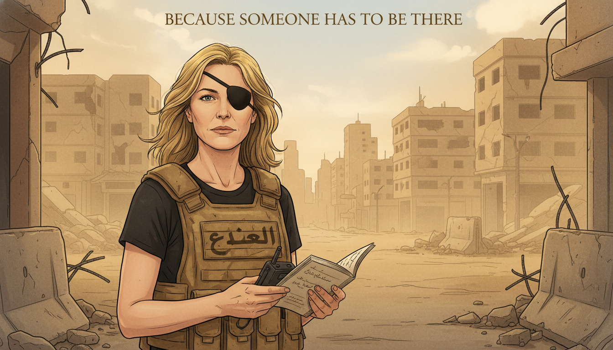

Cover Image Prompt

Please generate a wide-landscape 16:9 cover image for a graphic novel titled "Because Someone Has to Be There" in a contemporary editorial illustration style reminiscent of modern graphic novels and newsmagazine covers. Show Marie Colvin, an American war correspondent in her early 50s, with shoulder-length blonde hair, her signature black eye patch over her left eye, wearing a worn flak vest over a simple black T-shirt. She stands at the edge of a ruined street in an unnamed Middle Eastern city, holding a small reporter's notebook and a satellite phone, looking directly at the viewer with calm determination. Behind her, a distant skyline of damaged but empty buildings is softened by dust and evening light. No explicit violence, no blood, no bodies — the emotional weight comes from the empty street and her steady gaze. The title "Because Someone Has to Be There" is rendered in a clean contemporary serif typeface at the top. Color palette: dust gold, faded concrete gray, deep black, a single note of sky blue, warm evening amber. Emotional tone: weary courage. Include: (1) Colvin's direct, steady gaze, (2) the eye patch prominently visible, (3) the flak vest with Arabic press markings, (4) the reporter's notebook in hand, (5) the satellite phone, (6) empty, dust-softened buildings in the distance. Generate the image immediately without asking clarifying questions.

Narrative Prompt

This is a 12-panel graphic novel about Marie Colvin (1956-2012), the American war correspondent for the London *Sunday Times* who reported from Chechnya, Kosovo, Sierra Leone, East Timor, Sri Lanka (where she lost her left eye in 2001), Iraq, Libya, and finally Homs, Syria, where she was killed in a targeted shelling on February 22, 2012. The story is aimed at teenage readers, so violence must be handled with gravity but without explicit depiction: empty streets, distant smoke, abandoned objects, and reaction shots convey the weight of war without showing wounds or bodies. Settings range from New York newsrooms to frontline civilian basements around the world. The art style is contemporary editorial illustration with documentary realism and restrained color. Colvin should be drawn consistently: a woman with shoulder-length blonde hair, her signature black eye patch after 2001, and a flak vest over simple practical clothes. Central TOK theme: eyewitness testimony as the last defense against propaganda, and the ethics of journalism.

### Prologue – A Baby in a Basement

On February 21, 2012, Marie Colvin made a live broadcast from the besieged Syrian city of Homs. She described a makeshift clinic in a basement where civilians sheltered from shelling. She described a baby dying in front of her. The Assad regime had insisted for months that the people of Homs were not civilians — they were "terrorists." Colvin's broadcast made that lie impossible to maintain. Twelve hours later, she was killed in a targeted rocket strike on the building she was broadcasting from. She was 56 years old.

## Panel 1: The Long Island Beach

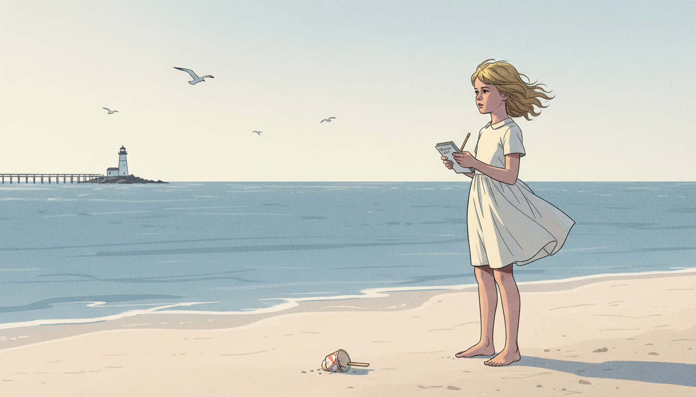

Image Prompt

I am about to ask you to generate a series of images for a graphic novel. Please make the images have a consistent style and consistent characters. Do not ask any clarifying questions. Just generate the image immediately when asked.

Please generate a 16:9 image in contemporary editorial illustration style depicting panel 1 of 12. The scene shows a young Marie Colvin, around age 12 in 1968, on a Long Island beach holding a small reporter's notebook, staring intently out at the Atlantic Ocean. Her hair is blonde and wind-tossed; she wears a simple 1960s summer dress. Color palette: pale sand, ocean blue-gray, cream, soft morning light. Emotional tone: early curiosity. Specific details: (1) the young Marie with notebook, (2) a small spiral-bound pad and pencil, (3) a distant lighthouse, (4) seagulls overhead, (5) a dropped ice cream cup in the sand nearby, (6) a weathered wooden pier in the distance. Generate the image immediately without asking clarifying questions.

Marie Catherine Colvin was born in 1956 in Queens, New York, and grew up in Oyster Bay on Long Island. From a young age she loved to write and ask questions — her father, a schoolteacher, gave her her first reporter's notebook before she was ten. She filled it with descriptions of the ocean, the neighbors, and the books she read late into the night. She would carry a version of that notebook for the rest of her life.

## Panel 2: Yale and Decision

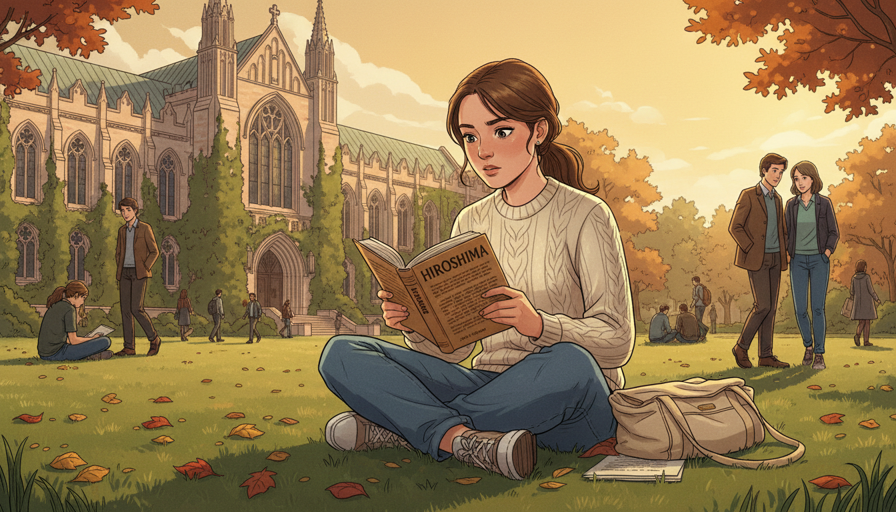

Image Prompt

Please generate a 16:9 image in contemporary editorial illustration style depicting panel 2 of 12. Make the characters and style consistent with the prior panel. The scene shows Marie as a college student at Yale University in the late 1970s, seated on a library lawn with a book of John Hersey's "Hiroshima" open in her lap. She is reading intently. Color palette: ivy green, stone gray, warm afternoon gold, cream book pages. Emotional tone: the moment a vocation is chosen. Specific details: (1) Marie in 1970s jeans and a simple sweater, (2) the book clearly visible, (3) Gothic university architecture in the background, (4) a canvas bookbag beside her, (5) other students in the distance, (6) autumn leaves scattered on the grass. Generate the image immediately without asking clarifying questions.

At Yale, Marie read John Hersey's *Hiroshima*, an essay-length piece of journalism that simply described the lives of six people in the Japanese city on the day the atomic bomb fell. No editorializing, no rhetoric — just people. She closed the book understanding, for the first time, what journalism could do: it could make distant suffering impossible to ignore by bringing witnesses home.

## Panel 3: The Eye Patch

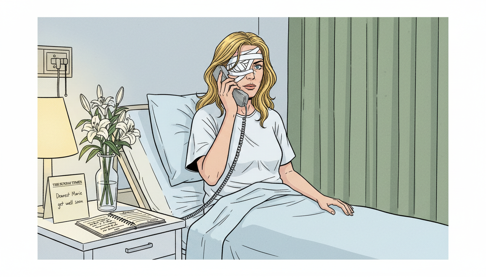

Image Prompt

Please generate a 16:9 image in contemporary editorial illustration style depicting panel 3 of 12. Make the characters and style consistent with the prior panel. The scene shows Marie Colvin in a London hospital room in April 2001, age 44, sitting up in bed with fresh bandages over her left eye, dictating a story into a satellite phone. Her right eye is alert and focused. Color palette: clean hospital white, pale blue bedding, muted green curtains, warm lamp. Emotional tone: defiance in recovery. Specific details: (1) Marie in a hospital gown with bandages, (2) a satellite phone in her hand, (3) a reporter's notebook on the bedside table, (4) a vase of flowers, (5) a get-well card from the Sunday Times, (6) her blonde hair loose around her shoulders. No blood, no wounds visible. Generate the image immediately without asking clarifying questions.

In April 2001, Colvin was covering the civil war in Sri Lanka — a conflict the government insisted was nearly over — when a grenade exploded near her. She lost her left eye. From her hospital bed, before the anesthesia had fully worn off, she dictated her story to the *Sunday Times*. The black eye patch she wore afterward was not a costume. It was a reminder of what the truth had cost her, and of why she refused to stop.

## Panel 4: The Woman in the Flak Vest

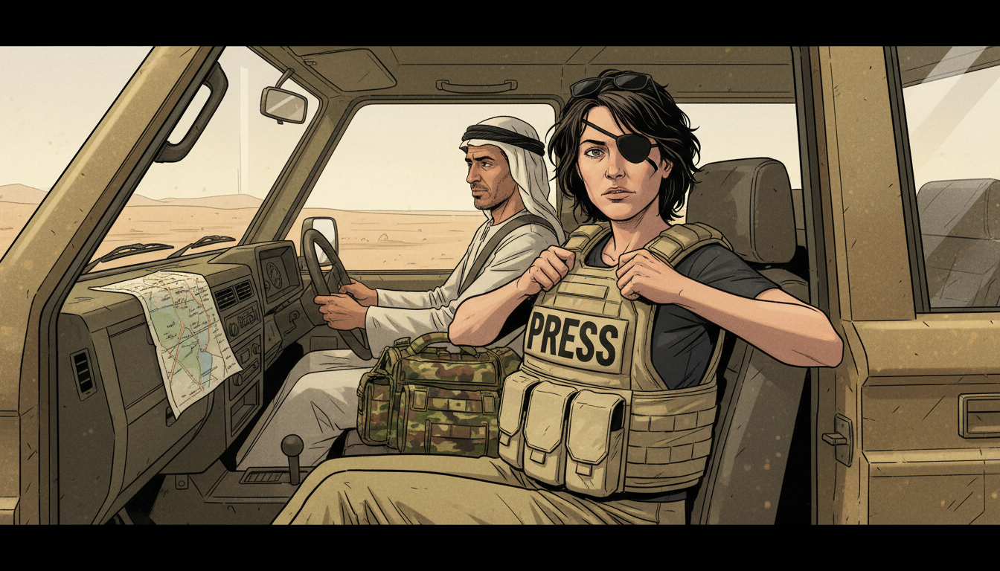

Image Prompt

Please generate a 16:9 image in contemporary editorial illustration style depicting panel 4 of 12. Make the characters and style consistent with the prior panel. The scene shows Colvin a few years after her injury, now wearing her signature black eye patch, in a dusty press vehicle in the Middle East. She is pulling on a flak vest marked "PRESS." A driver sits at the wheel. Color palette: dust tan, olive khaki, deep black patch, cream press vest. Emotional tone: practiced preparation. Specific details: (1) Colvin in her eye patch and vest, (2) a four-wheel-drive vehicle interior, (3) a camera bag and helmet on the seat, (4) sunglasses perched on her head, (5) a map folded on the dashboard, (6) a driver in local clothing. Generate the image immediately without asking clarifying questions.

Colvin specialized in a particular kind of story: civilian suffering in wars governments wanted to hide. She reported from Chechnya when Russia claimed civilian areas were not being targeted. She reported from East Timor when Indonesian-backed militias were erasing villages. She walked into places other journalists had left, and then she walked further in. Her colleagues called her fearless, and it was almost true.

## Panel 5: Listening in a Kitchen

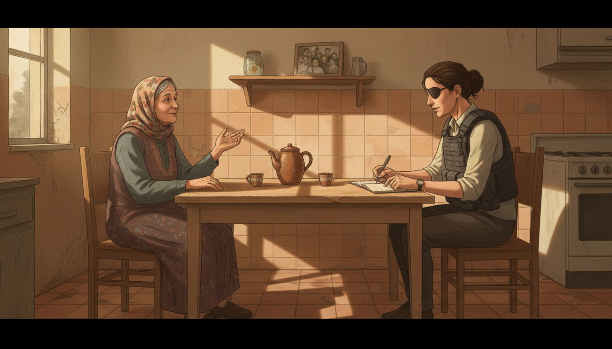

Image Prompt

Please generate a 16:9 image in contemporary editorial illustration style depicting panel 5 of 12. Make the characters and style consistent with the prior panel. The scene shows Colvin seated at a simple kitchen table in a war-affected home, listening intently to an older woman in traditional dress who is speaking and gesturing. Colvin is taking notes. Color palette: warm tile, cream wall, tea amber, dust-muted daylight from a small window. Emotional tone: patient listening. Specific details: (1) two mismatched chairs, (2) a teapot and two small cups, (3) Colvin in her flak vest and eye patch with notebook, (4) the older woman in a headscarf gesturing with one hand, (5) a framed family photo on a shelf, (6) warm afternoon light through a small window. Generate the image immediately without asking clarifying questions.

Her method was simple and old-fashioned: she sat with people. She drank their tea. She asked them to describe the day they lost their son, or their house, or their village. She wrote their names down carefully — correct spelling, correct age, correct circumstance. She believed that the single most powerful thing a journalist could do was to refuse to let a person become a statistic.

## Panel 6: The Satellite Phone

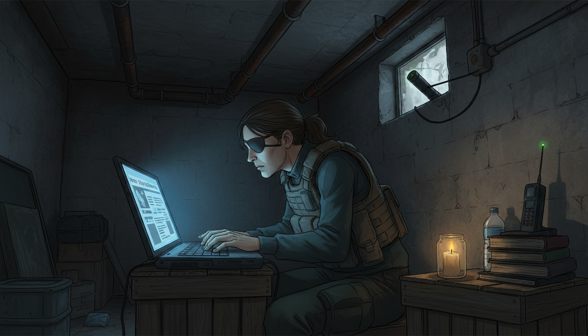

Image Prompt

Please generate a 16:9 image in contemporary editorial illustration style depicting panel 6 of 12. Make the characters and style consistent with the prior panel. The scene shows Colvin in a dimly lit basement shelter in the 2000s, typing rapidly on a laptop balanced on a crate, with a satellite phone propped beside her for filing her story. Color palette: dark basement gray-brown, laptop screen blue glow, warm candle amber. Emotional tone: urgent concentration. Specific details: (1) a laptop with a partial news article visible, (2) a satellite phone with antenna extended, (3) a single candle in a jar, (4) a water bottle, (5) Colvin in her patch and vest hunched over the work, (6) the concrete walls of a basement with pipes overhead. Generate the image immediately without asking clarifying questions.

When she finished interviewing, she filed. On satellite phones from basements, on laptops powered by car batteries, on scraps of paper dictated over bad lines. Her stories appeared in the *Sunday Times* every week, read by millions of people who would otherwise have known nothing about the lives she was describing. Propaganda thrives on distance. Colvin's whole career was an attempt to close that distance.

## Panel 7: The Homs Broadcast

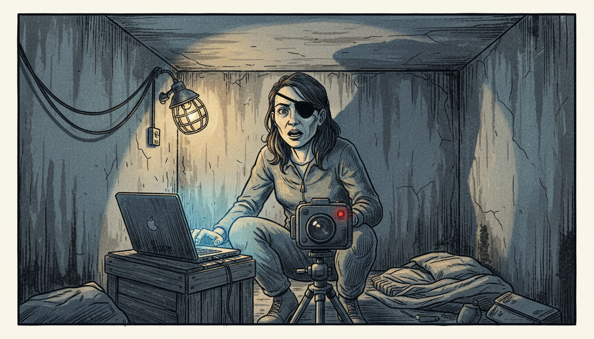

Image Prompt

Please generate a 16:9 image in contemporary editorial illustration style depicting panel 7 of 12. Make the characters and style consistent with the prior panel. The scene shows Colvin in a basement in Homs, Syria on the night of February 21, 2012, speaking into a video camera for a live broadcast to CNN, BBC, and Channel 4. She is lit only by a small work lamp and the laptop screen. Her expression is composed and urgent. Color palette: basement shadow, cool laptop blue, warm lamp amber, a single note of red (the on-air indicator). Emotional tone: witness under pressure. Specific details: (1) Colvin facing the camera with her eye patch clearly visible, (2) a small field video camera on a tripod, (3) a laptop on a crate, (4) a single work lamp, (5) concrete basement walls with improvised wiring, (6) no violence visible — the weight is carried by her face. Generate the image immediately without asking clarifying questions.

On the night of February 21, 2012, from a media center improvised in a basement in the Baba Amr district of Homs, Colvin went live on three international news networks. She described a makeshift clinic where a baby had just died in front of her. "This is the worst, absolutely the worst, I have ever seen," she said. Viewers around the world finally understood what the Syrian regime had been denying for months: this was a siege of civilians.

## Panel 8: The Last Morning

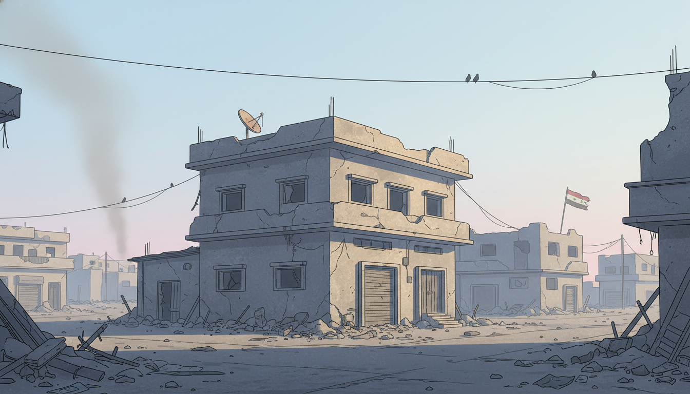

Image Prompt

Please generate a 16:9 image in contemporary editorial illustration style depicting panel 8 of 12. Make the characters and style consistent with the prior panel. The scene shows the exterior of the Baba Amr media center on the morning of February 22, 2012, with dawn light breaking over damaged but empty buildings. A thin column of dust rises in the distance. No people, no bodies, no explicit violence — just the empty street and the first light of day. Color palette: pale dawn blue, dust gold, concrete gray, faint pink on the horizon. Emotional tone: solemn, quiet, inevitable. Specific details: (1) a two-story building with a small satellite dish on the roof, (2) an empty street strewn with rubble, (3) the first rays of sunrise, (4) a distant column of pale dust, (5) birds on a nearby wire, (6) a small Syrian flag hanging torn in the distance. Generate the image immediately without asking clarifying questions.

Just before dawn on February 22, a barrage of shells struck the media center. Colvin and the French photojournalist Rémi Ochlik were killed. Evidence gathered later suggested the strike had been deliberately targeted using intercepted communications. Colvin had known the risk. She had stayed because the story was not finished, and because there were civilians in that basement whose names, at that moment, only she was writing down.

## Panel 9: The Memorial Service

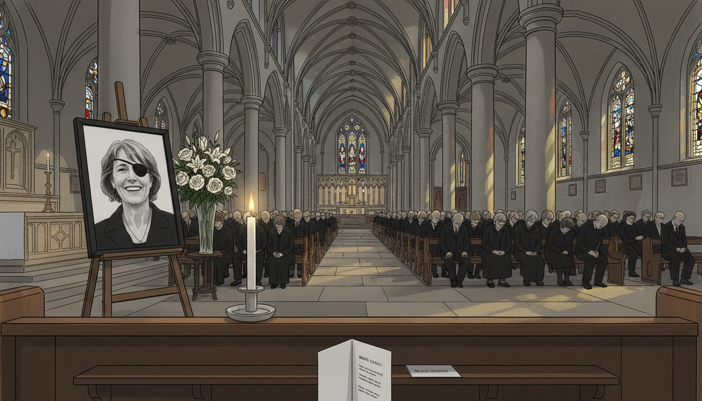

Image Prompt

Please generate a 16:9 image in contemporary editorial illustration style depicting panel 9 of 12. Make the characters and style consistent with the prior panel. The scene shows a memorial service for Marie Colvin at St. Martin-in-the-Fields church in London in May 2012. A large photograph of Colvin (smiling, in her eye patch) stands on a stand beside the altar. Mourners in dark clothes fill the pews. Color palette: stone gray, candlelight amber, black mourning clothes, cream flowers. Emotional tone: quiet grief and recognition. Specific details: (1) the photograph of Colvin on an easel, (2) a simple bouquet of white flowers, (3) stained-glass windows throwing colored light, (4) mourners in the pews, (5) a program card in the foreground, (6) a single lit candle at the front. Generate the image immediately without asking clarifying questions.

Colleagues, friends, and readers gathered in London to remember her. Her sister Cathleen read from her dispatches. Fellow war correspondents spoke about the stories she had helped them file, the nerve she had given them, and the rules she had lived by: know the people you write about, verify before you broadcast, and never treat a civilian life as an afterthought.

## Panel 10: The Legal Judgment

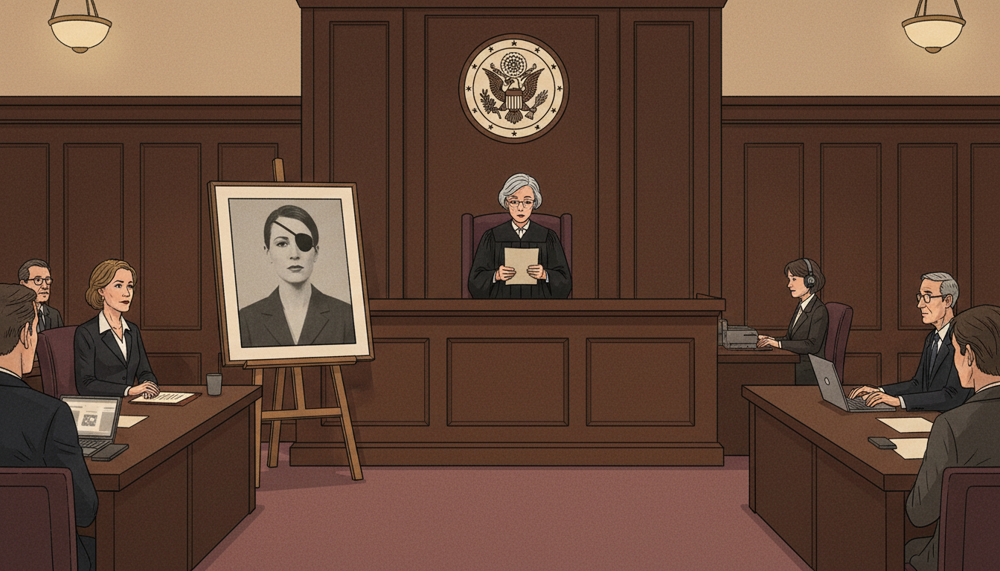

Image Prompt

Please generate a 16:9 image in contemporary editorial illustration style depicting panel 10 of 12. Make the characters and style consistent with the prior panel. The scene shows an American federal courtroom in Washington, D.C. in January 2019, with a judge reading from a document, and Marie Colvin's sister Cathleen seated at a plaintiff's table looking composed. A large photograph of Marie stands on an easel beside the bench. Color palette: dark wood paneling, cream paper, muted burgundy carpet, warm overhead light. Emotional tone: long-delayed accountability. Specific details: (1) the judge in a black robe reading, (2) a courtroom seal on the wall, (3) Cathleen Colvin in a dark suit, (4) the photograph of Marie visible, (5) lawyers at their tables, (6) a stenographer typing. Generate the image immediately without asking clarifying questions.

In 2019, a U.S. federal court ruled that the Syrian government had deliberately targeted Colvin because of her reporting. The judge awarded her family $302 million in damages — symbolic, perhaps, but formally establishing in a court of law what Colvin's reporting had been meant to prove: that the regime was killing civilians, and that it would kill the witnesses who documented it.

## Panel 11: The Documentary

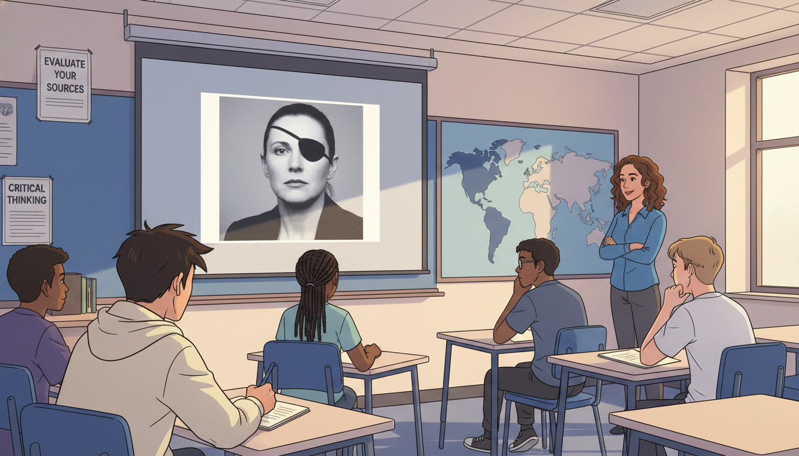

Image Prompt

Please generate a 16:9 image in contemporary editorial illustration style depicting panel 11 of 12. Make the characters and style consistent with the prior panel. The scene shows a modern high school classroom in which students are watching a documentary about Marie Colvin on a projection screen. One student is taking notes intently. Color palette: classroom blue, projection screen gray, cream notebook, warm overhead light. Emotional tone: knowledge being passed to a new generation. Specific details: (1) the projection screen showing Colvin's face with eye patch, (2) four or five diverse teenage students at desks, (3) one student writing in a notebook, (4) a teacher at the side of the room, (5) classroom posters about media literacy, (6) a world map on the wall. Generate the image immediately without asking clarifying questions.

Colvin's life has since been the subject of books, documentaries, and a feature film (*A Private War*, 2018). In classrooms around the world, students now study her dispatches as examples of rigorous, humane journalism — and as cautionary tales about how much propaganda relies on the absence of witnesses.

## Panel 12: The Notebook Passed On

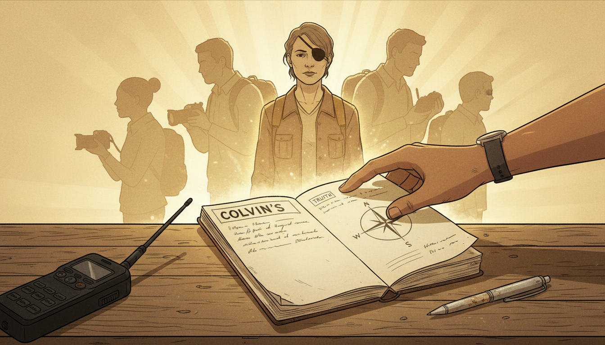

Image Prompt

Please generate a 16:9 image in contemporary editorial illustration style depicting panel 12 of 12. The composition shows a symbolic scene: a weathered reporter's notebook — Colvin's — lying open on a table, with a younger journalist's hand reaching in to pick it up. Behind the notebook, faint silhouettes of Colvin and other war correspondents fade into warm amber light. Color palette: cream paper, dust gold, warm amber, deep black. Emotional tone: legacy carried forward. Specific details: (1) the open notebook with legible handwriting, (2) a younger journalist's hand (diverse skin tone), (3) a worn pen beside it, (4) a faint silhouette of Colvin in the background, (5) a soft glow around the notebook, (6) a modern satellite phone in the corner ready to go. Generate the image immediately without asking clarifying questions.

A generation of journalists — many of them women, many of them from the very countries Colvin reported on — now carry her method: show up, sit with people, take the names down carefully, and refuse to leave until the story is filed. Propaganda only works when nobody is watching. Marie Colvin's legacy is a simple, stubborn promise, repeated in notebooks all over the world: *someone is watching*.

### Epilogue – What Made Marie Colvin Different?

Colvin was not the only brave war correspondent of her era. What made her different was her conviction that the value of a story lay in its specificity — one basement, one mother, one name at a time. She believed that propaganda could only survive where witnesses did not, and she was willing to be the witness who made it collapse. She did not romanticize war, and she did not romanticize her own risk-taking. She simply refused to leave people behind.

| Challenge | How Colvin Responded | Lesson for Today |
|-----------|----------------------|------------------|
| Regimes denied that civilians were being targeted | She went to the basements and described what she saw | Primary-source testimony is the hardest form of propaganda to defeat |
| She lost her left eye reporting in Sri Lanka | She filed her story from the hospital and returned to frontlines | A reporter's credential is not a shield; her record is |
| Editors worried her risks were excessive | She negotiated carefully but would not be pulled out mid-story | Ethical courage is a practice, not a personality trait |
| The Syrian regime targeted journalists | She kept filing until the last hours | Being in the room is sometimes the story |
| After her death, some governments tried to minimize what had happened | Her reporting, broadcasts, and court rulings made denial impossible | Well-documented witness testimony outlives the witness |

### Call to Action

When you read news from a place you have never been, ask Sofia's question first: *But how do we know?* Who is there? Who has talked to the people? Who has written their names down? Marie Colvin spent her life making sure that question had an honest answer. The least we can do is keep asking it.

---

*"Bravery is not being afraid to be afraid."*
—Marie Colvin

*"Our mission is to speak the truth to power. We send home that first rough draft of history."*
—Marie Colvin

*"I believed the story was worth it."*
—Marie Colvin

---

## References

1. [Wikipedia: Marie Colvin](https://en.wikipedia.org/wiki/Marie_Colvin) - Biography of the American war correspondent for the Sunday Times
2. [Wikipedia: Siege of Homs](https://en.wikipedia.org/wiki/Siege_of_Homs) - The 2012 siege during which Colvin made her final broadcast
3. [Wikipedia: A Private War](https://en.wikipedia.org/wiki/A_Private_War) - 2018 biographical feature film about Colvin's life and work
4. [Committee to Protect Journalists: Marie Colvin](https://cpj.org/data/people/marie-colvin/) - Case record and tribute from the Committee to Protect Journalists
5. [Encyclopaedia Britannica: Marie Colvin](https://www.britannica.com/biography/Marie-Colvin) - Overview of Colvin's life and career as a war correspondent
