# Mary Anning and the Dragons in the Cliffs

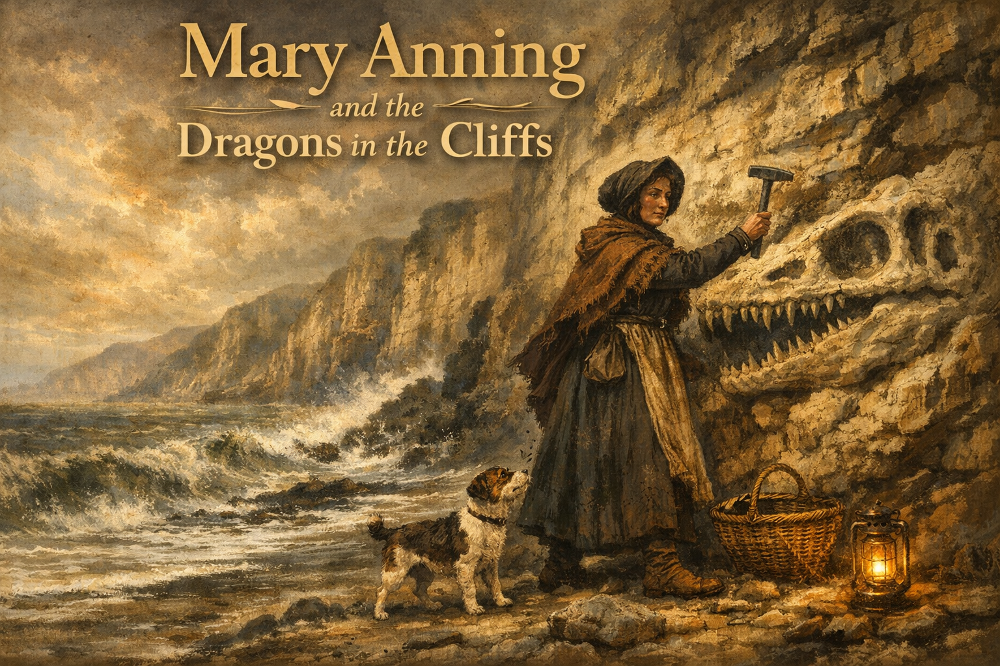

Cover Image Prompt

Please generate a wide-landscape 16:9 cover image for a graphic novel titled "Mary Anning and the Dragons in the Cliffs" in a Victorian English Romantic landscape style reminiscent of J.M.W. Turner and John Constable — misty Dorset coast, sepia-tinged oil-painting warmth, dramatic skies over the Blue Lias cliffs. Show Mary Anning, a determined young woman in her late 20s wearing a dark bonnet, a practical long dress with a heavy shawl, and sturdy boots, standing on the storm-lashed beach at Lyme Regis with her geological hammer raised against the cliff face. Behind her, the great jawbone of an ichthyosaur emerges partway from the crumbling rock. Her faithful terrier, Tray, stands at her feet. The title text "Mary Anning and the Dragons in the Cliffs" is rendered in an elegant serif typeface at the top. Color palette: stormy grays, warm sepia, Blue Lias blue-gray, fossil cream, amber lantern light. Emotional tone: solitary courage against ancient stone. Include: (1) Anning's resolute, weathered expression, (2) the layered Blue Lias cliffs stretching into mist, (3) a wicker fossil-collecting basket at her side, (4) crashing waves at the base of the cliffs, (5) period-accurate early 1800s working-class clothing, (6) the half-exposed skull of the ichthyosaur gleaming in the cliff face. Generate the image immediately without asking clarifying questions.

Narrative Prompt

This is a 12-panel graphic novel about Mary Anning (1799-1847), the self-taught fossil hunter from Lyme Regis, England, whose extraordinary discoveries of ichthyosaurs, plesiosaurs, and pterosaurs helped prove that extinction was real and that the Earth was vastly older than biblical timelines allowed. The story is set primarily on the Dorset coast between the 1810s and 1840s, with scenes in London's Geological Society and the British Museum. The art style throughout is Victorian English Romantic landscape — think Turner and Constable: misty coastlines, sepia-tinged oil-painting warmth, Blue Lias cliffs, dramatic seascapes, and careful attention to early 19th-century working-class and gentlemen's clothing. Mary Anning should be drawn consistently across panels: a slim, sharp-featured young woman with dark hair pulled back under a bonnet, intense dark eyes, weathered hands, and practical working clothes. She ages from a girl of 12 to a woman in her late 40s across the panels. Central TOK themes: deep time and extinction as revolutionary knowledge claims; the injustice of who gets credited as a "knower" when class and gender determine authority; empirical evidence versus scriptural authority.

### Prologue – The Girl on the Beach

In the early 1800s, most English people believed the Earth was about six thousand years old and that every creature God had made was still alive somewhere on its surface. The cliffs along the Dorset coast told a different story, but almost no one was listening. Then a poor girl who had never been to school began pulling monsters out of the rock. Mary Anning, armed with a hammer, a keen eye, and a self-taught knowledge of anatomy, would unearth creatures so strange and so old that they forced an entire civilization to rethink what it knew about time, life, and death. The men who bought her fossils won the fame. Mary Anning won something harder: she was right.

## Panel 1: Lightning Child

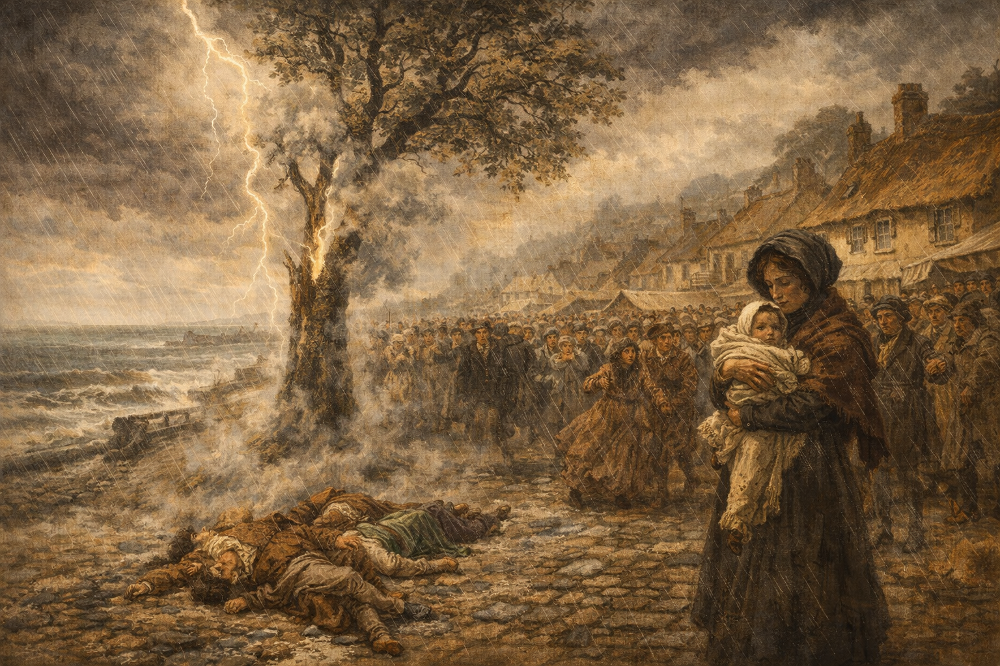

Image Prompt

I am about to ask you to generate a series of images for a graphic novel. Please make the images have a consistent style and consistent characters. Do not ask any clarifying questions. Just generate the image immediately when asked.

Please generate a 16:9 image in Victorian English Romantic landscape style reminiscent of Turner and Constable — sepia-tinged oil-painting warmth, misty Dorset coast, dramatic atmosphere. Depicting panel 1 of 12. The scene shows the town of Lyme Regis in 1800: a stormy summer day, with a crowd gathered at an outdoor fair. A bolt of lightning strikes a tall elm tree under which a woman holds a baby. Three people stand nearby. The aftermath: the baby survives, the others do not. The color palette is stormy dark gray, flash-white lightning, warm sepia, and muted village greens. Emotional tone: dramatic origin, fateful survival. Specific details: (1) the elm tree split and smoking from the strike, (2) a crowd of villagers in early 1800s working-class clothing recoiling in shock, (3) the baby wrapped in a shawl, (4) thatched-roof cottages and the Dorset coast visible in the background, (5) rain-lashed cobblestones, (6) a distant view of the Cobb harbour wall through the mist. Generate the image immediately without asking clarifying questions.

Before Mary Anning was a scientist, she was a legend. In August 1800, when she was fifteen months old, a bolt of lightning struck the elm tree under which her nursemaid was sheltering with her at a village fair. The nursemaid and two neighbors were killed. The baby survived. The people of Lyme Regis called her the lightning child and said the bolt had made her uncommonly clever. What actually made her clever was something no lightning bolt can give: she paid attention to what the rocks were telling her.

## Panel 2: The Fossil Shop

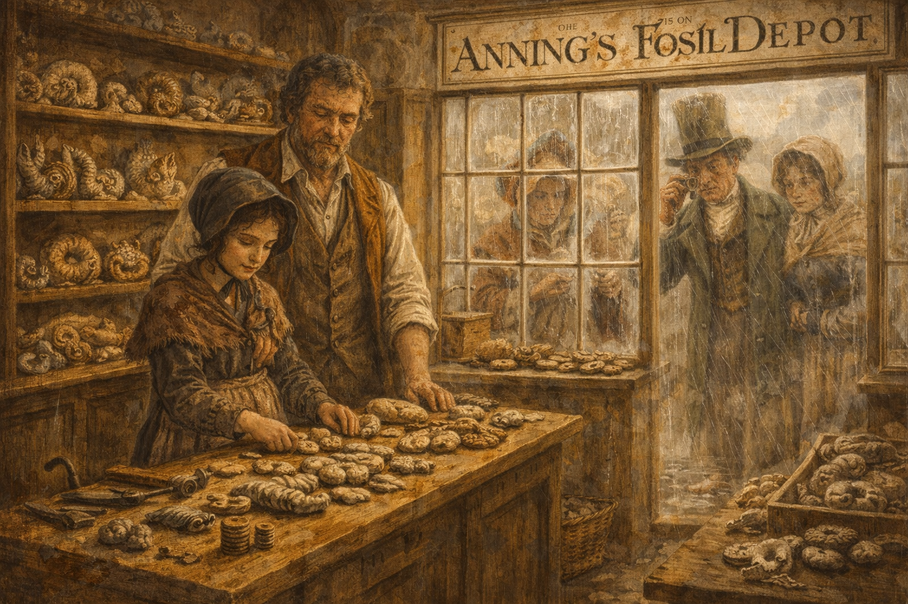

Image Prompt

Please generate a 16:9 image in Victorian English Romantic landscape style reminiscent of Turner and Constable — sepia-tinged oil-painting warmth. Depicting panel 2 of 12. Make the characters and style consistent with the prior panel. The scene shows the Anning family's small curiosity shop on Bridge Street in Lyme Regis, around 1810. Young Mary, about 11 years old, thin and sharp-eyed with dark hair under a bonnet, stands behind a wooden table arranging ammonites and belemnites for sale. Her father Richard, a cabinetmaker with worn hands, supervises from behind. Tourists in Regency-era clothing peer through the shop window. The color palette is warm sepia, wood-brown, fossil cream, soft gray daylight. Emotional tone: modest industry, the seeds of discovery. Specific details: (1) shelves lined with polished ammonites and curiosities, (2) a hand-lettered sign reading "Anning's Fossil Depot," (3) a gentleman tourist examining a fossil through a hand lens, (4) Mary's hammer and chisel set on the counter, (5) a stack of pennies beside a small fossil, (6) rain streaking the shop window. Generate the image immediately without asking clarifying questions.

Mary's father Richard was a cabinetmaker who supplemented his income by collecting fossils from the cliffs and selling them to summer tourists as "curiosities." He taught Mary and her brother Joseph where to look, how to use a hammer without shattering a specimen, and which shapes in the rock were worth digging out. When Richard died in 1810 of tuberculosis, leaving the family in debt, Mary was eleven. The fossil trade was no longer a hobby. It was survival.

## Panel 3: The Monster in the Cliff

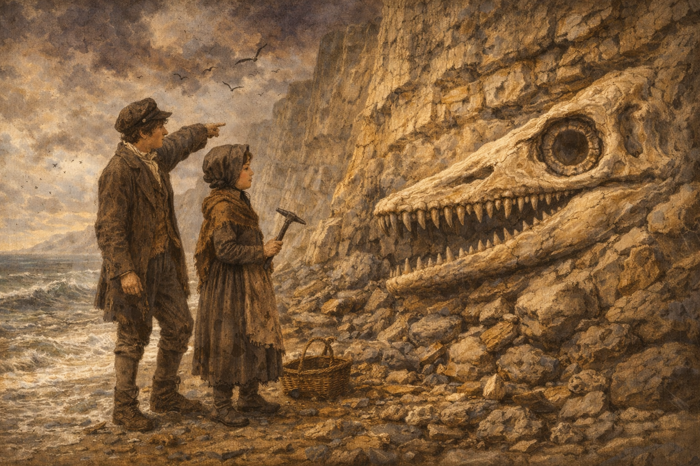

Image Prompt

Please generate a 16:9 image in Victorian English Romantic landscape style reminiscent of Turner and Constable — dramatic seascape, Blue Lias cliffs. Depicting panel 3 of 12. Make the characters and style consistent with the prior panel. The scene shows Mary Anning at age 12 and her brother Joseph, about 15, standing on the beach beneath the towering Blue Lias cliffs near Lyme Regis in 1811. Joseph points excitedly at an enormous fossilized skull embedded in the cliff face — the four-foot-long skull of an ichthyosaur, its great eye socket and rows of teeth clearly visible in the pale limestone. The color palette is Blue Lias blue-gray, storm-cloud purple, fossil cream, sepia warmth. Emotional tone: awe and discovery. Specific details: (1) the massive skull with its conical teeth and enormous eye ring clearly visible in the rock, (2) Mary holding a geological hammer, studying the skull intently, (3) loose shale and fallen rocks at the base of the cliff, (4) waves lapping at their boots, (5) a wicker collecting basket on the ground, (6) seabirds wheeling against a dramatic clouded sky. Generate the image immediately without asking clarifying questions.

In 1811, Joseph spotted something extraordinary in the cliff: a skull four feet long, with huge eye sockets and rows of conical teeth. Over the following months, Mary returned again and again, carefully excavating the rest of the skeleton from the crumbling Blue Lias limestone. What emerged was a creature unlike anything alive — a marine reptile with the snout of a dolphin, the teeth of a crocodile, and the paddles of a whale. She was twelve years old. She had just found the first complete ichthyosaur skeleton ever identified by science.

## Panel 4: The Self-Taught Anatomist

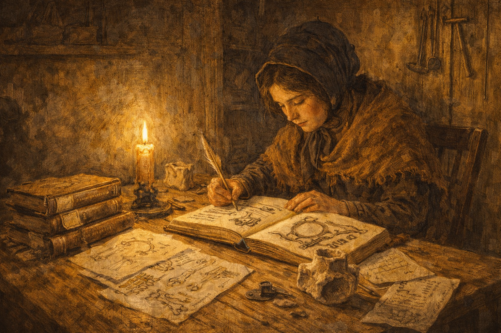

Image Prompt

Please generate a 16:9 image in Victorian English Romantic landscape style — warm lamplight, sepia tones. Depicting panel 4 of 12. Make the characters and style consistent with the prior panel. The scene shows Mary Anning, now about 18, sitting at a rough wooden table in her small cottage in the evening, studying by candlelight. She is carefully copying anatomical illustrations from a borrowed book, comparing them with a fossil specimen laid out before her. Scattered around her are hand-drawn sketches of bones, a dog-eared copy of Georges Cuvier's anatomy text, and letters from collectors. The color palette is amber candlelight, deep shadow, parchment cream, warm wood-brown. Emotional tone: fierce self-education against poverty. Specific details: (1) Mary copying a skeletal diagram with careful penmanship, (2) a real fossil vertebra beside the open book for comparison, (3) a tallow candle guttering low, (4) a shawl around her shoulders against the cold, (5) a stack of borrowed books with paper markers, (6) her geological hammer and chisel hung on a nail by the door. Generate the image immediately without asking clarifying questions.

Mary Anning had never been to school. She could not read Latin, the language of science. She could not afford books. So she borrowed them, copied out the illustrations by hand, and taught herself comparative anatomy from the work of Georges Cuvier, the French naturalist who had first proposed that species could go extinct. She learned to identify every bone in a skeleton by its shape and position. By the time she was twenty, there was not a gentleman geologist in England who understood the anatomy of marine reptiles better than she did.

## Panel 5: The Sea Dragon Emerges

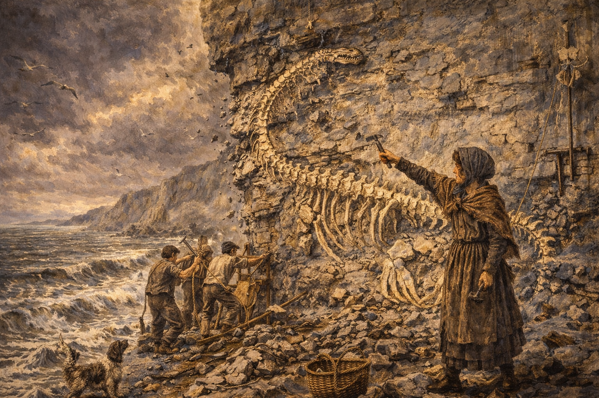

Image Prompt

Please generate a 16:9 image in Victorian English Romantic landscape style — dramatic coastal scene, Turner-esque atmosphere. Depicting panel 5 of 12. Make the characters and style consistent with the prior panel. The scene shows Mary Anning, now in her early 20s, supervising a team of local laborers as they carefully extract a nearly complete plesiosaur skeleton from the cliff face at Lyme Regis in 1823. Mary directs the work, pointing with her hammer at the long serpentine neck of the creature curving through the rock. The color palette is storm-gray sky, Blue Lias blue, warm sepia, bone-white fossil. Emotional tone: triumph and physical danger. Specific details: (1) the extraordinary long-necked plesiosaur skeleton visible in the rock, its small head and four large paddles emerging, (2) laborers with pickaxes and ropes working carefully, (3) Mary in practical working clothes and bonnet directing them, (4) loose rock falling from above, (5) the tide visible in the background, threatening to rise, (6) her dog Tray barking at the cliff base. Generate the image immediately without asking clarifying questions.

In 1823, Mary made a discovery that shook the scientific world to its foundations. She unearthed the first complete skeleton of a plesiosaur — a creature with a tiny head, a neck like a snake, a body like a turtle, and four great flippers. Nothing like it existed anywhere on Earth. Georges Cuvier himself initially doubted the skeleton was real, suspecting it was a forgery. When he examined the evidence more carefully, he admitted he was wrong. The creature was genuine, and it was proof that entire categories of life had vanished from the world.

## Panel 6: The Gentlemen's Club

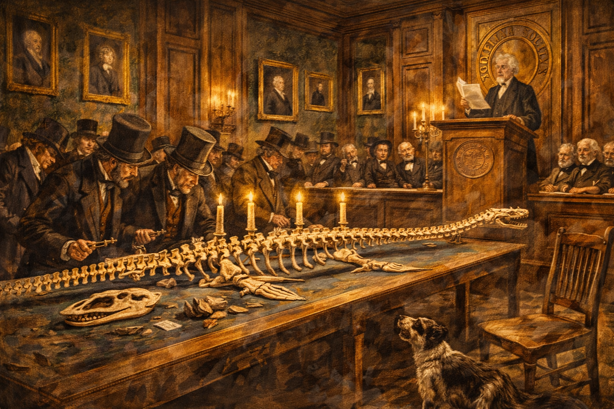

Image Prompt

Please generate a 16:9 image in Victorian English Romantic style — formal interior, oil-painting richness. Depicting panel 6 of 12. Make the characters and style consistent with the prior panel. The scene shows the interior of the Geological Society of London in the 1820s: a grand wood-paneled meeting room where gentlemen in top hats and frock coats examine Mary Anning's plesiosaur skeleton, now mounted and displayed on a long table. A prominent geologist reads a paper about the discovery to the assembled members. Mary Anning is nowhere in the room — she was not permitted to attend. The color palette is mahogany brown, deep green wallpaper, candlelight gold, scholarly cream. Emotional tone: institutional injustice behind polished doors. Specific details: (1) the mounted plesiosaur skeleton on the display table, (2) gentlemen with mutton-chop whiskers leaning in to examine it, (3) a speaker at a lectern reading from a paper, (4) the words "Geological Society" on a banner or seal, (5) an empty chair that symbolically represents Mary's absence, (6) oil portraits of learned men on the walls. Generate the image immediately without asking clarifying questions.

The Geological Society of London was the most prestigious scientific body in England. It did not admit women. When Mary Anning's fossils arrived in London, gentlemen geologists wrote papers about them, presented them at meetings, and published them in journals. They rarely mentioned her name. Henry De la Beche, William Conybeare, Richard Owen — these are the names in the history books. Mary Anning found the evidence. They took the credit. She was not even allowed through the door.

## Panel 7: The Flying Dragon

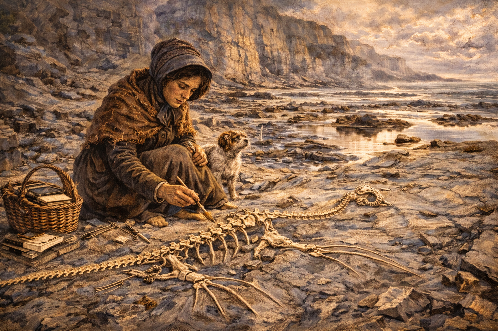

Image Prompt

Please generate a 16:9 image in Victorian English Romantic landscape style — dramatic coastal discovery scene. Depicting panel 7 of 12. Make the characters and style consistent with the prior panel. The scene shows Mary Anning, now about 29, kneeling on the beach at Lyme Regis in 1828, carefully brushing sediment from the fossilized wings of the first pterosaur ever found in Britain — a Dimorphodon. The delicate wing bones spread across the rock like the ribs of an impossible umbrella. Her expression is one of intense concentration and wonder. The color palette is pale morning light, blue-gray limestone, warm sepia, bone-white fossil. Emotional tone: delicate revelation. Specific details: (1) the pterosaur's wing membrane impression visible in the stone, (2) Mary using a fine brush and small chisel with surgical precision, (3) her collecting basket and notebooks beside her, (4) the tide pools reflecting the sky nearby, (5) her dog Tray sitting patiently watching, (6) the cliffs rising behind her into morning mist. Generate the image immediately without asking clarifying questions.

In 1828, Mary found something that made even the ichthyosaur look ordinary: the first pterosaur discovered in Britain, a flying reptile with leathery wings and hollow bones. Sea monsters were strange enough. But a flying reptile — a dragon, the locals called it — was almost too much for the imagination. The ancient world was not simply different from the present. It was alien. And Mary Anning, the girl who had never been to school, was the one revealing it, fossil by fossil, from the cliffs of Dorset.

## Panel 8: The Argument Over Time

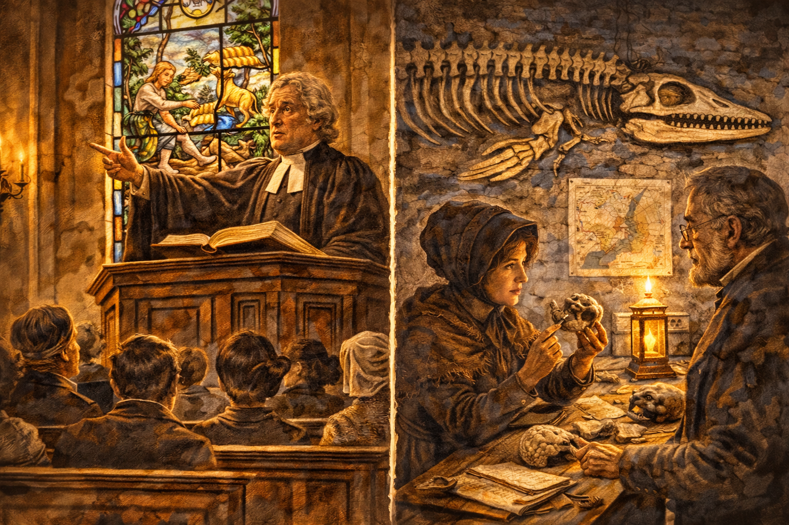

Image Prompt

Please generate a 16:9 image in Victorian English Romantic style — split composition showing ideological conflict. Depicting panel 8 of 12. Make the characters and style consistent with the prior panel. The scene is a split composition. On the left: a Church of England clergyman in a pulpit, gesturing at an open Bible, preaching to a congregation about the Earth being six thousand years old, with a stained glass window showing the Garden of Eden behind him. On the right: Mary Anning's fossil shop, where a massive ichthyosaur skeleton hangs on the wall and Mary shows a vertebra to a visiting geologist, pointing out growth rings that suggest immense age. The color palette contrasts warm church gold and stained-glass color on the left with cool Blue Lias gray and scientific lamplight on the right. Emotional tone: scripture versus stone. Specific details: (1) the clergyman's earnest expression, (2) parishioners in pews looking certain, (3) the Eden window with Adam naming the animals, (4) Mary's calm empirical focus on the right, (5) the ichthyosaur skeleton dominating her shop wall, (6) a geological map pinned behind her. Generate the image immediately without asking clarifying questions.

Mary's fossils were not just curiosities. They were arguments. If these creatures had once lived and then vanished, the Earth had to be vastly older than six thousand years, because these animals had lived, flourished, and gone extinct long before human beings existed. This was a direct challenge to the biblical timeline that most English people took as literal truth. The rocks did not care about scripture. They simply recorded what had happened, and Mary Anning was the one who could read them.

## Panel 9: The Bitter Letter

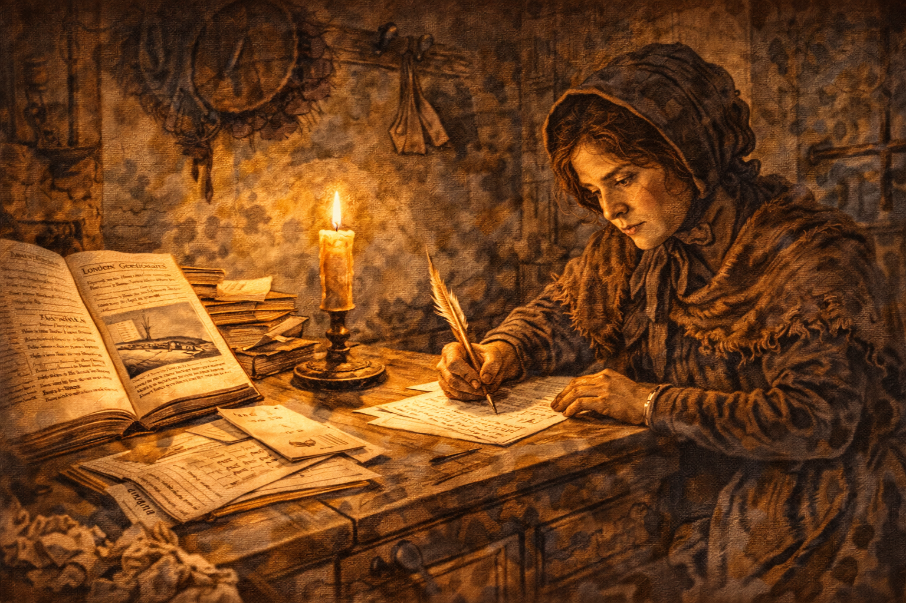

Image Prompt

Please generate a 16:9 image in Victorian English Romantic style — intimate interior scene, emotional weight. Depicting panel 9 of 12. Make the characters and style consistent with the prior panel. The scene shows Mary Anning, now in her mid-30s, sitting at her writing desk in her cottage, composing a letter by candlelight with visible frustration. Crumpled drafts litter the floor. On the desk is an open copy of a scientific journal showing a paper about one of her discoveries — with another man's name as author. Her expression is bitter but controlled. The color palette is deep amber candlelight, shadow, ink-black, parchment cream. Emotional tone: injustice endured with dignity. Specific details: (1) the journal open to a paper with an illustration of her plesiosaur, (2) the author's name clearly not hers, (3) Mary's ink-stained fingers gripping a pen, (4) letters from London geologists stacked on the desk, (5) a ledger showing meager sales figures, (6) her bonnet hung on a peg, her dark hair loosely tied. Generate the image immediately without asking clarifying questions.

In a letter that has survived, Mary wrote: "The world has used me so unkindly, I fear it has made me suspicious of everyone." She had watched men of wealth and education build entire careers on her discoveries. They paid her for the fossils — she needed the money desperately — but they did not share the authorship, the honors, or the recognition. She could not publish in scientific journals. She could not attend meetings. She could not vote, hold property easily, or call herself a geologist. She was poor, female, and self-taught — three strikes against being recognized as a knower in Regency England.

## Panel 10: Duria Antiquior

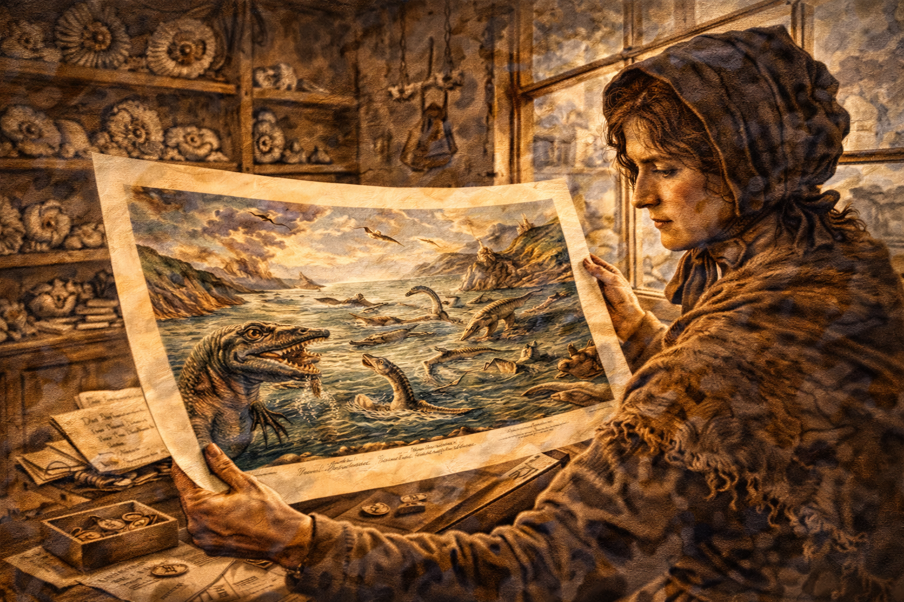

Image Prompt

Please generate a 16:9 image in Victorian English Romantic style — painterly, richly detailed. Depicting panel 10 of 12. Make the characters and style consistent with the prior panel. The scene shows the famous painting "Duria Antiquior" (A More Ancient Dorset) by Henry De la Beche — a vivid reconstruction of prehistoric Dorset based entirely on Mary Anning's fossil discoveries. The painting shows ichthyosaurs, plesiosaurs, and pterosaurs in a dramatic prehistoric seascape. In the foreground of the panel, Mary Anning stands in her shop looking at a printed lithograph of this painting, which De la Beche created to raise money for her when she was destitute. Her expression is complex — gratitude mixed with the knowledge that even this act of charity was possible only because a man had painted it. The color palette is the rich greens, blues, and earth tones of the Duria Antiquior painting contrasted with the muted sepia of Mary's shop. Emotional tone: bittersweet recognition. Specific details: (1) the Duria Antiquior lithograph clearly visible showing the prehistoric scene, (2) Mary holding the print with both hands, (3) her fossil specimens on shelves behind her, (4) a letter from De la Beche on the counter, (5) coins from lithograph sales in a small box, (6) light from the shop window illuminating the print. Generate the image immediately without asking clarifying questions.

In 1830, Mary's friend Henry De la Beche painted *Duria Antiquior* — "A More Ancient Dorset" — the first pictorial reconstruction of a prehistoric scene, based entirely on Mary's fossil discoveries. He sold lithographic prints to raise money for her, because by then she was nearly destitute. It was an act of genuine friendship. But it also captured the paradox of Mary Anning's life: the most important fossil hunter in England needed charity because the institutions of science refused to acknowledge her as one of their own.

## Panel 11: The Final Years

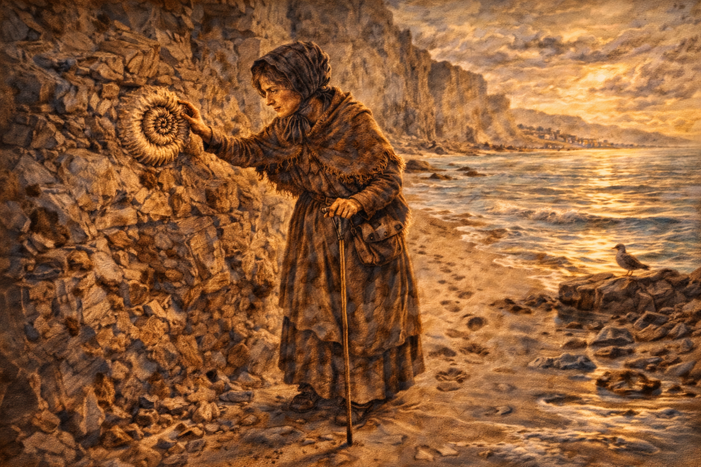

Image Prompt

Please generate a 16:9 image in Victorian English Romantic landscape style — Turner-esque coastal atmosphere, elegiac mood. Depicting panel 11 of 12. Make the characters and style consistent with the prior panel. The scene shows Mary Anning, now visibly aged and ill in her mid-40s, walking slowly along the beach at Lyme Regis in the mid-1840s, leaning on a walking stick. She pauses to examine a fossil ammonite in the cliff face, her practiced eye still sharp. Her clothes are worn but dignified. The sea is calm, the light golden and fading. The color palette is golden-hour amber, soft gray cliffs, quiet teal sea, warm sepia. Emotional tone: a life of work nearing its end, dignity intact. Specific details: (1) Mary's face lined but her gaze still keen, (2) her geological hammer tucked in her belt from habit, (3) the ammonite spiraling perfectly in the cliff, (4) footprints trailing behind her in the wet sand, (5) the town of Lyme Regis visible in the distance, (6) a single seabird on the rocks watching her pass. Generate the image immediately without asking clarifying questions.

In her final years, Mary Anning was finally granted a small annuity by the British Association for the Advancement of Science and the Geological Society — the same society that had never admitted her. She was diagnosed with breast cancer in 1846. She was forty-seven. She had discovered the first ichthyosaur, the first complete plesiosaur, the first British pterosaur, and important fossil fish. She had identified coprolites — fossilized feces — and used them to understand ancient food chains. She had changed humanity's understanding of time itself. And she had done it all from a beach in Dorset, without a degree, without funding, and without the credit she deserved.

## Panel 12: The Cliffs Remember

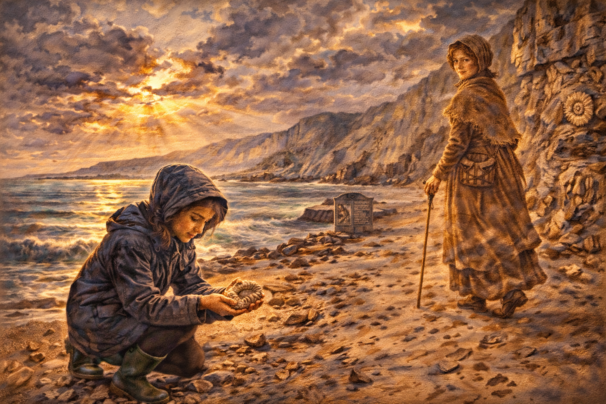

Image Prompt

Please generate a 16:9 image in Victorian English Romantic landscape style — sweeping, luminous, Turner-esque grandeur. Depicting panel 12 of 12. Make the characters and style consistent with the prior panel. The scene shows the Lyme Regis coastline in the present day, with the Blue Lias cliffs stretching into the distance under a dramatic sky. In the foreground, a modern-day girl of about twelve, wearing a raincoat and wellies, kneels on the beach examining an ammonite she has just found. Behind her, translucent and ghost-like, the figure of Mary Anning walks along the cliffs with her hammer and basket, looking back over her shoulder with a faint smile. The color palette is dramatic sky blues and purples, warm golden light breaking through clouds, Blue Lias gray, and the amber glow of the ghostly Mary. Emotional tone: legacy, continuity, and justice delayed but not forgotten. Specific details: (1) the modern girl's expression of wonder mirroring young Mary's, (2) the ghostly Mary rendered in translucent sepia tones, (3) the Cobb harbour wall visible in the distance, (4) fossils visible in the cliff face, (5) a museum plaque or memorial partially visible on the seafront, (6) the same dramatic coastline that Turner himself might have painted. Generate the image immediately without asking clarifying questions.

Mary Anning died on March 9, 1847. The Geological Society, which had never admitted her as a member, published an obituary praising her contributions — after she was gone. It took more than a century for the world to fully recognize what she had done. Today, the cliffs at Lyme Regis are a UNESCO World Heritage Site, and Mary Anning is celebrated as one of the greatest fossil hunters who ever lived. But the deeper lesson is not about fossils. It is about who gets to be called a knower — and how much knowledge the world loses when it decides that only the privileged can speak.

### Epilogue – What Made Mary Anning Different?

Mary Anning did not have education, wealth, connections, or institutional support. What she had was something that no institution can grant: an absolute refusal to stop looking at the evidence. She taught herself anatomy so she could understand what she was finding. She kept meticulous records so her discoveries could be verified. She challenged the most powerful assumption of her age — that the Earth was young and unchanging — not with rhetoric but with bones. Her life is a case study in epistemic injustice: in how the social identity of a knower can determine whether her knowledge is recognized, and in how evidence, given enough time, can outlast the prejudice of those who tried to ignore it.

| Challenge | How Mary Anning Responded | Lesson for Today |
|-----------|--------------------------|------------------|
| No formal education or scientific training | Taught herself anatomy, geology, and paleontology from borrowed books | Credentials are not the same as knowledge; self-education can produce genuine expertise |
| Male scientists took credit for her discoveries | Kept finding, kept documenting, let the evidence accumulate | The truth of a discovery does not depend on who gets the byline |
| Biblical literalism rejected the concept of extinction | Presented undeniable physical evidence — complete skeletons of vanished species | Empirical evidence can challenge even the most deeply held beliefs |
| Poverty forced her to sell fossils rather than study them | Made the best deals she could and continued her work regardless | Economic injustice shapes who gets to produce knowledge and who gets to own it |

### Call to Action

The next time you encounter a knowledge claim, ask who made the discovery and who got the credit. Ask whether the people closest to the evidence — the ones who did the fieldwork, the counting, the careful observation — are the ones whose names appear on the paper. Mary Anning's story is not ancient history. In laboratories and field sites around the world today, the question of who counts as a knower still depends on class, gender, nationality, and institutional affiliation. The rocks do not care who finds them. Science should not either.

---

*"The world has used me so unkindly, I fear it has made me suspicious of everyone."*
—Mary Anning

*"She sells seashells on the seashore" — a popular tongue-twister believed to have been inspired by Mary Anning's fossil sales on the Lyme Regis beach.*

*"Mary Anning's discoveries became landmarks in the history of paleontology, although in her own day she did not always receive full credit for her scientific contributions."*
—Encyclopaedia Britannica

---

## References

1. [Wikipedia: Mary Anning](https://en.wikipedia.org/wiki/Mary_Anning) - Biography of the pioneering English fossil hunter and paleontologist
2. [Wikipedia: Ichthyosaur](https://en.wikipedia.org/wiki/Ichthyosaur) - The marine reptile first identified from Anning's complete 1811 skeleton
3. [Wikipedia: Plesiosaur](https://en.wikipedia.org/wiki/Plesiosaur) - The long-necked marine reptile whose first complete skeleton Anning discovered in 1823
4. [Natural History Museum: Mary Anning](https://www.nhm.ac.uk/discover/mary-anning.html) - The Natural History Museum's account of Anning's life, discoveries, and scientific legacy
5. [Encyclopaedia Britannica: Mary Anning](https://www.britannica.com/biography/Mary-Anning) - Curated reference overview of Anning's contributions to geology and paleontology
