# The Woman Who Listened to Silent Spring

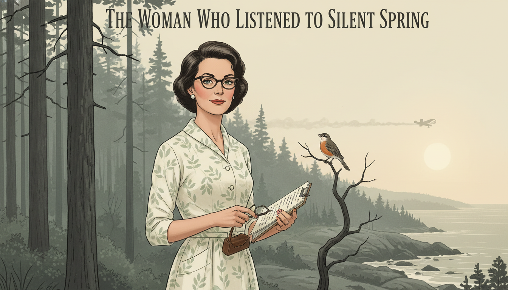

Cover Image Prompt

Please generate a wide-landscape 16:9 cover image for a graphic novel titled "The Woman Who Listened to Silent Spring" in a mid-century American illustrated style reminiscent of 1960s Saturday Evening Post covers blended with modern editorial illustration. Show Rachel Carson, a poised woman in her mid-50s with short dark wavy hair, warm brown eyes, and a tailored 1960s dress, standing at the edge of a pine forest near the Maine coast. She holds a clipboard and a small bird rests silently on a nearby bare branch; a crop duster is visible in the distant sky releasing a faint plume. The title text "The Woman Who Listened to Silent Spring" is rendered in an elegant serif typeface at the top. Color palette: muted sage greens, misty grays, cream, with a single warning note of pale amber sunlight. Emotional tone: quiet courage and foreboding beauty. Include: (1) Carson's calm, observant expression, (2) the contrast between the living forest and one unnaturally still songbird, (3) period-accurate 1962 clothing and spectacles case in her hand, (4) a weathered field notebook, (5) the distant silhouette of the crop duster, (6) soft atmospheric haze. Generate the image immediately without asking clarifying questions.

Narrative Prompt

This is a 12-panel graphic novel about Rachel Carson (1907-1964), the American marine biologist and writer whose 1962 book *Silent Spring* exposed the ecological harms of the pesticide DDT and helped spark the modern environmental movement. The story is set primarily in the United States between the 1950s and early 1960s, in settings ranging from the Maine coast to Washington D.C. and televised congressional hearings. The art style throughout is mid-century American editorial illustration — muted period colors, careful attention to 1950s-60s clothing and interiors, and a quiet, literary emotional register. Rachel Carson should be drawn consistently across panels: a woman in her 50s with short dark wavy hair (later thinning from chemotherapy), warm brown eyes, a reserved but determined expression, and simple tailored clothes. Central TOK theme: evidence-based reasoning triumphing over a well-funded corporate disinformation campaign. The story emphasizes her rigor, her failing health, and the power of carefully footnoted truth.

### Prologue – The Birds Stopped Singing

In the spring of 1958, a letter arrived at Rachel Carson's home in Maryland. A friend in Massachusetts wrote that the songbirds in her yard had suddenly gone silent — and the morning after a state airplane had sprayed DDT, she had found seven dead robins. Carson had spent her life listening to the natural world and writing about what she heard. Now she began listening for something no one else was reporting: a silence that should not exist. What she found would pit her against the most powerful chemical companies in America, and teach a generation how to tell real knowledge from paid-for lies.

## Panel 1: The Letter from a Friend

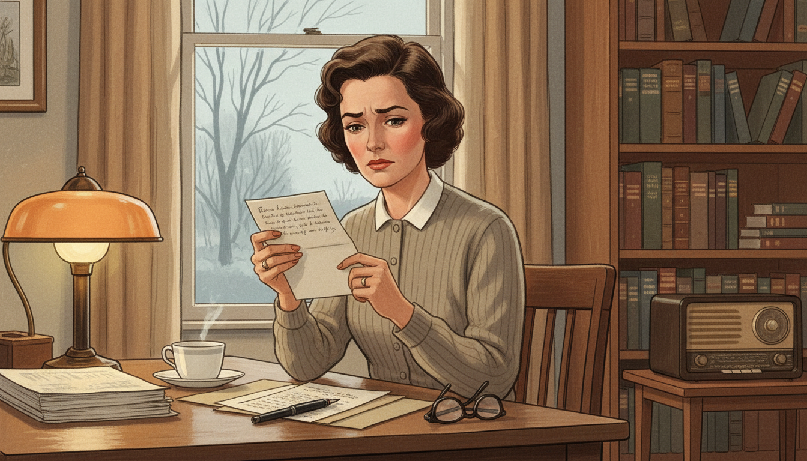

Image Prompt

I am about to ask you to generate a series of images for a graphic novel. Please make the images have a consistent style and consistent characters. Do not ask any clarifying questions. Just generate the image immediately when asked.

Please generate a 16:9 image in mid-century American editorial illustration style depicting panel 1 of 12. The scene shows Rachel Carson, a woman in her early 50s with short dark wavy hair and warm brown eyes, seated at a writing desk by a window in her Maryland home in January 1958. She is reading a handwritten letter with a troubled expression. Outside the window, bare winter trees stand under a pale sky. The color palette is muted cream, soft browns, gray-blue, and a single amber lamp glow. Emotional tone: quiet alarm. Specific details: (1) a cup of tea on a saucer, (2) a stack of scientific papers and a fountain pen on the desk, (3) the letter written on personal stationery, (4) bookshelves in the background filled with natural history books, (5) a radio on a side table, (6) Carson's tailored 1950s cardigan and reading glasses resting on the desk. Generate the image immediately without asking clarifying questions.

Carson read the letter twice. Her friend Olga Owens Huckins described not just a few dead robins but a backyard gone eerily quiet after state planes sprayed DDT to kill mosquitoes. As a trained marine biologist who had worked for years at the U.S. Fish and Wildlife Service, Carson knew this was not one woman's misfortune — it was a clue. She set down her tea, picked up her pen, and began writing to every scientist she knew who might have data.

## Panel 2: The Researcher at Work

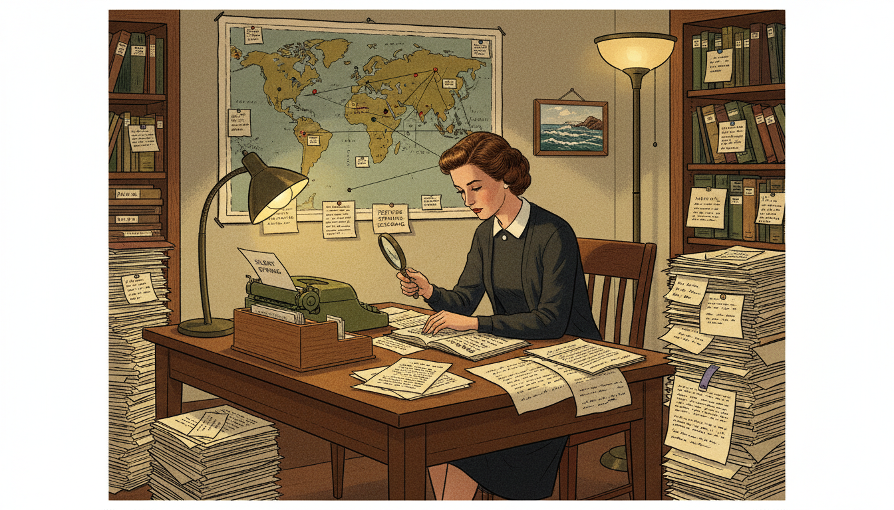

Image Prompt

Please generate a 16:9 image in mid-century American editorial illustration style depicting panel 2 of 12. Make the characters and style consistent with the prior panel. The scene shows Rachel Carson working in a cluttered but organized home study in 1959, surrounded by hundreds of scientific reprints, government reports, and correspondence. She is cross-referencing documents with a magnifying glass. The color palette is warm browns, parchment cream, forest green, and pools of lamplight. Emotional tone: determined, scholarly. Specific details: (1) teetering stacks of scientific journals labeled with paper slips, (2) a world map pinned with notes about pesticide spraying locations, (3) a typewriter with a half-finished page, (4) an index card file box, (5) Carson wearing a simple dark dress and cardigan, her expression focused, (6) a small framed photograph of the sea on the wall. Generate the image immediately without asking clarifying questions.

For four years, Carson did what real science requires: she read everything. She wrote to biologists, toxicologists, doctors, and wildlife officers in a dozen countries. Every claim she would eventually publish was cross-checked against peer-reviewed evidence and filed on index cards. She was not writing opinion — she was building a case so carefully footnoted that no honest critic could dismantle it.

## Panel 3: The Diagnosis

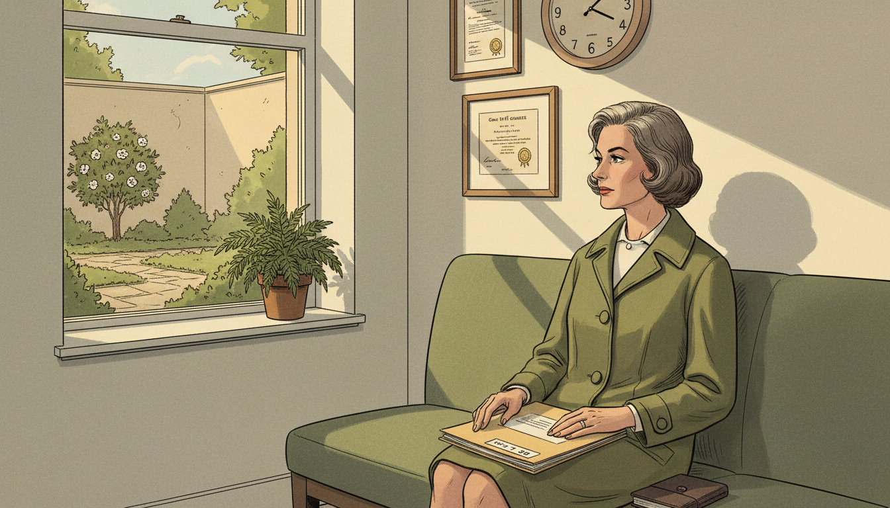

Image Prompt

Please generate a 16:9 image in mid-century American editorial illustration style depicting panel 3 of 12. Make the characters and style consistent with the prior panel. The scene shows Rachel Carson sitting alone in a 1960 doctor's waiting room after receiving a cancer diagnosis. She holds a medical file on her lap and gazes out a window at a small garden. The color palette is muted hospital greens, cream, soft gray, with a shaft of afternoon light. Emotional tone: grave but resolute. Specific details: (1) a period wall clock reading late afternoon, (2) framed medical certificates on the wall, (3) Carson in a simple travel coat, her composure intact, (4) a closed file folder marked with a doctor's name, (5) her hand resting on a small leather notebook, (6) a potted fern by the window. Generate the image immediately without asking clarifying questions.

In 1960, in the middle of her research, doctors told Rachel Carson she had breast cancer. The treatments were brutal and the prognosis was uncertain. Most people would have stopped writing. Carson told only her closest friends and kept working, because she understood something about time that most people only learn at the end: the question was not whether she could finish the book, but whether the truth would reach the public before it was too late.

## Panel 4: Writing Through the Night

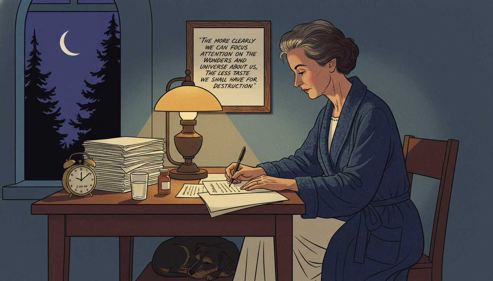

Image Prompt

Please generate a 16:9 image in mid-century American editorial illustration style depicting panel 4 of 12. Make the characters and style consistent with the prior panel. The scene shows Rachel Carson writing late at night at her desk in 1961, a single lamp illuminating her papers. She wears a dark blue bathrobe over a nightgown; her hair is thinning slightly from treatment. Through a window, we see a crescent moon over silhouetted trees. The color palette is deep blues, amber lamplight, shadow, cream. Emotional tone: fragile determination. Specific details: (1) typed manuscript pages stacked beside her, (2) a clock showing 2:00 AM, (3) a glass of water and medication bottle on the desk, (4) her dog sleeping at her feet, (5) a pen in her hand mid-sentence, (6) a framed handwritten quote on the wall. Generate the image immediately without asking clarifying questions.

Carson wrote *Silent Spring* at night, when her pain was most bearable and the house was quiet. She worked slowly because she refused to publish anything she could not defend. Her editor grew anxious; her publisher pressured her to hurry. She would not be hurried. Every sentence had to be true — and every footnote had to be real.

## Panel 5: Silent Spring Arrives

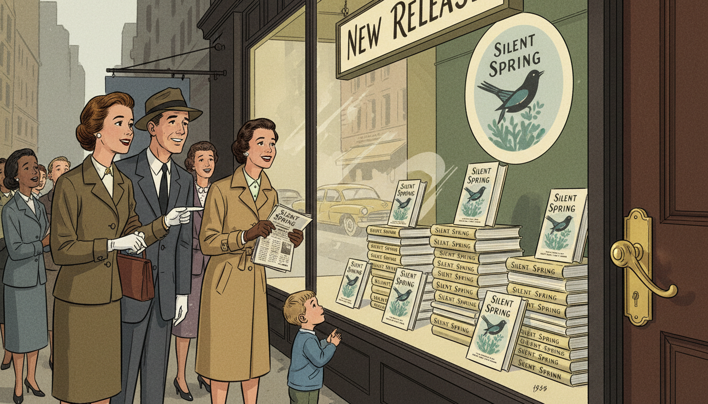

Image Prompt

Please generate a 16:9 image in mid-century American editorial illustration style depicting panel 5 of 12. Make the characters and style consistent with the prior panel. The scene shows a 1962 bookstore window in New York City displaying stacks of the book "Silent Spring" with its iconic cover. A small crowd has gathered to look at the display. The color palette is muted greens, cream, warm yellows, city grays. Emotional tone: quiet anticipation turning to excitement. Specific details: (1) a hand-lettered "New Release" sign, (2) a well-dressed 1962 couple pointing at the display, (3) reflections of passing cars in the glass, (4) a woman holding a copy of the book and a newspaper, (5) a small child looking up curiously, (6) the bookstore's elegant brass door handle. Generate the image immediately without asking clarifying questions.

*Silent Spring* was published on September 27, 1962. It sold over 100,000 copies in the first weeks. Readers who had never thought about ecology discovered, chapter by meticulous chapter, that the miracle chemicals they had been told were safe were in fact poisoning birds, fish, insects, and perhaps themselves. The book did not rage. It explained. And that made it unstoppable.

## Panel 6: The Attack Begins

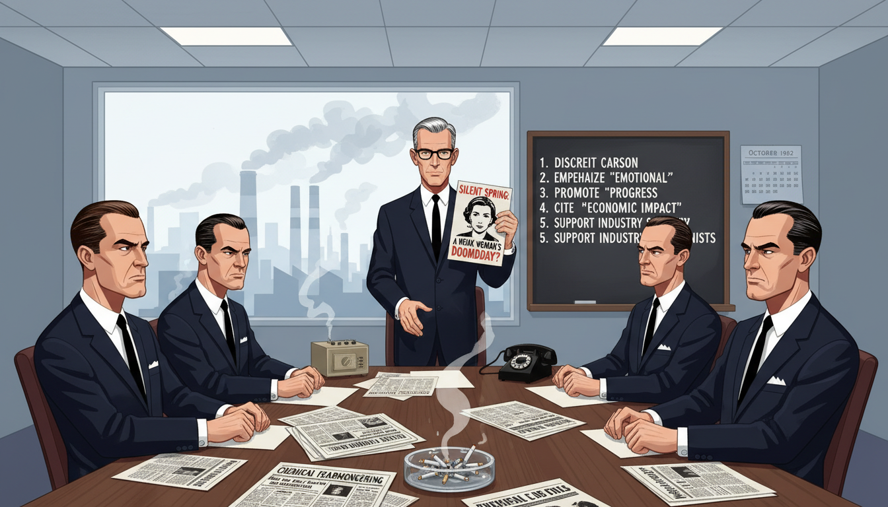

Image Prompt

Please generate a 16:9 image in mid-century American editorial illustration style depicting panel 6 of 12. Make the characters and style consistent with the prior panel. The scene shows a 1962 corporate boardroom inside a large American chemical company, with executives in dark suits reviewing press materials attacking Rachel Carson. One executive holds up a pamphlet with Carson's photograph on it. A large window reveals an industrial skyline with smokestacks. The color palette is cold grays, corporate blues, harsh fluorescent white. Emotional tone: calculated hostility. Specific details: (1) a conference table covered with press kits and newspapers, (2) a blackboard listing talking points against the book, (3) executives in conservative 1960s business suits, (4) an ashtray with cigarettes, (5) a telephone and intercom, (6) a calendar showing October 1962. Generate the image immediately without asking clarifying questions.

The chemical industry spent about a quarter of a million dollars — enormous money for 1962 — trying to destroy Rachel Carson. They hired scientists to write critical reviews. They mailed pamphlets to newspapers. They called her hysterical, a communist sympathizer, a spinster who did not understand real science. None of them could find an error in her book. So they attacked her instead of her evidence.

## Panel 7: The Whispered Lies

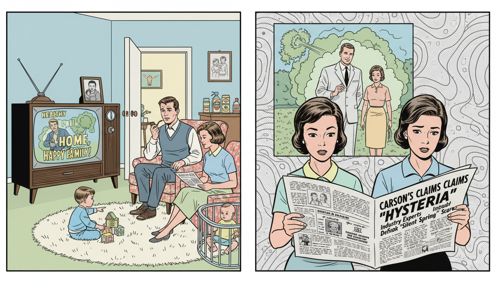

Image Prompt

Please generate a 16:9 image in mid-century American editorial illustration style depicting panel 7 of 12. Make the characters and style consistent with the prior panel. The scene shows a split composition: on the left, a 1962 American living room where a family watches a television ad showing smiling actors in a pesticide-sprayed suburban yard; on the right, the same family reading a newspaper headline attacking Rachel Carson. The color palette is 1960s suburban pastels contrasted with newsprint gray. Emotional tone: the quiet manipulation of public opinion. Specific details: (1) a vintage console television showing the ad, (2) a child playing on a rug, (3) a mother holding the newspaper with a puzzled expression, (4) a father in an armchair with a pipe, (5) pesticide products visible on a kitchen counter through an open door, (6) a family photograph on the TV set. Generate the image immediately without asking clarifying questions.

The disinformation campaign worked on a familiar principle: if you cannot refute the facts, confuse the audience. Television ads showed happy families in chemically sprayed backyards. Ghost-written op-eds suggested Carson wanted children to die of malaria. For many Americans, the result was simple doubt — the most effective weapon misinformation has ever had. Carson understood that doubt, not disagreement, was the enemy of knowing.

## Panel 8: The Television Interview

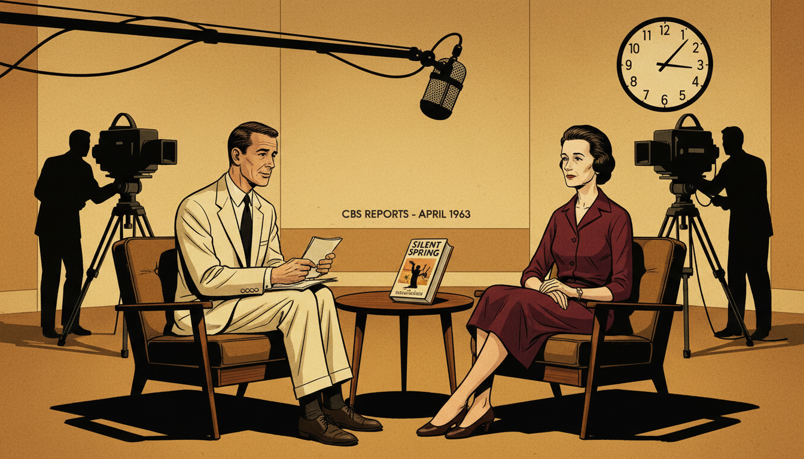

Image Prompt

Please generate a 16:9 image in mid-century American editorial illustration style depicting panel 8 of 12. Make the characters and style consistent with the prior panel. The scene shows Rachel Carson on a CBS Reports television set in April 1963, seated across from journalist Eric Sevareid under studio lights. Carson is visibly thin from her illness but composed, wearing a dark tailored dress. Cameras and crew are visible in the background. The color palette is warm studio amber, shadow black, cream, burgundy. Emotional tone: quiet authority under pressure. Specific details: (1) large 1960s television cameras, (2) a studio clock, (3) a microphone on a boom arm, (4) Sevareid holding note cards, (5) Carson with her hands folded calmly in her lap, (6) a copy of Silent Spring on the small table between them. Generate the image immediately without asking clarifying questions.

On April 3, 1963, more than ten million Americans tuned in to watch *CBS Reports: The Silent Spring of Rachel Carson*. Sponsors had pulled out; the network aired it anyway. On screen, Carson did not shout or sneer. She simply answered each question with the patience of someone who had checked her footnotes. Across from her, the industry's best-paid critic waved his arms and called her unscientific. By the end of the hour, millions of viewers could see which one of them was telling the truth.

## Panel 9: The Call from the White House

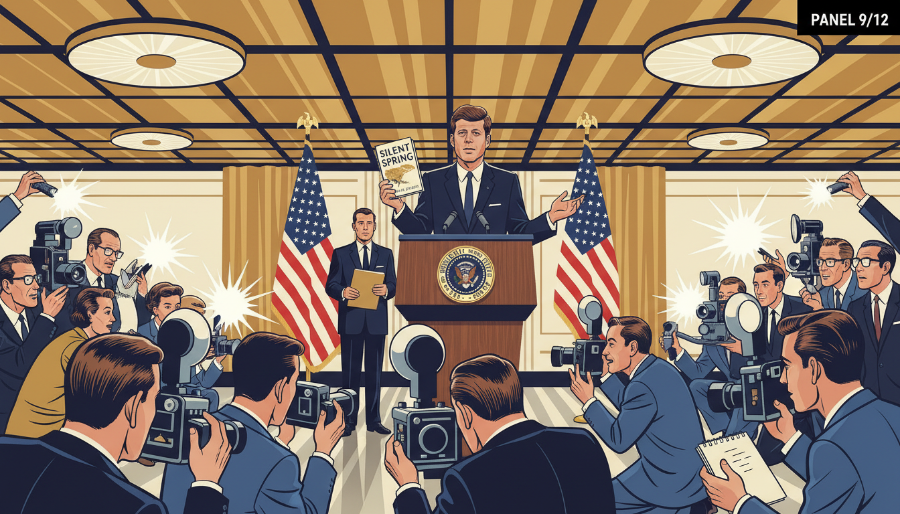

Image Prompt

Please generate a 16:9 image in mid-century American editorial illustration style depicting panel 9 of 12. Make the characters and style consistent with the prior panel. The scene shows President John F. Kennedy at a 1962 White House press conference, holding up a copy of "Silent Spring" as he answers a reporter's question. Press corps and photographers with vintage cameras fill the foreground. The color palette is presidential navy, cream, gold, flashbulb white. Emotional tone: institutional recognition. Specific details: (1) Kennedy at a lectern with the presidential seal, (2) reporters with notepads and vintage press cameras, (3) American flags in the background, (4) Kennedy gesturing to the book, (5) a White House staffer holding a folder, (6) overhead studio lights reflecting off polished wood. Generate the image immediately without asking clarifying questions.

When a reporter asked President Kennedy whether the government was investigating the pesticide problem, Kennedy answered, "Yes — and I think particularly, of course, since Miss Carson's book." He ordered his President's Science Advisory Committee to examine her claims independently. For a sitting president to cite a book by a female biologist was, in 1962, extraordinary. It was also the moment the industry knew they had lost the argument.

## Panel 10: The Senate Hearing

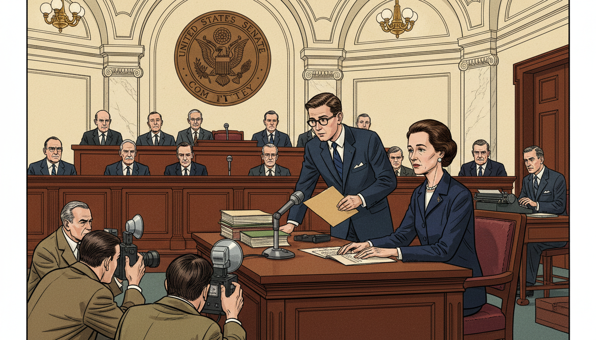

Image Prompt

Please generate a 16:9 image in mid-century American editorial illustration style depicting panel 10 of 12. Make the characters and style consistent with the prior panel. The scene shows Rachel Carson testifying before a 1963 U.S. Senate subcommittee. She sits at a witness table under a large vaulted ceiling, a microphone in front of her, facing a row of senators at a raised bench. Her appearance shows the toll of illness but her bearing is calm and dignified. The color palette is deep mahogany, cream marble, government navy, warm brass. Emotional tone: historic gravity. Specific details: (1) the Senate committee seal behind the senators, (2) stacks of documents at Carson's table, (3) press photographers kneeling in the foreground, (4) Carson wearing a modest dark suit and small pearl earrings, (5) an aide handing her a folder, (6) a stenographer at a small desk. Generate the image immediately without asking clarifying questions.

On June 4, 1963, Carson was called before a Senate subcommittee. By then she could barely walk without pain. She did not mention her illness. Instead, over two days, she laid out her evidence, named the chemicals, and recommended concrete reforms — independent testing, public disclosure, and a citizen's right to a safe environment. One senator told her, "Miss Carson, we welcome you here. You are the lady who started all this."

## Panel 11: The Walk by the Sea

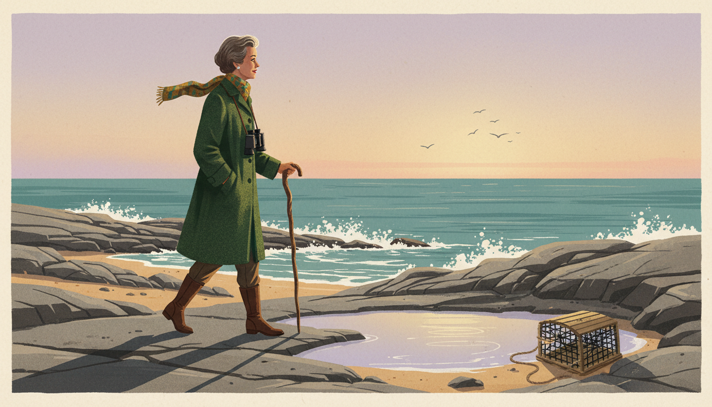

Image Prompt

Please generate a 16:9 image in mid-century American editorial illustration style depicting panel 11 of 12. Make the characters and style consistent with the prior panel. The scene shows Rachel Carson walking alone along a rocky Maine coastline at golden hour in 1964, wearing a warm wool coat and a scarf, leaning slightly on a wooden walking stick. She gazes out over tide pools toward the ocean. Her expression is peaceful. The color palette is golden amber, deep teal ocean, weathered rock gray, pale lavender sky. Emotional tone: serene farewell. Specific details: (1) gentle surf breaking on the rocks, (2) seabirds in flight over the horizon, (3) a tide pool reflecting the sky, (4) a weathered lobster trap on the shore, (5) Carson's silhouette long in the low sun, (6) a pair of binoculars around her neck. Generate the image immediately without asking clarifying questions.

Rachel Carson died on April 14, 1964, less than two years after *Silent Spring* was published. She had lived long enough to see a president confirm her findings, to testify before the Senate, and to know that the world had heard her. The sea she had loved all her life was a little safer because of her. So were the songbirds — and, eventually, the children who would grow up drinking cleaner water and breathing cleaner air.

## Panel 12: The DDT Ban

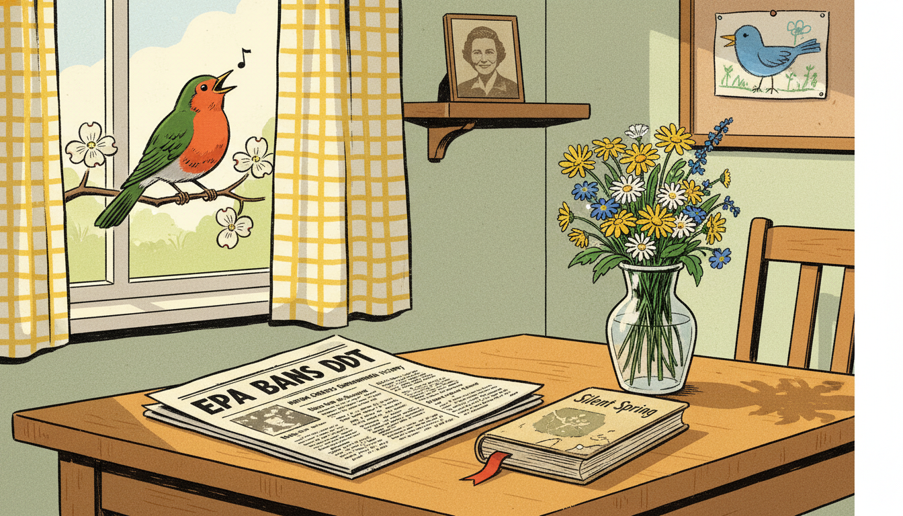

Image Prompt

Please generate a 16:9 image in mid-century American editorial illustration style depicting panel 12 of 12. Make the characters and style consistent with the prior panel. The scene shows a newspaper front page from 1972 announcing the EPA ban on DDT, with the newspaper resting on a wooden table beside a vase of fresh wildflowers and a well-worn copy of "Silent Spring." Through an open window, a bright-eyed robin perches on a flowering branch, clearly alive and singing. The color palette is sunlit yellow, cream, deep green, robin red-orange. Emotional tone: hopeful vindication. Specific details: (1) the newspaper headline reading "EPA BANS DDT", (2) the dog-eared book with a bookmark, (3) sunlight streaming through a gingham curtain, (4) the robin caught mid-song, (5) a child's drawing of a bird pinned to a corkboard, (6) a small framed photograph of Rachel Carson on a shelf. Generate the image immediately without asking clarifying questions.

In 1972, eight years after her death, the United States banned most uses of DDT. Her carefully footnoted book had done what no lawsuit and no protest could: it had changed how Americans decided what was true. The Environmental Protection Agency itself had been created partly because of the public conversation she started. The birds came back. And generations of scientists learned that rigorous evidence, patiently explained, is still the most dangerous thing in the world to a lie.

### Epilogue – What Made Rachel Carson Different?

Rachel Carson did not win because she was loud. She won because she was right, and because she had done the work to prove it. In an era when chemical companies controlled public relations and many scientists stayed silent, she insisted that ordinary people could understand complex evidence if it was explained honestly. Her life is a case study in epistemology: in how real knowledge is built, how misinformation is built, and how the first can defeat the second — if someone is willing to pay the cost of telling the truth.

| Challenge | How Rachel Carson Responded | Lesson for Today |
|-----------|-----------------------------|------------------|
| A powerful industry spreading misinformation | Built a case with hundreds of peer-reviewed citations | Check sources, and trust evidence that shows its work |
| Personal attacks instead of scientific rebuttals | Refused to answer in kind; let the evidence speak | Attacks on the messenger are often a sign the message is true |
| A fatal diagnosis while writing the book | Kept working at her own rigorous pace rather than rushing | Urgency is no excuse for carelessness with the truth |
| A public confused by ad campaigns | Explained the science in clear, literary prose | Good science communication is a public service, not a luxury |

### Call to Action

The next time you hear a confident claim about health, the environment, or any other part of the world, try what Rachel Carson did. Ask who funded the claim. Ask where the evidence comes from. Ask what would change your mind. You do not have to be a scientist to think like one — you only have to be willing to listen, like Carson did, for the things no one else is reporting.

---

*"The more clearly we can focus our attention on the wonders and realities of the universe about us, the less taste we shall have for destruction."*
—Rachel Carson

*"One way to open your eyes is to ask yourself, 'What if I had never seen this before? What if I knew I would never see it again?'"*
—Rachel Carson

*"Those who contemplate the beauty of the earth find reserves of strength that will endure as long as life lasts."*
—Rachel Carson

---

## References

1. [Wikipedia: Rachel Carson](https://en.wikipedia.org/wiki/Rachel_Carson) - Biography of the American marine biologist, writer, and conservationist
2. [Wikipedia: Silent Spring](https://en.wikipedia.org/wiki/Silent_Spring) - Carson's landmark 1962 book on the environmental harms of pesticides
3. [Wikipedia: DDT](https://en.wikipedia.org/wiki/DDT) - The organochlorine insecticide at the center of Silent Spring
4. [U.S. Fish and Wildlife Service: Rachel Carson Biography](https://www.fws.gov/refuge/rachel-carson/about-us/rachel-carson-biography) - Official biography from the federal agency where Carson worked
5. [Encyclopaedia Britannica: Rachel Carson](https://www.britannica.com/biography/Rachel-Carson) - Curated reference overview of Carson's life and legacy
